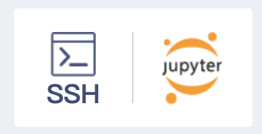
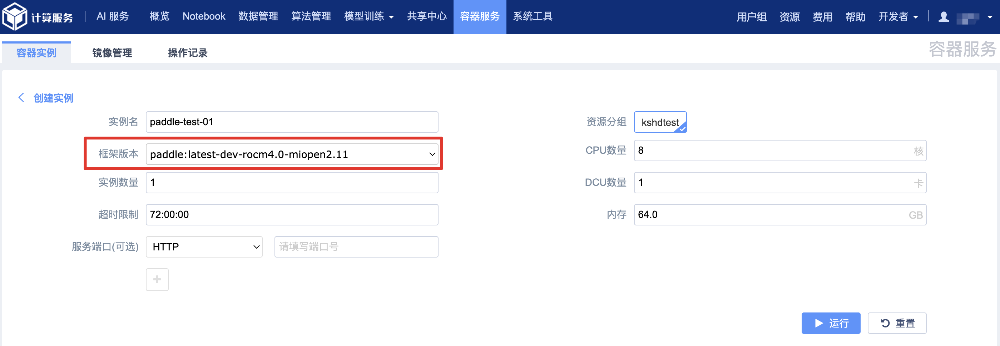
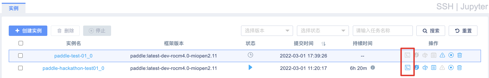
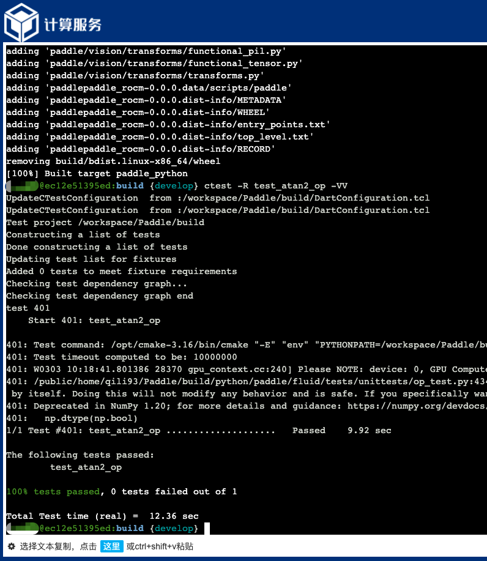

# 曙光智算平台-Paddle 源码编译和单测执行

由于[曙光智算](https://www.hpccube.com/ac/home/index.html)环境下网路受限，直接编译飞桨源码会遇到第三方依赖库下载失败从而导致编译失败的问题。因此在曙光智算环境下进行飞桨源码编译与单测需要以下几个步骤：


## 第一章节：本地容器编译 Paddle 源码，并进行 Paddle 目录打包

**第一步**：本地启动编译容器 (推荐使用 Paddle 镜像)

```bash
# 并拉取开发镜像
docker pull paddlepaddle/paddle:latest-dev-rocm4.0-miopen2.11

# 启动容器，注意目录映射按需改成自己环境中的路径
docker run -it --name paddle-dev --shm-size=128G --network=host \
     --volume /home/test_user:/workspace --workdir=/workspace \
     --cap-add=SYS_PTRACE --security-opt seccomp=unconfined \
     paddlepaddle/paddle:latest-dev-rocm4.0-miopen2.11 /bin/bash
```

**第二步**：在容器内进行源码编译，CMAKE 编译选项含义请参见[编译选项表](https://www.paddlepaddle.org.cn/documentation/docs/zh/develop/install/Tables.html#Compile)

```bash
# 拉取 Paddle 最新源码到本地目录，默认为 develop 分支
git clone https://github.com/PaddlePaddle/Paddle.git
cd Paddle

# 创建编译目录
mkdir build && cd build

# 执行 cmake
cmake .. -DPY_VERSION=3.7 -DWITH_ROCM=ON -DWITH_TESTING=ON  \
         -DWITH_DISTRIBUTE=ON -DWITH_MKL=ON

# 使用以下命令来编译
make -j8

# 编译完成之后将整个 Paddle 目录打包
cd /workspace
tar -zcvf Paddle.tar.gz ./Paddle
```

## 第二章节：将打包的 Paddle 源码包上传曙光智算平台个人目录

**第一步**：登录[曙光智算](https://www.hpccube.com/ac/home/index.html) 平台后进入菜单顶部的「文件 -> E-File」环境


**第二步**：在 E-File 页面点击文件上传，将压缩的 Paddle 包上传到智算平台的个人目录下

> **注意**：Paddle.tar.gz 包大约 6G 左右大小，建议使用“快传“节省传输时间。


## 第三章节：智算平台下启动 Paddle 开发容器，执行编译和单测

**第一步**：登录[曙光智算](https://www.hpccube.com/ac/home/index.html) 平台后进入页面中部的「我的服务 -> 智能计算服务」


**第二步**：在 AI 服务页面，点击页面底部的 「SSH | Jupyter」图标



**第三步**：在弹出的「实例」页面中点击页面上部的「创建实例」按钮


**第四步**：在「创建实例」页面中选择和填入如下信息之后，点击「运行」按钮

> **注意**：这里必须选择框架版本为 paddle:latest-dev-rocm4.0-miopen2.11，建议选择 CPU 数量 8，C86 加速卡数量 1，内存 64.0



**第五步**：在「实例」页面等待容器状态从「等待」转为「运行」后，点击右侧「SSH」按钮

如下图所示，第一行为容器刚创建时状态为「等待」，右侧「SSH」按钮为灰色不可点击；预计 10 分钟左右容器转为第二行的「运行」状态，右侧红框中的「SSH」按钮转为蓝色可点击状态。点击「SSH」按钮后弹出的「WebShell」页面即为刚创建的容器环境。



**第六步**：在「WebShell」页面中，链接 Paddle 源码目录并重新编译后，即可执行相关算子单测任务

> **注意**：以下步骤目的是为了在容器内创建和本文第一章节中的本地容器一样的编译路径，否则 CMAKE 编译会出错

```bash
# 先将个人目录下的 Paddle 源码包进行解压
tar -zxvf Paddle.tar.gz

# 将解压后的源码目录软链接到/workspace/Paddle 目录
sudo mkdir /workspace
sudo ln -s ~/Paddle /workspace/Paddle
sudo chown -R $USER:$USER /workspace

# 进入源码编译目录，重新执行编译命令
cd /workspace/Paddle/build && make -j8

# 编译成功之后，在 build 目录下执行单测
ctest -R test_atan2_op -VV
```

预期得到如下结果，即为编译和单测环境配置成功


