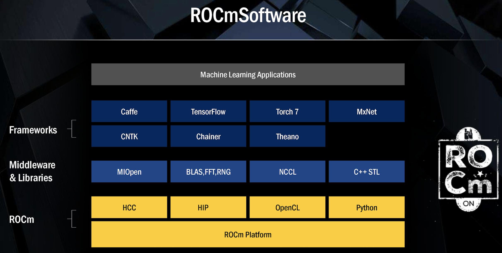

# Paddle 适配 C86 加速卡详解

当前百度飞桨 PaddlePaddle 已经适配了支持 C86 加速卡 的 ROCm 软件栈，并提供了官方 [Paddle ROCm 安装包](https://www.paddlepaddle.org.cn/install/quick?docurl=/documentation/docs/zh/guides/09_hardware_support/rocm_docs/paddle_install_cn.html) 的下载，以及官方 [开发与运行镜像](https://www.paddlepaddle.org.cn/documentation/docs/zh/guides/09_hardware_support/rocm_docs/paddle_install_cn.html) 的下载，并完成了 C86 加速卡 上 [70 个模型](https://www.paddlepaddle.org.cn/documentation/docs/zh/guides/09_hardware_support/rocm_docs/paddle_rocm_cn.html) 的训练与推理任务的支持。

## Paddle 适配 ROCm 软件栈

### ROCm 软件栈简介

ROCm 软件栈整体架构如下，其中除了支持 C86 加速卡 的 Driver/Firemware 之外，对上层应用还提供了一整套较为完整的开发套件，其中与深度学习框架适配相关的最为主要的几个部分包括：

- HIP: 支持异构计算的 C++ Driver/Runtime API，兼容 CUDA 并提供了与 CUDA 多个版本的 [API 对照表](https://github.com/ROCm-Developer-Tools/HIP/blob/master/docs/markdown/CUDA_Runtime_API_functions_supported_by_HIP.md)
- HIP Kernel: 支持自定义 Kernel 编程，编程语法同 CUDA Kernel 一致，且支持直接编译 CUDA Kernel 源码为 HIP Kernel
- HIPCC：HIP Kernel 编译器，类同于 NVCC 编译器，支持将 CUDA Kernel 或者 HIP Kernel 编译为 ROCm 上的可执行程序
- 加速库、数学库及通讯库：包括 MIOpen，rocBLAS，RCCL 等，分别对标 CUDA 的 cuDNN，cuBLAS, NCCL 等 ([对照表](https://github.com/ROCm-Developer-Tools/HIP/blob/master/docs/markdown/hip_porting_guide.md#library-equivalents))

ROCm 软件栈本身具备较高的成熟度与完备性，用户根据 ROCm 提供的 CUDA 到 HIP 的[代码移植手册](https://rocmdocs.amd.com/en/latest/Programming_Guides/HIP-porting-guide.html) ，可以较为方便的将 CUDA 上的工作移植到 HIP 上，使得用户程序可以支持跨 ROCm 与 CUDA 的异构计算。




### Paddle 适配 ROCm

受益于 ROCm 本身的特性，Paddle 在适配 ROCm 的过程中可以大量迁移与复用已有的 Paddle 在 CUDA 上的工作。主要的适配开发工作包括以下几个部分：

1. 环境适配：包括 Paddle 基于 ROCm 软件栈的开发编译环境，以及算子注册等功能适配工作
   - [hip.cmake](https://github.com/PaddlePaddle/Paddle/blob/develop/cmake/hip.cmake) 配置 HIP 相关编译环境，包括编译所需的头文件、依赖库，以及 CXX / HIPCC 的编译选项等
   - [miopen.cmake](https://github.com/PaddlePaddle/Paddle/blob/develop/cmake/miopen.cmake) 配置 MIOpen 算子相关编译环境，包括编译所需的 MIOpen 头文件及依赖库等
   - [rccl.cmake](https://github.com/PaddlePaddle/Paddle/blob/develop/cmake/rccl.cmake) 配置 ROCm 通讯库 RCCL 相关编译环境，主要为 RCCL 编译所需的头文件
   - [generic.cmake](https://github.com/PaddlePaddle/Paddle/blob/develop/cmake/generic.cmake#L575) 定义 Paddle 中的 hip_library 及 hip_test 等 cmake 函数，支持生成 HIP 对象
   - [operators.cmake](https://github.com/PaddlePaddle/Paddle/blob/develop/cmake/operators.cmake#L98) 配置 HIP Kernel 算子注册方式，自动映射 CUDA Kernel 算子文件为 HIP Kernel 算子文件
   - 其他相关 cmake 配置，包括依赖的第三方库如 [eigen.cmake](https://github.com/PaddlePaddle/Paddle/blob/develop/cmake/external/eigen.cmake) 和 [warpctc.cmake](https://github.com/PaddlePaddle/Paddle/blob/develop/cmake/external/warpctc.cmake)等
2. 设备接入：主要包括设备相关的 Driver/Runtime API 的接入，以及通讯库等底层加速库的接入工作
   - 动态库加载: 在 [paddle/fluid/platform/dynload](https://github.com/PaddlePaddle/Paddle/tree/develop/paddle/fluid/platform/dynload) 目录下动态加载 ROCm 加速库及所需 API，如 [hiprand.h](https://github.com/PaddlePaddle/Paddle/blob/develop/paddle/fluid/platform/dynload/hiprand.h) [miopen.h](https://github.com/PaddlePaddle/Paddle/blob/develop/paddle/fluid/platform/dynload/miopen.h) [rocblas.h](https://github.com/PaddlePaddle/Paddle/blob/develop/paddle/fluid/platform/dynload/rocblas.h)等
   - Driver/Runtime 适配：主要在 [paddle/fluid/platform/device/gpu](https://github.com/PaddlePaddle/Paddle/tree/develop/paddle/fluid/platform/device/gpu) 目录下对 HIP 和 CUDA 进行了相关 API 的封装，其中在 [gpu_types.h](https://github.com/PaddlePaddle/Paddle/blob/develop/paddle/fluid/platform/device/gpu/gpu_types.h) 少量封装了部分与 CUDA 差异较小的数据类型定义，部分 ROCm 独有代码位于[paddle/fluid/platform/device/gpu/rocm](https://github.com/PaddlePaddle/Paddle/tree/develop/paddle/fluid/platform/device/gpu/rocm)目录
   - Memory 管理：利用上一步封装好的 Driver/Runtime API 对 [memcpy.cc](https://github.com/PaddlePaddle/Paddle/blob/develop/paddle/fluid/memory/memcpy.cc#L574) 与 [paddle/fluid/memory/allocation](https://github.com/PaddlePaddle/Paddle/tree/develop/paddle/fluid/memory/allocation) 目录下的多种 Memory Allocator 进行实现
   - Device Context 管理：利用封装好的 API 实现对设备上下文的管理及设备池的初始化，位于 [device_contxt.h](https://github.com/PaddlePaddle/Paddle/blob/develop/paddle/fluid/platform/device_context.h)
   - 其他设备管理相关的适配接入，如 Profiler, Tracer, Error Message, NCCL 等，代码主要位于 [Paddle/platform](https://github.com/PaddlePaddle/Paddle/tree/develop/paddle/fluid/platform) 目录下
3. 算子注册：主要包括 HIP Kernel 的算子注册，以及 MIOpen 的算子在 ROCm 平台上的注册
   - 数据类型支持：除通用数据类型外，还需适配 Paddle 支持的特殊数据类型包括 [float16.h](https://github.com/PaddlePaddle/Paddle/blob/develop/paddle/fluid/platform/float16.h#L144) [complex.h](https://github.com/PaddlePaddle/Paddle/blob/develop/paddle/fluid/platform/complex.h#L88) [bfloat16.h](https://github.com/PaddlePaddle/Paddle/blob/develop/paddle/fluid/platform/bfloat16.h#L65) 等
   - 数学库支持：通过 ROCm 的 rocBLAS 库，实现 Paddle 在 [blas.h](https://github.com/PaddlePaddle/Paddle/blob/develop/paddle/phi/kernels/funcs/blas/blas.h) 中定义的 BLAS 函数，代码位于 [blas_impl.hip.h](https://github.com/PaddlePaddle/Paddle/blob/develop/paddle/phi/kernels/funcs/blas/blas_impl.hip.h)
   - Kernel 算子注册：根据 [operators.cmake](https://github.com/PaddlePaddle/Paddle/blob/develop/cmake/operators.cmake#L98) 的修改，可以大部分复用 Paddle 框架下的 CUDA 已有算子 Kernel 文件，存在部分 Kernel 实现在 CUDA 与 ROCm 平台下有所区别，例如线程数、WarpSize 以及 thurst 库等；此类区别需要针对具体的算子实现进行相应的调整，通过 Paddle 自身的算子单测用例以及模型验证测试可以对此类问题进行定位并修复
   - MIOpen 算子注册：MIOpen 与 cuDNN 的接口与类型设计较为类似，但在实际执行中还是存在一定区别，因为对于此类算子需根据 MIOpen API 进行适配，甚至对于差异较大的算子例如 [rnn_op.cu.cc](https://github.com/PaddlePaddle/Paddle/blob/develop/paddle/fluid/operators/rnn_op.cu.cc#L506) 需要进行 weight 数据重排
4. Python API 兼容适配：当前 Paddle ROCm 兼容所有 Paddle CUDA 相关的 Python API，这意味着对于所有目前 Paddle 可以支持 CUDA 的模型，无需修改任意代码可以直接运行在 C86 加速卡 上

经过以上几个步骤的适配工作，用户可以无需修改任意代码就将之前在 Paddle CUDA 平台上的程序运行在 C86 加速卡 的环境下，在保持用户已有的基于 Paddle CUDA 的编程习惯的同时，也减少了 Paddle 已有的模型套件在 CUDA 平台与 ROCm 平台之间的迁移工作。

例如以下这份代码可以同时运行于 Paddle 的 CUDA 环境和 C86 加速卡环境，且输出结果一致：

```python
import paddle
import paddle.nn.functional as F
import numpy as np

paddle.set_device("gpu") # 设置运行在 CUDA 或 ROCm 上

x = np.arange(24).reshape(2, 3, 4).astype(np.float32)
x = paddle.to_tensor(x)
out = F.softmax(x)

# Nvidia V100 输出如下
W1102 10:17:50.512131 16379 device_context.cc:447] Please NOTE: device: 0, GPU Compute Capability: 7.0, Driver API Version: 11.2, Runtime API Version: 10.1
W1102 10:17:50.522437 16379 device_context.cc:465] device: 0, cuDNN Version: 7.6.
Tensor(shape=[2, 3, 4], dtype=float32, place=CUDAPlace(0), stop_gradient=True,
       [[[0.03205860, 0.08714432, 0.23688284, 0.64391428],
         [0.03205860, 0.08714432, 0.23688284, 0.64391428],
         [0.03205860, 0.08714432, 0.23688284, 0.64391428]],

        [[0.03205860, 0.08714432, 0.23688284, 0.64391428],
         [0.03205860, 0.08714432, 0.23688284, 0.64391428],
         [0.03205860, 0.08714432, 0.23688284, 0.64391428]]])

# C86 加速卡 输出如下
W1102 10:06:45.729085   875 device_context.cc:447] Please NOTE: device: 0, GPU Compute Capability: 90.0, Driver API Version: 321.0, Runtime API Version: 3.1
W1102 10:06:45.733167   875 device_context.cc:460] device: 0, MIOpen Version: 2.11.0
Tensor(shape=[2, 3, 4], dtype=float32, place=CUDAPlace(0), stop_gradient=True,
       [[[0.03205860, 0.08714432, 0.23688284, 0.64391428],
         [0.03205860, 0.08714432, 0.23688284, 0.64391428],
         [0.03205860, 0.08714432, 0.23688284, 0.64391428]],

        [[0.03205860, 0.08714432, 0.23688284, 0.64391428],
         [0.03205860, 0.08714432, 0.23688284, 0.64391428],
         [0.03205860, 0.08714432, 0.23688284, 0.64391428]]])
```
