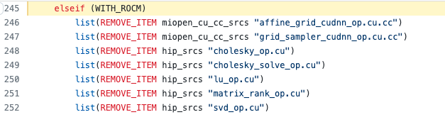
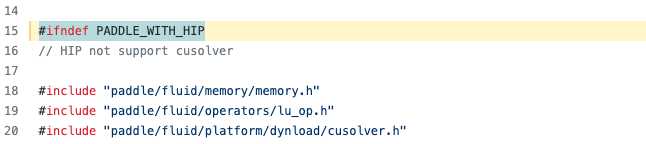
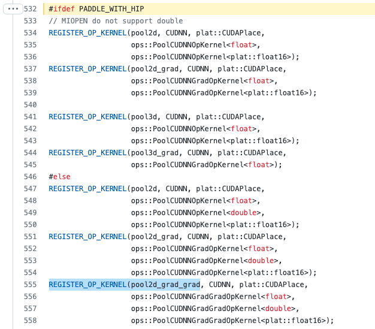
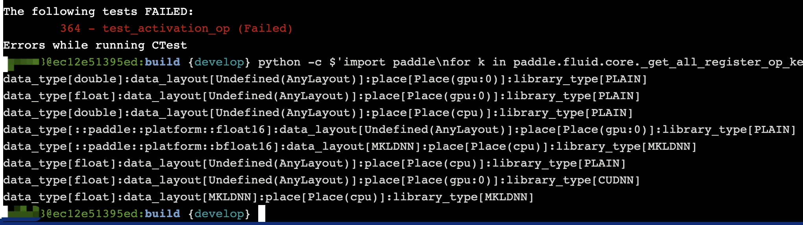
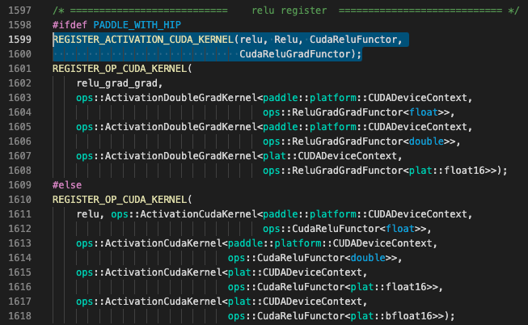
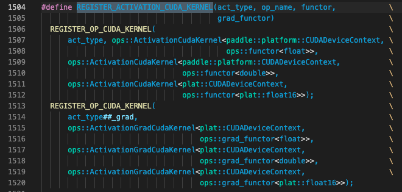

# Paddle 框架下 ROCm(HIP)算子单测修复指导

进行 ROCm(HIP)算子修复之前，请先仔细阅读 [曙光智算平台-Paddle 源码编译和单测执行](./compile_and_test_cn.html) 并按照其中步骤准备好编译和单测环境。并阅读 [Paddle 适配 C86 加速卡详解](./paddle_c86_cn.html) 文档了解当前 Paddle 与 ROCm(HIP)的适配方案和具体的代码修改。

常见的 HIP 算子问题已经修复办法如下，也可以在[PaddlePR](https://github.com/PaddlePaddle/Paddle/pulls?q=is%3Apr+%5BROCm%5D)中搜索`[ROCm]`关键字查看 ROCm(HIP)相关的代码修改，更多问题请自行探索解决方法。

> 注：打开 Paddle Debug Level 日志可以参考 [Contribute Code](https://github.com/PaddlePaddle/Paddle/blob/develop/CONTRIBUTING.md#writing-logs) 中的 Writing Logs 章节。


## 算子修复举例 1：无法找到对应算子的 GPU Kernel

这类问题常由相应的算子没有在 HIP 下注册成功引起，首先根据报错信息中提示的算子名确认该算子的 Kernel 情况。执行以下步骤，并观察输出结果中的`data_type`以及`place`的结果：

```bash
# 将以下路径输出到 PYTHONPATH 环境变量
export PYTHONPATH=/workspace/Paddle/build/python:$PYTHONPATH

# 执行如下命令打印算子的 Kernel 列表 - 将其中的 XXX 改为真正的算子名即可
python -c $'import paddle\nfor k in paddle.fluid.core._get_all_register_op_kernels()["XXX"]:print(k)'

# 例如如下输出，表示存在数据类型为 float，算子硬件类型为 GPU 的 Kernel
# 通常会有多行类似以下结果的输出，请根据输出仔细分析算子 Kernel 结果
data_type[float]:data_layout[Undefined(AnyLayout)]:place[Place(gpu:0)]:library_type[PLAIN]
```

### 情况 1：整个算子只有 CPU Kernel，没有任何 GPU Kernel

例如如下输出表示：算子只存在 Place 为 CPU 的 Kernel，不存在任何 Place 为 GPU 的 Kernel

```bash
# 错误提示信息如下：
928:     NotFoundError: Operator (lu) does not have kernel for data_type[float]:data_layout[Undefined(AnyLayout)]:place[Place(gpu:0)]:library_type[PLAIN].
928:       [Hint: Expected kernel_iter != kernels.end(), but received kernel_iter == kernels.end().] (at /workspace/Paddle/paddle/fluid/framework/operator.cc:1503)
928:       [operator < lu > error]

# 打印算子名对应的 Kernel 列表如下
data_type[double]:data_layout[Undefined(AnyLayout)]:place[Place(cpu)]:library_type[PLAIN]
data_type[float]:data_layout[Undefined(AnyLayout)]:place[Place(cpu)]:library_type[PLAIN]
```

这个原因通常是由于算子的 GPU Kernel 源码文件没有加入编译目标引起的。修复办法是先在 [operators.cmake](https://github.com/PaddlePaddle/Paddle/blob/develop/cmake/operators.cmake#L245) 中查看改算子的源码是否被移除，如下图代码所示：



移除的原因可以打开具体的源码文件进行查看，例如打开[lu_op.cu](https://github.com/PaddlePaddle/Paddle/blob/develop/paddle/fluid/operators/lu_op.cu#L15), 可见如下结果：



根据注释，是由于初始适配时 ROCm 下的 rocSolver 库未曾适配导致的，需参考 cuSovler 代码以及 [hipSOLVER](https://github.com/ROCmSoftwarePlatform/hipSOLVER) 中 rocSovler 和 cuSolver 的 API 封装示例修改代码使改算子可以在 HIP 环境下正确运行。

### 情况 2：算子 GPU Kernel 存在，少了某个 LibraryType 下的 Kernel

这类问题的常见报错信息如下:

例如如下输出表示：算子只存在 GPU Kernel，但是只有 PLAIN 没有 CUDNN 类型实现

```bash
# 错误提示信息如下：
1000:     NotFoundError: Operator (pool2d_grad_grad) does not have kernel for data_type[float]:data_layout[Undefined(AnyLayout)]:place[Place(gpu:0)]:library_type[CUDNN].
1000:       [Hint: Expected kernel_iter != kernels.end(), but received kernel_iter == kernels.end().] (at /workspace/Paddle/paddle/fluid/framework/operator.cc:1503)
1000:       [operator < pool2d_grad_grad > error]

# 打印算子名对应的 Kernel 列表如下
data_type[double]:data_layout[Undefined(AnyLayout)]:place[Place(gpu:0)]:library_type[PLAIN]
data_type[::paddle::platform::float16]:data_layout[Undefined(AnyLayout)]:place[Place(gpu:0)]:library_type[PLAIN]
data_type[float]:data_layout[Undefined(AnyLayout)]:place[Place(cpu)]:library_type[PLAIN]
data_type[float]:data_layout[Undefined(AnyLayout)]:place[Place(gpu:0)]:library_type[PLAIN]
data_type[double]:data_layout[Undefined(AnyLayout)]:place[Place(cpu)]:library_type[PLAIN]
```

查看对应算子源码文件 [pool_cudnn_op.cu.cc](https://github.com/PaddlePaddle/Paddle/blob/develop/paddle/fluid/operators/pool_cudnn_op.cu.cc#L555) 可知对应的`pool2d_grad_grad`只在 CUDA 平台下注册了 CUDNN 的`pool2d_grad_grad`算子，但是没有在 HIP 平台下注册，因此修改代码在 HIP 平台下进行注册即可。



### 情况 3：存在算子的 GPU Kernel，只是少了某几个数据类型

例如如下输出表示：存在 Place 为 GPU 的 GPU Kernel，只是少了数据类型 bfloat16



这个原因通常是由于算子的 GPU Kernel 源码文件中没有注册对应数据类型引起的，修复办法是先在以下两个算子 Kernel 源码目录中通过查找`REGISTER_OP_CUDA_KERNEL`关键字找到对应算子的源码文件中注册算子 Kernel 的代码。

```bash
Paddle 当前算子 Kernel 了目录主要位于如下两个目录中
cd /workspace/Paddle/paddle/fluid/operators
cd /workspace/Paddle/paddle/phi/kernels
```

例如查找得到的 relu 算子的注册代码如下：




注意观察其中用`PADDLE_WITH_HIP`的宏定义包围的代码才是 C86 加速卡相关算子，其中`REGISTER_ACTIVATION_CUDA_KERNEL`的定义如下，只为算子的前反向定义了 float/double/float16 三种数据类型，缺少错误提示中所说的 bfloat16 数据类型



因此可以参考非`PADDLE_WITH_HIP`的宏定义包围的英伟达 GPU 相关代码，为 HIP 算子注册 bfloat16 数据类型。之后再在 HIP 环境下验证该算子的正确输出结果。

## 算子修复举例 2：单测的输出结果无法达到精度对齐

这类问题造成的原因较为多样，请先仔细阅读单测的报错信息，可能存在如下几种情况

### 情况 1：输出误差较小，则相应修改单测文件的误差阈值即可

这类问题的常见报错信息如下:

```bash
1066:   File "/public/home/qili93/Paddle/build/test/legacy_test/test_poisson_op.py", line 60, in verify_output
1066:     "actual: {}, expected: {}".format(hist, prob))
1066: AssertionError: False is not true : actual: [0.03375816 0.08399963 0.13975811 0.17509079 0.17573357 0.14692497
1066:  0.10456944 0.06567383 0.03586864], expected: [0.03368973499542734, 0.08422433748856833, 0.14037389581428056, 0.1754673697678507, 0.1754673697678507, 0.1462228081398756, 0.104444862957054, 0.06527803934815875, 0.03626557741564375]
```

从输出中可以观察到，`actual`和`expected`结果较为接近，可以通过修改误差阈值来解决：

```bash
# 例如原有误差阈值为 0.01
self.assertTrue(np.allclose(hist, prob, rtol=0.01),
                "actual: {}, expected: {}".format(hist, prob))

# 将其修改为新的误差阈值如 0.05
self.assertTrue(np.allclose(hist, prob, rtol=0.05),
                "actual: {}, expected: {}".format(hist, prob))
```

### 情况 2：输出误差较大，需要定位误差是代码实现导致还是硬件本身原因

这类问题的常见报错信息如下:

```bash
# 示例 2
373: AssertionError:
373: Not equal to tolerance rtol=1e-06, atol=0
373:
373: Mismatched elements: 1 / 1 (100%)
373: Max absolute difference: 6.5650682
373: Max relative difference: 3.80200248
373:  x: array([4.838329], dtype=float32)
373:  y: array(-1.72674)
```

从输出中观察到，此类算子误差非常大，可能是算子本身计算代码在 HIP 平台下存在问题。建议仔细调试该算子的 GPU Kernel，定位算子计算问题并进行修复。

### 情况 3：输出结果中出 Nan，需要定位算子内核函数的实现问题

这类问题的常见报错信息如下:

```bash
# 示例 3
356: AssertionError: False is not true : Output (Out) has diff at Place(gpu:0)
356: Expect [[[ 0.3687  -0.0764   0.1682   0.3389  -0.4622 ] ...
356: But Got[[[[nan nan nan nan nan] ...
```

从输出中观察到，算子输出直接出 nan 了，可能是算子本身计算代码在 HIP 平台下存在问题。同上个问题一样，需要仔细调试该算子的 GPU Kernel，定位算子计算问题并进行修复。可能的解决办法是请先检查对应算子 Kernel 的线程数，可以参考 [ROCm-Developer-Tools/HIP#2235](https://github.com/ROCm-Developer-Tools/HIP/issues/2235) 中的回复，将 HIP 平台下的算子线程数控制在 256 及以内。
