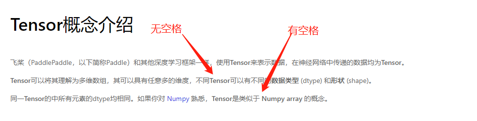

# 飞桨官网文档体验报告

## 上下文介绍

### 文档体系的分类

按照 https://documentation.divio.com/ 中的理论，任何软件产品，都应该配套以下四类文档：

本文将基于这个文档分类系统，参考比较多个深度学习框架的文档组织方式，形成最终报告。

### 竞品比较

#### TensorFlow

    - Tutorial：[Tutorial](https://www.tensorflow.org/tutorials)
    - GUIDE：[Guide](https://www.tensorflow.org/guide)
    - EXPLANATION：除 [ML Glossary](https://developers.google.com/machine-learning/glossary/tensorflow) 外，没有显式存在。
    - REFERENCE： [API 文档](https://www.tensorflow.org/versions)

TensorFlow 的文档规划，比较直接地匹配了本文所介绍的分类标准。

具体的文档结构如下：

**Tutorials**

- Quickstart for beginners
- Quickstart for experts
- ML basics with Keras
    - Basic image classfication
    - Basic text classification
    - Text classification with TF Hub
    - Regression
    - Overfit and underfit
    - Save and load
    - Tune hyperprameters with Keras Tuner
    - More examples on kera.io
- Load and preprocess data
    - Images
    - CSV
    - Numpy
    - pandas.DataFrame
    - TFRecord and tf.Example
    - Additional formats with tf.io
    - Text
    - More text loading
- Customization
    - Tensors and operations
    - Custom layers
    - Custom traning: walkthrough
- Distributed training
    - Distributed training with Kereas
    - Distributed training with DTensors
    - Using DTensors with Keras
    - Custom training loops
    - Multi-worker training with Keras
    - Multi-worker training with CTL
    - Parameter Server Training
    - Save and load
    - Distributed input
- Images
    - Convolutional Neural Network
    - Image classification
    - Transfer learning and fine-tuning
    - Transfer learning with TF Hub
    - Data Augmentaion
    - Image segmentation
    - Object detection with TF Hub
- Text
    - Word embeddings
    - Word2Vec
    - Text classification with an RNN
    - classify Text with BERT
    - Solve GLUE tasks using BERT on TPU
    - Neural machine translation with attention
    - Image captioning
- Audio
    - Simple audio recognition
    - Transfer learning for audio recognition
    - Generate music with an RNN
- Structured data
    - Classifying structured data with preprocessing layers
    - Classfication on imbalanced data
    - Time series forecasting
    - Decision forest models
    - Recommenders
- Generative
    - Neural style transfer
    - DeepDream
    - DCGAN
    - Pix2Pix
    - CycleGAN
    - Adversarial FGSM
    - Intro to Autoencoders
    - Variational Autoencoder
- Model Understanding
    - Integrated gradients
    - Uncertainty quantification with SNGP
    - Probabilistic regression
- Reinforcement learning
    - Actor-Critic method
    - TensorFlow agents
- tf.Estimator
    - Premade estimator
    - Linear model
    - Keras model to Estimator
    - Multi-worker training with Estimator
    - Feature columns

**Guide**

- TensorFlow basics
    - Overview
    - Tensors
    - Variables
    - Automatic differentiation
    - Graphs and functions
    - Modules, layers, and models
    - Training loops
- Keras
    - The Sequnetial model
    - The Functional API
    - Training and evaluation with the built-in methods
    - Making new Laayers and Models via subclassing
    - Save and load Kears models
    - Working with preprocessing layers
    - Customize what happens in Model.fit
    - Writing a training loop from scratch
    - Recurrent Neural Networks(RNN) with Keras
    - Masking and padding wiht Keras
    - Writing your own callbacks
    - Transfer learning and fine-tuning
    - Training Keras models with TensorFlow Cloud
- TensorFlow in depth
    - Tensor slicing
    - Advanced autodiff
    - Ragged tensor
    - Sparse tensor
    - Random number generation
    - NumPy API
    - DTensor concepts
    - Thinking in TensorFlow 2
- Customization
    - Create an op
    - Extension types
- Data input pipelines
    - tf.data
    - Optimize pipeline performance
    - Analyze pipeline performance
- Save a model
    - Checkpoint
    - SavedModel
- Accelerators
    - Distributed training
    - GPU
    - TPU
- Performance
    - Better performance with tf.function
    - Profile TensorFlow performance
    - Optimize GPU Performance
    - Graph optimizaition
    - Mixed precision

#### PyTorch

    - Tutorial：https://pytorch.org/tutorials/beginner/basics/intro.html
    - GUIDE：https://pytorch.org/tutorials/recipes/recipes_index.html
    - EXPLANATION：没有显式存在，分散在 API 文档中。
    - REFERENCE：[API 文档](https://pytorch.org/docs/stable/index.html)

[PyTorch 的文档](https://docs.pytorch.org) 分为 API 文档和 Tutorials 两大类。但实际 Tutorials 中可以继续分为 Learn the Basics 和 PyTorch Recipes 两大类。

并且，PyTorch 在自己的 API 文档首页中有 Notes。在必要时，也会在模块 API 开始做背景介绍，这些内容可以归为 “Explanation” 象限。

- Introduction to PyTorch
    - Learn the Basics
    - Quickstart
    - Tensors
    - Datasets & Dataloaders
    - Transforms
    - Build the Neural Network
    - Automatic Differentiation with torch.autograd
    - Optimization Model Parameters
    - Save and Load the Model
- Introduction to PyTorch on YouTube
    - Introduction to PyTorch - YouTube Series
    - Introduction to PyTorch
    - Introduction to PyTorch Tensors
    - The Fundamentals of Autograd
    - Building Models with PyTorch
    - PyTorch TensorBoard Support
    - Traning wiht PyTorch
    - Model Understanding with Captum
- Learning PyTorch
    - Deep Learning with PyTorch: A 60 Minute Blitz
    - Learing PyTorch with Examples
    - What is torch.nn really?
    - Visualizing Models, Data, and Training with TensorBoard
- Image and Video
    - TorchVision Object Detection Finetuning Tutorial
    - Transfer Learning for Computer Vision Tutorial
    - Adversarial Example Generation
    - DCGAN Tutorial
    - Spatial Tansformer Networks Tutorial
    - Optimizaing Vision Transformer Model for Deployment
- Audio
    - Audio I/O
    - Audio Resampling
    - Audio Data Augmentation
    - Audio Feature Extractions
    - Audio Feature Augmentation
    - Audio Datasets
    - Speech Recognition with Wav2Vec2
    - Speech Command Classification with torchaudio
    - Text-to-speech with torchaudio
    - Forced Alignment with Wav2Vec2
- Text
    - Language Modeling with nn.Transformer and TorchText
    - NLP From Scratch: Classifying Names with a Character-Level RNN
    - NLP From Scratch: Generating Names with a Character-Level RNN
    - NLP From Scratch: Translation with a Sequence to Sequence Network and Attention
    - Text classification with the torchtext library Language Translation with nn.Transformer and torchtext
- Deploying PyTorch Models in Production
    - Deploying PyTorch in Python via a REST API with Flask
    - Introduction to TorchScript
    - Loading a TorchScript Model in C++
    - (optional) Exporting a Model from PyTorch to ONNX and Running it using ONNX Runtime
    - Real Time Inference on Raspberry Pi 4
- Code Transforms with FX
    - Building a Convolution/Batch Norm fuser in FX
    - Building a Simple CPU Performance Profiler with FX
- Frontend APIs
    - Channels Last Memory Format in PyTorch
    - Forward-mode Automatic Differentiation
    - Using the PyTorch C++ Frontend
    - Dynamic Parallelism in TorchScript
    - Autograd in C++ Frontend
- Extending PyTorch
    - Double Backward with Custom Functions
    - Fusing Convolution and Batch Norm using Custom Function
    - Custom C++ and CUDA Extensions
    - Extending TorchScript with Custom C++ Operators
    - Extending TorchScript with Custom C++ Classes
    - Registering a Dispatched Operator in C++
    - Extending dispatcher for a new backend in C++
- Model Optimization
    - Profiling your PyTorch Module
    - PyTorch Profiler with TensorBoard
    - Hyperparameter tuning with Ray Tune
    - Optimizing Vision Transformer Model for Deployment Parametrization Tutorial
    - Pruning Tutorial
    - Dynamic Quantization on an LSTM Word Language Model
    - Dynamic Quantization on BERT
    - Quantized Transfer Learning for Computer Vision Tutorial
    - Static Quantization with Eager Model in PyTorch
    - Grokking PyTorch Intel CPU performance from first principles
- Parallel and Distributed Tranining
    - PyTorch Distributed Overview
    - Single-Machine Model Parallel Best Practices
    - Getting Started with Distributed Data Parallel
    - Writing Distributed Applications with PyTorch
    - Getting Started with Fully Sharded Data Prallel
    - Customize Process Group Backends Using Cpp Extension
    - Getting Started with Distributed RPC Framework
    - Implementing a Parameter Server Using Distributed RPC Framework
    - Distributed Pipeline Parallelsim using RPC
    - Implementing Batch RPC Processing Using Asynchronous Executions
    - Combining Distributed DataPrallel with Distributed RPC Framework
    - Training Transformer models using Pipeline Parallelism
    - Training Transformer models using Distributed Data Parallel and Pipeline Parallelism
    - Distributed Training with Uneven Inputs Using the Join Context Manager
- Moible
    - Image Segmentation DeepLabV3 on iOS
    - Image Segmentation DeepLabV3 on Android
- Recommendation Systems
    - Introduction to TorchRec

#### MindSpore

    - Tutorial：在 [教程](https://www.mindspore.cn/tutorials/zh-CN/r1.6/index.html) 前部分和 [编程指南](https://www.mindspore.cn/docs/programming_guide/zh-CN/r1.6/index.html) 的前半部分话题中
    - GUIDE：在 [教程](https://www.mindspore.cn/tutorials/zh-CN/r1.6/index.html) 后部分和 [编程指南](https://www.mindspore.cn/docs/programming_guide/zh-CN/r1.6/index.html) 的后半段话题以及 [开发者精华分享](https://bbs.huaweicloud.com/forum/forumdisplay-fid-1076-orderby-lastpost-filter-typeid-typeid-1255sub.html) 中
    - EXPLANATION：[规格和说明](https://www.mindspore.cn/docs/note/zh-CN/r1.6/index.html) 及 [FAQ](https://www.mindspore.cn/docs/faq/zh-CN/r1.6/index.html)
    - REFERENCE：[API 文档](https://www.mindspore.cn/docs/api/zh-CN/r1.6/index.htmls)

MindSpore 的有自己独立的文档分类标准和风格，所以硬套本文提及的文档分类标准，结果会显得有些复杂。以上所列的各类文档中，《开发者精华分享》是比较独特的一个栏目，他更像是 MindSpore 搭建的开源社区平台，吸收了用户贡献的各种经验，包括 Numpy 的使用，MindSpore 的安装问题如何解决等社区贡献的知识。

**初学入门**

- 初学教程
    - 基本介绍
    - 快速入门
    - 张量 Tensor
    - 数据处理
    - 创建网络
    - 自动微分
    - 模型训练
    - 保存与加载
    - 推理与部署
- 进阶
    - 进阶案例：线性拟合
    - 数据处理
    - 网络构建
    - 训练与评估
    - 动态图与静态图

**应用实践**

- 计算机视觉
    - ResNet50 网络进行图像分类
    - 图像分类迁移学习
    - 模型对抗攻击
    - 生成式对抗网络
- 自然语言处理
    - 使用 RNN 实现情感分类
    - LSTM+CRF 实现序列标注

**深度开发**

- 数据处理
    - 自动数据增强
    - 轻量化数据处理
    - 单节点数据缓存
    - 优化数据处理

- 算子执行
    - 算子分类
    - 运算重载
    - 自定义算子（CPU）
    - 自定义算子（GPU）
    - 自定义算子（Ascend）
    - 自定义算子（基于 Custom 表达）

- 模型推理
    - 模型推理总览
    - GPU/CPU 推理
    - Ascend 910 AI 处理器上推理
    - Ascend 310 AI 处理器上使用 MindIR 模型进行推理
    - Ascend 310 AI 处理器上使用 AIR 模型进行推理

- 调试调优
    - 查看中间文件
    - Dump 功能调试
    - 自定义调试信息
    - 调用自定义类
    - 算子增量编译
    - 算子调优工具
    - 自动数据加速
    - 固定随机性以复现脚本运行结果

- 分布式并行
    分布式并行总览
    分布式集合通信原语
    分布式并行训练基础样例（Ascend）
    分布式并行训练基础样例（GPU）
    分布式推理
    保存和加载模型（HyBrid Parallel 模式）
    分布式并行训练 Transformer 模型
    鹏程·盘古模型网络多维度混合并行解析
    分布式故障恢复

- 其他特性
    - 混合精度
    - 梯度累积算法
    - 自适应梯度求和算法
    - 降维训练算法

- 设计
    - 设计白皮书
    - 全场景统一
    - 函数式微分编程
    - 动静态图结合
    - 异构并行训练
    - 分布式并行
    - 中间表达 MindIR
    - 高性能数据处理引擎
    - 图算融合加速引擎
    - 二阶优化
    - 可视化调试调优
    - 安全可信
    - 术语

- 迁移指南
    - 概述
    - 准备工作
    - 网络脚本分析
    - 网络脚本开发
    - 网络调试
    - 精度调试
    - 性能调试
    - 推理执行
    - 网络迁移调试实例
    - 常见问题

### 完备性定义

综合 Paddle 及其它竞品，先罗列一个较为完备的“知识点体系”。即如果是各个级别的用户，面向他们应该提供哪类信息，做一个全集式的罗列。

- 初级用户：初级用户定位是未有使用深度学习框架完成项目的经验，如高校低年级学生
- 中级用户：中级用户定位是通常意义上的算法工程师，在日常的项目中需要使用深度学习框架，但还不涉及较为“高级”的特性。如独立参与比赛的高校学生，工业界的初级、中级算法工程师。
- 高级用户：需要紧随前沿使用框架高级特性的工业届、学术界用户。如复杂的并行技术、算子融合、AMP 等高级优化技术。

对应的信息分类和罗列：

- 初级：
    - 基本数据（Tensor）和基本算子（Op）
    - 数据加载
    - 如何组网
    - 如何训练
    - 保存与加载模型
    - 可视化、调优技巧
    - 自动微分

- 中级：
    - 动态图与静态图的转换
    - 部署相关
    - CV 领域的实践指南
    - NLP 领域的实践指南
    - 推荐系统领域的实践指南
    - 强化学习领域的实践指南
    - 移动端相关
    - 从其它框架至本框架的迁移

- 高级：
    - 如何自定义算子
    - 分布式训练
    - 框架设计文档

## Paddle 文档体系分析

现有 Paddle 文档，结构如下：

**文档**

- 整体介绍
    - 基本概念
    - 升级指南
    - 版本迁移工具
- 模型开发
    - 10 分钟快速上手飞桨
    - 数据集的定义和加载
    - 数据预处理
    - 模型组网
    - 训练与预测验证
    - 单机多卡训练
    - 自定义指标
    - 模型保存与载入
    - 模型导出 ONNX 协议
- VisualDL 工具
    - VisualDL 工具简介
    - VisualDL 使用指南
- 动态图转静态图
    - 使用样例
    - 转换原理
    - 支持语法
    - 案例解析
    - 报错调试
- 推理部署
    - 服务器部署
    - 移动端/嵌入式部署
    - 模型压缩
- 分布式训练
    - 分布式训练开始
    - 使用 FleetAPI 进行分布式训练
- 自定义算子
    - 自定义原生算子
    - 原生算子开发注意事项
    - 自定义外部算子
    - 自定义 Python 算子
    - Kernel Primitive API
        - API 介绍
        - API 示例
- 性能调优
    - 飞桨模型量化
- 算子映射
    - Paddle 1.8 与 Paddle 2.0 API 映射表
    - PyTorch-PaddlePaddle API 映射表
- 硬件支持
    - 飞桨产品硬件支持表
    - 昆仑 XPU 芯片运行飞桨
    - 海光 DCU 芯片运行飞桨
    - 昇腾 NPU 芯片运行飞桨
- 参与开发
    - 本地开发指南
    - 提交 PR 注意事项
    - FAQ
- 环境变量 FLAGS
    - cudnn
    - 数值计算
    - 调试
        - check nan inf 工具
    - 设备管理
    - 分布式
    - 执行器
    - 存储管理
    - 曻腾 NPU
    - 其它

**应用实践**

- 快速上手
    - hello paddle：从普通程序走向机器学习程序
    - 动态图
    - 飞桨高层 API 使用指南
    - 模型保存及加载
    - 使用线性回归预测波士顿房价
- 计算机视觉
    - 使用 LeNet 在 MNIST 数据集实现图像分类
    - 使用卷积神经网络进行图像分类
    - 基于图片相似度的图片搜索
    - 基于 U-Net 卷积神经网络实现宠物图像分割
    - 通过 OCR 实现验证码识别
    - 通过 Sub-Pixel 实现图像超分辨率
    - 人脸关键点检测
    - 点云处理：实现 PointNet 点云分类
- 自然语言处理
    - 用 N-Gram 模型在莎士比亚文集中训练 word embedding
    - IMDB 数据集使用 BOW 网络的文本分类
    - 使用预训练的词向量完成文本分类任务
    - 使用注意力机制的 LSTM 的机器翻译
    - 使用序列到序列模型完成数字加法
- 推荐
    - 使用协同过滤实现电影推荐
- 强化学习
    - 强化学习——Actor Critic Method
    - 强化学习——Advantage Actor-Critic(A2C)
    - 强化学习——Deep Deterministic Policy Gradient (DDPG)
- 时序数据
    - 通过 AutoEncoder 实现时序数据异常检测
- 动转静
    - 使用动转静完成以图搜图

### 完备性分析

根据以上对同类软件的文档做了调研罗列的基础上，对它们的知识点，以及知识点对应的文章，做了初步的统计。

有几点说明：

- TensorFlow、PaddlePaddle 因为已经将部署、移动端推理独立成了产品，所以以上表格中统计数据可能不准确，或未做统计
- PaddlePaddle 的 [教程](https://www.paddlepaddle.org.cn/tutorials/projectdetail/3465990) 一栏中也包含了大量的文章，但是未做统计（因为不在 `docs` 仓库中），不过会在下文中的“组织结构分析中”纳入考量

|                              | TensorFlow                                                   | 数量 | PyTorch                                                      | 数量 | MindSpore                                                    | 数量 | PaddlePaddle                                                 | 数量   |
| ---------------------------- | ------------------------------------------------------------ | ---- | ------------------------------------------------------------ | ---- | ------------------------------------------------------------ | ---- | ------------------------------------------------------------ | ------ |
| 基本数据（Tensor）和基本算子 | Tensors Variables Tensor slicing Ragged tensor Sparse tensor DTensor concepts | 6    | Tensors Transforms Introduction to PyTorch Tensors           | 3    | 张量 Tensor                                                  | 1    | Tensor 概念介绍                                               | 1      |
| 数据加载与预处理             | Images CSV Numpy pandas.DataFrame TFRecord and tf.Example Additional formats with tf.io Text More text loading Classifying structured data with preprocessing layers Classfication on imbalanced data Time series forecasting Decision forest models | 13   | Datasets & Dataloaders                                       | 1    | 数据处理 数据处理（进阶） 自动数据增强 轻量化数据处理 单节点数据缓存 优化数据处理 | 6    | 数据集的定义和加载 数据预处理                                | 2      |
| 如何组网                     | Modules, layers, and models                                  | 1    | Build the Neural Network Building Models with PyTorch What is torch.nn really? Learing PyTorch with Examples | 4    | 创建网络 网络构建                                            | 2    | 模型组网 飞桨高层 API 使用指南 层与模型                      | 3      |
| 如何训练                     | Training loops NumPy API Checkpoint SavedModel               | 4    | Optimization Model Parameters Traning wiht PyTorch           | 2    | 模型训练 训练与评估                                          | 2    | 训练与预测验证 自定义指标                                    | 2      |
| 保存与加载模型               | Save and load Save and load(Distrbuted Training)             | 2    | Save and Load the Model                                      | 1    | 保存与加载                                                   | 1    | 模型保存与载入 模型保存及加载（应用实践）                    | 2      |
| 可视化、调优技巧             | Overfit and underfit Tune hyperprameters with Keras Tuner Better performance with tf.function Profile TensorFlow performance Graph optimizaition Optimize GPU Performance Mixed precision | 7    | PyTorch TensorBoard Support Model Understanding with Captum Visualizing Models, Data, and Training with TensorBoard Profiling your PyTorch Module PyTorch Profiler with TensorBoard Hyperparameter tuning with Ray Tune Optimizing Vision Transformer Model for Deployment Parametrization Tutorial Pruning Tutorial Grokking PyTorch Intel CPU performance from first principles | 11   | 查看中间文件 Dump 功能调试 自定义调试信息 调用自定义类 算子增量编译 算子调优工具 自动数据加速 固定随机性以复现脚本运行结果 | 8    | VisualDL 工具简介 VisualDL 使用指南 飞桨模型量化             | 3      |
| 自动微分                     | Automatic differentiation Advanced autodiff                  | 2    | Automatic Differentiation with torch.autograd The Fundamentals of Autograd | 2    | 自动微分                                                     | 1    | 自动微分                                                     | 1      |
| 动态图与静态图               | Graphs and functions                                         | 1    | （torchscript 其实是静态图，不过归类到部署中了）             | 0    | 动态图与静态图                                               | 1    | 使用样例 转换原理 支持语法 案例解析 报错调试 动态图 使用动转静完成以图搜图 | 7      |
| 部署相关                     | https://www.tensorflow.org/tfx/tutorials 下的 21 篇文章 https://www.tensorflow.org/tfx/guide 下的 30+文章 | 50+  | Deploying PyTorch in Python via a REST API with Flask Introduction to TorchScript Loading a TorchScript Model in C++ (optional) Exporting a Model from PyTorch to ONNX and Running it using ONNX Runtime Real Time Inference on Raspberry Pi 4 | 6    | 推理与部署 模型推理总览 GPU/CPU 推理 Ascend 910 AI 处理器上推理 Ascend 310 AI 处理器上使用 MindIR 模型进行推理 Ascend 310 AI 处理器上使用 AIR 模型进行推理 | 7    | 服务器部署 移动端/嵌入式部署 模型压缩 https://www.paddlepaddle.org.cn/lite/v2.10/guide/introduction.html 下 50+ 篇文章 | 50+    |
| CV 领域相关                  | Basic image classfication Convolutional Neural Network Image classification Transfer learning and fine-tuning Transfer learning with TF Hub Data Augmentaion Image segmentation Object detection with TF Hub Neural style transfer DeepDream DCGAN Pix2Pix CycleGAN Adversarial FGSM Intro to Autoencoders Variational Autoencoder | 16   | TorchVision Object Detection Finetuning Tutorial Transfer Learning for Computer Vision Tutorial Adversarial Example Generation DCGAN Tutorial Spatial Tansformer Networks Tutorial Optimizaing Vision Transformer Model for Deployment Quantized Transfer Learning for Computer Vision Tutorial | 7    | ResNet50 网络进行图像分类 图像分类迁移学习 模型对抗攻击 生成式对抗网络 | 4    | 使用 LeNet 在 MNIST 数据集实现图像分类 使用卷积神经网络进行图像分类 基于图片相似度的图片搜索 基于 U-Net 卷积神经网络实现宠物图像分割 通过 OCR 实现验证码识别 通过 Sub-Pixel 实现图像超分辨率 人脸关键点检测 点云处理：实现 PointNet 点云分类 | 7      |
| NLP 领域相关                 | Basic text classification Text classification with TF Hub Word embeddings Word2Vec Text classification with an RNN classify Text with BERT Solve GLUE tasks using BERT on TPU Neural machine translation with attention Image captioning | 9    | Language Modeling with nn.Transformer and TorchText NLP From Scratch: Classifying Names with a Character-Level RNN NLP From Scratch: Generating Names with a Character-Level RNN NLP From Scratch: Translation with a Sequence to Sequence Network and Attention Text classification with the torchtext library Language Translation with nn.Transformer and torchtext Dynamic Quantization on an LSTM Word Language Model Dynamic Quantization on BERT | 8    | 使用 RNN 实现情感分类 LSTM+CRF 实现序列标注                  | 2    | 用 N-Gram 模型在莎士比亚文集中训练 word embedding IMDB 数据集使用 BOW 网络的文本分类 使用预训练的词向量完成文本分类任务 使用注意力机制的 LSTM 的机器翻译 使用序列到序列模型完成数字加法 | 5      |
| 语音领域相关                 |                                                              |      | Audio I/O Audio Resampling Audio Data Augmentation Audio Feature Extractions Audio Feature Augmentation Audio Datasets Speech Recognition with Wav2Vec2 Speech Command Classification with torchaudio Text-to-speech with torchaudio Forced Alignment with Wav2Vec2 | 10   |                                                              | 0    |                                                              | 0      |
| 推荐领域相关                 | Recommenders                                                 | 1    | Introduction to TorchRec                                     | 1    |                                                              | 0    | 使用协同过滤实现电影推荐                                     | 1      |
| 强化学习领域相关             | Actor-Critic method TensorFlow agents                        | 2    | 0                                                            | 0    |                                                              | 0    | 强化学习——Actor Critic Method 强化学习——Advantage Actor-Critic(A2C) 强化学习——Deep Deterministic Policy Gradient (DDPG) | 3      |
| 移动端相关                   | 独立的栏目 https://www.tensorflow.org/lite                   | 10+  | Image Segmentation DeepLabV3 on iOS Image Segmentation DeepLabV3 on Android | 2    |                                                              | 0    | Paddle Lite 中独立存在                                       | 未统计 |
| 框架之间的迁移相关           |                                                              |      |                                                              | 0    | 概述 准备工作 网络脚本分析 网络脚本开发 网络调试 精度调试 性能调试 推理执行 网络迁移调试实例 常见问题 | 10   | Paddle 1.8 与 Paddle 2.0 API 映射表 PyTorch-PaddlePaddle API 映射表 版本迁移工具 | 3      |
| 自定义算子                   | Tensors and operations Custom layers Custom traning: walkthrough Create an op Extension types | 5    | Double Backward with Custom Functions Fusing Convolution and Batch Norm using Custom Function Custom C++ and CUDA Extensions Extending TorchScript with Custom C++ Operators Extending TorchScript with Custom C++ Classes Registering a Dispatched Operator in C++ Extending dispatcher for a new backend in C++ | 7    | 算子分类 运算重载 自定义算子（CPU） 自定义算子（GPU） 自定义算子（Ascend） 自定义算子（基于 Custom 表达） | 6    | 自定义原生算子 原生算子开发注意事项 自定义外部算子 自定义 Python 算子 API 介绍 API 示例 本地开发指南 提交 PR 注意事项 FAQ | 9      |
| 分布式训练                   | Distributed training with Kereas Distributed training with DTensors Using DTensors with Keras Custom training loops Multi-worker training with Keras Multi-worker training with CTL Parameter Server Training Distributed input Distributed training | 9    | PyTorch Distributed Overview Single-Machine Model Parallel Best PracticesGetting Started with Distributed Data Parallel Writing Distributed Applications with PyTorch Getting Started with Fully Sharded Data Prallel Customize Process Group Backends Using Cpp Extension Getting Started with Distributed RPC Framework Implementing a Parameter Server Using Distributed RPC Framework Distributed Pipeline Parallelsim using RPC Implementing Batch RPC Processing Using Asynchronous Executions Combining Distributed DataPrallel with Distributed RPC Framework Training Transformer models using Pipeline Parallelism Training Transformer models using Distributed Data Parallel and Pipeline Parallelism Distributed Training with Uneven Inputs Using the Join Context Manager | 16   | 分布式并行总览 分布式集合通信原语 分布式并行训练基础样例（Ascend） 分布式并行训练基础样例（GPU） 分布式推理 保存和加载模型（HyBrid Parallel 模式） 分布式并行训练 Transformer 模型 鹏程·盘古模型网络多维度混合并行解析 分布式故障恢复 | 9    | 单机多卡训练 分布式训练开始 使用 FleetAPI 进行分布式训练     | 3      |
| 框架设计文档                 | Random number generation                                     | 1    | 分散在 API 文档、源码中，其实比较丰富。30+                   | 30+  | 设计白皮书 全场景统一 函数式微分编程 动静态图结合 异构并行训练 分布式并行 中间表达 MindIR 高性能数据处理引擎 图算融合加速引擎 二阶优化 可视化调试调优 安全可信 术语 | 13   |                                                              | 0      |
| 其它                         | Integrated gradients Uncertainty quantification with SNGP Probabilistic regression Keras 一级标题下的 13 篇文章 Thinking in TensorFlow 2 Data input pipelines 一级标题下的 3 篇 GPU TPU | 20   | Learn the Basics Quickstart Deep Learning with PyTorch: A 60 Minute Blitz Building a Convolution/Batch Norm fuser in FX Building a Simple CPU Performance Profiler with FX Channels Last Memory Format in PyTorch Forward-mode Automatic Differentiation Using the PyTorch C++ Frontend Dynamic Parallelism in TorchScript Autograd in C++ Frontend Static Quantization with Eager Model in PyTorch | 11   | 基本介绍 快速入门 进阶案例：线性拟合 混合精度 梯度累积算法 自适应梯度求和算法 降维训练算法 | 7    | 10 分钟快速上手飞桨 使用线性回归预测波士顿房价 模型导出 ONNX 协议 飞桨产品硬件支持表 昆仑 XPU 芯片运行飞桨 海光 DCU 芯片运行飞桨 昇腾 NPU 芯片运行飞桨 环境变量 FLAGS 下 9 篇 hello paddle：从普通程序走向机器学习程序 通过 AutoEncoder 实现时序数据异常检测 广播介绍 自动混合精度训练 梯度裁剪 升级指南 | 20+    |

可以看除，PaddlePaddle 在文档上是比较完备的，在本文划分的 19 个具体领域中的 17 个领域中都已有文档，包括：

- 基本数据（Tensor）和基本算子
- 数据加载与预处理
- 如何组网
- 如何训练
- 保存与加载模型
- 可视化、调优技巧
- 自动微分
- 动态图与静态图
- 部署相关
- CV 领域相关
- NLP 领域相关
- 推荐领域相关
- 强化学习领域相关
- 移动端相关
- 框架之间的迁移相关
- 自定义算子
- 分布式训练

并且，与其它框架相比，有一些独特的文章，它们归类到了“其它”中，比如与国产芯片的适配，Paddle 的环境变量的设置及意义等。

但是在个别领域，还比较薄弱甚至空缺，主要是：

- 语音领域是空缺的
- 与 PyTorch 相比，分布式领域的文档还比较薄弱。PyTorch 有 13 篇分布式有关的文档，涵盖了分布式训练的基本概念、设备之间的通信、不同模块的使用、不同分布式策略的选择和使用。而 Paddle 只有三篇，并且主要集中在 API 接口的介绍，没有结合分布式策略详细介绍，对于没有太多分布式训练经验的人而言，容易困惑。
- 框架设计文档在官方网站上是空缺的，像 PyTorch、TensorFlow 都有深度介绍框架设计的文档，这对像参与开源建设或者自定义框架的高阶用户，还是很必要的。

### 行文风格分析

整体而言，PaddlePaddle 的文档保持了较高的水准。不过因为精力有限，笔者虽然有较长的 Paddle 使用经验，但是也没有对所有文档做“深入分析”，在此仅针对一些有代表的案例，发表自己的看法，讨论下是否有改进的必要。

**代码风格的统一**

首先，我认为应该在形式上，尽量追求统一，形式上的“统一美感”，可以给读者留下好的第一印象。

文章中有些地方出现了代码高亮格式的不一致，甚至是同一篇文章中就有高亮风格不一致的地方，如 [自定义指标](https://www.paddlepaddle.org.cn/documentation/docs/zh/guides/02_paddle2.0_develop/07_customize_cn.html#zidingyizhibiao) 一文中，一些代码中 docstring 有高亮，一些没有：

**标题的统一**

其次，有些二级标题，在导航栏的显示名称，与导航页面的显示名称，是不一致的：

**文章的新旧更迭**

还有一些文章的链接，已经失效了，比如 [本地开发指南](https://www.paddlepaddle.org.cn/documentation/docs/zh/guides/10_contribution/local_dev_guide_cn.html) 中：

有些文章中引用的链接，虽然没有失效，但是其实不应该引用，或者需要做更新。比如 [使用动转静完成以图搜图](https://www.paddlepaddle.org.cn/documentation/docs/zh/practices/jit/image_search_with_jit.html) 一文中引用了 [基于图片相似度的图片搜索](https://www.paddlepaddle.org.cn/documentation/docs/zh/tutorial/cv_case/image_search/image_search.html)，但是后者其实已经是一篇“孤岛文章”，并没有被纳入到 Paddle 的文档体系中：

很可能应该被 [基于图片相似度的图片搜索](https://www.paddlepaddle.org.cn/documentation/docs/zh/practices/cv/image_search.html) 替换。

这类问题，仔细找的话还可以找到不少，不过定位所有这类问题，超出了本文的范围，建议可以组织人手做一次系统的摸排。

**空格的细节**

中文和英文之间，是否有空格，应该没有严格的规定，但是在官方文档中，应该统一，要么都有空格，要么都没有。如果混用的话，也会有不协调的感觉。

### 内容分析

#### 概述

按照 [The documentation system](https://documentation.divio.com/) 中对文档的划分（见本文开头图片），每类文档都有自己的特点和写作标准。而相邻区间的文档，又因为有相似的性质，所以容易“混乱”。

比如 Tutorial 和 Guide 是两类相似，但是又不同的文档。一般而言，Tutorial 的风格更像一堂课，需要动手操作 steps，也需要介绍“知识概念”。而 Guide 是解决问题为导向的，需要一系列的 steps，以及较为直接的解决问题。

如果在 Guide 中引入了太多的“知识概念”，会让急于解决具体问题的读者，感到重点不明显。

而如果在 Tutorial 中，不顾及读者的已有知识体系，单纯地“灌输”操作步骤，就容易让读者失去阅读和学习的乐趣，过早地产生放弃继续阅读的想法。

再比如，Reference 和 Guide 也是相邻的象限，不过 Guide 更侧重实际操作，而 Reference 注重理论知识。如果不注意它们的区分，比如在 Guide 中只介绍接口参数，却不举具体的接口使用的例子，容易让读者“心中没底”；在 Reference （如 API 文档）中如果不追求 “dry & clean” 的风格，以及完备的信息，就容易让读者怀疑资料的权威性。

因为 Paddle 中的一些文章，并没有显式地说明到底是哪种类型，除了 API 文档明显应该属于 Reference 外，其它的笔者只能根据自己的感受主观上判断，并且笔者认为几乎均为 Tutorial 或者 Guide 类别，而没有显式的 Explanation 类别的文档。以下内容依据 Tutorial 或 Guide 的要求，来做具体案例分析，不一定准确，仅供参考。

#### 具体案例

Paddle 当前文档中的 Tutorial，特别是初级内容部分，都很好的遵循了 Tutorial 的写作要求，如 [基本概念](https://www.paddlepaddle.org.cn/documentation/docs/zh/guides/01_paddle2.0_introduction/basic_concept/index_cn.html) 中的所有文章和 [模型开发](https://www.paddlepaddle.org.cn/documentation/docs/zh/guides/02_paddle2.0_develop/index_cn.html) 中的大部分文章。

但是，对于一些类别为 Guide 的文章，往往还有提升空间。以一级标题 [动态图转静态图](https://www.paddlepaddle.org.cn/documentation/docs/zh/guides/04_dygraph_to_static/index_cn.html) 中的文章为例，我们继续讨论：

**不必要的拆黑箱**

在 [使用样例](https://www.paddlepaddle.org.cn/documentation/docs/zh/guides/04_dygraph_to_static/basic_usage_cn.html) 一文中，除了提供直接可运行的 steps 之外，还提供了对于用户而言，比较复杂的 “@to_static 的基本执行流程如下图”：

但是这个流程图个人认为可以在此省去，或者直接移动到 [转换原理](https://www.paddlepaddle.org.cn/documentation/docs/zh/guides/04_dygraph_to_static/principle_cn.html) 一文中。

**缺乏 steps**

在 [支持语法](https://www.paddlepaddle.org.cn/documentation/docs/zh/guides/04_dygraph_to_static/principle_cn.html) 一文中，几乎都是大量罗列，而比较缺少代码的实例。

当然，静态图所支持的语法限制，本身就难“正向”做展示。在这里，我建议可以考虑，干脆“反其道行之”，展示“反面操作”，即如果使用的语法超出了静态图的范围，会报怎么样的错误，如何纠正。这样的“做中学”，可能可以给读者更深的印象。而将现有的这种大而全的正想罗列，放入到 API 文档中。

**缺简单易复现的环境**

在 [报错调试](https://www.paddlepaddle.org.cn/documentation/docs/zh/guides/04_dygraph_to_static/debugging_cn.html) 一文中，细致地教用户如何看错误信息，以及介绍相关的多种工具，这都是非常友好的。但是美中不足，并没有配套的仓库。如果能为用户专门准备一个配套的“试错仓库”，用户克隆后，可以直接复现这类错误，并且根据文档定位、纠正，这样可能会更友好。

### 组织结构分析

从组织结构角度分析，以我个人的感受，飞桨还有一些值得讨论，和可能改进的地方。

#### 从 Paddle 文档一级标题看完备性分析

在上文 [完备性分析](#完备性分析) 部分，已经 Paddle 文档体系覆盖内容的分析。在本节，笔者尝试讨论，如何对文档的标题做重构，得到更好的文档结构，个人看法，仅供参考。之所以认为这样更合理，是可以为读者提供“一站式”服务，而现有的 Paddle 文档体系，同类别的文档，有时会分散在多个栏目中；或者某个重要的内容，藏的目录级别较深（如 “整体介绍/升级指南/使用高层 API”），不容易被读者发现。

建议，可以分为以下几个 “栏目”，每个栏目中有若干篇文章（一级标题）。

- 使用 Paddle
- Paddle 与 CV
- Paddle 与 NLP
- Paddle 与语音
- Paddle 与推荐系统
- Paddle 与强化学习
- 自定义扩展 Paddle
- 框架设计文档
- Cookbook

它们与现有文档体系的对应关系，以下分开阐述。

**使用 Paddle**

在这个栏目下，针对上手 Paddle 的用户，分模块介绍 Paddle 的各个功能。可以包括：

- 快速上手（对应现有的《10 分钟快速上手飞桨》，同时应注意链在文章内连接重构后的其它更细节的文章）
- Tensor（对应现有的《Tensor 概念介绍》）
- 数据加载与预处理（对应现有的《数据集定义和加载》、《数据预处理》）
- 搭建模型（对应现有的《Paddle 中的模型与层》、《模型组网》）
- 模型训练（对应现有的《训练与预测验证》、《自定义指标》
- 自动微分（对应现有的《自动微分机制介绍》）
- 转静态图（对应现有的《动态图与静态图一栏》）
- 模型的保存与加载（对应现有的《模型的保存于加载》）
- 分布式训练（对应现有的《单机多卡训练》、《分布式训练快速开始》、《使用 FleetAPI 进行分布式训练》

**Paddle 与 CV**

对应现有 [计算机视觉](https://www.paddlepaddle.org.cn/documentation/docs/zh/practices/cv/image_classification.html) 与 [目标检测 YOLOv3](https://www.paddlepaddle.org.cn/tutorials/projectdetail/3106208) 中等的内容。

**Paddle 与 NLP**

对应现有文档中的 [自然语言处理](https://www.paddlepaddle.org.cn/tutorials/projectdetail/2504863) 与 [持续学习语义理解框架](https://www.paddlepaddle.org.cn/tutorials/projectdetail/2538222)等内容。

**Paddle 与语音**

这一部分 Paddle 尚缺少，可以参考 PyTorch 的文档 https://pytorch.org/tutorials/beginner/audio_io_tutorial.html

**Paddle 与推荐系统**

对应现有 [推荐系统](https://www.paddlepaddle.org.cn/tutorials/projectdetail/2200430) 中相关文档。

**Paddle 与强化学习**

对应现有文档 [强化学习](https://www.paddlepaddle.org.cn/documentation/docs/zh/practices/reinforcement_learning/index_cn.html) 中相关文档。

**自定义扩展 Paddle**

对应现有文档中 [自定义算子](https://www.paddlepaddle.org.cn/documentation/docs/zh/guides/07_new_op/index_cn.html) 中相关文档。且其中的 “Kernel Primitive API” 中的文章，可以上升一个级别。

**框架设计文档**

现有 Paddle 文档欠缺这类文档，可以参考 Mindspore 的文档补充 https://www.mindspore.cn/docs/zh-CN/r1.7/design/technical_white_paper.html。

**Cookbook**

建议将现有的已经足够丰富程独立产品的文档，分离出去，变为独立产品的文档（如部署相关的文档）。

将内容不够丰富，又不方便分类的“其它”类型的文档，做成 cookbook（具体名字可以讨论，这里主要是参考的 Python Cookbook 一书），意味着以解决问题为导向的实践指南。

比如现有的《自动混合精度训练》、《梯度剪裁方式介绍》、《飞桨模型量化》、《模型导出 ONNX》 等，可以放在这一个栏目。

#### “整体介绍”栏目下的结构问题

首先是 [整体介绍](https://www.paddlepaddle.org.cn/documentation/docs/zh/guides/01_paddle2.0_introduction/index_cn.html) 里的目录结构和内容可以考虑调整。

如 [整体介绍/基本概念](https://www.paddlepaddle.org.cn/documentation/docs/zh/guides/01_paddle2.0_introduction/basic_concept/index_cn.html) 中包括了以下内容：

- Tensor 概念及介绍
- Paddle 中的模型与层
- 广播介绍
- 自动微分
- 自动混合精度训练
- 梯度裁剪

这部分应该是面对想要了解飞桨并上手使用的初级用户准备的。所以它定位应该是 “Tutorial”。但是有些地方可能讨论改进：

- [Paddle 中的模型与层](https://www.paddlepaddle.org.cn/documentation/docs/zh/guides/01_paddle2.0_introduction/basic_concept/layer_and_model_cn.html) 一节与“升级指南” 里的 [组网方式](https://www.paddlepaddle.org.cn/documentation/docs/zh/guides/01_paddle2.0_introduction/update_cn.html#sequential) 一节有内容重叠。
- [广播介绍](https://www.paddlepaddle.org.cn/documentation/docs/zh/guides/01_paddle2.0_introduction/basic_concept/broadcasting_cn.html) 更像是 “Explanation” 类的东西，而且内容比较少，可以考虑放置到 API 文档中，以链接的方式引用就可以了。
- [自动微分机制介绍](https://www.paddlepaddle.org.cn/documentation/docs/zh/guides/01_paddle2.0_introduction/basic_concept/autograd_cn.html) 一节的内容与 [PyTorch 的 Tutorial](https://pytorch.org/tutorials/beginner/basics/autogradqs_tutorial.html) 相比，在介绍 “飞桨自动微分运行机制” 时感觉内容选题复杂了一点。而在“飞桨中自动微分相关所有的使用方法说明” 一节中，没有继续细分“计算梯度”，“关闭梯度”等小标题，作为 Tutorial 感觉友好度还可以加强
- [自动混合精度训练](https://www.paddlepaddle.org.cn/documentation/docs/zh/guides/01_paddle2.0_introduction/basic_concept/amp_cn.html) 和 [梯度剪裁](https://www.paddlepaddle.org.cn/documentation/docs/zh/guides/01_paddle2.0_introduction/basic_concept/gradient_clip_cn.html) 两节内容感觉归为 Guide 更合理，放在“基本概念”中会有点学习曲线陡增的感觉。

其次，在 [升级指南](https://www.paddlepaddle.org.cn/documentation/docs/zh/guides/01_paddle2.0_introduction/update_cn.html) 包含了这些内容：

- 数据处理
- 组网方式
- 模型训练
- 单机多卡启动
- 模型保存
- 推理

这里面包含了很多“干货”的内容，但是我觉得放在“升级指南”中有“明珠暗投”的风险。因为一般人对“升级指南”的刻板印象，应该类似是“relase log”级别的东西，可能会不会优先点开。

据我体验，升级指南中的 [使用高层 API](https://www.paddlepaddle.org.cn/documentation/docs/zh/guides/01_paddle2.0_introduction/update_cn.html#id4) 和 [使用基础 API](https://www.paddlepaddle.org.cn/documentation/docs/zh/guides/01_paddle2.0_introduction/update_cn.html#id5) 包含了其它地方没有的内容，这些内容被用户错过的话，是可惜的。

而升级指南中的 [单机多卡启动](https://www.paddlepaddle.org.cn/documentation/docs/zh/guides/01_paddle2.0_introduction/update_cn.html#danjiduokaqidong) 和 [分布式训练](https://www.paddlepaddle.org.cn/documentation/docs/zh/guides/06_distributed_training/index_cn.html) 中的内容非常接近，感觉可以考虑合并。

我建议可以对整体介绍中的内容进行重新组织，主要方向有：

- “整体介绍部分”尽量瘦身，主要以“信息索引”存在
- 将 “Tensor 概念介绍”、“模型与层”以及上文提到的升级指南中的操作性强又基础的内容，考虑与一级目录 [模型开发](https://www.paddlepaddle.org.cn/documentation/docs/zh/guides/02_paddle2.0_develop/index_cn.html) 合并
- 将自动混合精度、梯度剪裁以及分布式训练有关的内容，整理为专门领域的 Guide，作为独立的一级目录或二级目录存在

#### 其它一级目录

除了上文提到的个人看法外，飞桨的一级目录，大部分都内容充实、结构合理。只是对于少数章节，我个人觉得可以再讨论改进。

[性能调优](https://www.paddlepaddle.org.cn/documentation/docs/zh/guides/performance_improving/index_cn.html) 作为一个一级目录存在，但其中的二级目录只有 [模型量化](https://www.paddlepaddle.org.cn/documentation/docs/zh/guides/performance_improving/quantization.html) 一文。这显得有些单薄。不过在现有的目录结构下，这种选择可能已经是最优的了。我还没有具体的改进建议。

但是，如果未来考虑增加新栏目的话，感觉可以把增加一个“开发者实践”类型的栏目，其内容可以参考 MindSpore 的 [开发者精华分享](https://bbs.huaweicloud.com/forum/forumdisplay-fid-1076-orderby-lastpost-filter-typeid-typeid-1255sub.html)。将一些任务导向的话题，如量化、profiling 等“杂项”放在其中。

其次 [环境变量](https://www.paddlepaddle.org.cn/documentation/docs/zh/guides/flags/flags_cn.html) 这种纯粹的 flags 说明，应该归类为 Reference，感觉将它直接放到 API 文档中可能会更合理。

#### 与《教程》栏目的大量重叠

[教程](https://www.paddlepaddle.org.cn/tutorials/projectdetail/3465990) 一栏下包括了三类个子栏目：

- 零基础实践深度学习
- 产业级实践深度学习
- 飞桨产业实践范例库

这些内容在 [PaddlePaddle/docs](https://github.com/PaddlePaddle/docs/) 仓库似乎找不到，有可能独立于 [文档](https://www.paddlepaddle.org.cn/documentation/docs/zh/guides/index_cn.html) 团队之外的另一个团队做的。

但是从用户的角度看，它们之间有大量的内容重叠，比如：

- [使用飞桨重写波士顿房价预测任务](https://www.paddlepaddle.org.cn/tutorials/projectdetail/3469365) VS [使用线性回归预测波士顿房价](https://www.paddlepaddle.org.cn/documentation/docs/zh/practices/quick_start/linear_regression.html)
- [分布式训练](https://www.paddlepaddle.org.cn/tutorials/projectdetail/2538251) VS [分布式训练](https://www.paddlepaddle.org.cn/documentation/docs/zh/guides/06_distributed_training/index_cn.html)
- [外部用户如何贡献代码](https://www.paddlepaddle.org.cn/tutorials/projectdetail/2538259) VS [参与开发](https://www.paddlepaddle.org.cn/documentation/docs/zh/guides/10_contribution/index_cn.html)
- ...

它们有些是内容上就是同质的，有些是标题上比较接近（但是内容风格不一致）。我建议如果能更加清晰地将他们做“差异化”处理，可能会更好。

## 用户角色代入分析

### 初级用户

初级用户可以通过 [整体介绍](https://www.paddlepaddle.org.cn/documentation/docs/zh/guides/index_cn.html)、[模型开发](https://www.paddlepaddle.org.cn/documentation/docs/zh/guides/02_paddle2.0_develop/index_cn.html) 上手飞桨，掌握从数据加载、预处理到模型训练、导出到 ONNX 等各项基本技能。

### 中级用户

中级用户可以通过 [VisualDL 工具](https://www.paddlepaddle.org.cn/documentation/docs/zh/guides/03_VisualDL/index_cn.html)、[动态图转静态图](https://www.paddlepaddle.org.cn/documentation/docs/zh/guides/03_VisualDL/index_cn.html)、[推理部署](https://www.paddlepaddle.org.cn/documentation/docs/zh/guides/05_inference_deployment/index_cn.html)、以及 [应用实践](https://www.paddlepaddle.org.cn/documentation/docs/zh/practices/index_cn.html)、[分布式训练](https://www.paddlepaddle.org.cn/documentation/docs/zh/guides/06_distributed_training/index_cn.html) 中的各类信息，掌握实际落地过程中各个领域的遇到的模型调试、性能调优、部署等问题。

### 高级用户

想为飞桨开源项目增加功能的用户，可以参考 [自定义算子](https://www.paddlepaddle.org.cn/documentation/docs/zh/guides/07_new_op/index_cn.html) 了解如何增加算子，以及 [参与开发](https://www.paddlepaddle.org.cn/documentation/docs/zh/guides/10_contribution/index_cn.html) 了解提交 PR 的流程。

不过，其它框架，一般会有文档介绍它组件中的设计理念和原理，如 PyTorch 的这篇 [autograd](https://pytorch.org/docs/stable/notes/autograd.html)，OneFlow 的一些 [技术博客](https://zhuanlan.zhihu.com/p/337851255)，以及 MindSpore 的 [设计文档](https://www.mindspore.cn/docs/programming_guide/zh-CN/r1.6/design/technical_white_paper.html) （这个信息量偏薄弱点）。

在 Paddle 的文档体系中，好像没有找到类似的内容，这对于想学习 Paddle 底层原理甚至参与开源建设的爱好者，是一种遗憾。希望可以考虑推出。

## 报告总结

飞桨文档的完备性、质量和组织结构都已经达到了很高的水准，但是在此分析过程中依然发现一些可以讨论、改进的点，包括：

- 完备性方面：可加强语音、分布式、设计文档方面的内容
- 组织结构方面：一些二级标题升级为一级标题；与“教程”中重叠内容较多的文章，考虑加强区分标志
- 行文风格方面：建议对行文形式上做出更显式的要求（如中英文之间的空格），并做一次彻底的摸排
- 内容方面：Tutorial 类别质量已经很高，Guide 类别的部分文章可能存在“不必要的知识过多”，“实践性不足”，“配套不完善”的问题，期待改进。

个人非常期待飞桨能整理开放出设计文档，让更多人可以了解飞桨开源代码背后的原理和巧妙。
