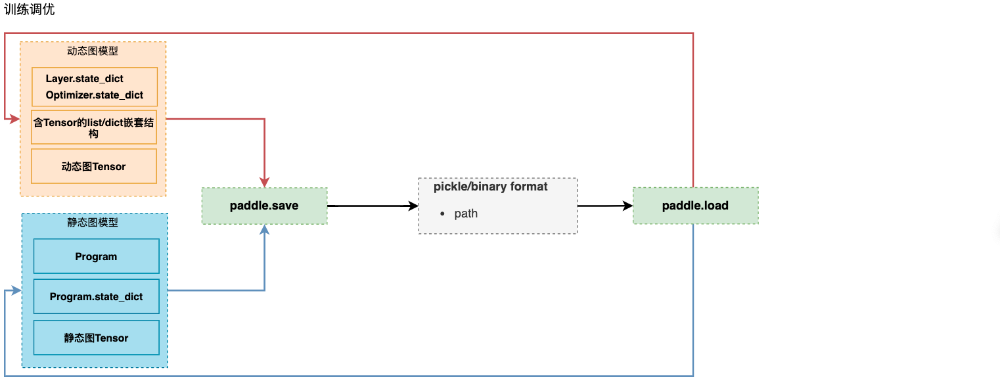

.. _cn_doc_model_save_load:

#############
模型保存与载入
#############

一、保存载入体系简介
##################

1.1 基础API保存载入体系
--------------------

飞桨框架2.1对模型与参数的保存与载入相关接口进行了梳理：对于训练调优场景，我们推荐使用paddle.save/load保存和载入模型；对于推理部署场景，我们推荐使用paddle.jit.save/load（动态图）和paddle.static.save/load_inference_model（静态图）保存载入模型。

飞桨保存载入相关接口包括：


:ref:`paddle.save <cn_api_paddle_framework_io_save>`

:ref:`paddle.load <cn_api_paddle_framework_io_load>`

:ref:`paddle.jit.save <cn_api_paddle_jit_save>`

:ref:`paddle.jit.load <cn_api_paddle_jit_save>`

:ref:`paddle.static.save_inference_model <cn_api_static_save_inference_model>`

:ref:`paddle.static.load_inference_model <cn_api_fluid_io_load_inference_model>`


各接口关系如下图所示：




1.2 高阶API保存载入体系
--------------------

- paddle.Model.fit (训练接口，同时带有参数保存的功能)
- paddle.Model.save
- paddle.Model.load

飞桨框架2.0高阶API仅有一套Save/Load接口，表意直观，体系清晰，若有需要，建议直接阅读相关API文档，此处不再赘述。

.. note::
    本教程着重介绍飞桨框架2.1的各个保存载入接口的关系及各种使用场景，不对接口参数进行详细介绍，如果需要了解具体接口参数的含义，请直接阅读对应API文档。


`模型保存常见问题 <./../../faq/save_cn.html>`_ 


二、训练调优场景的模型&参数保存载入
##############################

2.1 动态图参数保存载入
-------------------

若仅需要保存/载入模型的参数，可以使用 ``paddle.save/load`` 结合Layer和Optimizer的state_dict达成目的，此处state_dict是对象的持久参数的载体，dict的key为参数名，value为参数真实的numpy array值。

结合以下简单示例，介绍参数保存和载入的方法，以下示例完成了一个简单网络的训练过程：

.. code-block:: python

    import numpy as np
    import paddle
    import paddle.nn as nn
    import paddle.optimizer as opt

    BATCH_SIZE = 16
    BATCH_NUM = 4
    EPOCH_NUM = 4

    IMAGE_SIZE = 784
    CLASS_NUM = 10

    # define a random dataset
    class RandomDataset(paddle.io.Dataset):
        def __init__(self, num_samples):
            self.num_samples = num_samples

        def __getitem__(self, idx):
            image = np.random.random([IMAGE_SIZE]).astype('float32')
            label = np.random.randint(0, CLASS_NUM - 1, (1, )).astype('int64')
            return image, label

        def __len__(self):
            return self.num_samples

    class LinearNet(nn.Layer):
        def __init__(self):
            super(LinearNet, self).__init__()
            self._linear = nn.Linear(IMAGE_SIZE, CLASS_NUM)

        def forward(self, x):
            return self._linear(x)

    def train(layer, loader, loss_fn, opt):
        for epoch_id in range(EPOCH_NUM):
            for batch_id, (image, label) in enumerate(loader()):
                out = layer(image)
                loss = loss_fn(out, label)
                loss.backward()
                opt.step()
                opt.clear_grad()
                print("Epoch {} batch {}: loss = {}".format(
                    epoch_id, batch_id, np.mean(loss.numpy())))

    # create network
    layer = LinearNet()
    loss_fn = nn.CrossEntropyLoss()
    adam = opt.Adam(learning_rate=0.001, parameters=layer.parameters())

    # create data loader
    dataset = RandomDataset(BATCH_NUM * BATCH_SIZE)
    loader = paddle.io.DataLoader(dataset,
        batch_size=BATCH_SIZE,
        shuffle=True,
        drop_last=True,
        num_workers=2)

    # train
    train(layer, loader, loss_fn, adam)


2.1.1 参数保存
-------------

参数保存时，先获取目标对象（Layer或者Optimzier）的state_dict，然后将state_dict保存至磁盘，示例如下（接前述示例）:

.. code-block:: python

    # save
    paddle.save(layer.state_dict(), "linear_net.pdparams")
    paddle.save(adam.state_dict(), "adam.pdopt")


2.1.2 参数载入
-------------

参数载入时，先从磁盘载入保存的state_dict，然后通过set_state_dict方法配置到目标对象中，示例如下（接前述示例）：

.. code-block:: python

    # load
    layer_state_dict = paddle.load("linear_net.pdparams")
    opt_state_dict = paddle.load("adam.pdopt")

    layer.set_state_dict(layer_state_dict)
    adam.set_state_dict(opt_state_dict)


2.2 静态图模型&参数保存载入
-----------------------
若仅需要保存/载入模型的参数，可以使用 ``paddle.save/load`` 结合Program的state_dict达成目的，此处state_dict与动态图state_dict概念类似，dict的key为参数名，value为参数真实的值。若想保存整个模型，需要使用``paddle.save``将Program和state_dict都保存下来。

结合以下简单示例，介绍参数保存和载入的方法：

.. code-block:: python

    import paddle
    import paddle.static as static

    paddle.enable_static()

    # create network
    x = paddle.static.data(name="x", shape=[None, 224], dtype='float32')
    z = paddle.static.nn.fc(x, 10)

    place = paddle.CPUPlace()
    exe = paddle.static.Executor(place)
    exe.run(paddle.static.default_startup_program())
    prog = paddle.static.default_main_program()


2.2.1 静态图模型&参数保存
---------------------

参数保存时，先获取Program的state_dict，然后将state_dict保存至磁盘，示例如下（接前述示例）:

.. code-block:: python
    
    paddle.save(prog.state_dict(), "temp/model.pdparams")
    

如果想要保存整个静态图模型，除了state_dict还需要保存Program

.. code-block:: python

    paddle.save(prog, "temp/model.pdmodel")


2.2.2 静态图模型&参数载入
---------------------

如果只保存了state_dict，可以跳过此段代码，直接载入state_dict。如果模型文件中包含Program和state_dict，请先载入Program，示例如下（接前述示例）:

.. code-block:: python

    prog = paddle.load("temp/model.pdmodel")


参数载入时，先从磁盘载入保存的state_dict，然后通过set_state_dict方法配置到Program中，示例如下（接前述示例）：

.. code-block:: python

    state_dict = paddle.load("temp/model.pdparams")
    prog.set_state_dict(state_dict)


三、训练部署场景的模型&参数保存载入
##################################

3.1 动态图模型&参数保存载入（训练推理）
---------------------------
若要同时保存/载入动态图模型结构和参数，可以使用 ``paddle.jit.save/load`` 实现。

3.1.1 动态图模型&参数保存
----------------------

模型&参数存储根据训练模式不同，有两种使用情况：

(1) 动转静训练 + 模型&参数保存
(2) 动态图训练 + 模型&参数保存

3.1.1.1 动转静训练 + 模型&参数保存
``````````````````````````````

动转静训练相比直接使用动态图训练具有更好的执行性能，训练完成后，直接将目标Layer传入 ``paddle.jit.save`` 保存即可。：

一个简单的网络训练示例如下：

.. code-block:: python

    import numpy as np
    import paddle
    import paddle.nn as nn
    import paddle.optimizer as opt

    BATCH_SIZE = 16
    BATCH_NUM = 4
    EPOCH_NUM = 4

    IMAGE_SIZE = 784
    CLASS_NUM = 10

    # define a random dataset
    class RandomDataset(paddle.io.Dataset):
        def __init__(self, num_samples):
            self.num_samples = num_samples

        def __getitem__(self, idx):
            image = np.random.random([IMAGE_SIZE]).astype('float32')
            label = np.random.randint(0, CLASS_NUM - 1, (1, )).astype('int64')
            return image, label

        def __len__(self):
            return self.num_samples

    class LinearNet(nn.Layer):
        def __init__(self):
            super(LinearNet, self).__init__()
            self._linear = nn.Linear(IMAGE_SIZE, CLASS_NUM)

        @paddle.jit.to_static
        def forward(self, x):
            return self._linear(x)

    def train(layer, loader, loss_fn, opt):
        for epoch_id in range(EPOCH_NUM):
            for batch_id, (image, label) in enumerate(loader()):
                out = layer(image)
                loss = loss_fn(out, label)
                loss.backward()
                opt.step()
                opt.clear_grad()
                print("Epoch {} batch {}: loss = {}".format(
                    epoch_id, batch_id, np.mean(loss.numpy())))

    # create network
    layer = LinearNet()
    loss_fn = nn.CrossEntropyLoss()
    adam = opt.Adam(learning_rate=0.001, parameters=layer.parameters())

    # create data loader
    dataset = RandomDataset(BATCH_NUM * BATCH_SIZE)
    loader = paddle.io.DataLoader(dataset,
        batch_size=BATCH_SIZE,
        shuffle=True,
        drop_last=True,
        num_workers=2)

    # train
    train(layer, loader, loss_fn, adam)


随后使用 ``paddle.jit.save`` 对模型和参数进行存储（接前述示例）：

.. code-block:: python

    # save
    path = "example.model/linear"
    paddle.jit.save(layer, path)


通过动转静训练后保存模型&参数，有以下三项注意点：

(1) Layer对象的forward方法需要经由 ``paddle.jit.to_static`` 装饰

经过 ``paddle.jit.to_static`` 装饰forward方法后，相应Layer在执行时，会先生成描述模型的Program，然后通过执行Program获取计算结果，示例如下：

.. code-block:: python

    import paddle
    import paddle.nn as nn

    IMAGE_SIZE = 784
    CLASS_NUM = 10

    class LinearNet(nn.Layer):
        def __init__(self):
            super(LinearNet, self).__init__()
            self._linear = nn.Linear(IMAGE_SIZE, CLASS_NUM)

        @paddle.jit.to_static
        def forward(self, x):
            return self._linear(x)

若最终需要生成的描述模型的Program支持动态输入，可以同时指明模型的 ``InputSepc`` ，示例如下：

.. code-block:: python

    import paddle
    import paddle.nn as nn
    from paddle.static import InputSpec

    IMAGE_SIZE = 784
    CLASS_NUM = 10

    class LinearNet(nn.Layer):
        def __init__(self):
            super(LinearNet, self).__init__()
            self._linear = nn.Linear(IMAGE_SIZE, CLASS_NUM)

        @paddle.jit.to_static(input_spec=[InputSpec(shape=[None, 784], dtype='float32')])
        def forward(self, x):
            return self._linear(x)


(2) 请确保Layer.forward方法中仅实现预测功能，避免将训练所需的loss计算逻辑写入forward方法

Layer更准确的语义是描述一个具有预测功能的模型对象，接收输入的样本数据，输出预测的结果，而loss计算是仅属于模型训练中的概念。将loss计算的实现放到Layer.forward方法中，会使Layer在不同场景下概念有所差别，并且增大Layer使用的复杂性，这不是良好的编码行为，同时也会在最终保存预测模型时引入剪枝的复杂性，因此建议保持Layer实现的简洁性，下面通过两个示例对比说明：

错误示例如下：

.. code-block:: python

    import paddle
    import paddle.nn as nn

    IMAGE_SIZE = 784
    CLASS_NUM = 10

    class LinearNet(nn.Layer):
        def __init__(self):
            super(LinearNet, self).__init__()
            self._linear = nn.Linear(IMAGE_SIZE, CLASS_NUM)

        @paddle.jit.to_static
        def forward(self, x, label=None):
            out = self._linear(x)
            if label:
                loss = nn.functional.cross_entropy(out, label)
                avg_loss = nn.functional.mean(loss)
                return out, avg_loss
            else:
                return out
            

正确示例如下：

.. code-block:: python

    import paddle
    import paddle.nn as nn

    IMAGE_SIZE = 784
    CLASS_NUM = 10

    class LinearNet(nn.Layer):
        def __init__(self):
            super(LinearNet, self).__init__()
            self._linear = nn.Linear(IMAGE_SIZE, CLASS_NUM)

        @paddle.jit.to_static
        def forward(self, x):
            return self._linear(x)


(3) 如果你需要保存多个方法，需要用 ``paddle.jit.to_static`` 装饰每一个需要被保存的方法。

.. note::
    只有在forward之外还需要保存其他方法时才用这个特性，如果仅装饰非forward的方法，而forward没有被装饰，是不符合规范的。此时 ``paddle.jit.save`` 的 ``input_spec`` 参数必须为None。

示例代码如下：

.. code-block:: python

    import paddle
    import paddle.nn as nn
    from paddle.static import InputSpec

    IMAGE_SIZE = 784
    CLASS_NUM = 10

    class LinearNet(nn.Layer):
        def __init__(self):
            super(LinearNet, self).__init__()
            self._linear = nn.Linear(IMAGE_SIZE, CLASS_NUM)
            self._linear_2 = nn.Linear(IMAGE_SIZE, CLASS_NUM)

        @paddle.jit.to_static(input_spec=[InputSpec(shape=[None, IMAGE_SIZE], dtype='float32')])
        def forward(self, x):
            return self._linear(x)

        @paddle.jit.to_static(input_spec=[InputSpec(shape=[None, IMAGE_SIZE], dtype='float32')])
        def another_forward(self, x):
            return self._linear_2(x)

    inps = paddle.randn([1, IMAGE_SIZE])
    layer = LinearNet()
    before_0 = layer.another_forward(inps)
    before_1 = layer(inps)
    # save and load
    path = "example.model/linear"
    paddle.jit.save(layer, path)

保存的模型命名规则：forward的模型名字为：模型名+后缀，其他函数的模型名字为：模型名+函数名+后缀。每个函数有各自的pdmodel和pdiparams的文件，所有函数共用pdiparams.info。上述代码将在 ``example.model`` 文件夹下产生5个文件：
``linear.another_forward.pdiparams、 linear.pdiparams、 linear.pdmodel、 linear.another_forward.pdmodel、 linear.pdiparams.info``

(4) 当使用 ``jit.save`` 保存函数时，``jit.save`` 只保存这个函数对应的静态图 `Program` ，不会保存和这个函数相关的参数。如果你必须保存参数，请使用Layer封装这个函数。

示例代码如下：

.. code-block:: python

    def fun(inputs):
        return paddle.tanh(inputs)

    path = 'func/model'
    inps = paddle.rand([3, 6])
    origin = fun(inps)

    paddle.jit.save(
        fun,
        path,
        input_spec=[
            InputSpec(
                shape=[None, 6], dtype='float32', name='x'),
        ])
    load_func = paddle.jit.load(path)
    load_result = load_func(inps)


3.1.1.2 动态图训练 + 模型&参数保存
``````````````````````````````

动态图模式相比动转静模式更加便于调试，如果你仍需要使用动态图直接训练，也可以在动态图训练完成后调用 ``paddle.jit.save`` 直接保存模型和参数。

同样是一个简单的网络训练示例：

.. code-block:: python

    import numpy as np
    import paddle
    import paddle.nn as nn
    import paddle.optimizer as opt
    from paddle.static import InputSpec

    BATCH_SIZE = 16
    BATCH_NUM = 4
    EPOCH_NUM = 4

    IMAGE_SIZE = 784
    CLASS_NUM = 10

    # define a random dataset
    class RandomDataset(paddle.io.Dataset):
        def __init__(self, num_samples):
            self.num_samples = num_samples

        def __getitem__(self, idx):
            image = np.random.random([IMAGE_SIZE]).astype('float32')
            label = np.random.randint(0, CLASS_NUM - 1, (1, )).astype('int64')
            return image, label

        def __len__(self):
            return self.num_samples

    class LinearNet(nn.Layer):
        def __init__(self):
            super(LinearNet, self).__init__()
            self._linear = nn.Linear(IMAGE_SIZE, CLASS_NUM)

        def forward(self, x):
            return self._linear(x)

    def train(layer, loader, loss_fn, opt):
        for epoch_id in range(EPOCH_NUM):
            for batch_id, (image, label) in enumerate(loader()):
                out = layer(image)
                loss = loss_fn(out, label)
                loss.backward()
                opt.step()
                opt.clear_grad()
                print("Epoch {} batch {}: loss = {}".format(
                    epoch_id, batch_id, np.mean(loss.numpy())))

    # create network
    layer = LinearNet()
    loss_fn = nn.CrossEntropyLoss()
    adam = opt.Adam(learning_rate=0.001, parameters=layer.parameters())

    # create data loader
    dataset = RandomDataset(BATCH_NUM * BATCH_SIZE)
    loader = paddle.io.DataLoader(dataset,
        batch_size=BATCH_SIZE,
        shuffle=True,
        drop_last=True,
        num_workers=2)

    # train
    train(layer, loader, loss_fn, adam)


训练完成后使用 ``paddle.jit.save`` 对模型和参数进行存储：

.. code-block:: python

    # save
    path = "example.dy_model/linear"
    paddle.jit.save(
        layer=layer, 
        path=path,
        input_spec=[InputSpec(shape=[None, 784], dtype='float32')])

动态图训练后使用 ``paddle.jit.save`` 保存模型和参数注意点如下：

(1) 相比动转静训练，Layer对象的forward方法不需要额外装饰，保持原实现即可

(2) 与动转静训练相同，请确保Layer.forward方法中仅实现预测功能，避免将训练所需的loss计算逻辑写入forward方法

(3) 在最后使用 ``paddle.jit.save`` 时，需要指定Layer的 ``InputSpec`` ，Layer对象forward方法的每一个参数均需要对应的 ``InputSpec`` 进行描述，不能省略。这里的 ``input_spec`` 参数支持两种类型的输入：

- ``InputSpec`` 列表

使用InputSpec描述forward输入参数的shape，dtype和name，如前述示例（此处示例中name省略，name省略的情况下会使用forward的对应参数名作为name，所以这里的name为 ``x`` ）：

.. code-block:: python

    paddle.jit.save(
        layer=layer, 
        path=path,
        input_spec=[InputSpec(shape=[None, 784], dtype='float32')])

- Example Tensor 列表

除使用InputSpec之外，也可以直接使用forward训练时的示例输入，此处可以使用前述示例中迭代DataLoader得到的 ``image`` ，示例如下：

.. code-block:: python

    paddle.jit.save(
        layer=layer, 
        path=path,
        input_spec=[image])

3.1.2 动态图模型&参数载入
----------------------

载入模型参数，使用 ``paddle.jit.load`` 载入即可，载入后得到的是一个Layer的派生类对象 ``TranslatedLayer`` ， ``TranslatedLayer`` 具有Layer具有的通用特征，支持切换 ``train`` 或者 ``eval`` 模式，可以进行模型调优或者预测。

.. note::
    为了规避变量名字冲突，载入之后会重命名变量。

载入模型及参数，示例如下：

.. code-block:: python

    import numpy as np
    import paddle
    import paddle.nn as nn
    import paddle.optimizer as opt

    BATCH_SIZE = 16
    BATCH_NUM = 4
    EPOCH_NUM = 4

    IMAGE_SIZE = 784
    CLASS_NUM = 10

    # load
    path = "example.model/linear"
    loaded_layer = paddle.jit.load(path)

载入模型及参数后进行预测，示例如下（接前述示例）：

.. code-block:: python

    # inference
    loaded_layer.eval()
    x = paddle.randn([1, IMAGE_SIZE], 'float32')
    pred = loaded_layer(x)

载入模型及参数后进行调优，示例如下（接前述示例）：

.. code-block:: python

    # define a random dataset
    class RandomDataset(paddle.io.Dataset):
        def __init__(self, num_samples):
            self.num_samples = num_samples

        def __getitem__(self, idx):
            image = np.random.random([IMAGE_SIZE]).astype('float32')
            label = np.random.randint(0, CLASS_NUM - 1, (1, )).astype('int64')
            return image, label

        def __len__(self):
            return self.num_samples

    def train(layer, loader, loss_fn, opt):
        for epoch_id in range(EPOCH_NUM):
            for batch_id, (image, label) in enumerate(loader()):
                out = layer(image)
                loss = loss_fn(out, label)
                loss.backward()
                opt.step()
                opt.clear_grad()
                print("Epoch {} batch {}: loss = {}".format(
                    epoch_id, batch_id, np.mean(loss.numpy())))

    # fine-tune
    loaded_layer.train()
    dataset = RandomDataset(BATCH_NUM * BATCH_SIZE)
    loader = paddle.io.DataLoader(dataset,
        batch_size=BATCH_SIZE,
        shuffle=True,
        drop_last=True,
        num_workers=2)
    loss_fn = nn.CrossEntropyLoss()
    adam = opt.Adam(learning_rate=0.001, parameters=loaded_layer.parameters())
    train(loaded_layer, loader, loss_fn, adam)
    # save after fine-tuning
    paddle.jit.save(loaded_layer, "fine-tune.model/linear", input_spec=[x])


此外， ``paddle.jit.save`` 同时保存了模型和参数，如果你只需要从存储结果中载入模型的参数，可以使用 ``paddle.load`` 接口载入，返回所存储模型的state_dict，示例如下：

.. code-block:: python

    import paddle
    import paddle.nn as nn

    IMAGE_SIZE = 784
    CLASS_NUM = 10

    class LinearNet(nn.Layer):
        def __init__(self):
            super(LinearNet, self).__init__()
            self._linear = nn.Linear(IMAGE_SIZE, CLASS_NUM)

        @paddle.jit.to_static
        def forward(self, x):
            return self._linear(x)

    # create network
    layer = LinearNet()

    # load
    path = "example.model/linear"
    state_dict = paddle.load(path)

    # inference
    layer.set_state_dict(state_dict, use_structured_name=False)
    layer.eval()
    x = paddle.randn([1, IMAGE_SIZE], 'float32')
    pred = layer(x)


3.2 静态图模型&参数保存载入（推理部署）
--------------------------------
保存/载入静态图推理模型，可以通过 ``paddle.static.save/load_inference_model`` 实现。示例如下:

.. code-block:: python

    import paddle
    import numpy as np

    paddle.enable_static()

    # Build the model
    startup_prog = paddle.static.default_startup_program()
    main_prog = paddle.static.default_main_program()
    with paddle.static.program_guard(main_prog, startup_prog):
        image = paddle.static.data(name="img", shape=[64, 784])
        w = paddle.create_parameter(shape=[784, 200], dtype='float32')
        b = paddle.create_parameter(shape=[200], dtype='float32')
        hidden_w = paddle.matmul(x=image, y=w)
        hidden_b = paddle.add(hidden_w, b)
    exe = paddle.static.Executor(paddle.CPUPlace())
    exe.run(startup_prog)


3.2.1 静态图推理模型&参数保存
-------------------------
静态图导出推理模型需要指定导出路径、输入、输出变量以及执行器。 ``save_inference_model`` 会裁剪Program的冗余部分，并导出两个文件： ``path_prefix.pdmodel`` 、 ``path_prefix.pdiparams`` 。示例如下（接前述示例）：

.. code-block:: python

    # Save the inference model
    path_prefix = "./infer_model"
    paddle.static.save_inference_model(path_prefix, [image], [hidden_b], exe)


3.2.2 静态图推理模型&参数载入
-------------------------
载入静态图推理模型时，输入给 ``load_inference_model`` 的路径必须与 ``save_inference_model`` 的一致。示例如下（接前述示例）：

.. code-block:: python

    [inference_program, feed_target_names, fetch_targets] = (
        paddle.static.load_inference_model(path_prefix, exe))
    tensor_img = np.array(np.random.random((64, 784)), dtype=np.float32)
    results = exe.run(inference_program,
                    feed={feed_target_names[0]: tensor_img},
                    fetch_list=fetch_targets)

