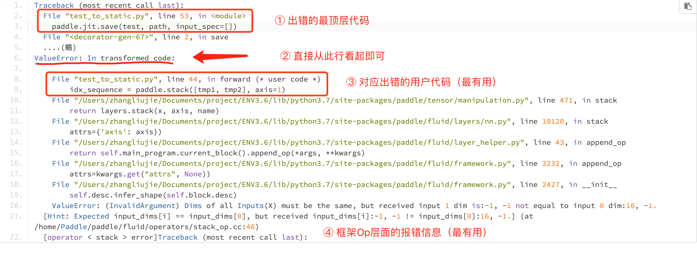
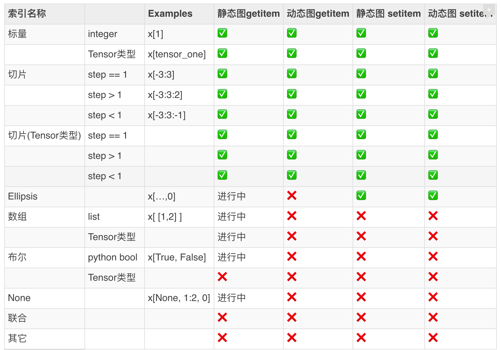

# 调试经验


## 一、错误日志怎么看

**如下是一个报错栈输出样例：**

)

**动转静的报错栈，自顶向下总共包含4个核心部分：**

+ 原生 Python 的报错栈（对应上图 ①）
>  此行所在代码为出错的用户最顶层代码入口，如上图 ① 意味着是 `paddle.jit.save()` 这样调用导致的后续一系列报错。

+ 动转静报错栈起始标志位（对应 ②）
> 实际场景中，可以直接搜索 `transformed code` 关键字，并从这一行以下开始看报错日志即可。

+ 实际出错的转写代码位置（对应 ③）
> 表示具体执行到哪一行转写代码时报的错误，对应的是转写后的代码行。如上图 ② 中执行到 `paddle.stack` 处报的错误。

+ 静态图相关的框架层面报错信息（对应 ④）
> 此部分与静态图组网报错信息是一致的。一般可以直接根据最后三行的信息，定位具体是在生成哪个 OpDesc 时报的错误，一般是与执行此 Op 的 infershape 逻辑报的错误。


## 二、快速确定问题原因

经过汇总整理，根据报错信息的种类，可以将动转静的问题大致分为如下几个类别：

### 2.1 (NotFound) Input("X")

**报错信息大致如下：**

```bash
RuntimeError: (NotFound) Input("Filter") of ConvOp should not be null.
  [Hint: Expected ctx->HasInputs("Filter") == true, but received ctx->HasInputs("Filter"):0 != true:1.]
  [operator < conv2d > error]
```

此类问题的原因一般是：

> 执行到报错所在行的 Paddle API 时，某些输入或者 weight 的类型还是动态图的 Tensor，而非静态图的 Variable 或者 Parameter.

**排查建议：**

+ 首先确认代码所在的 sublayer 是否继承了 `nn.Layer`
+ 此行代码所在函数是否绕开了 foward 函数，单独调用的（2.1 版本之前）
+ 如何查看是 Tensor 还是 Vaiable 类型，可以通过 pdb 交互式调试


### 2.2 Expected input_dims[i] == input_dims[0]

**报错信息大致如下：**

```bash
[Hint: Expected input_dims[i] == input_dims[0], but received input_dims[i]:-1, -1 != input_dims[0]:16, -1.]
  [operator < xxx_op > error]
```

此类问题的原因一般是：
> 逐个 append_op 生成静态图 Program 时，在执行到某个 Paddle API 时，编译期 infershape 不符合要求。

**排查建议：**

+ 代码层面，判断是否是上游使用了`reshape`导致 -1 的污染性传播
> 动态图由于执行时 shape 都是已知的，所以 reshape(x, [-1, 0, 128]) 是没有问题的。但静态图组网时都是编译期的 shape（可能为-1），因此使用 reshape 接口时，尽量减少 -1 的使用。

+ 可以结合后续调试技巧，判断是否是某个 API 的输出 shape 在动静态图下有 diff 行为
> 比如某些 Paddle API 动态图下返回的是 1-D Tensor， 但静态图却是始终和输入保持一致，如 `ctx->SetOutputDim("Out", ctx->GetInputDim("X"));`

### 2.3 desc->CheckGuards() == true

```bash
[Hint: Expected desc->CheckGuards() == true, but received desc->CheckGuards():0 != true: 1.]
```

此类问题的原因一般是：
> 模型代码中存在一些高阶的 Tensor slice 赋值操作。一些静态图高阶的 slice 语法功能正在与动态图对齐和支持中。

**如下是当前动、静态图对 slice 语法功能的汇总情况：**



**排查建议：**

+  模型代码是否存在上述复杂的 Tensor slice 切片操作
+ 推荐使用 paddle.slice 接口替换复杂的 Tensor slice 操作

### 2.4 Segment Fault
当动转静出现 **段错误** 时，报错栈信息也会很少，但导致此类问题的原因一般也比较明确。

此类问题的一般原因是：

> 某个 sublayer 未继承 `nn.Layer` ，同时在 `__init__.py` 函数中存在 `paddle.to_tensor` 接口的调用。导致在生成 `Program` 或者保存模型参数时，在静态图模式下访问了动态图的 Tensor 数据。

**排查建议：**

+  每个sublayer 是否继承了 `nn.Layer`

### 2.5 Container 的使用建议

动态图下，提供了如下几种 container 的容器类：

+ [ParameterList](https://www.paddlepaddle.org.cn/documentation/docs/zh/api/paddle/nn/ParameterList_cn.html#parameterlist)
    ```python
    class MyLayer(paddle.nn.Layer):
        def __init__(self, num_stacked_param):
            super(MyLayer, self).__init__()

            w1 = paddle.create_parameter(shape=[2, 2], dtype='float32')
            w2 = paddle.create_parameter(shape=[2], dtype='float32')

            # 此用法下，MyLayer.parameters() 返回为空
            self.params = [w1, w2]                            # <----- 错误用法

            self.params = paddle.nn.ParameterList([w1, w2])   # <----- 正确用法
    ```

+ [LayerList](https://www.paddlepaddle.org.cn/documentation/docs/zh/api/paddle/nn/LayerList_cn.html#layerlist)
    ```python
    class MyLayer(paddle.nn.Layer):
        def __init__(self):
            super(MyLayer, self).__init__()

            layer1 = paddle.nn.Linear(10, 10)
            layer2 = paddle.nn.Linear(10, 16)

            # 此用法下，MyLayer.parameters() 返回为空
            self.linears = [layer1, layer2]                        # <----- 错误用法

            self.linears = paddle.nn.LayerList([layer1, layer2])   # <----- 正确用法
    ```


+ [Sequential](https://www.paddlepaddle.org.cn/documentation/docs/zh/api/paddle/nn/Sequential_cn.html#sequential)

在模型代码中，我们都比较推荐使用这些 container， 而非原生的 Python List 作为容器。
