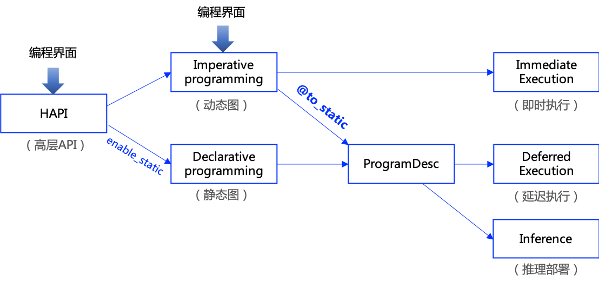

###############
动态图转静态图
###############

=========================
什么是动态图和静态图？
=========================

从深度学习模型构建方式上看，飞桨框架支持动态图编程和静态图编程两种方式，其代码编写方式和执行方式均存在差异。

* **动态图编程：** 采用 Python 风格的编程方式，解析式的执行方式。每写一行网络代码，即可同时获得计算结果。在
`模型开发 <../02_paddle2.0_develop/index_cn.html>`_ 章节中，介绍的都是动态图编程方式。

* **静态图编程：** 采用先编译后执行的方式。先预定义完整的神经网络结构，飞桨框架将神经网络描述为 `Program` 的数据结构，对 `Program` 进行编译优化，再调用执行器获得计算结果。

动态图编程体验更佳、更易调试，但是因为采用 Python 实时执行的方式，而 Python 执行开销较大，与 C++ 有一定差距，性能方面不占优。静态图调试难度大，但是将前端 Python 编写的神经网络预定义为 Program描述，转到 C++ 端重新解析执行，脱离了 Python 依赖，往往执行性能更佳，并且预先拥有完整网络结构也更利于全局优化。

=========================
什么场景下需要动态图转静态图？
=========================

飞桨框架在设计时，考虑同时兼顾动态图的高易用性和静态图的高性能优势，采用『动静统一』的方案：

* **在模型开发时，推荐采用动态图编程：** 可获得更好的编程体验、更易用的接口、更友好的调试交互机制。

* **在模型训练或者推理部署时，只需添加一行装饰器 @to_static，即可将动态图代码转写为静态图代码，并在底层自动使用静态图执行器运行：** 可获得更好的模型运行性能。

方案如下图所示：

.. centered:: 图1 飞桨框架动静统一方案示意图

.. note::
    飞桨框架 2.0 及以上版本默认的编程模式是动态图模式，包括使用高层 API 编程和基础的 API 编程。如果想切换到静态图模式编程，可以在程序的开始执行 `enable_static()` 函数。如果程序已经使用动态图的模式编写了，想转成静态图模式训练或者保存模型用于部署，可以使用装饰器 @to_static。

想了解动态图和静态图的详细对比介绍，可参见
`动态图和静态图的差异 <https://www.paddlepaddle.org.cn/tutorials/projectdetail/2134396#anchor-8>`_。

以下将详细地介绍动静转换的各个模块内容：

- `基础接口用法 <basic_usage_cn.html>`_ : 介绍了动静转换 @to_static 的基本用法

- `语法支持列表 <grammar_list_cn.html>`_ ：介绍了动静转换功能已支持的语法概况

- `预测模型导出 <./export_model/index_cn.html>`_ ：介绍了导出动态图预测模型的详细教程

- `常见案例解析 <./case_analysis_cn.html>`_ : 介绍使用 @to_static 时常见的问题和案例解析

- `报错调试经验 <debugging_cn.html>`_ ：介绍了动静转换 @to_static 的调试方法和经验

..  toctree::
    :hidden:

    basic_usage_cn.rst    
    grammar_list_cn.md
    export_model_cn.md
    case_analysis_cn.md
    debugging_cn.md

