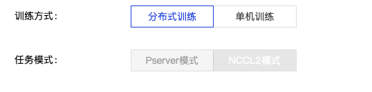

本节将采用CV领域非常经典的任务来介绍如何使用 `Fleet API <https://www.paddlepaddle.org.cn/documentation/docs/zh/api/paddle/distributed/Overview_cn.html#fleetapi>`_ (paddle.distributed.fleet)完成Collective训练任务。

1.1 版本要求
^^^^^^^^^^^^^^^^^^^^^^^^^^^^^^

在编写分布式训练程序之前，用户需要确保已经安装paddlepaddle-2.0.0-rc-cpu或paddlepaddle-2.0.0-rc-gpu及以上版本的飞桨开源框架。

1.2 操作方法
^^^^^^^^^^^^^^^^^^^^^^^^^^^^^^

与单机单卡的普通模型训练相比，无论静态图还是动态图，Collective训练的代码都只需要简单补充五个部分代码：

    1. 导入分布式训练依赖包 
    2. 初始化Fleet环境 
    3. 构建分布式训练使用的网络模型 
    4. 构建分布式训练使用的优化器 
    5. 构建分布式训练所使用的数据集 

下面将逐一进行讲解。

.. _method1_label:

1.2.1 导入分布式训练依赖包
""""""""""""""""""""""""""""

导入飞桨分布式训练专用包Fleet。

.. code-block:: python

    # 导入分布式专用Fleet API
    from paddle.distributed import fleet
    # 导入分布式训练数据所需API
    from paddle.io import DataLoader, DistributedBatchSampler
    # 设置GPU环境
    paddle.set_device('gpu')

.. _method2_label:

1.2.2 初始化Fleet环境
""""""""""""""""""""""""""

分布式初始化需要：

    1. 设置is_collective为True，表示分布式训练采用Collective模式。
    2. [可选] 设置分布式策略 `DistributedStrategy <https://www.paddlepaddle.org.cn/documentation/docs/zh/api/paddle/distributed/fleet/DistributedStrategy_cn.html>`_，跳过将使用缺省配置。

.. code-block:: python

    # 选择不设置分布式策略
    fleet.init(is_collective=True)

    # 选择设置分布式策略
    strategy = fleet.DistributedStrategy()
    fleet.init(is_collective=True, strategy=strategy)

.. _method3_label:

1.2.3 构建分布式训练使用的网络模型
""""""""""""""""""""""""""""""""""
只需要使用 ``fleet.distributed_model`` 对原始串行网络模型进行封装。

.. code-block:: python

    # 等号右边model为原始串行网络模型
    model = fleet.distributed_model(model)

.. _method4_label:

1.2.4 构建分布式训练使用的优化器
""""""""""""""""""""""""""""""""""
只需要使用 ``fleet.distributed_optimizer`` 对原始串行优化器进行封装。

.. code-block:: python

    # 等号右边optimizer为原始串行网络模型
    optimizer = fleet.distributed_optimizer(optimizer)

.. _method5_label:

1.2.5 构建分布式训练所使用的数据集
""""""""""""""""""""""""""""""""""

由于分布式训练过程中每个进程可能读取不同数据，所以需要对数据集进行合理拆分，这里需要在构建 `DataLoader <https://www.paddlepaddle.org.cn/documentation/docs/zh/api/paddle/io/DataLoader_cn.html#dataloader>`_ 时候， 设置分布式数据采样器 `DistributedBatchSampler <https://www.paddlepaddle.org.cn/documentation/docs/zh/api/paddle/io/DistributedBatchSampler_cn.html#distributedbatchsampler>`_ 即可。

.. code-block:: python

    # 构建分布式数据采样器 
    # 注意：需要保证batch中每个样本数据shape相同，若原尺寸不一，需进行预处理
    train_sampler = DistributedBatchSampler(train_dataset, 32, shuffle=True, drop_last=True)
    val_sampler = DistributedBatchSampler(val_dataset, 32)

    # 构建分布式数据加载器
    train_loader = DataLoader(train_dataset, batch_sampler=train_sampler, num_workers=2)
    valid_loader = DataLoader(val_dataset, batch_sampler=val_sampler, num_workers=2)

1.3 完整示例代码
^^^^^^^^^^^^^^^^^^^^^^^^^^^^^^

1.3.1 示例1：当样本数据尺寸一致时，采用Paddle内置的cifar10数据集介绍
""""""""""""""""""""""""""""""""""""""""""""""""""""""""""""""""""""""""""""""""""""""""""""""""

.. code-block:: python

    # -*- coding: UTF-8 -*-
    import numpy as np
    import matplotlib.pyplot as plt
    import paddle
    import paddle.nn.functional as F
    from paddle.vision.transforms import ToTensor
    # 一、导入分布式专用Fleet API
    from paddle.distributed import fleet
    # 导入分布式训练数据所需API
    from paddle.io import DataLoader, DistributedBatchSampler
    # 设置GPU环境
    paddle.set_device('gpu')

    class MyNet(paddle.nn.Layer):
        def __init__(self, num_classes=1):
            super(MyNet, self).__init__()

            self.conv1 = paddle.nn.Conv2D(in_channels=3, out_channels=32, kernel_size=(3, 3))
            self.pool1 = paddle.nn.MaxPool2D(kernel_size=2, stride=2)

            self.conv2 = paddle.nn.Conv2D(in_channels=32, out_channels=64, kernel_size=(3,3))
            self.pool2 = paddle.nn.MaxPool2D(kernel_size=2, stride=2)

            self.conv3 = paddle.nn.Conv2D(in_channels=64, out_channels=64, kernel_size=(3,3))

            self.flatten = paddle.nn.Flatten()

            self.linear1 = paddle.nn.Linear(in_features=1024, out_features=64)
            self.linear2 = paddle.nn.Linear(in_features=64, out_features=num_classes)

        def forward(self, x):
            x = self.conv1(x)
            x = F.relu(x)
            x = self.pool1(x)

            x = self.conv2(x)
            x = F.relu(x)
            x = self.pool2(x)

            x = self.conv3(x)
            x = F.relu(x)

            x = self.flatten(x)
            x = self.linear1(x)
            x = F.relu(x)
            x = self.linear2(x)
            return x

    epoch_num = 10
    batch_size = 32
    learning_rate = 0.001
    val_acc_history = []
    val_loss_history = []

    def train():
        # 二、初始化Fleet环境
        fleet.init(is_collective=True)

        model = MyNet(num_classes=10)
        # 三、构建分布式训练使用的网络模型
        model = fleet.distributed_model(model)

        opt = paddle.optimizer.Adam(learning_rate=learning_rate,parameters=model.parameters())
        # 四、构建分布式训练使用的优化器
        opt = fleet.distributed_optimizer(opt)

        transform = ToTensor()
        cifar10_train = paddle.vision.datasets.Cifar10(mode='train',
                                               transform=transform)
        cifar10_test = paddle.vision.datasets.Cifar10(mode='test',
                                              transform=transform)

        # 五、构建分布式训练使用的数据集
        train_sampler = DistributedBatchSampler(cifar10_train, 32, shuffle=True, drop_last=True)
        train_loader = DataLoader(cifar10_train, batch_sampler=train_sampler, num_workers=2)

        valid_sampler = DistributedBatchSampler(cifar10_test, 32, drop_last=True)
        valid_loader = DataLoader(cifar10_test, batch_sampler=valid_sampler, num_workers=2)

        for epoch in range(epoch_num):
            model.train()
            for batch_id, data in enumerate(train_loader()):
                x_data = data[0]
                y_data = paddle.to_tensor(data[1])
                y_data = paddle.unsqueeze(y_data, 1)

                logits = model(x_data)
                loss = F.cross_entropy(logits, y_data)

                if batch_id % 1000 == 0:
                    print("epoch: {}, batch_id: {}, loss is: {}".format(epoch, batch_id, loss.numpy()))
                loss.backward()
                opt.step()
                opt.clear_grad()

            model.eval()
            accuracies = []
            losses = []
            for batch_id, data in enumerate(valid_loader()):
                x_data = data[0]
                y_data = paddle.to_tensor(data[1])
                y_data = paddle.unsqueeze(y_data, 1)

                logits = model(x_data)
                loss = F.cross_entropy(logits, y_data)
                acc = paddle.metric.accuracy(logits, y_data)
                accuracies.append(acc.numpy())
                losses.append(loss.numpy())

            avg_acc, avg_loss = np.mean(accuracies), np.mean(losses)
            print("[validation] accuracy/loss: {}/{}".format(avg_acc, avg_loss))
            val_acc_history.append(avg_acc)
            val_loss_history.append(avg_loss)

    if __name__ == "__main__":
        train()

1.3.2 示例2：当样本数据尺寸不一致时，采用自定义的人脸关键点检测数据集 
""""""""""""""""""""""""""""""""""""""""""""""""""""""""""""""""""""""""""""""""""""""""""""""""

.. code-block:: python

    import numpy as np
    import pandas as pd
    import paddle
    from paddle.io import Dataset
    from paddle.vision.transforms import transforms
    from paddle.vision.models import resnet18
    # 一、导入分布式专用Fleet API
    from paddle.distributed import fleet
    # 导入分布式训练数据所需API
    from paddle.io import DataLoader, DistributedBatchSampler
    # 设置GPU环境
    paddle.set_device('gpu')

    class ImgTransforms(object):
        """
        图像预处理工具，用于将图像进行升维(96, 96) => (96, 96, 3)，
        并对图像的维度进行转换从HWC变为CHW
        """
        def __init__(self, fmt):
            self.format = fmt

        def __call__(self, img):
            if len(img.shape) == 2:
                img = np.expand_dims(img, axis=2)
            img = img.transpose(self.format)
            if img.shape[0] == 1:
                img = np.repeat(img, 3, axis=0)
            return img

    class FaceDataset(Dataset):
        def __init__(self, data_path, mode='train', val_split=0.2):
            self.mode = mode
            assert self.mode in ['train', 'val', 'test'], \
                "mode should be 'train' or 'test', but got {}".format(self.mode)
            self.data_source = pd.read_csv(data_path)

            # 清洗数据, 数据集中有很多样本只标注了部分关键点, 这里有两种策略
            # 第一种, 将未标注的位置从上一个样本对应的关键点复制过来
            # self.data_source.fillna(method = 'ffill',inplace = True)
            # 第二种, 将包含有未标注的样本从数据集中移除
            self.data_source.dropna(how="any", inplace=True)
            self.data_label_all = self.data_source.drop('Image', axis=1)

            if self.mode in ['train', 'val']:
                np.random.seed(43)
                data_len = len(self.data_source)
                # 随机划分
                shuffled_indices = np.random.permutation(data_len)
                # 顺序划分
                # shuffled_indices = np.arange(data_len)
                self.shuffled_indices = shuffled_indices
                val_set_size = int(data_len * val_split)
                if self.mode == 'val':
                    val_indices = shuffled_indices[:val_set_size]
                    self.data_img = self.data_source.reindex().iloc[val_indices]
                    self.data_label = self.data_label_all.reindex().iloc[val_indices]
                elif self.mode == 'train':
                    train_indices = shuffled_indices[val_set_size:]
                    self.data_img = self.data_source.reindex().iloc[train_indices]
                    self.data_label = self.data_label_all.reindex().iloc[train_indices]
            elif self.mode == 'test':
                self.data_img = self.data_source
                self.data_label = self.data_label_all
            self.transforms = transforms.Compose([
                ImgTransforms((2, 0, 1))
            ])

        def __getitem__(self, idx):
            img = self.data_img['Image'].iloc[idx].split(' ')
            img = ['0' if x == '' else x for x in img]
            img = np.array(img, dtype='float32').reshape(96, 96)
            # 预处理操作
            img = self.transforms(img)
            label = np.array(self.data_label.iloc[idx, :], dtype='float32') / 96
            return img, label

        def __len__(self):
            return len(self.data_img)

    # 模型的定义
    class FaceNet(paddle.nn.Layer):
        def __init__(self, num_keypoints, pretrained=False):
            super(FaceNet, self).__init__()
            self.backbone = resnet18(pretrained)
            self.outLayer1 = paddle.nn.Sequential(
                paddle.nn.Linear(1000, 512),
                paddle.nn.ReLU(),
                paddle.nn.Dropout(0.1))
            self.outLayer2 = paddle.nn.Linear(512, num_keypoints*2)

        def forward(self, inputs):
            out = self.backbone(inputs)
            out = self.outLayer1(out)
            out = self.outLayer2(out)
            return out

    def train():
        # 二、 初始化Fleet环境
        fleet.init(is_collective=True)

        model = FaceNet(num_keypoints=15)
        # 三、构建分布式训练使用的网络模型
        model = fleet.distributed_model(model)

        optim = paddle.optimizer.Adam(learning_rate=1e-3, parameters=model.parameters())
        # 四、构建分布式训练使用的优化器
        optim = fleet.distributed_optimizer(optim)

        # 定义数据集路径:
        #   training.csv: 包含了用于训练的人脸关键点坐标和图像。
        #   test.csv: 包含了用于测试的人脸关键点图像, 没有标注关键点坐标。
        #   IdLookupTable.csv: 测试集关键点的位置的对应名称。
        Train_Dir = './data/training.csv'
        Test_Dir = './data/test.csv'
        lookid_dir = './data/IdLookupTable.csv'

        train_dataset = FaceDataset(Train_Dir, mode='train')
        val_dataset = FaceDataset(Train_Dir, mode='val')
        test_dataset = FaceDataset(Test_Dir, mode='test')

        # 五、构建分布式训练使用的数据集
        train_sampler = DistributedBatchSampler(train_dataset, 32, shuffle=True, drop_last=True)
        train_loader = DataLoader(train_dataset, batch_sampler=train_sampler, num_workers=2)

        val_sampler = DistributedBatchSampler(val_dataset, 32, drop_last=True)
        val_loader = DataLoader(val_dataset, batch_sampler=val_sampler, num_workers=2)

        epoch = 30
        for eop in range(epoch):
            model.train()
            print("Epoch ", eop + 1, "/", epoch)
            for batch_id, data in enumerate(train_loader()):
                img, label = data
                label.stop_gradient = True
                out = model(img)
                loss = paddle.nn.functional.mse_loss(input=out, label=label)
                loss_data = loss.numpy()
                loss.backward()
                optim.step()
                model.clear_gradients()
                if batch_id % 10 == 0:
                    print("step %d / %d - loss: %.5f" % (batch_id, len(train_loader), loss_data))

            model.eval()
            print("Eval begin...")
            for batch_id, data in enumerate(val_loader()):
                img, label = data
                label.stop_gradient = True
                out = model(img)
                loss = paddle.nn.functional.mse_loss(input=out, label=label)
                loss_data = loss.numpy()
                if batch_id % 10 == 0:
                    print("step %d / %d - loss: %.5f" % (batch_id, len(val_loader), loss_data))
            print("Eval samples: ", len(val_dataset))

    if __name__ == "__main__":
        train()

1.4 分布式启动示例
^^^^^^^^^^^^^^^^^^^^^^^^^^^^^^

使用Fleet `paddle.distributed.launch <https://www.paddlepaddle.org.cn/documentation/docs/zh/api/paddle/distributed/launch_cn.html#launch>`_ 能够在如下3种不同集群平台上分布式训练：

- AI Studio启动 
- 自定义集群启动 
- PaddleCloud集群启动 

.. _launch1_label:

1.4.1 AI Studio启动
""""""""""""""""""""""""

.. code-block:: bash

    python -m paddle.distributed.launch --gpus=0,1 run.py

您将看到显示如下日志信息：

.. code-block:: bash

    -----------  Configuration Arguments -----------
    gpus: 0,1
    heter_worker_num: None
    heter_workers:
    http_port: None
    ips: 127.0.0.1
    log_dir: log
    nproc_per_node: None
    server_num: None
    servers:
    training_script: train_fleet_dygraph.py
    training_script_args: []
    worker_num: None
    workers:
    ------------------------------------------------
    WARNING 2021-05-06 11:32:50,804 launch.py:316] Not found distinct arguments and compiled with cuda. Default use collective mode
    launch train in GPU mode
    INFO 2021-05-06 11:32:50,806 launch_utils.py:472] Local start 2 processes. First process distributed environment info (Only For Debug):
        +=======================================================================================+
        |                        Distributed Envs                      Value                    |
        +---------------------------------------------------------------------------------------+
        |                PADDLE_TRAINER_ENDPOINTS         127.0.0.1:20923,127.0.0.1:10037       |
        |                     FLAGS_selected_gpus                        0                      |
        |                       PADDLE_TRAINER_ID                        0                      |
        |                     PADDLE_TRAINERS_NUM                        2                      |
        |                 PADDLE_CURRENT_ENDPOINT                 127.0.0.1:20923               |
        +=======================================================================================+

    INFO 2021-05-06 11:32:50,806 launch_utils.py:475] details abouts PADDLE_TRAINER_ENDPOINTS can be found in log/endpoints.log, and detail running logs maybe found in log/workerlog.0
    grep: warning: GREP_OPTIONS is deprecated; please use an alias or script
    I0506 11:32:51.828132  6427 nccl_context.cc:189] init nccl context nranks: 2 local rank: 0 gpu id: 0 ring id: 0
    W0506 11:32:52.365190  6427 device_context.cc:362] Please NOTE: device: 0, GPU Compute Capability: 7.0, Driver API Version: 11.0, Runtime API Version: 11.0
    W0506 11:32:52.368203  6427 device_context.cc:372] device: 0, cuDNN Version: 8.0.
    [Epoch 0, batch 0] loss: 4.98047, acc1: 0.00000, acc5: 0.00000
    [Epoch 0, batch 5] loss: 39.06348, acc1: 0.03125, acc5: 0.09375
    ...

.. _launch2_label:

1.4.2 自定义集群启动
""""""""""""""""""""""""
.. note::

    对于自定义集群启动，用户需要提供集群中使用节点的IP地址。

用户在使用 `paddle.distributed.launch <https://www.paddlepaddle.org.cn/documentation/docs/zh/api/paddle/distributed/launch_cn.html#launch>`_ 启动时，只需要配置以下参数：

.. code-block:: bash

    --cluster_node_ips： 集群中所有节点的IP地址列表，以','分隔，例如：192.168.1.2,192.168.1.3。

    --node_ip: 当前节点的IP地址。

    --started_port：起始端口号，假设起始端口号为51340，并且节点上使用的GPU卡数为4，那么GPU卡上对应训练进程的端口号分别为51340、51341和51342。务必确保端口号可用。

    --selected_gpus：使用的GPU卡。

假设自定义集群包含两个节点（机器），IP地址分别为192.168.1.2和192.168.1.3，并且每个节点上使用的GPU卡数为4，那么需要在两个节点终端上分别运行如下命令。

在192.168.1.2节点运行：

.. code-block:: bash

    python -m paddle.distributed.launch \
    --cluster_node_ips=192.168.1.2,192.168.1.3 \
    --node_ip=192.168.1.2 \
    --started_port=6170 \
    --selected_gpus=0,1,2,3 \
    train_with_fleet.py

在192.168.1.3节点运行：

.. code-block:: bash

    python -m paddle.distributed.launch \
    --cluster_node_ips=192.168.1.2,192.168.1.3 \
    --node_ip=192.168.1.3 \
    --started_port=6170 \
    --selected_gpus=0,1,2,3 \
    train_with_fleet.py

.. note::

    进行单机多卡训练的用户，只需要指定GPU卡，其他采用默认命令行参数即可，如：

.. code-block:: bash

    python -m paddle.distributed.launch --selected_gpus=0,1,2,3 train_with_fleet.py

.. _launch3_label:

1.4.3 PaddleCloud集群启动
""""""""""""""""""""""""""""""""""""""""""""""""

百度公司内部用户还可以使用 `PaddleCloud <http://paddlecloud.baidu-int.com/>`_ 集群运行多机多卡程序。

.. note::

    在PaddleCloud上进行分布式训练，训练方式需要选择“分布式训练”选项，任务模式需要选择“NCCL2模式”选项，如下图所示。

如果使用客户端提交任务，需要设置 `start_cmd` 和在命令行参数中指定运行模式为“NCCL2模式”，具体命令如下：

.. code-block:: bash

    start_cmd="python -m paddle.distributed.launch
               --use_paddlecloud --seletected_gpus='0,1,2,3,4,5,6,7'
               train_with_fleet.py --model=ResNet50 --data_dir=./ImageNet"

    paddlecloud job \
      --start-cmd "${start_cmd}" \
      ... \
      --is-standalone 0 \
      --distribute-job-type NCCL2

从单机多卡到多机多卡训练，代码上不需要做任何改动，只需再额外指定IP列表即可。其内容为多机的ip列表，具体命令如下：

.. code-block:: bash

    python3 -m paddle.distributed.launch --ips="xx.xx.xx.xx,yy.yy.yy.yy" --gpus 0,1,2,3,4,5,6,7 train_with_fleet.py

