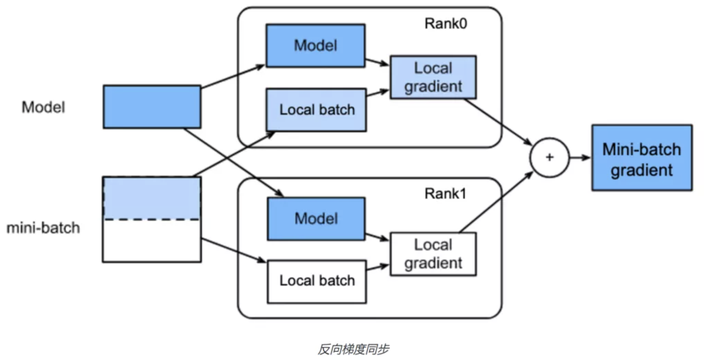

Collective数据并行
=========

简介
~~~~~~~~~~~~~~

对于NLP和CV这类拥有复杂网络、稠密参数特点的模型，集合通信架构（Collective）可以很好的支持这类模型的训练。该架构中每个节点都是计算节点（Worker），每个Worker负责模型训练的同时还需要掌握当前最新的全局梯度信息。Collective架构对计算芯片的算力和芯片之间的网络互联要求较高，如高性能计算的GPU、芯片之间的高速网络互联NVLINK和InfiniBand等，因此非常适合CV和NLP领域计算密集型训练任务。

为了高效训练超大规模稠密模型，Collective架构需要在单卡训练支持的算子融合、混合精度等基础性能优化策略之外，还能够支持一系列并行策略，如数据并行（Data Parallel，DP）、流水线并行（Pipeline Model Parallelism，PP）、张量模型并行（Tensor Model Parallel，MP），以及分组参数切片（Group Sharding）。本文将介绍Collective分布式训练架构下的数据并行训练策略，并且采用同步训练的参数更新方式，即每个Worker节点在训练一个batch的数据后，会通过节点间相互通信，统一完成梯度合并及参数更新。同步训练的优势在于Loss可以比较稳定的下降，缺点是整个训练速度较慢，这是典型的木桶原理，速度的快慢取决于最慢的那个线程的训练计算时间。

数据并行原理介绍
~~~~~~~~~~~~~~

近年来，深度学习模型训练中，使用更多的训练数据和更大的模型趋势未改。更大的模型和数据量意味着更多的计算量和存储需求，也意味着更久的训练时间。那么如何将计算和存储需求分布到多个训练设备来提升训练速度，成为了关键问题。

数据并行(data parallelism)是解决上述问题的的一种并行策略，其主要逻辑遵循\ `Single Program Multiple Data <https://en.wikipedia.org/wiki/SPMD>`\ 的原则，即在数据并行的模型训练中，训练任务被切分到多个进程(设备)上,每个进程维护相同的模型参数和相同的计算任务，但是处理不同的数据(batch data)。通过这种方式，同一全局数据(global batch)下的数据和计算被切分到了不同的进程，从而减轻了单个设备上的计算和存储压力。

在深度学习模型训练中，数据并行可作为通过增加并行训练设备来提高训练吞吐量(global batch size per second) 的方法。以常见的ResNet50 模型使用32GB V100卡训练为例。假设训练时单卡最大能支持的local batch size为256，训练一个step的耗时为1秒。则单卡训练时的吞吐为256 imgs/s。如果我们使用32 张V100 做数据并行训练，假设没有损耗，那么理论上的训练吞吐可达到 32 x 256 = 8192 imgs/。实际上由于数据并行时多机多卡的通信消耗等，实际加速效率会有折扣，但在加速效率为0.8时，训练吞吐也可达到32 x 256 x 0.8 = 6554 imgs/s。如果使用更多的GPU，并行训练的速度将会更高，大大减少训练需要的时间。

输入数据切分
-----------

数据并行方式下，每个卡上保存完整的模型副本，并行处理多个数据。训练过程中，通过下文介绍的同步机制，确保各个卡上的模型参数始终保持一致。通常，全量训练数据集被平均为多份，每个卡独立处理一份数据集。输入数据切分实现上比较简单，一般有两种常用的实现方式：

- 方式一：在每个训练Epoch开始前，将整个训练数据集根据并行进程数划分，每个进程只读取自身切分的数据。
- 方式二：数据的读取仅由具体某个进程负责(假设为rank0)。rank0在数据读取后同样根据并行进程数将数据切分成多块，再将不同数据块发送到对应进程上。

方式一相对方式二不需要进行数据通信，训练效率更高，飞桨框架中默认的数据并行使用方式一完成数据在不同进程上的切分。

模型参数同步
-----------

数据并行实现的关键问题在于如何保证训练过程中每个进程上模型的参数相同。

因为训练过程的每一个step 都会更新模型参数，每个进程处理不同的数据会得到不同的Loss。由Loss计算反向梯度并更新模型参数后，如何保证进程间模型参数正确同步，是数据并行需要解决的最主要问题。只要保证以下两点就能解决这个问题：保证各个进程模型初始参数一致，保证每次更新时各个进程上的梯度一致。

有两种常用实现方法保证各个进程模型初始参数一致：

- 方法一：所有进程在参数初始时使用相同的随机种子并以相同的顺序初始化所有参数。
- 方法二：某个进程初始化全部模型参数，之后由该进程向其他所有进程广播模型参数。

基于上述任意一种方法使每个进程得到一份相同的模型初始化参数后，数据并行训练就可以进一步拆解为如下三个部分：

前向计算
^^^^^^^

每个进程根据自身得到的输入数据独立前向计算，因为输入数据不同每个进程会得到不同的Loss。

反向计算
^^^^^^^

每个进程根据自身的前向计算独立进行反向计算，因为每个进程上的Loss不同，每个进程上在反向中会计算出不同的梯度。这时一个关键的操作是要在后续的更新步骤之前，对所有进程上的梯度进行同步，保证后续更新步骤中每个进程使用相同的全局梯度更新模型参数。

这一梯度同步过程是用一个Allreduce sum同步通信操作实现的，对梯度使用Allreduce sum操作后每个进程上得到的梯度是相同的，这时候的梯度值等于所有进程上梯度对应位置相加的和，然后每个进程用Allreduce sum后的梯度和除以数据并行中的进程数，这样得到的梯度是同步之前所有进程上梯度的平均值，如下图所示。

参数更新
^^^^^^^

每个进程经过上述步骤后得到相同全局梯度，然后各自独立地完成参数更新。因为更新前各进程间的模型参数是相同的，更新中所使用的梯度也是相同的，所以更新后各进程上的模型参数也是相同的。

上述是主流框架中数据并行的实现过程。和单卡训练相比，最主要的区别在于反向计算中的梯度需要在所有进程间进行同步，保证每个进程上最终得到的是所有进程上梯度的平均值。

操作实践
~~~~~~~~~~~~~~

与单机单卡模型训练相比，Collective数据并行训练只需要补充三个部分代码：

- 导入分布式训练需要的依赖包
- 初始化分布式环境
- 使用\ `DataParallel` \ 封装模型

下面将逐一进行讲解。

导入依赖
--------

导入必要的依赖：

.. code-block::

   from paddle.distributed as dist

初始化分布式环境
--------

.. code-block::

   dist.init_parallel_env()

使用\ `DataParallel` \ 封装模型
--------

.. code-block::

   model = paddle.DataParallel(model)

下面，我们具体介绍如何使用飞桨分布式。完整训练代码如下所示(train.py)：

.. code-block:: py

    # -*- coding: UTF-8 -*-
    import numpy as np
    import paddle

    # 导入必要分布式训练的依赖包
    from paddle.distributed as dist
    # 导入模型文件
    from paddle.vision.models import ResNet
    from paddle.vision.models.resnet import BottleneckBlock
    from paddle.io import Dataset, BatchSampler, DataLoader

    base_lr = 0.1   # 学习率
    momentum_rate = 0.9 # 冲量
    l2_decay = 1e-4 # 权重衰减

    epoch = 10  #训练迭代次数
    batch_num = 100 #每次迭代的batch数
    batch_size = 32 #训练批次大小
    class_dim = 102

    # 设置数据读取器
    class RandomDataset(Dataset):
        def __init__(self, num_samples):
            self.num_samples = num_samples

        def __getitem__(self, idx):
            image = np.random.random([3, 224, 224]).astype('float32')
            label = np.random.randint(0, class_dim - 1, (1, )).astype('int64')
            return image, label

        def __len__(self):
            return self.num_samples

    # 设置优化器
    def optimizer_setting(parameter_list=None):
        optimizer = paddle.optimizer.Momentum(
            learning_rate=base_lr,
            momentum=momentum_rate,
            weight_decay=paddle.regularizer.L2Decay(l2_decay),
            parameters=parameter_list)
        return optimizer

    # 设置训练函数
    def train_resnet():
        # 初始化Fleet环境
        dist.init_parallel_env()

        resnet = ResNet(BottleneckBlock, 50, num_classes=class_dim)
        optimizer = optimizer_setting(parameter_list=resnet.parameters())

        # 使用DataParallel封装模型
        resnet = paddle.DataParallel(resnet)

        dataset = RandomDataset(batch_num * batch_size)
        train_loader = DataLoader(dataset,
                    batch_size=batch_size,
                    shuffle=True,
                    drop_last=True,
                    num_workers=2)

        for eop in range(epoch):
            resnet.train()
            
            for batch_id, data in enumerate(train_loader()):
                img, label = data
                label.stop_gradient = True

                out = resnet(img)
                loss = paddle.nn.functional.cross_entropy(input=out, label=label)
                avg_loss = paddle.mean(x=loss)
                acc_top1 = paddle.metric.accuracy(input=out, label=label, k=1)
                acc_top5 = paddle.metric.accuracy(input=out, label=label, k=5)
                
                avg_loss.backward()
                optimizer.step()
                resnet.clear_gradients()

                if batch_id % 5 == 0:
                    print("[Epoch %d, batch %d] loss: %.5f, acc1: %.5f, acc5: %.5f" % (eop, batch_id, avg_loss, acc_top1, acc_top5))

    if __name__ == '__main__':
        train_resnet()

可以通过\ ``paddle.distributed.launch``\ 组件启动飞桨分布式任务，假设要运行2卡的任务，那么只需在命令行中执行:

.. code-block::

   python -m paddle.distributed.launch --gpus=0,1 train.py

您将看到显示如下日志信息：

.. code-block::

    -----------  Configuration Arguments -----------
    gpus: 0,1
    heter_worker_num: None
    heter_workers:
    http_port: None
    ips: 127.0.0.1
    log_dir: log
    ...
    ------------------------------------------------
    launch train in GPU mode
    INFO 2021-03-23 14:11:38,107 launch_utils.py:481] Local start 2 processes. First process distributed environment info (Only For Debug):
        +=======================================================================================+
        |                        Distributed Envs                      Value                    |
        +---------------------------------------------------------------------------------------+
        |                 PADDLE_CURRENT_ENDPOINT                 127.0.0.1:59648               |
        |                     PADDLE_TRAINERS_NUM                        2                      |
        |                PADDLE_TRAINER_ENDPOINTS         127.0.0.1:59648,127.0.0.1:50871       |
        |                     FLAGS_selected_gpus                        0                      |
        |                       PADDLE_TRAINER_ID                        0                      |
        +=======================================================================================+

    I0323 14:11:39.383992  3788 nccl_context.cc:66] init nccl context nranks: 2 local rank: 0 gpu id: 0 ring id: 0
    W0323 14:11:39.872674  3788 device_context.cc:368] Please NOTE: device: 0, GPU Compute Capability: 7.0, Driver API Version: 10.2, Runtime API Version: 9.2
    W0323 14:11:39.877283  3788 device_context.cc:386] device: 0, cuDNN Version: 7.4.
    [Epoch 0, batch 0] loss: 4.77086, acc1: 0.00000, acc5: 0.00000
    [Epoch 0, batch 5] loss: 15.69098, acc1: 0.03125, acc5: 0.18750
    [Epoch 0, batch 10] loss: 23.41379, acc1: 0.00000, acc5: 0.09375
    ...

请注意，不同飞桨版本上述显示信息可能会略有不同。了解更多启动分布式训练任务信息，请参考\ `launch组件详解 <./launch.rst>`_\ 。
