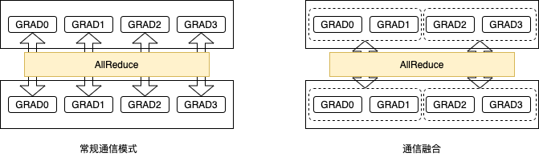
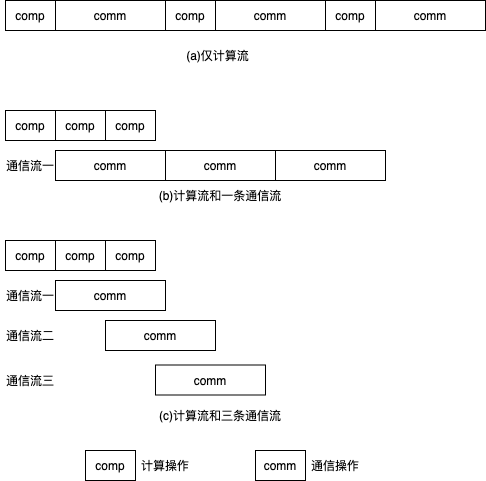
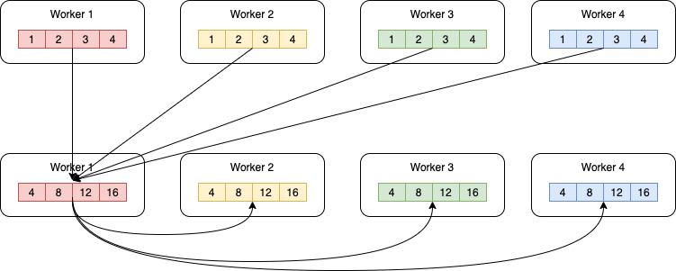
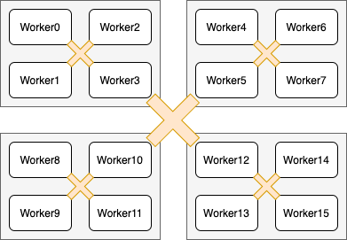

.. _performance_optimization:

性能优化
===============

飞桨长期致力于分布式性能优化，给用户带来极高的性能体验。计算和通信是影响分布式深度学习任务性能的最主要的两部分。

在计算层面，高性能计算算子开发是提升模型性能的主要途径，尤其是计算算子融合。值得注意的是，高性能算子设计与开发与硬件架构密切相关，但优化思路是基本一致的。飞桨适配了包括NVIDIA GPU、百度昆仑、华为昇腾、Graphcore IPU、寒武纪MLU在内的多种AI加速芯片，致力于给户提供统一、性能优异的算子库体系。

在通信层面，尽可能地降低通信时间占比是提升通信性能的主要途径，特别是在大规模分布式训练场景下跨节点通信性能损耗尤为显著的场景下通信优化尤为关键。通信融合、计算与通信重叠等是较为常见的优化手段。

一、融合优化
-----------------------

1.1 计算算子融合优化
^^^^^^^^^^^^^^^^^^^^^^^^^^

计算算子融合，是指将网络中多个"小"算子替换为功能相同的"大"算子，以提升训练速度和减少显存消耗。

我们以计算a、b、c三个张量的和为例说明计算融合的原理。计算a + b + c有以下两种实现方式：

- 第一种方式：编写一个名为 \ ``add2`` \ 的算子，其功能是实现两个张量的加法，然后先计算中间结果张量tmp = a + b，最后再计算最终结果d = tmp + c。这种实现方式会存在以下几个问题：

    - 在计算a + b的过程中，需要将计算结果写到中间结果张量tmp中；在计算tmp + c的过程中，需要读取张量tmp的值，即引入了额外的显存读写开销。在现代GPU等硬件中，显存读写的耗时往往远大于计算的耗时。

    - 中间结果张量tmp需要占用额外的显存中间，带来显存占用量的提高。

- 第二种方式：编写一个名为 \ ``add3`` \ 的融合算子，其功能是实现三个张量的加法，一次性直接计算d = a + b + c，不存储任何中间计算结果。相比于第一种方式，由于不存在中间结果张量的读写以及显存占用，性能会获得显著的提升。

在飞桨动态图中，算子融合往往是通过API的方式来使用的，包括但不限于： `FusedMultiHeadAttention` ， `FusedFeedForward` ，`FusedLinear` 等。用户可查阅相应的API文档了解具体的实现方式。得益于飞桨的动静统一设计，算子融合API同时适用于动态图和静态图。

在飞桨静态图中，除了可通过算子融合API的方式来使用外，还可以通过配置开关的方式来打开对应的功能。目前飞桨静态图支持配置的算子融合开关包括但不限于：

- `build_strategy.fuse_all_optimizer_ops`：表明是否融合优化器算子，目前可对SGD、Adam和Momentum优化器生效。
- `build_strategy.fuse_elewise_add_act_ops`：表明是否融合elementwise_add算子和activation算子。
- `build_strategy.fuse_bn_act_ops`：表明是否融合atch_norm算子和activation算子。
- `build_strategy.fused_bn_add_act_ops`：表明是否融合atch_norm算子、elementwise_add算子和activation算子。
- `build_strategy.fuse_gemm_epilogue`：表明是否融合matmul算子、elementwise_add算子和activation算子（可选）。

1.2 通信融合优化
^^^^^^^^^^^^^^^^^^^^^^^^^^

深度学习模型训练过程分为前向计算、反向传播和参数更新三个阶段。数据并行模式下，需要使用AllReduce操作同步参数梯度。默认情形下，对每个参数梯度均需要调用一次AllReduce同步操作。通常来讲，当通信数据量较小时，无法充分利用网络带宽，且每次同步操作需要额外的通信开销。因此，一种直观的优化思路是将多个梯度的AllReduce操作合并为一次AllReduce通信操作，如下图所示。这即是我们要介绍的通信融合：将多次梯度AllReduce操作合并为单次AllReduce同步操作。

如图所示，一方面我们减少了AllReduce同步操作的次数；另一方面，我们增加了每次AllReduce同步操作的数据量。这有助于提升通信效率，从而提升训练速度。

默认情况下，AllReduce通信融合会将同一layer中多个参数梯度的多个AllReduce操作合并成一个。例如，对于全连接层FC中的Weight和Bias两个参数，通常需要两次AllReduce同步操作；但使用AllReduce通信融合后，只需要使用一次AllReduce同步操作，从而可以减少梯度同步的通信耗时。

此外，为支持更大粒度的参数梯度融合，飞桨提供了以下两个选项供用户选择，用户可以在DistributedStrategy中设置：

- fuse_grad_size_in_MB: 指定每次AllReduce同步操作的梯度字节数。假如该参数值等于16，则飞桨底层会将多个参数梯度的AllReduce同步操作聚合为单次AllReduce同步操作，尽量保证每次AllReduce同步操作聚合的梯度大小达到16MB。该参数值通常设置为每次迭代总通信量的十分之一，即模型参数量的十分之一。

- _fuse_grad_size_in_TFLOPS: 指定每次AllReduce操作的最大层数，即当聚合的梯度层数达到该层数就进行一次AllReduce同步操作。假如该参数值等于50, 那么最多聚合50层参数梯度即做一次 AllReduce同步操作。

注意： 目前，AllReduce通信融合不支持稀疏参数的梯度。

1.3 操作实践
^^^^^^^^^^^^^^^^^^^^^^^^^^

.. code:: python

    # 计算融合
    build_strategy = paddle.static.BuildStrategy()
    build_strategy.fuse_elewise_add_act_ops = True
    build_strategy.fuse_bn_act_ops = True
    build_strategy.fuse_relu_depthwise_conv = True
    build_strategy.fuse_broadcast_ops = True
    build_strategy.fuse_all_optimizer_ops = True

    strategy = paddle.distributed.fleet.DistributedStrategy()
    strategy.build_strategy = build_strategy

    # 通信融合
    strategy.fuse_grad_size_in_MB = 16
    strategy._fuse_grad_size_in_TFLOPS = 50
    strategy.fuse_all_reduce_ops=True

完整示例请参考：`example/resnet/train_fleet_static_op_fusion.py <https://github.com/PaddlePaddle/FleetX/blob/develop/examples/resnet/train_fleet_static_op_fusion.py>`_。

假设要运行2卡训练任务，那么只需在命令行中执行:

.. code-block:: sh

   python -m paddle.distributed.launch --gpus=0,1 train_fleet_static_op_fusion.py

您将看到显示如下日志信息：

.. code-block::

    -----------  Configuration Arguments -----------
    gpus: None
    heter_worker_num: None
    heter_workers:
    http_port: None
    ips: 127.0.0.1
    log_dir: log
    ...
    ------------------------------------------------
    WARNING 2021-01-19 14:53:04,943 launch.py:316] Not found distinct arguments and compiled with cuda. Default use collective mode
    launch train in GPU mode
    INFO 2021-01-19 14:53:04,945 launch_utils.py:472] Local start 8 processes. First process distributed environment info (Only For Debug):
        +=======================================================================================+
        |                        Distributed Envs                      Value                    |
        +---------------------------------------------------------------------------------------+
        |                 PADDLE_CURRENT_ENDPOINT                 127.0.0.1:28355               |
        |                     PADDLE_TRAINERS_NUM                        8                      |
        |                PADDLE_TRAINER_ENDPOINTS  ... 0.1:33653,127.0.0.1:27766,127.0.0.1:16631|
        |                     FLAGS_selected_gpus                        0                      |
        |                       PADDLE_TRAINER_ID                        0                      |
        +=======================================================================================+
    ...
    W0119 14:53:16.871562 68031 device_context.cc:362] Please NOTE: device: 0, GPU Compute Capability: 7.0, Driver API Version: 10.2, Runtime API Version: 9.2
    W0119 14:53:16.875859 68031 device_context.cc:372] device: 0, cuDNN Version: 7.4.
    W0119 14:53:25.973377 68031 build_strategy.cc:116] Currently, fuse_broadcast_ops only works under Reduce mode.
    I0119 14:53:27.382609 68031 graph_pattern_detector.cc:101] ---  detected 16 subgraphs
    I0119 14:53:27.390769 68031 graph_pattern_detector.cc:101] ---  detected 16 subgraphs
    W0119 14:53:27.407582 68031 fuse_optimizer_op_pass.cc:207] Find momentum operators : 161, and 161 for dense gradients. To make the speed faster, those optimization are fused during training.
    W0119 14:53:27.436177 68031 fuse_all_reduce_op_pass.cc:79] Find all_reduce operators: 161. To make the speed faster, some all_reduce ops are fused during training, after fusion, the number of all_reduce ops is 6.
    [Epoch 0, batch 0] loss: 0.15131, acc1: 0.00000, acc5: 0.03125
    [Epoch 0, batch 5] loss: 1.15416, acc1: 0.00000, acc5: 0.03125

需要注意的是，不同飞桨版本，上述信息可能会有所差异。

二、计算与通信重叠优化
-----------------------

2.1 原理介绍
^^^^^^^^^^^^^^^^^^^^^^^^^^

通信与计算重叠（overlap）优化的思路是，尽可能使得计算算子和通信算子在模型训练过程中并发执行，从而使得通信开销掩盖在计算耗时中，提高模型分布式训练性能。

以数据并行为例，如上节所述，数据并行训练过程中需要对参数梯度进行AllReduce操作，从而引入了通信开销。这里存在多种选择：一种是串行执行机制，即在完成反向传播生成所有参数的梯度后，使用AllReduce通信参数梯度；另一种是在生成某个参数的梯度后，即使用AllReduce同步参数梯度，且反向传播计算过程和通信通常是可以并行执行的，即计算与通信重叠。当然，这里AllReduce通信操作也有多种可选方式，比如对每个参数梯度调用一次AllReduce同步操作，或者利用上节所述的通信融合技术将多个参数梯度的AllReduce操作聚合为一个。无论采用哪种方式，这种计算与通信重叠的技术均可以有效提升训练速度。

具体地，飞桨框架只支持单个计算流，但可以有多个通信流。每个流可以看作一个独立的执行序列，多个流之间可以并行执行。在通信为瓶颈的网络中，通过融合计算和通信流以及融合多个通信流，可以有效利用通信带宽，从而获得更优的通信和训练性能。多流相关的概念请参考：\ `cuda-streams-best-practices <https://on-demand.gputechconf.com/gtc/2014/presentations/S4158-cuda-streams-best-practices-common-pitfalls.pdf>`_\ 。下图给出通信重叠的示意图，每个计算操作产生一份梯度，随后接着通信该梯度。图(a)中，所有的计算和通信操作共用一个计算流，所以计算和通信操作串行执行。图(b)中，有一条计算流和一条通信流，计算和通信操作分别在两条流上执行。当产生完一个梯度后，即可开始通过通信流通信该梯度。然而，由于通信时间大于计算时间，因此整体通信时间仍然较长。然而，相比于单条计算流的串行模式，这种计算和通信重叠的方式可以一定程度的降低执行时间。图(c)中，采用单个计算流和三条通信流，当产生完一个梯度后，即可开始通过通信流通信该梯度。可见，通过通信流重叠的方式，可以进一步优化执行时间。

2.2 操作实践
^^^^^^^^^^^^^^^^^^^^^^^^^^

飞桨分布式默认实现了计算和通信的重叠，并提供多通信流重叠（overlap）功能。为了实现多通信流重叠，只需设置通信器数量nccl_comm_num，即可以加快GPU之间的通信效率。按照经验，建议在单机环境下将nccl_comm_num的值设置为1，在多机环境下将nccl_comm_num的值设置为2。设置方法如下所示：

.. code:: python

    strategy = fleet.DistributedStrategy()
    strategy.nccl_comm_num = 2
    strategy.sync_nccl_allreduce=False

完整的示例代码请参考：\ `example/resnet/train_fleet_static_overlap.py <https://github.com/PaddlePaddle/FleetX/blob/develop/examples/resnet/train_fleet_static_overlap.py>`_\ 。

假设要运行用2卡执行上述任务，那么只需在命令行中执行:

.. code-block:: sh

   python -m paddle.distributed.launch --gpus=0,1 train_fleet_static_overlap.py

您将看到显示如下日志信息：

.. code-block::

    -----------  Configuration Arguments -----------
    gpus: 0,1
    heter_worker_num: None
    heter_workers:
    http_port: None
    ips: 127.0.0.1
    log_dir: log
    ...
    ------------------------------------------------
    ...
        +=======================================================================================+
        |                        Distributed Envs                      Value                    |
        +---------------------------------------------------------------------------------------+
        |                 PADDLE_CURRENT_ENDPOINT                 127.0.0.1:10097               |
        |                     PADDLE_TRAINERS_NUM                        2                      |
        |                PADDLE_TRAINER_ENDPOINTS         127.0.0.1:10097,127.0.0.1:59371       |
        |                     FLAGS_selected_gpus                        0                      |
        |                       PADDLE_TRAINER_ID                        0                      |
        +=======================================================================================+
    ...
    W0118 21:44:34.542804 70071 device_context.cc:362] Please NOTE: device: 0, GPU Compute Capability: 7.0, Driver API Version: 10.2, Runtime API Version: 9.2
    W0118 21:44:34.547377 70071 device_context.cc:372] device: 0, cuDNN Version: 7.4.
    W0118 21:44:40.178053 70071 fuse_all_reduce_op_pass.cc:79] Find all_reduce operators: 161. To make the speed faster, some all_reduce ops are fused during training, after fusion, the number of all_reduce ops is 5.
    [Epoch 0, batch 0] loss: 0.14466, acc1: 0.00000, acc5: 0.03125
    [Epoch 0, batch 5] loss: 4.00225, acc1: 0.00000, acc5: 0.03125
    ...

需要注意的是，不同飞桨版本，上述信息可能会有所差异。

三、通信拓扑优化
-----------------------

3.1 原理介绍
^^^^^^^^^^^^^^^^^^^^^^^^^^

数据并行训练过程分为前向计算、反向传播和参数更新三个阶段，在参数更新前需要使用AllReduce求和操作同步参数梯度。下图给出一种AllReduce求和操作实现方法示例。这种实现中，所有训练进程将数据发送到worker1，worker1进程计算数据的和值，并将结果发送到其它所有训练进程。

为了实现更高效的通信，AllReduce操作还存在其它多种实现方式，如Ring AllReduce。然而，随着训练设备的增加，通信依然成为影响训练效率的因素。一种解决方案是优化通信拓扑结果，使用层次化通信方式。

我们以下图为例说明层次化拓扑的原理。将所有计算设备分为多个组，并在每个组中选择一个计算设备作为\ ``leader``\ 。图中，16个计算设备被划分为4个组，每个组内包含4个计算设备。具体地将，worker0 ~ worker3为一个组，worker4 ~ worker7为一个组，worker8 ~ worker11为一个组，worker12 ~ worker15为最后一个组。各个组的\ ``leader``\ 分别为worker3、worker5、woker10和worker13。通信时，首先在组内做AllReduce，各个节点得到组内汇聚的结果。接着，在各个组的\ ``leader``\ 间做组间AllReduce操作；那么，\ ``leader``\ 设备上等价于获取了所有设备的汇聚结果。最后，各个组间\ ``leader``\ 设备将其结果广播到组内所有其它设备。

3.2 操作实践
^^^^^^^^^^^^^^^^^^^^^^^^^^

飞桨实现了层次化通信拓扑，支持分层AllReduce操作。用户只需要设置相应的DistributedStrategy策略即可使用该功能，如下面的例子所示：

.. code:: python

    dist_strategy = fleet.DistributedStrategy()
    dist_strategy.use_hierarchical_allreduce = True
    dist_strategy.hierarchical_allreduce_inter_nranks = 8

其中，\ ``hierarchical_allreduce_inter_nranks``\ 表示\ ``leader``\ 设备的数量。每个组的大小可以根据该值自动推断。

需要说明的是，层次化通信拓扑目前只适用于多GPU训练。

上述例子存放在：\ `example/resnet/train_fleet_static_communication_topology.py <https://github.com/PaddlePaddle/FleetX/blob/develop/examples/resnet/train_fleet_static_communication_topology.py>`_\ 。

假设要运行8卡的任务，那么只需在命令行中执行:

.. code-block:: sh

   python -m paddle.distributed.launch --gpus=0,1,2,3,4,5,6,7 train_fleet_static_communication_topology.py

您将看到显示如下日志信息：

.. code-block::

    -----------  Configuration Arguments -----------
    gpus: None
    heter_worker_num: None
    heter_workers:
    http_port: None
    ips: 127.0.0.1
    log_dir: log
    ...
    ------------------------------------------------
    ...
    INFO 2021-01-19 14:58:43,720 launch_utils.py:472] Local start 8 processes. First process distributed environment info (Only For Debug):
        +=======================================================================================+
        |                        Distributed Envs                      Value                    |
        +---------------------------------------------------------------------------------------+
        |                 PADDLE_CURRENT_ENDPOINT                 127.0.0.1:53762               |
        |                     PADDLE_TRAINERS_NUM                        8                      |
        |                PADDLE_TRAINER_ENDPOINTS  ... 0.1:58938,127.0.0.1:54203,127.0.0.1:44221|
        |                     FLAGS_selected_gpus                        0                      |
        |                       PADDLE_TRAINER_ID                        0                      |
        +=======================================================================================+
    ...
    W0119 14:58:52.487838 95116 device_context.cc:362] Please NOTE: device: 0, GPU Compute Capability: 7.0, Driver API Version: 10.2, Runtime API Version: 9.2
    W0119 14:58:52.493592 95116 device_context.cc:372] device: 0, cuDNN Version: 7.4.
    W0119 14:59:01.665702 95116 fuse_all_reduce_op_pass.cc:79] Find all_reduce operators: 161. To make the speed faster, some all_reduce ops are fused during training, after fusion, the number of all_reduce ops is 5.
    [Epoch 0, batch 0] loss: 0.13468, acc1: 0.00000, acc5: 0.06250
    [Epoch 0, batch 5] loss: 0.18902, acc1: 0.03125, acc5: 0.03125

需要注意的是，不同飞桨版本，上述信息可能会有所差异。

