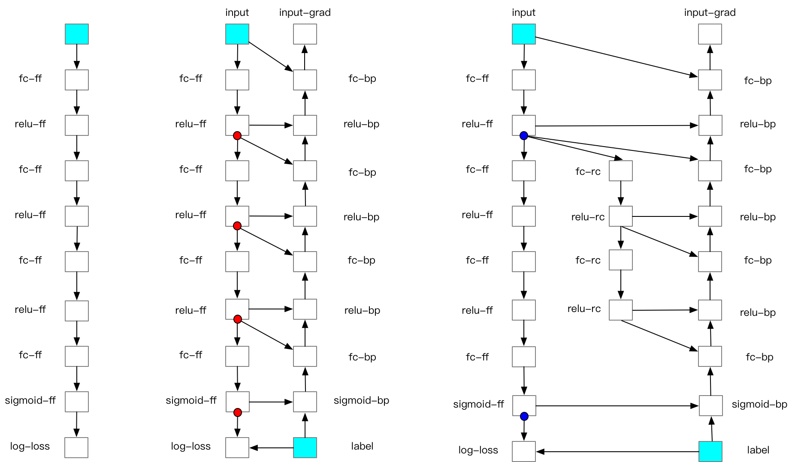

..  _recompute:

前向重计算
==================

一、原理介绍
-----------------

-  **反向计算：** 运行反向算子来计算参数(Parameter)的梯度。
-  **优化：** 应用优化算法以更新参数值 。

在前向计算过程中，前向算子会计算出大量的中间结果，由于这些中间结果是训练数据和算子计算得到的，所以训练数据的 batch size 越大，中间结果占用的内存也就越大。飞桨核心框架会使用张量来存储这些隐层的中间结果。当模型层数加深时，其中间结果的数量可达数千甚至数万，占据大量的内存。飞桨核心框架的显存回收机制会及时清除无用的中间结果以节省显存，但是有些中间结果是反向计算过程中算子的输入，这些中间结果必须存储在内存中，直到相应的反向算子计算完毕。

对于大小固定的内存来说，如果用户希望使用大 batch size 的数据进行训练，则将导致单个中间结果占用内存增大，那么就需要减少中间结果的存储数量，FRB 就是基于这种思想设计的。FRB 是将深度学习网络切分为 k 个部分（segments）。对每个 segment 而言：前向计算时，除了小部分必须存储在内存中的张量外，其他中间结果都将被删除；在反向计算中，首先重新计算一遍前向算子，以获得中间结果，再运行反向算子。简而言之，FRB 和普通的网络迭代相比，多计算了一遍前向算子。

具体过程如下图所示：

* Recompute-Offload 支持多卡并行训练， 当多卡并行时开启 Offload，训练中同一节点上所有 GPU 上的 checkpoints 都将卸载到 Host 内存中，会存在以下风险：

    - PCIe 带宽瓶颈： 同一节点上的所有 GPU 和 Host 内存间共享一根 PCIe 带宽，如同一节点上 GPU 数量较多（单机 8 卡）容易因为 PCIe 带宽限制让训练速度进一步减慢。
    - Host 内存溢出： 当同一节点上 GPU 数量较多，且每张 GPU checkpoints size 较大时，需要注意卸载量是否超出 Host 内存大小。

二、功能效果
-----------------------

我们在 BERT-Large 模型上对 Recompute 的效果进行了测试，Recompute 可以让 batch size 扩大 10 倍， Offload 可以在 Recompute 的基础上再扩大 1.43 倍。
batch size = seq * seq_max_len
硬件: 单卡 V100 32GB

+--------------+----------------+--------------------------+-------------------------------+
| 策略         | amp            | amp + Recompute          | amp + Recompute + offload     |
+==============+================+==========================+===============================+
| batch size   | 18 * 512       | 180 * 512                | 258 * 512                     |
+--------------+----------------+--------------------------+-------------------------------+
| speed        | 23.94 sents/s  | 17.82 sents/s            | 15.47 sents/s                 |
+--------------+----------------+--------------------------+-------------------------------+

三、动态图使用方法
-------------------------

动态图 recompute 功能在 Paddle2.1 以上加入，建议将 Paddle 版本升级到最新版。动态图使用 recompute 功能步骤如下：
**注：当 recompute 中存在随机性算子比如 dropout 时，需要在最开始指定 paddle.seed，保证反向的重计算随机性。

3.1 导入需要的包
^^^^^^^^^^^^^^^^^^^^^^^^^^

.. code:: python

    import numpy as np
    import paddle
    from paddle.distributed.fleet.utils import recompute
    import random

3.2 定义组网，添加 recompute 调用
^^^^^^^^^^^^^^^^^^^^^^^^^^^^^^^^^^^^^^^

在需要使用 recompute 的地方直接调用函数：recompute(function, checkpoint)，paddle 就会自动进行 recompute 相关操作。recompute 函数的第一个参数\ ``function``\ 是前向计算函数，第二参数\ ``checkpoint``\ 是选择的 checkpoint 点。

.. code:: python

    def get_fc_block(block_idx, input_size, is_last=False):
        block_name = "block_" + str(block_idx)
        block = paddle.nn.Sequential(
            (block_name + "_fc_0", paddle.nn.Linear(input_size, input_size, bias_attr=False)),
            (block_name + "_dropout", paddle.nn.Dropout(p=0.5)),
            (block_name + "_relu_1", paddle.nn.ReLU()),
            (block_name + "_fc_1", paddle.nn.Linear(input_size, input_size, bias_attr=False)),
            (block_name + "_relu_2", paddle.nn.ReLU()),
        )
        if is_last:
            block.add_sublayer(
                block_name + "_fc_2",
                paddle.nn.Linear(
                    input_size, 1, bias_attr=False
                )
            )
        else:
            block.add_sublayer(
                block_name + "_fc_2",
                paddle.nn.Linear(input_size, input_size, bias_attr=False)
            )

        return block

    class Naive_fc_net(paddle.nn.Layer):
        def __init__(self, input_size=10,
                    recompute_blocks=[1, 3],
                    recompute_kwargs={}):
            super().__init__()
            self.recompute_blocks = recompute_blocks
            self.recompute_kwargs = recompute_kwargs
            self.runfunc0 = get_fc_block(0, input_size, is_last=False)
            self.runfunc1 = get_fc_block(1, input_size, is_last=False)
            self.runfunc2 = get_fc_block(2, input_size, is_last=False)
            self.runfunc3 = get_fc_block(3, input_size, is_last=False)
            self.runfunc4 = get_fc_block(4, input_size, is_last=True)
            self.total_func = [self.runfunc0, self.runfunc1, self.runfunc2, self.runfunc3, self.runfunc4]

        def forward(self, inputs):
            nums = len(self.total_func)
            for i in range(nums):
                if i in self.recompute_blocks:
                    inputs = recompute(self.total_func[i], inputs)
                else:
                    inputs = self.total_func[i](inputs)
            return inputs

3.3 定义运行程序
^^^^^^^^^^^^^^^^^^^^^^^^^^

.. code:: python

    def run_model(cuda_state, recompute_block=[], recompute_kwargs={}):
        gen = paddle.seed(10)
        gen.manual_seed(10)
        np.random.seed(10)
        random.seed(10)
        if cuda_state:
            paddle.set_cuda_rng_state(cuda_state)

        batch_size, input_size = 1, 10
        model = Naive_fc_net(
            input_size,
            recompute_blocks=recompute_block,
            recompute_kwargs=recompute_kwargs)
        optimizer = paddle.optimizer.SGD(learning_rate=0.01, parameters=model.parameters())
        loss_ = []
        param_ = []
        grad_ = []
        for _ in range(5):
            x_data = np.random.randn(batch_size, input_size).astype(np.float32)
            x = paddle.to_tensor(x_data)
            y_pred = model(x)
            loss = y_pred.mean()
            loss_.append(np.asarray(loss).tolist())
            loss.backward()
            optimizer.step()
            param_.append(np.asarray(model.parameters()[9]).tolist())
            grad_.append(np.asarray(model.parameters()[3]._grad_ivar()).tolist())
            optimizer.clear_grad()

        return loss_, param_, grad_

3.4 执行运行程序，打印结果
^^^^^^^^^^^^^^^^^^^^^^^^^^^^^^^^^^^^

将正常的没有 recompute 的 loss 与 recompute 的 loss 进行比较，结果应该是相等的。

.. code:: python

    cuda_state = paddle.get_cuda_rng_state()
    # without recompute
    loss_ref, param_ref, grad_ref = run_model(
        cuda_state, recompute_block=[]
    )

    loss, param, grad = run_model(cuda_state, recompute_block=[1, 2])
    print("normal_loss: {},\n recompute_loss: {}".format(loss_ref, loss))

运行方式:

.. code:: bash

    python recompute_dygraph.py

recompute 动态图代码：`代码示例 <https://github.com/PaddlePaddle/PaddleFleetX/tree/old_develop/examples/recompute>`__。

输出:

.. code:: bash

    normal_loss: [[0.0], [-0.12574796378612518], [0.6378830075263977], [0.00968710333108902], [0.0]],
    recompute_loss: [[0.0], [-0.12574796378612518], [0.6378830075263977], [0.00968710333108902], [0.0]]

四、数据并行下的重计算
-------------------------

当结合使用数据并行和重计算时，建议采用如下方式：

.. code:: python

    from paddle.distributed.fleet.utils.hybrid_parallel_util import fused_allreduce_gradients

    def run_model(cuda_state, recompute_block=[], recompute_kwargs={}):
        gen = paddle.seed(10)
        gen.manual_seed(10)
        np.random.seed(10)
        random.seed(10)
        if cuda_state:
            paddle.set_cuda_rng_state(cuda_state)

        batch_size, input_size = 1, 10
        model = Naive_fc_net(
            input_size,
            recompute_blocks=recompute_block,
            recompute_kwargs=recompute_kwargs)
        optimizer = paddle.optimizer.SGD(learning_rate=0.01, parameters=model.parameters())

        # Data parallel
        model = paddle.DataParallel(model)

        loss_ = []
        param_ = []
        grad_ = []
        for _ in range(5):
            x_data = np.random.randn(batch_size, input_size).astype(np.float32)
            x = paddle.to_tensor(x_data)

            # 结合使用重计算和数据并行时，需使用 no_sync 并手动实现梯度 allreduce
            with model.no_sync():
                y_pred = model(x)
                loss = y_pred.mean()
                loss_.append(np.asarray(loss).tolist())
                loss.backward()
            fused_allreduce_gradients(list(model.parameters()), None)

            optimizer.step()
            param_.append(np.asarray(model.parameters()[9]).tolist())
            grad_.append(np.asarray(model.parameters()[3]._grad_ivar()).tolist())
            optimizer.clear_grad()

        return loss_, param_, grad_
