分布式训练简介
====================================

近几年，深度学习领域的开发者们对模型效果的追求愈演愈烈，各大榜单纪录不断刷新，而这个现象的背后都有着 “大规模训练” 的身影。简单来说，就是使用大规模的数据或大规模参数量的模型来做训练。大规模的数据可以让模型有足够的 “教材” 用于 “学习”，而大规模的参数量则可以让模型“学习能力” 更强，更容易 “学习” 到“教材”中的“知识”。在数据和参数规模增长的过程中，常规的单机训练由于硬件资源的限制渐渐显得捉襟见肘，而分布式训练则成为了广大开发者的必然选择。所谓分布式训练，就是使用多台机器共同完成训练任务，这其中涉及多机任务拆分、集群训练资源配置、平衡训练速度和收敛速度、弹性训练与容错等多项重要技术，同时也是各大深度学习框架彰显技术实力的重要 “战略高地”。

一、应用场景

^^^^^^^^^^^^^^^^^^^^^^^^^^^^^^^^^^^^^^^^^^^^

相对于单卡训练，分布式训练常在训练数据量较大或模型参数规模太大导致单卡不可训练的场景下使用。例如当训练数据量较大时，单卡训练耗时过长，需要分布式训练技术提高训练效率；或者当单卡无法支持训练时，即单卡显存无法放下全量模型参数时，可使用分布式训练技术将模型参数等模型信息切分到多张卡或多台设备上，以保证模型可训练。

在分布式训练技术中，集合通信训练模式和参数服务器训练模式是两种最主要的训练模式。对于网络复杂、参数稠密特点的计算机视觉（CV）\ 自然语言处理（NLP）等类型的模型训练场景，请使用集合通信训练模式；对于拥有庞大的 Embedding 层模型和超大数据量的搜索、推荐模型训练场景，请使用参数服务器训练模式。飞桨分布式训练技术同时支持这两种训练模式，并且经过多年发展，两种训练模式已经分别衍生出了端到端自适应分布式训练、异构多云，以及通用异构参数服务器、超大规模图模型训练架构等领先技术。本节将对这两种分布式训练模式，及其技术原理和领先技术进行简述。

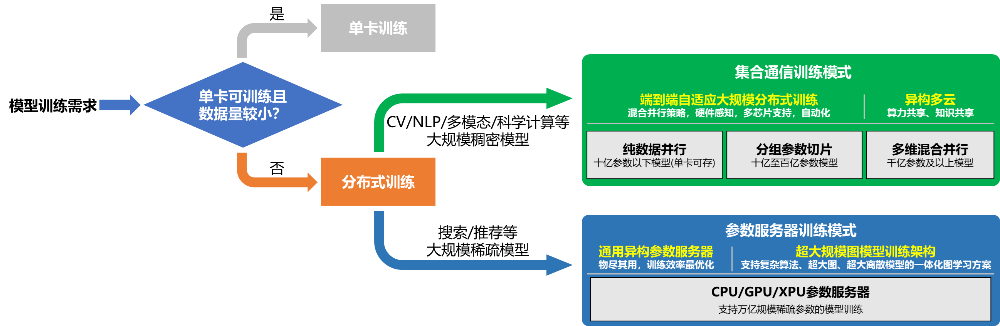

图 1 分布式训练模式使用导航

==================================

>**稠密参数模型和稀疏参数模型**
>
>这里是针对模型参数而言。模型参数，包括模型权重，以及中间的过程变量，可分为稠密参数和稀疏参数：
>
>- 稠密参数(Dense_Var)是指每个 step 都会更新的参数，比如 FC 的 Weight 参数
>- 稀疏参数(Sparse_Var)是指每个 step 不是必须更新的参数，如 Embedding 参数，只会更新当前 step 中涉及到的 key 的相应 value

1.1 集合通信训练模式

---------------------------

NLP、CV、多模态、科学计算等领域的模型往往具有模型结构复杂、参数稠密的特点，集合通信（Collective Communications）训练模式可以很好地支持此类模型的训练。该模式每个节点都可以称为 Worker 节点，每个 Worker 负责模型训练的同时还需要掌握当前最新的全局梯度信息。集合通信模式对计算芯片的算力和芯片之间的网络互联要求较高，如高性能计算的 GPU、芯片之间的高速网络互联 NVLink 和 InfiniBand 等，因此非常适合稠密参数、计算密集的训练任务。

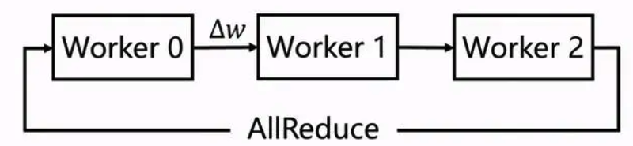

图 2 集合通信训练

==================================

1.2 参数服务器训练模式

--------------------------

搜索、推荐等场景的模型往往数据量巨大，特征维度高且高度稀疏化。参数服务器（Parameter Server，PS）训练模式可以很好地支持此类模型的训练。参数服务器训练模式可以同时做到对数据和模型的并行训练。参数服务器训练模式采用了一种将模型参数中心化管理的方式来实现模型参数的分布式存储和更新，该模式除了有 worker 节点外，还有 Server 节点，其中 Worker 用于执行模型的前向与反向计算，而 Server 则负责从各个 Worker 收集汇总梯度并更新参数，因此对于存储超大规模模型参数的训练场景十分友好，常被用于训练拥有海量稀疏参数的搜索、推荐领域模型。

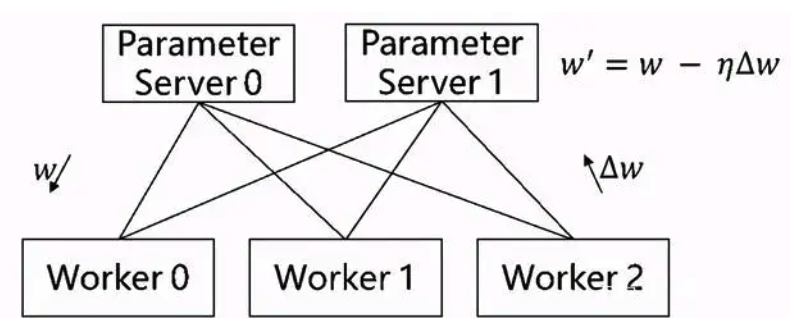

图 3 传统参数服务器

==================================

二、分布式训练技术原理

^^^^^^^^^^^^^^^^^^^^^^^^^^^^^^^^^^^^^^^^^^^^

2.1 集合通信训练模式

------------------------------------------

在集合通信训练模式下，根据模型参数规模的不同，需要选择不同的并行策略：

- 当模型参数较少，单卡显存足够容纳全量模型参数时，应选择**纯数据并行**的训练模式。此场景常见于十亿参数以下的模型。

- 当模型参数较多，单卡显存不足以容纳全量模型参数时，则可进一步根据模型规模选择不同的并行策略：

- 针对十亿至百亿参数的模型，可选用飞桨的**分组参数切片的数据并行**策略。此类策略一方面保留了数据并行模式的高效性，另一方面将模型参数和优化器状态等切分到不同设备上，减少单卡的显存占用量，保证了模型可训练。

- 针对千亿参数及以上的模型，可选用飞桨的多维混合并行策略。此类策略有效地融合了**纯数据并行**、**分组参数切片的数据并行**、**张量模型并行**、**流水线模型并行**、**专家并行等多种并行策略**，为用户提供高效的大模型分布式训练解决方案。

下面将分别介绍各个并行策略的原理。

2.1.1 纯数据并行

>>>>>>>>>>>>>>>>>

数据并行是深度学习领域最常用的并行方法。在此策略下数据集被平均分为多份，每个卡上保存完整的模型参数并独立处理一份子数据集，以加速模型训练过程。

在数据并行训练过程中，每个卡上的输入数据是不同的。各个卡独立地执行网络的前向运算和反向计算，计算出各自卡上的参数梯度。随后，使用 AllReduce 等集合通信原语，将各个卡上计算出的参数梯度进行累加聚合，得到最终的全局参数梯度。最后，全局参数梯度进入优化器进行参数更新，完成一个完整的 mini-batch 训练流程。

在使用数据并行训练模型时，每个卡上需要拥有相等的参数值。具体地，在训练开始前，往往需要将第一张卡上随机初始化的参数广播到其他卡上，保证各个卡上拥有相等的初始参数值；在每个 mini-batch 训练过程中，AllReduce 通信保证了各个卡上获得的全局参数梯度值是相等的，因此优化器更新后的参数也是相等的。

由于数据并行训练时各卡只在反向计算后进行一次参数梯度的全局通信，其他部分计算完全独立，因此数据并行可获得很高的加速效率。此外，可进一步配合低精度训练、梯度累加、梯度压缩等策略可进一步降低模型计算效率和通信量，获得更优的分布式训练性能。

.. image:: ./images/distribute_overview_04.png
  :width: 600
  :alt: paddle_dist
  :align: center

图 4 数据并行原理

==================================

> **集合通信原语**
>
> 这里是针对模型参数而言。模型参数，包括模型权重，以及中间的过程变量，可分为稠密参数和稀疏参数：
>
> - 稠密参数(Dense_Var)是指每个 step 都会更新的参数，比如 FC 的 Weight 参数
>
> - 稀疏参数(Sparse_Var)是指每个 step 不是必须更新的参数，如 Embedding 参数，只会更新当前 step 中涉及到的 key 的相应 value

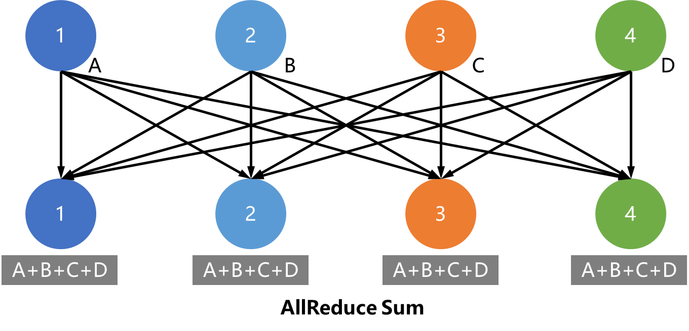

图 5 多对多规约（累加）示意图

==================================

2.1.2 分组参数切片的数据并行

>>>>>>>>>>>>>>>>>

纯数据并行的训练模式要求每个卡持有全量的模型参数和优化器状态参数，在十亿乃至百亿等模型上可能会遇到显存瓶颈。 `《ZeRO: Memory Optimizations Toward Training Trillion Parameter Models》 <https://arxiv.org/abs/1910.02054>`_ 论文指出在每个 GPU 上都保存一份模型参数和优化器状态副本是冗余的。飞桨的参数切片数据并行技术实现了 ZeRO 论文中的三阶段参数切片技术，可依次将优化器状态、参数梯度和模型参数切分到各个卡上，并在此基础上支持分组混合并行技术（组内参数切片+组间数据并行），显著降低模型的显存占用，支持百亿参数模型高效训练。

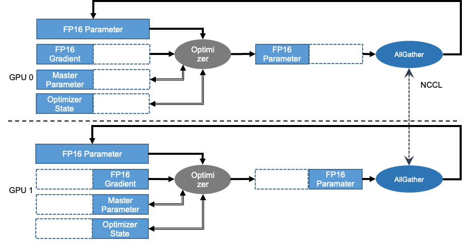

图 6 参数切片数据并行原理

==================================

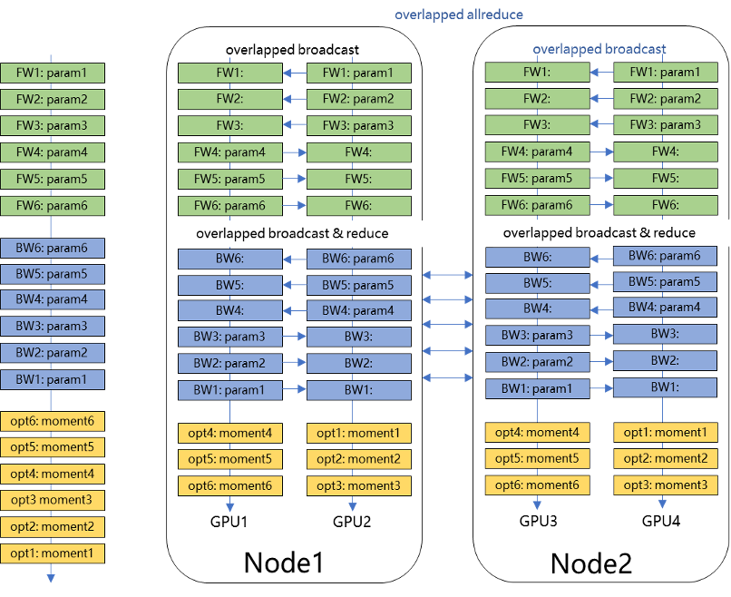

图 7 分组参数切片数据并行原理

==================================

2.1.3 张量模型并行

>>>>>>>>>>>>>>>>>

在大模型训练中，除了数据并行技术以外，往往需要使用模型并行技术进一步降低显存占用。张量模型并行是一种常见的模型并行策略。与数据并行将输入数据进行切片不同，张量模型并行将模型参数进行切片，并在计算过程中插入相应的通信算子，保证计算正确性的同时降低模型显存占用。

例如，对于深度学习模型中常见的矩阵乘法运算 $Z=X∗W$ ，假设**X**和**W**都是二维张量，**W**是模型参数，那么可以有以下两种方式进行张量模型并行计算：

- 对张量W按列进行切分，然后各个卡独立计算矩阵乘法，最后通过 AllGather 通信得到最终的计算结果，即：

$$
Z = X * W = X * [W_1, W_2] = [X*W_1, X*W_2]
$$

.. image:: ./images/distribute_overview_08.png
  :width: 600
  :alt: paddle_dist
  :align: center

图 8 张量按列切分的模型并行计算

==================================

- 对张量**W**按行进行切分，同时对输入**X**按列进行切分，最后通过 AllReduce 通信得到最终的计算结果，即：

$$
Z = [X_1, X_2] * \begin{bmatrix}W_1\\W_2\end{bmatrix} = X_1*W_1 + X_2*W_2
$$

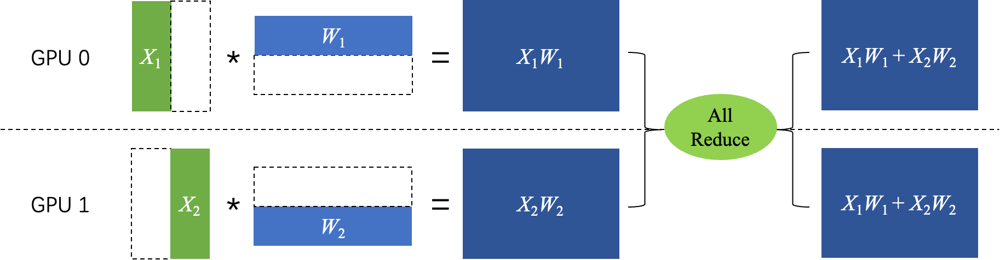

图 9 张量按行列切分的模型并行计算

==================================

2.1.4 流水线并行

>>>>>>>>>>>>>>>>>

流水线并行是模型并行的一种，其原理是把模型的不同层放置在不同卡上运行，参数也按层分配到不同的卡上，以降低模型的显存占用。

如下图所示，网络共包含 4 层，我们可以把第 0 层放置在卡 0 上运行，第 1 层和第 2 层放置在卡 1 上运行，第 4 层放置在卡 2 上运行。在训练过程中，卡 0 接收输入数据进行计算，并将计算结果发送给卡 1；卡 1 接收到卡 0 的计算结果后进行计算，并将计算结果发送给卡 2；卡 2 接收到卡 1 的计算结果后进行计算，得到损失函数值，完成前向计算。反向计算逻辑与前向刚好相反。

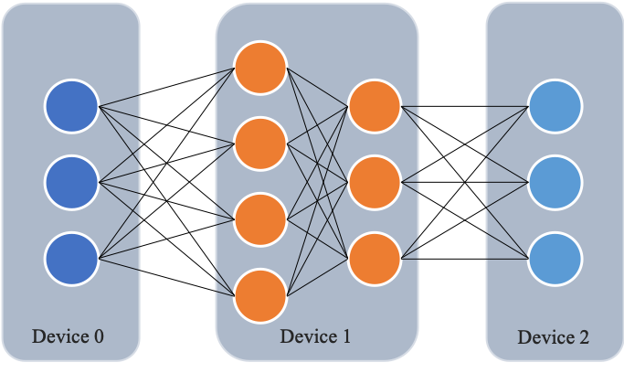

图 10 流水线并行示意图

==================================

下图展示了朴素的流水线并行调度逻辑。无论是前向还是反向计算，每个时刻有且仅有一个设备进行计算，其他设备均处于空闲状态，设备利用率和计算效率较差。

.. image:: ./images/distribute_overview_11.png
  :width: 600
  :alt: paddle_dist
  :align: center

图 11 朴素流水线并行

==================================

为了优化流水线并行中设备的计算效率，可以进一步将 mini-batch 切分成若干更小粒度的 micro-batch，以提升流水线并行的并发度，进而达到提升设备利用率和计算效率的目的。如下图所示，一个 mini-batch 被切分为 4 个 micro-batch；前向阶段，每个设备依次计算单个 micro-batch 的结果；从而增加了设备间的并发度，降低了流水线并行 bubble 空间比例，提高了计算效率。

.. image:: ./images/distribute_overview_12.png
  :width: 600
  :alt: paddle_dist
  :align: center

图 12 优化后的流水线并行

==================================

2.1.5 专家并行

>>>>>>>>>>>>>>>>>

当模型规模达到万亿及以上时，上述并行策略无论是计算效率还是显存占用都无法有效实施。飞桨支持了专家并行（Mixture of Experts）的稀疏模型并行训练策略。在专家并行训练过程中，每个 mini-batch 仅有部分的专家网络被激活，从而大大提高计算效率，降低显存占用。目前，专家并行是训练万亿及以上参数规模模型的主要方式。

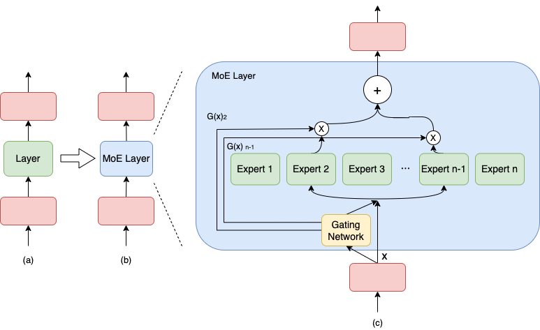

图 13 专家并行示意图

==================================

具体地，专家并行将网络某一层或多层的结构扩展为含有多个类似结构的网络，称为 Expert 网络。输入数据先通过门控网络（Gating Network）对各 Expert 网络进行打分，打分值排名前 Top K 的 Expert 网络才被激活，其他 Expert 网络均不进行计算，最终网络的输出结果是各个被激活的 Expert 网络输出结果的加权平均值。

2.2 参数服务器

-----------------------------------------------

参数服务器训练模式包含两类角色，即 Server 和 Worker。具体地，对于每个 mini-batch 的训练过程：

- Worker 接收输入数据，并从 Server 拉取模型参数，进行前向计算和反向计算，得到参数梯度后，发送给 Server。Worker 从 Server 端拉取参数的过程称为 Pull，Worker 把参数梯度发送给 Server 的过程称为 Push。

- Server 接收到 Worker 发送的参数梯度，进行参数更新。

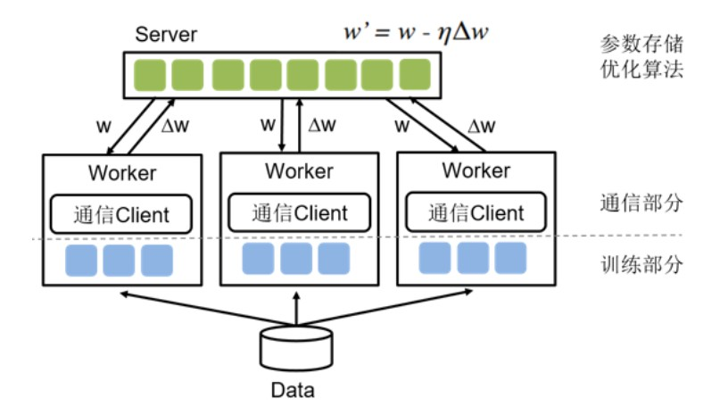

图 14 传统参数服务器训练流程

==================================

飞桨提供了纯 CPU/GPU/XPU 参数服务器以及异构参数服务器等不同训练方案，用户可根据模型特点、资源情况和训练成本等选择不同的训练方案。

三、领先技术

^^^^^^^^^^^^^^^^^^^^^^^^^^^^^^^^^^^^^^^

飞桨的英文名“PaddlePaddle” ，正是 “PArallel Distributed Deep Learning” 并行分布式深度学习的字母缩写组合。飞桨不仅在业内最早支持了万亿级稀疏参数模型的训练能力，还结合计算机视觉、自然语言处理、科学计算、个性化推荐等领域的应用，在集合通信训练模式和参数服务器训练模式两个方向上研发了多项领先技术成果：

- 面向集合通信训练模式，飞桨研发了多种并行策略组合使用的混合并行技术，并在此基础上，研发了可根据模型特性和集群内硬件特性自动选择并行策略的**端到端自适应大规模分布式训练技术**，实现端到端极致的性能优化。进一步针对多集群训练，飞桨推出了业内首个**异构多云**自适应分布式训练架构，支持云际环境下的异构硬件联合训练，实现算力共享（多个算力中心互联训练）和知识共享（云化方式利用各自的大模型）。

- 面向参数服务器训练模式，飞桨针对多硬件发展趋势，研发了**异构参数服务器架构**，可以在硬件异构集群中部署分布式训练任务，高效利用异构硬件资源。随后针对图模型在推荐场景应用越来越广泛，飞桨又推出了基于 GPU 的**超大规模图模型训练技术 PGLBox**，在业内率先实现了可同时支持复杂算法、超大图、超大离散模型的一体化图学习方案。

下面我们将针对上述领先技术逐一介绍。

3.1  端到端自适应大规模分布式训练技术

--------------------------------------------------

随着 2020 年 GPT-3 1750 亿超大语言预训练模型的提出，语言、视觉、多模态等领域也随即发布多种超大规模预训练模型，不仅模型参数量越来越大，训练数据量和计算量也相应变大。针对大规模稠密参数模型高效训练问题，飞桨于 2021 年初在业内首创 4D 混合并行训练策略，即将数据并行、张量模型并行、流水线并行、分组参数切片并行等策略组合使用，取长补短，发挥各自的优势。简而言之，首先在单机内使用张量模型并行和分组参数切片组合的 2D 策略，原因是这两个策略通信量较大，适合使用机器内的卡间通信；然后为了承载千亿规模模型，再叠加流水线并行策略，使用多台机器共同分担；最后为了做到高效，在外层又叠加了数据并行来增加并发数量，提升整体训练速度。

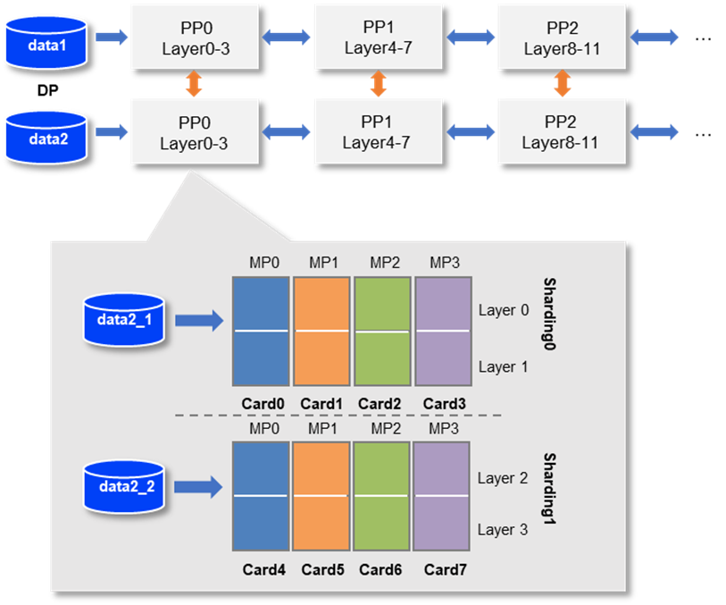

图 15 4D 混合并行策略示意图

==================================

在 4D 混合并行训练策略的基础上，为了进一步降低用户使用门槛，同时也是为了应对模型多样性和训练硬件资源异构性，飞桨从硬件特点和算法特性的角度出发，遵循软硬结合的设计思路，提出了端到端自适应分布式训练架构。该架构可以针对不同的深度学习算法抽象成统一的计算视图，自动感知硬件环境并抽象成统一的异构资源视图；还采用了代价模型对两者进行联合建模；最后将模型参数、梯度、优化器状态按照最优策略分配到不同设备上，构建流水线进行异步高效执行。该架构可以在同地域或跨地域多种异构硬件下，达到节省存储、负载均衡、提升训练性能的目的。以鹏城 - 百度 · 文心为例，使用该架构不仅支持了多种硬件下的高效训练，还将训练性能提升到了传统分布式训练方法的 2.1 倍。

此外，针对大模型训练资源不稳定的问题，还设计了弹性资源调度管理机制。当资源发生变化时，该架构能够自动的感知硬件环境并修正资源视图，重新触发模型切分放置策略选择及异步流水线执行，使得硬件故障下任务恢复可从小时级降至秒级。

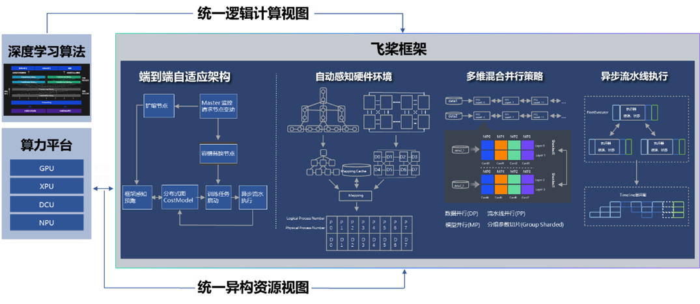

图 16 端到端自适应分布式训练架构

==================================

3.2 异构多云，实现算力和模型共享

----------------------------------------------------------------

针对多算力中心数据、算力共享面临的安全、效率挑战，飞桨推出了业内首个异构多云自适应分布式训练架构，支持云际环境下的异构硬件联合训练，实现算力共享（多个算力中心互联训练）或知识共享（云化方式利用各自的大模型）。该架构融合了混合并行训练、通信压缩、异构通信、安全加密等技术，并已在“鹏城云脑 II+百度百舸”下完成多个模型的验证。 通过算力共享方式成功训练了多语言知识融合的 ERNIE 模型，可以做到精度无损和性能基本无损。在该场景下，各算力中心会收到全量训练数据和自适应切分的不同模型网络层，并采用集合通信、模型并行等技术训练各网络层，参数服务器架构将中间层输出与梯度信息进行通信压缩和安全加密后，传递至其它算力中心，完成联合训练。多算力中心算力联合训练，将是一种更灵活的大模型训练方式。

鹏城云脑 II 和百度百舸以这种知识共享方式成功训练了英语-西班牙语翻译模型。预训练大模型也可用于其它模型高质量生产。

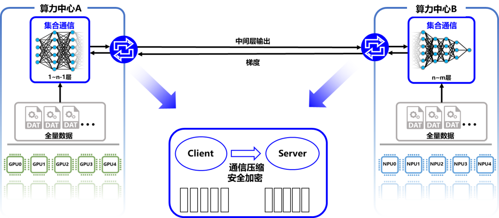

图 17 异构多云分布式训练示意图

==================================

3.3 高扩展性通用异构参数服务器

----------------------------------------------------

参数服务器架构在搜索推荐系统应用非常广泛。飞桨框架 2.0 版本推出业内首个“通用异构参数服务器”技术，可使训练任务对硬件型号不敏感，即可以同时使用不同的硬件混合异构训练。通过异构参数服务器模式，用户可以在异构硬件集群中部署分布式训练任务，目的是对不同算力的芯片高效利用，获得更高吞吐，更低资源消耗的训练能力。异构参数服务器拥有非常高的性价比，如下图所示，仅用两个 CPU 机器加两个 GPU 机器就可以达到与 4 个 GPU 机器相仿的训练速度，而成本至少可以节约 35%。

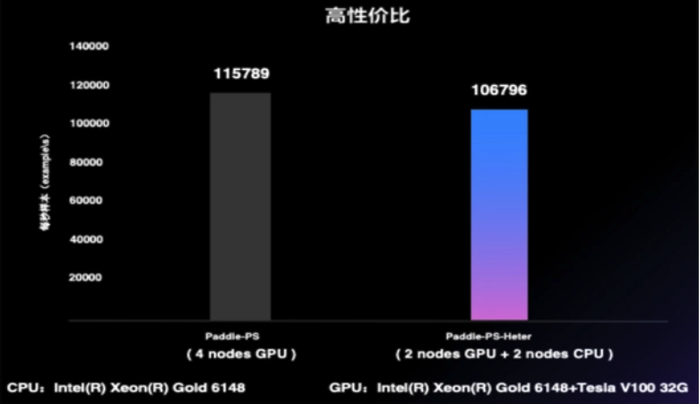

图 18 异构参数服务器与传统参数服务器性能对比

==================================

同时，飞桨在 2.3 版本中进一步提升其扩展性，主要是将其中的基础模块通用化，提升二次开发体验，高效支持产业应用中广泛的定制开发需求。以新增支持昆仑芯 XPU 的参数服务器为例，在复用通用模块的基础上，只需增加三个硬件相关的定制模块，使得开发量从原来的万行减少至千行。再比如，扩展业务场景至 GPU 图神经网络训练，仅需要在存储模块中添加图采样策略即可开发完成 GPU 三级存储图检索引擎，支持 GPU 图分布式训练。

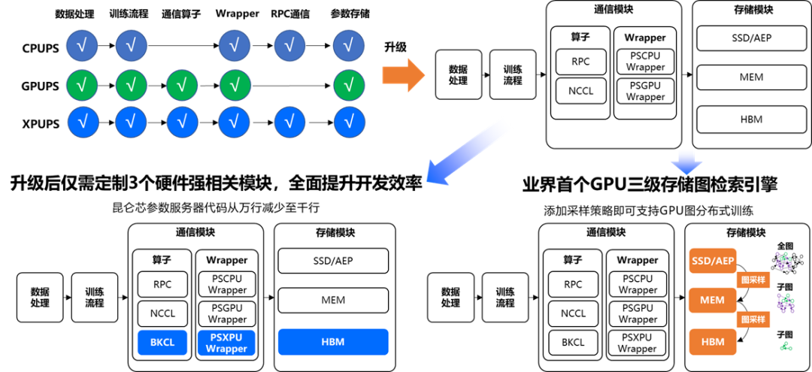

图 19 可高效扩展的参数服务器架构

==================================

3.4 超大规模图模型训练架构

----------------------------------------------------

图神经网络基于顶点和边的关系进行模型训练，对图数据具有强大的表征刻画能力，广泛用于广告、推荐召回等模型场景。飞桨针对图表示学习模型训练，推出了基于 GPU 的超大规模图模型训练引擎 PGLBox 2.0，实现业内首个 SSD-MEM-HBM 3 级存储的图模型训练架构，单机可支持百亿节点、数百亿边模型规模，相比 1.0 版本速度再提升 1.6 倍，相比 MPI 训练的加速比提升 27 倍。

PGLBox 在业内率先实现了可同时支持复杂算法、超大图、超大离散模型的一体化图学习方案，基于 PGLBox 的 R-UniMP 模型提速近 10 倍，获得 NeurIPS 2022 大规模 GNN 挑战赛冠军。

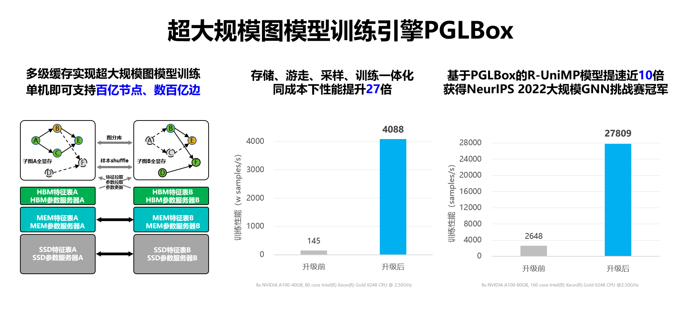

图 20 图神经网络训练架构

==================================

四、性能测试

^^^^^^^^^^^^^^^^^^^^^^^^^^^^^^^^^^^^^^^^^^^^^^^

在 AI 训练任务上，芯片决定了算力的理论上限，服务器和集群的整合可以保证基础的运行效率，而最终能充分发挥计算潜力的是深度学习框架。飞桨自诞生以来一直在百度业务实践中被不断改进。结合计算机视觉、自然语言处理、科学计算等领域的应用，飞桨研发了异构硬件下的低存储和高性能训练技术，并拥有多项领先技术成果，基础训练性能也一路提升。

4.1 登顶全球最权威 AI 性能基准评测

----------------------------------------------------

11 月 10 日，机器学习基准测试平台 MLPerf （MLPerf 是目前国际公认的权威 AI 性能评测基准）放出了最新一期榜单，在 BERT 模型训练排行榜上，百度使用飞桨框架提交的 8 机 64 卡配置在同等 GPU 配置下获得第一名[1]。百度参与的自然语言处理赛道要求训练 BERT Large 模型，比较语言模型准确率（Masked Language Model Accuracy）训练至 72% 的端到端时间。作为 NLP 领域的知名模型之一，BERT 使用的 Transformer 架构正是目前主流大模型的基础架构。

本次评测共有 21 个公司和机构参与。百度提出的方法在端到端训练时间和训练吞吐两个指标上均超越了同等 GPU 配置下的所有对手。在同等 GPU 配置下端到端训练收敛时间比其它提交结果快 1% 到 20%，在训练吞吐量上比其他提交结果要快 2% 到 12%。此结果进一步印证了飞桨分布式训练的性能表现。

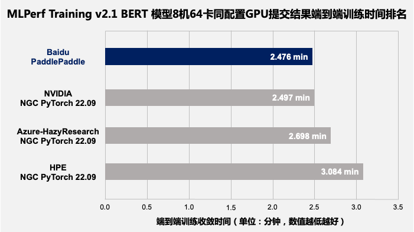

图 21 MLPerf Training v2.1 BERT 模型端到端训练收敛时间排名（8 机 64 卡 GPU）

==================================

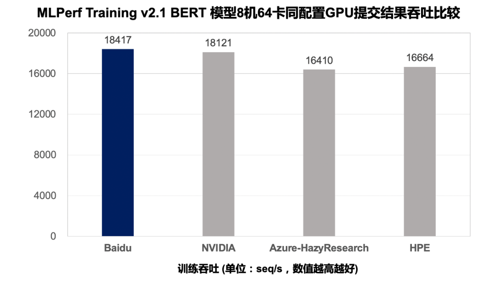

图 22 MLPerf Training v2.1 BERT 模型提交结果吞吐量比较（8 机 64 卡 GPU）

==================================

MLPerf 基准测试上获得的高速度，得益于飞桨框架在分布式训练核心技术上的持续探索和创新。

本次测评是多节点分布式训练。在跨设备并联计算的情况下，飞桨依托之前所述的 4D 混合并行策略，端到端自适应分布式训练等领先技术，解决了一些此前单机训练时无法遇到的挑战，优化范围包括设备间的负载均衡，以及 CPU、GPU 等异构算力的负载均衡。在跨设备通信的问题上，飞桨还使用了全局通信与分层次通信相结合的方法提高通信效率。在 MLPerf BERT 模型训练任务上，飞桨根据集群通信拓扑特点并结合 NCCL SHARP 协议，使用全局通信与分层次通信结合的方式降低整体通信耗时，有效提升了模型训练性能。针对分布式训练经常出现的负载不均、数据加载速度瓶颈等问题，飞桨利用异构设备混合负载均衡方案，根据不同设备的特点把任务分配到效率最高的算力上。在 MLPerf 训练任务上，飞桨通过使用 GPU 高带宽通信解决了模型训练启动时的数据加载慢问题，又用 CPU 异构设备通信实现了模型训练过程与数据负载均衡间的重叠，提高了模型训练效率。另外，飞桨框架还在 Transformer 类模型底层提供了专门的高性能支持，对数据的输入、模型结构、算子实现等方面实现了优化。

值得一提的是，在数据并行优化的基础上，百度的方案在 8GPU 的机器上实现了超过 8 的效率——用框架的优化跑出了超过等效物理芯片数量的速度。在多 GPU 计算单元机器学习并行运算时，各 GPU 的优化器计算部分是冗余重复的。飞桨优化了冗余重复计算的部分，让每张卡只需计算参数梯度的一部分，然后再进行聚合同步更新；在此基础上，结合分层参数切分与通信、跨 step 通信 - 计算重叠、多流并发参数广播、底层算子深度优化等方式，进一步提升分布式训练极致性能，实现了 1+1 大于 2 的效果。

4.2 多场景验证

--------------------------------------------

除 MLPerf 打榜之外，飞桨的分布式训练架构在多个场景下得到了验证。

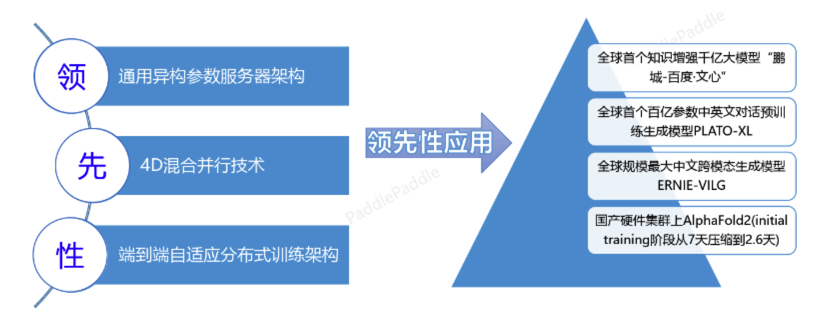

图 23 多场景验证了飞桨分布式训练架构的领先性

==================================

在稀疏门控混合专家并行领域，飞桨提出了 Task MoE 分布式训练架构和基于 Task 的负载均衡机制，同等实验环境下训练性能比 PyTorch 提升 66%。飞桨大规模分布式训练技术，支持了百度大模型领域技术快速迭代持续领先。例如，百度发布了全球首个知识增强千亿大模型“鹏城-百度·文心”、全球首个百亿参数中英文对话预训练生成模型 PLATO-XL、全球规模最大中文跨模态生成模型 ERNIE-VILG、业界规模最大的多任务统一视觉大模型文心 VIMER-UFO 2.0 大模型。目前，文心已发布 20 多个大模型，覆盖自然语言处理、计算机视觉、跨模态、生物计算等领域，赋能工业、能源、城市、金融等千行百业。

在 GPT-3 千亿模型 GPU 训练场景下，经测试，飞桨训练性能达到训练硬件峰值性能的 51.3%，在同等实验环境下超越业界同类实现（DeepSpeed/Megatron-LM）；而在「鹏城 - 百度 · 文心」千亿大模型的训练上，飞桨支持的性能达到同规模、非自适应架构下的性能的 2.1 倍。

此外，在蛋白质结构预测领域，飞桨创新性地提出了「分支并行 - 动态轴并行 - 数据并行」的混合并行策略，性能提升 36% 以上。飞桨分布式技术还在国产硬件集群上将 AlphaFold2 千万级别蛋白 initial training 阶段从 7 天压缩到 2.6 天。
