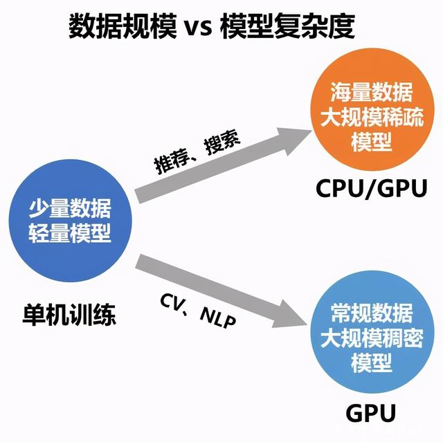
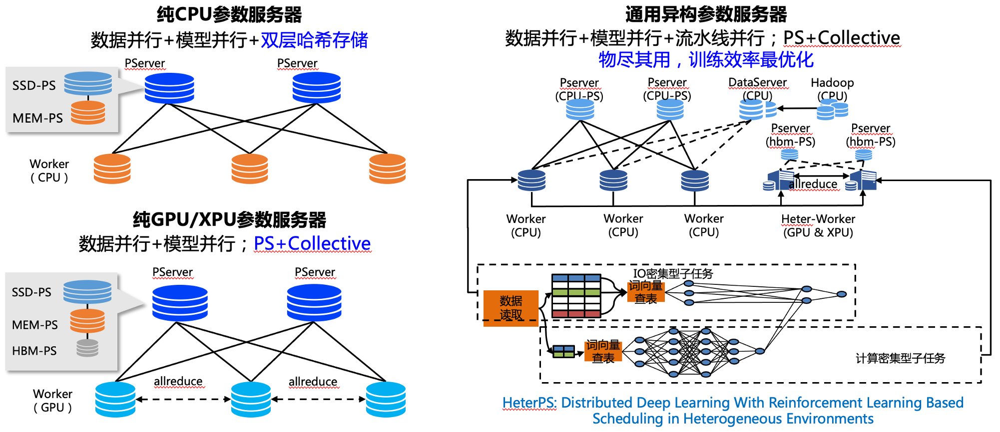

..  _distributed_overview:

Paddle 分布式整体介绍
====================================

1.概述
------

近几年，深度学习领域的开发者们对模型效果的追求愈演愈烈，各大榜单纪录不断刷新，而这个现象的背后都有着 “大规模训练” 的身影。简单来说，就是使用大规模的数据或大规模参数量的模型来做训练。大规模的数据可以让模型有足够的 “教材” 用于 “学习”，而大规模的参数量则可以让模型“学习能力” 更强，更容易 “学习” 到“教材”中的“知识”。在数据和参数规模增长的过程中，常规的单机训练由于硬件资源的限制渐渐显得捉襟见肘，而分布式训练则成为了广大开发者的必然选择。

所谓分布式训练，就是使用多台机器共同完成训练任务，这其中涉及多机任务拆分、集群训练资源配置、平衡训练速度和收敛速度、弹性训练与容错等多项重要技术，同时也是各大深度学习框架彰显技术实力的重要 “战略高地”。

飞桨是我国首个开源开放、自主研发、功能完备的产业级深度学习框架，其英文名“PaddlePaddle” 正是 “Parallel Distributed Deep Learning” 并行分布式深度学习的字母缩写组合。飞桨不仅在业内最早支持了万亿级稀疏参数模型的训练能力，而且近期又创新性的提出了 4D 混合并行策略，以训练千亿级稠密参数模型，可以说分布式训练是飞桨最具特色的技术之一。

飞桨的分布式训练技术在对外提供之前就已经在百度内部广泛应用，如搜索引擎、信息流推荐、百度翻译、百度地图、好看视频、文心 ERNIE 等等，既包含网络复杂、稠密参数特点的计算机视觉（CV）\ 自然语言处理（NLP）模型训练场景，又覆盖了有着庞大的 Embedding 层模型和超大数据量的推荐搜索训练场景，可谓是分布式训练技术得天独厚的“练功房”。

2.常见的使用场景
----------------------

2.1 搜索推荐场景
^^^^^^^^^^^^^^^^^^^^^^^^^^^^^^^^^^^^^^^^^^^^

搜索推荐场景经常面临数据量大、特征维度高且稀疏化的问题。而分布式训练的参数服务器模式采用了一种将模型参数中心化管理的方式来实现模型参数的分布式存储和更新，该模式有两个角色 Server 与 Worker：Worker 用于执行模型的前向与反向计算；Server 负责从各个 Worker 收集汇总梯度并更新参数，因此对于存储超大规模模型参数的训练场景十分友好，常被用于训练拥有海量稀疏参数的搜索推荐领域模型。

Paddle 提供了传统纯 CPU 参数服务器、纯 GPU 参数服务器以及异构参数服务器等不同方案，您可以根据自己的模型特点和资源情况进行选择。详细内容可以参考 `搜索推荐场景 <./cluster_quick_start_ps_cn.html>`__

2.2 稠密参数 collective 训练场景
^^^^^^^^^^^^^^^^^^^^^^^^^^^^^^^^^^^^^^^^^^^^
对于 NLP 和 CV 等这类拥有复杂网络、稠密参数特点的模型，飞桨分布式训练技术的集合通信模式可以很好的支持这类模型的训练。该模式没有管理模型参数的中心节点，每个节点都是 Worker，每个 Worker 负责模型训练的同时还需要掌握当前最新的全局梯度信息。集合通信模式对计算芯片的算力和芯片之间的网络互联要求较高，如高性能计算的 GPU、芯片之间的高速网络互联 NVLINK 和 InfiniBand 等，因此非常适合 CV 和 NLP 领域计算密集型训练任务。

在这类场景下，选择合适的分布式并行策略尤为重要，主要解决要面对的显存、通信和负载均衡的问题。下面我们以常见的模型训练场景为例作说明。

当我们的模型比较小或者单卡能放下时，我们可以采用 `数据并行训练 <./data_parallel/index_cn.html>`__ 的方式通过多卡间复制模型、同步梯度、增加 minibatch 的方法提高训练的效率，比如 ERNIE large 或者 Bert Large 模型单卡能够放得下，但是由于计算量偏大，在 V100 上训练这样的模型经常需要扩展到 4 机甚至 8 机上进行训练。

当模型变大到 10 亿到百亿这个范围时，比如 NLP Bert 百亿模型，V100 机器单卡放不下但是单机能够放下，我们可以采用 `GroupSharded 并行 <./group_sharded_parallel_cn.html>`__ 切分优化器状态、参数方式减少显存使用，用通信换显存占用； 或者使用 `张量并行 <./model_parallel_cn.html>`__ 把显存占用比例高的参数比如矩阵进行按照行列的维度进行切分，减少显存使用切分计算同时切分计算量。

.. 样例可以参考`ERNIE 百亿 <https://>`__ 或者 Bert。

当模型进一步增加，到达 100 亿以上、甚至千亿模型，单机可能就放不下了。需要进一步的对模型进行切分，比如 `流水线并行 <./pipeline_parallel_cn.html>`__ ；同时，我们针对这个场景提出了 `4D 混合并行的策略 <https://baijiahao.baidu.com/s?id=1697085717806202673&wfr=spider&for=pc&searchword=4d%E6%B7%B7%E5%90%88%E5%B9%B6%E8%A1%8C&sShare=1>`__ 以充分利用各个并行策略在显存、通信、负载均衡等各个维度的优势，对模型进行合理的切分，充分利用机器的计算能力。

当模型增加到万亿甚至 10W 亿，Dense 参数的训练模式由于计算量太大以至于比较难实际实施。这个时候需要稀疏模型训练，例如 MoE(Mixture-Of-Experts)，与 Dense 大模型不同，`MoE 训练 <http://>`__ 过程中只会激活部分的 Expert 参数从而大幅减少了计算量。目前 MoE 成为了通往万亿以及更大的模型的主要方式。

.. note::需要注意的是，我们使用任何一个并行策略都是有性能代价的，而且常常随着并行策略所应用的范围变大而上升。所以，把并行策略限定到尽量少的范围中会对保证训练性能有益。

.. note::分布式程序的性能要点在于：负载均衡、通信极小。

2.3 集群和云端训练支持
^^^^^^^^^^^^^^^^^^^^^^^^^^^^^^^^^^^^^^^^^^^^

* `弹性训练 <https://fleet-x.readthedocs.io/en/latest/paddle_fleet_rst/edl.html>`__ 弹性训练提供两方面的能力，任务所需要的资源可以随训练进度变化，以及当所能分配给任务的资源变化时对任务进行动态调整，前者可以保证任务能够充分利用可用资源提高训练效率，后者可以提高集群的资源利用率。PaddlePaddle 的弹性训练能够根据任务需求动态调整训练节点数和训练参数以提升训练效率，例如资源空闲时扩充训练节点加快训练进度，资源过载时收缩部分任务节点优先保证高优任务训练。

* `云端训练的支持 <https://fleet-x.readthedocs.io/en/latest/paddle_fleet_rst/public_cloud.html>`__ 针对常见的云平台，我们提供了在其上运行任务的详细的方法和步骤。

3. 文章
----------------------
* Ji Liu, Zhihua Wu, Dianhai Yu, Yanjun Ma, Danlei Feng, Minxu Zhang, Xinxuan Wu, Xuefeng Yao, Dejing Dou. `End-to-end Adaptive Distributed Training on PaddlePaddle <https://arxiv.org/abs/2112.02752>`__ .

* Yulong Ao, Zhihua Wu, Dianhai Yu, Weibao Gong, Zhiqing Kui, Minxu Zhang, Zilingfeng Ye, Liang Shen, Yanjun Ma, Tian Wu, Haifeng Wang, Wei Zeng, Chao Yang. `End-to-end Adaptive Distributed Training on PaddlePaddle <https://arxiv.org/abs/2112.02752>`__ .

* Yang Xiang, Zhihua Wu, Weibao Gong, Siyu Ding, Xianjie Mo, Yuang Liu, Shuohuan Wang, Peng Liu, Yongshuai Hou, Long Li, Bin Wang, Shaohuai Shi, Yaqian Han, Yue Yu, Ge Li, Yu Sun, Yanjun Ma, Dianhai Yu. `Nebula-I: A General Framework for Collaboratively Training Deep Learning Models on Low-Bandwidth Cloud Clusters <https://arxiv.org/abs/2205.09470>`__ .
