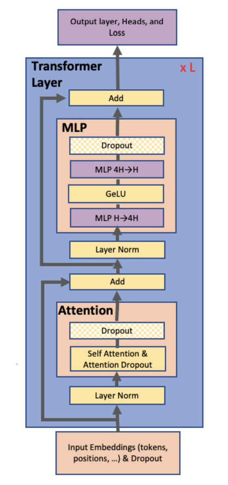
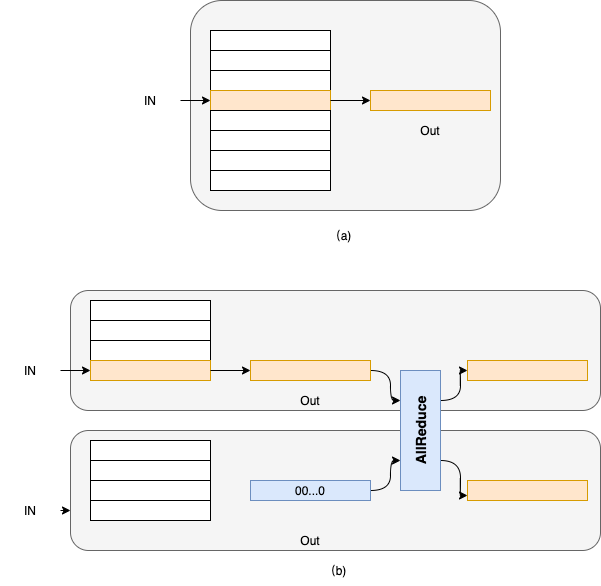
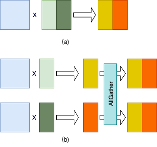
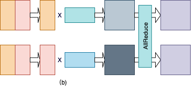
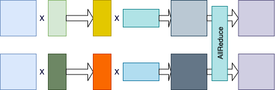
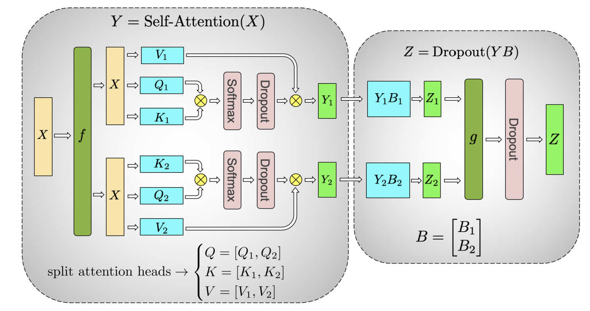

..  _model_parallel:

张量模型并行
=======================

通常来讲，训练更大规模的网络模型可以在多种任务上取得更好的效果，如自然语言处理类任务的准确率。然而，训练更大规模的网络模型会消耗更多的显存资源，甚至是超过单个设备的显存容量，从而导致模型无法训练。模型并行通过将网络中的张量（Tensor）切分到不同的设备，从而降低单个设备的显存消耗，使得超大规模模型训练成为可能。本文主要介绍飞桨模型并行的基本原理和使用方法。

一、原理介绍
-----------------------

张量模型并行需要解决两个问题：参数如何切分到不同设备（切分方式）；以及切分后，如何保证数学一致性（数学等价）。本文以 NLP 中的 Transformer 结构为例，介绍张量模型并行的切分方式和随机性控制。

1.1 切分方法
^^^^^^^^^^^^^^^^^^^^^^^^^^

自 2017 年提出以来， `Transformer <https://arxiv.org/abs/1706.03762>`__ 及其变种模型成为自然语言类任务的常用模型，并于近年来被应用到图像视觉领域。Transformer 模型的基础结构是由 Attention 和 MLP 组成的 Encoder 和 Decoder，以及 Embedding，如下图所示[1]。其中 Attention 和 MLP 的底层实现均为矩阵乘法运算，而 Embedding 是一种查找表实现。本文以 NLP 中的 Transformer 结构为例，介绍张量模型并行的切分方式和随机性控制。但总体上看核心思想都是利用分块矩阵的计算原理，实现其参数切分到不同的设备 2 。下面详细介绍这三种层的切分方式。

嵌入式表示（Embedding）
:::::::::::::::::::::::::

对于 Embedding 操作，可以将其理解为一种查找表操作。即，将输入看做索引，将 Embedding 参数看做查找表，根据该索引查表得到相应的输出，如下图（a）所示。当采用模型并行时，Embedding 的参数被均匀切分到多个卡上。假设 Embedding 参数的维度为 N*D，并采用 K 张卡执行模型并行，那么模型并行模式下每张卡上的 Embedding 参数的维度为 N//K*D。当参数的维度 N 不能被卡数 K 整除时，最后一张卡的参数维度值为(N//K+N%K)*D。以下图（b）为例，Embedding 参数的维度为 8*D，采用 2 张卡执行模型并行，那么每张卡上 Embedding 参数的维度为 4*D。

为了便于说明，以下我们均假设 Embedding 的参数维度值 D 可以被模型并行的卡数 D 整除。此时，每张卡上 Embedding 参数的索引值为[0, N/K)，逻辑索引值为[k*N/K, (k+1)*N/K)，其中 k 表示卡序号，0<=k<K。对于输入索引 I，如果该索引在该卡表示的逻辑索引范围内，则返回该索引所表示的表项（索引值为 I-k*N/K；否则，返回值为全 0 的虚拟表项。随后，通过 AllReduce 操作获取所有输出表项的和，即对应该 Embeding 操作的输出；整个查表过程如下图（b）所示。

矩阵乘（MatMul）
:::::::::::::::::::::::::

对于矩阵乘操作，是按行或者列将矩阵切分 K 份。假设原始矩阵的维度为 M*N，则按行切分后，各个卡上的矩阵维度为 M/K*N；若按列切分，则各个卡上矩阵的维度值为 M*N/K。

下图给出按列切分矩阵乘法的示例图。其中，图（a）给出单卡上的矩阵乘法。图（b）给出模型并行模式下的矩阵乘法，其中第二个矩阵按列切分到 2 张卡上；两张卡分别得到结果矩阵的一部分。最后，通过 AllGather 通信操作汇聚最终的结果。

下图给出按行切分矩阵乘法的示例图。其中，图（a）给出单卡上的矩阵乘法。图（b）给出模型并行模式下的矩阵乘法，其中第二个矩阵按行切分到 2 张卡上；第一个矩阵需要按列切分，以满足矩阵乘法的维度要求；两张卡分别得到结果矩阵的一部分。最后，通过 AllReduce 通信操作按元素累加结果矩阵得到最终的结果。

我们观察到，可以把上述按列切分矩阵乘法和按行切分矩阵乘法串联起来，从而省略掉一次 AllGather 通信操作，如下图所示。同时，我们注意到 Transformer 的 Attention 和 MLP 组件中各种两次矩阵乘法操作。因此，我们可以按照这种串联方式分别把 Attention 和 MLP 组件中的两次矩阵乘法串联起来，从而进一步优化性能。

随机性控制
:::::::::::::::::::::::::

我们观察到，在模型并行模式下，Transformer 的 Attention 组件中存在两种类型的 Dropout 操作，如下图所示[1]。第一类是 softmax 算子后的 Dropout 算子；其输入是按列切分矩阵乘法的部分结果，我们称为局部 Dropout。直观理解，模型并行下，所有卡上的 Dropout 算子构成一个完整的 Dropout 算子，因此我们需要确保不同卡上该类 Dropout 算子的丢弃位置是不同的。第二类是图中 g 操作之后的 Dropout 操作，对于此类 Dropout，其输入均为完整且相同的输出，我们需要确保 Dropout 算子的输出也相同，即各个卡上该类 Dropout 算子选择的丢弃位置是相同的。我们称此类 Dropout 为全局 Dropout。我们通常通过设置种子来控制两类 Dropout 的输出。具体地讲，对于局部 Dropout，我们在不同的卡上为他们设置不同的种子，从而确保它们选择的丢弃位置是不同的。而对于全局 Dropout 算子，我们在不同的卡上为它们设置相同的种子，从而确它们在不同卡上选择的丢弃位置是相同的。

我们需要注意以下几点：

- 模型并行下，需要确保模型并行组中各个卡读取相同的数据；
- 模型并行下，除了被切分的算子对应的输出外，其它所有算子的输出在各个卡上是一致的。

二、动态图使用方法
-----------------------

下面我们将分别介绍如何在动态图模式下使用飞桨框架进行模型并行训练。

动态图中，我们提供了以下接口实现 Embeeding 和矩阵切分：

- paddle.distributed.fleet.meta_parallel.VocabParallelEmbedding
- paddle.distributed.fleet.meta_parallel.ColumnParallelLinear
- paddle.distributed.fleet.meta_parallel.RowParallelLinear
- paddle.distributed.fleet.meta_parallel.get_rng_state_tracker

定义如下：

.. code-block:: python

   class VocabParallelEmbedding(Layer):
       def __init__(self,
                    num_embeddings,  # Embedding 参数的行数
                    embedding_dim,   # Embedding 参数的列数
                    weight_attr=None,
                    name=None):
           super().__init__()

   class RowParallelLinear(Layer):
       def __init__(self,
                    in_features,
                    out_features,
                    weight_attr=None,
                    has_bias=True,
                    input_is_parallel=False, #输入是否是并行输入，为否的话需要按列切分输入参数
                    name=None):
           super().__init__()

   class ColumnParallelLinear(Layer):
       def __init__(self,
                    in_features,
                    out_features,
                    weight_attr=None,
                    has_bias=None,
                    gather_output=True, # 是否在该算子后汇聚所有卡的输出
                    name=None):

   RNG_STATE_TRACKER = RNGStatesTracker() # RNGStatesTracker 是全局随机性控制器，用于保证张量模型并行的随机性
   def get_rng_state_tracker():
      return RNG_STATE_TRACKER

   class RNGStatesTracker:
      def __init__(self):
         self.states_ = {}     # 存储随机状态
         self.seeds_ = set()   # 可以设置多个随机种子

下面的例子给出在两张卡上实现 Embedding 算子模型并行的示例。

.. code-block:: python

   import paddle.distributed.fleet as fleet
   word_embeddings = fleet.meta_parallel.VocabParallelEmbedding(
       vocab_size,
       hidden_size,
       weight_attr=paddle.ParamAttr(initializer=nn.initializer.Normal(
                     mean=0.0, std=initializer_range)))

此外，我们还需要配置 Fleet 的选项，以使用模型并行功能。

.. code-block:: python

   strategy = paddle.distributed.fleet.DistributedStrategy()
   strategy.hybrid_configs = {
       "mp_degree": 2,
       "dp_degree": 1,
   }
   fleet.init(is_collective=True, strategy=strategy)
   hcg = fleet.get_hybrid_communicate_group()
   global_rank = hcg.get_global_rank() # 全局 rank
   mp_rank = hcg.get_model_parallel_rank() # 模型并行组 rank

当结合使用模型并行和数据并行时，我们需要指定 ``dp_degree`` 参数，设置数据并行的并行度。

如上文所述，对于 Transformer 模型，存在两种类型的 Dropout：全局 Dropout 和局部 Dropout；对于全局 Dropout，需要在模型并行的所有卡上设置相同的种子，对于局部 Dropout，则需要设置不同的种子。我们通过如下代码分别设置全局和局部种子：

.. code-block:: python

   from paddle.distributed.fleet.meta_parallel import get_rng_state_tracker
   local_seed = basic_seed + mp_rank * 11
   global_seed = basic_seed
   tracker.add('global_seed', global_seed)
   tracker.add('local_seed', local_seed)

上例只是一种示例实现，用户可以根据自己的需要实现不同的种子设置方式，但需要确保同一模型并行组内，全局 Dropout 的种子是一致的，而局部 Dropout 的种子是不同的。

在使用 ``Dropout`` 接口时，我们还需要根据其类型设置其种子，如下例所示：

.. code-block:: python

   # For local dropout
   import paddle.nn.functional as F
   from paddle.distributed.fleet.meta_parallel import get_rng_state_tracker
   with get_rng_state_tracker().rng_state('local_seed'):
       weights = F.dropout(
                         weights,
                         dropout_rate,
                         training=True,
                         mode='upscale_in_train')

   # For global dropout
   with get_rng_state_tracker().rng_state('global_seed'):
       weights = F.dropout(
                         weights,
                         dropout_rate,
                         training=True,
                         mode='upscale_in_train')

三、动态图运行示例
-----------------------

动态图的例子代码主要使用上面提到的三种类

下面代码在 Paddle2.0 以上可以运行，建议将 Paddle 版本升级到最新版

首先导入需要的包

.. code-block:: python

   import paddle
   import numpy as np
   import random
   import paddle.distributed as dist
   import paddle.fluid as fluid
   import paddle.distributed.fleet as fleet

声明一些需要使用的全局变量

.. code-block:: python

   vocab_size = 20
   hidden_size = 10
   inner_size = 8
   output_size = 10
   seq_length = 2
   batch_size = 4

定义模型并行的模型

.. code-block:: python

   class SimpleMPNet(fluid.dygraph.Layer):
      def __init__(self, vocab_size, hidden_size, inner_size, output_size):
         super().__init__()
         self.linear1 = fleet.meta_parallel.ColumnParallelLinear(
               hidden_size,
               inner_size,
               gather_output=False,
               has_bias=True)

         self.linear2 = fleet.meta_parallel.RowParallelLinear(
               inner_size,
               hidden_size,
               input_is_parallel=True,
               has_bias=True)

         self.linear3 = paddle.nn.Linear(hidden_size, output_size)

         self.embedding = fleet.meta_parallel.VocabParallelEmbedding(
                           vocab_size,
                           hidden_size)

      def forward(self, x):
         x = self.embedding(x)
         x = self.linear1(x)
         x = self.linear2(x)
         x = self.linear3(x)
         return x

定义固定种子的函数

.. code-block:: python

   def set_random_seed(seed, rank_id):
      random.seed(seed)
      np.random.seed(seed)
      paddle.seed(seed + rank_id)

初始化分布式环境，创建模型，训练

.. code-block:: python

   strategy = fleet.DistributedStrategy()

   # 设置两路张量模型并行
   model_parallel_size = 2
   data_parallel_size = 1
   strategy.hybrid_configs = {
      "dp_degree": data_parallel_size,
      "mp_degree": model_parallel_size,
      "pp_degree": 1
   }
   # 注意 strategy 是这里传递的，动态图只能这里，静态图还可以在 distributed_optimizer 里传
   fleet.init(is_collective=True, strategy=strategy)

   hcg = fleet.get_hybrid_communicate_group()
   mp_id = hcg.get_model_parallel_rank()
   rank_id = dist.get_rank()
   set_random_seed(1024, rank_id)

   model = SimpleMPNet(vocab_size, hidden_size, inner_size, output_size)

   optimizer = paddle.optimizer.SGD(learning_rate=0.001, parameters=model.parameters())
   model = fleet.distributed_model(model)
   optimizer = fleet.distributed_optimizer(optimizer)

   for _ in range(5):
      np_data = np.random.randint(0, vocab_size, (batch_size, seq_length, ))

      output = model(paddle.to_tensor(np_data))
      loss = output.mean()
      loss.backward()
      optimizer.step()
      optimizer.clear_grad()
      print("loss", loss.numpy())

模型并行的动态图代码：`example/model_parallelism/mp_dygraph.py <https://github.com/PaddlePaddle/PaddleFleetX/tree/old_develop/examples/model_parallelism>`_。

运行方式（需要保证当前机器有两张 gpu）：

.. code-block:: bash

   export CUDA_VISIBLE_DEVICES=0,1
   python -m paddle.distributed.launch mp_dygraph.py

控制台输出信息如下：

.. code-block:: bash

   LAUNCH INFO 2022-05-31 02:35:16,954 -----------  Configuration  ----------------------
   LAUNCH INFO 2022-05-31 02:35:16,954 devices: None
   LAUNCH INFO 2022-05-31 02:35:16,954 elastic_level: -1
   LAUNCH INFO 2022-05-31 02:35:16,954 elastic_timeout: 30
   LAUNCH INFO 2022-05-31 02:35:16,954 gloo_port: 6767
   LAUNCH INFO 2022-05-31 02:35:16,954 host: None
   LAUNCH INFO 2022-05-31 02:35:16,954 job_id: default
   LAUNCH INFO 2022-05-31 02:35:16,955 legacy: False
   LAUNCH INFO 2022-05-31 02:35:16,955 log_dir: log
   LAUNCH INFO 2022-05-31 02:35:16,955 log_level: INFO
   LAUNCH INFO 2022-05-31 02:35:16,955 master: None
   LAUNCH INFO 2022-05-31 02:35:16,955 max_restart: 3
   LAUNCH INFO 2022-05-31 02:35:16,955 nnodes: 1
   LAUNCH INFO 2022-05-31 02:35:16,955 nproc_per_node: None
   LAUNCH INFO 2022-05-31 02:35:16,955 rank: -1
   LAUNCH INFO 2022-05-31 02:35:16,955 run_mode: collective
   LAUNCH INFO 2022-05-31 02:35:16,955 server_num: None
   LAUNCH INFO 2022-05-31 02:35:16,955 servers:
   LAUNCH INFO 2022-05-31 02:35:16,955 trainer_num: None
   LAUNCH INFO 2022-05-31 02:35:16,955 trainers:
   LAUNCH INFO 2022-05-31 02:35:16,955 training_script: test.py
   LAUNCH INFO 2022-05-31 02:35:16,955 training_script_args: []
   LAUNCH INFO 2022-05-31 02:35:16,955 with_gloo: 1
   LAUNCH INFO 2022-05-31 02:35:16,955 --------------------------------------------------
   LAUNCH INFO 2022-05-31 02:35:16,956 Job: default, mode collective, replicas 1[1:1], elastic False
   LAUNCH INFO 2022-05-31 02:35:16,957 Run Pod: jbvsbv, replicas 2, status ready
   LAUNCH INFO 2022-05-31 02:35:16,984 Watching Pod: jbvsbv, replicas 2, status running

日志信息位于 log 目录下, loss 的输出信息:

.. code-block:: bash

   loss [0.0282112]
   loss [-0.05410034]
   loss [0.01392444]
   loss [0.01289728]
   loss [0.06050334]

四、参考文献
-----------------------

[1] `NVIDIA/Megatron-LM: Ongoing research training transformer <https://arxiv.org/abs/1909.08053>`__
