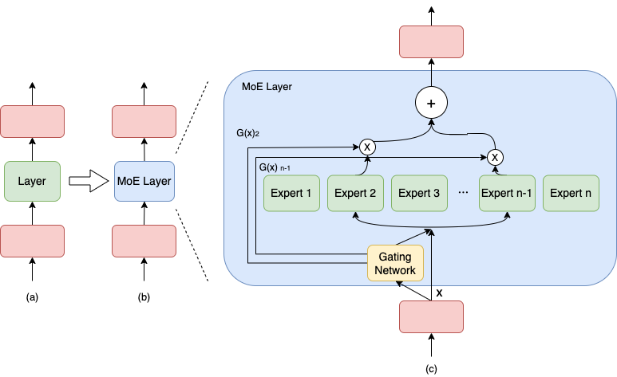

..  _moe:

MoE
=======================

通常来讲，模型规模的扩展会导致训练成本显著增加，计算资源的限制成为了大规模密集模型训练的瓶颈。为了解决这个问题，
`《Outrageously large neural networks: The sparsely-gated mixture-of-experts layer》 <https://arxiv.org/abs/1701.06538>`__
提出了一种基于稀疏 MoE 层的深度学习模型架构，即将大模型拆分成多个小模型(专家,  ``expert`` ), 每轮迭代根据样本决定激活一部分专家用于计算，达到了节省计算资源的效果；
并引入可训练并确保稀疏性的门( ``gate`` )机制，以保证计算能力的优化。

一、原理介绍
-------------------

与密集模型不同，MoE 将模型的某一层扩展为多个具有相同结构的专家网络( ``expert`` )，并由门( ``gate`` )网络决定激活哪些 ``expert`` 用于计算，从而实现超大规模稀疏模型的训练。
以上图为例，示例模型包含 3 个模型层；如(a)到(b)，将中间层扩展为具有 ``n`` 个 ``expert`` 的 MoE 结构，并引入 ``Gating network`` 和 ``Top_k`` 机制，MoE 细节见图(c)，计算过程如下述公式。

.. math::
    MoE\left ( {x} \right )=\sum ^{n}_{i=1} \left ( {{G\left ( {x} \right )}_{i}{E}_{i}\left ( {x} \right )} \right )
.. math::
    G\left ( {x} \right )=TopK\left ( {softmax\left ( {{W}_{g}\left ( {x} \right )+ϵ} \right )} \right )

上述第 1 个公式表示了包含 ``n`` 个专家的 MoE 层的计算过程。具体来讲，首先对样本 ``x`` 进行门控计算， ``W`` 表示权重矩阵；然后由 ``Softmax`` 处理后获得样本 ``x`` 被分配到各个 ``expert`` 的权重；
然后只取前 ``k`` (通常取 1 或者 2）个最大权重，最终整个 ``MoE Layer`` 的计算结果就是选中的 ``k`` 个专家网络输出的加权和。

二、功能效果
-------------------------

使用 MoE 结构，可以在计算成本次线性增加的同时实现超大规模模型训练，为恒定的计算资源预算带来巨大增益。

三、动态图使用方法
------------------------

下面我们将分别介绍如何在动态图模式下使用飞桨框架进行 MoE 架构的适配和训练。以下代码(train_moe.py)在 Paddle2.3 以上可以运行，建议将 Paddle 版本升级到最新版.

首先导入需要的包

.. code-block:: python

    import paddle
    from paddle.nn import Layer, LayerList, Linear, Dropout
    from paddle.incubate.distributed.models.moe import MoELayer
    from paddle.distributed.collective import Group
    from paddle.distributed import fleet
    import numpy as np

构建一个可以正常训练的模型

.. code-block:: python

    num_experts = 8
    d_model = 512
    d_hidden = 2048

    class ExpertLayer(Layer):
        def __init__(self, d_model, d_hidden, name=None):
            super().__init__()
            self.htoh4 = Linear(d_model, d_hidden)
            self.h4toh = Linear(d_hidden, d_model)

        def forward(self, x):
            x = self.htoh4(x)
            x = self.h4toh(x)
            return x

然后初始化分布式环境，并构建 expert 通信组 moe_group

.. code-block:: python

    fleet.init(is_collective=True)
    moe_group = paddle.distributed.new_group(list(range(fleet.worker_num())))

设置门网络的 ``gate`` 策略和 ``top_k`` 机制，并将模型单层扩展为 ``num_expert`` 个相同结构的专家网络

.. code-block:: python

    gate_config = {
        "type": "gshard",
        "top_k": 2,
    }

    experts_list = LayerList()
    for expi in range(num_experts):
        exp_layer = ExpertLayer(d_model, d_hidden)
        experts_list.append(exp_layer)

接着调用 ``MoELayer`` API 封装并创建出 MoE 模型

.. code-block:: python

    class Model(Layer):
    def __init__(self, d_model, d_hidden, name=None):
        super().__init__()
        self.linear1 = Linear(d_model, d_model)
        self.moe_layer = MoELayer(d_model = d_model,
                                experts=experts_list,
                                gate=gate_config,
                                moe_group=moe_group,
                                recompute_interval=0)

        self.linear2 = Linear(d_model, d_model)
        self.dropout = Dropout(p=0.1)

    def forward(self, x):
        x = self.linear1(x)
        x = self.moe_layer(x)
        x = self.linear2(x)
        x = self.dropout(x)
        return x

    model = Model(d_model, d_hidden)
    optim = paddle.optimizer.SGD(parameters=model.parameters())

最后创建数据集，开始训练

.. code-block:: python

    for step in range(1, 100):
        x = paddle.rand([4, 256, d_model])

        y = model(x)
        loss = y.mean()
        loss.backward()
        optim.step()

        optim.clear_grad()

        print("=== step : {}, loss : {}".format(step, loss.numpy()))

运行方式：

.. code-block:: bash

  python -m paddle.distributed.launch --gpus=0,1,2,3,4,5,6,7 --log_dir logs train_moe.py
