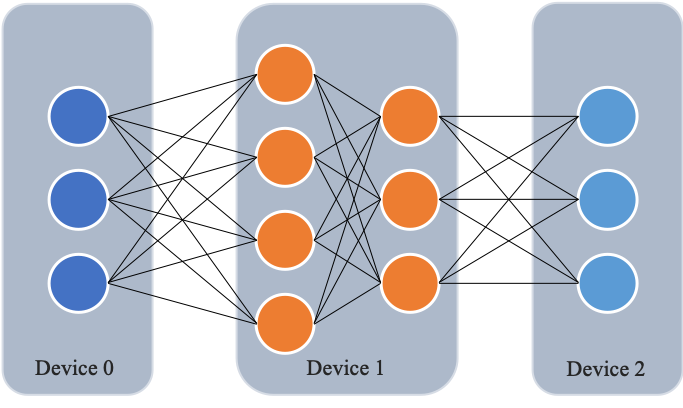
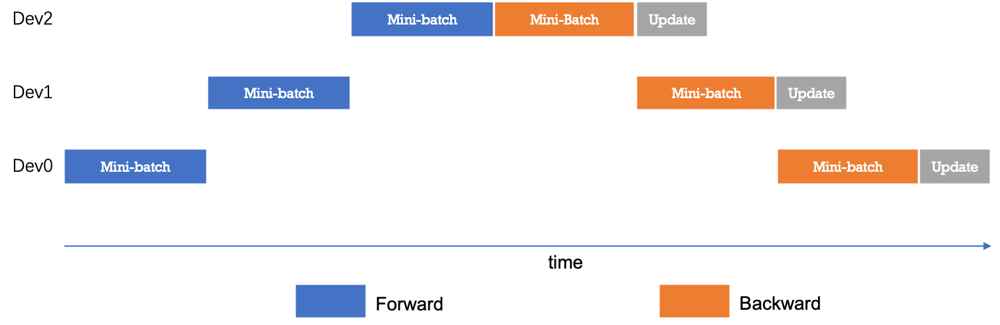
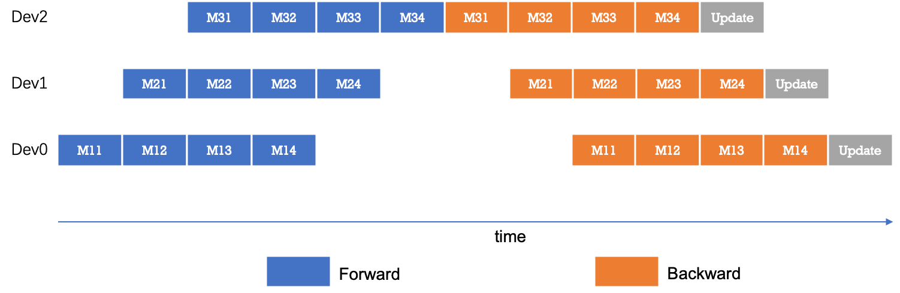
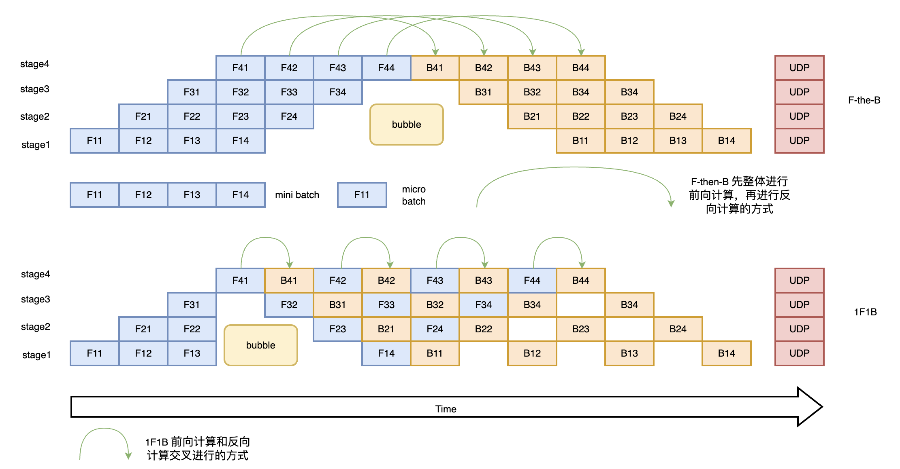

..  _pipeline_parallel:

流水线并行
=======================

通常来讲，训练更大规模的网络模型可以在多种任务上取得更好的效果，如提升图像分类任务的准确率。然而，随着参数规模的扩大，AI 加速卡存储（如 GPU 显存）容量问题和卡的协同计算问题成为了训练超大模型的瓶颈。流水线并行从模型切分和调度执行两个角度解决了这些问题，下面将以飞桨流水线并行为例，介绍下基本原理和使用方法。

一、原理介绍
-------------------

与数据并行不同，流水线并行将模型的不同层放置到不同的计算设备，降低单个计算设备的显存消耗，从而实现超大规模模型训练。以上图为例，示例模型包含四个模型层。该模型被切分为三个部分，并分别放置到三个不同的计算设备。即，第 1 层放置到设备 0，第 2 层和第三 3 层放置到设备 1，第 4 层放置到设备 2。相邻设备间通过通信链路传输数据。具体地讲，前向计算过程中，输入数据首先在设备 0 上通过第 1 层的计算得到中间结果，并将中间结果传输到设备 1，然后在设备 1 上计算得到第 2 层和第 3 层的输出，并将模型第 3 层的输出结果传输到设备 2，在设备 2 上经由最后一层的计算得到前向计算结果。反向传播过程类似。最后，各个设备上的网络层会使用反向传播过程计算得到的梯度更新参数。由于各个设备间传输的仅是相邻设备间的输出张量，而不是梯度信息，因此通信量较小。

下图给出流水线并行的时序图。最简配置流水线并行模型下，任意时刻只有单个计算设备处于计算状态，其它计算设备则处于空闲状态，因此设备利用率和计算效率较差。

为了优化流水线并行中设备的计算效率，可以进一步将 mini-batch 切分成若干更小粒度的 micro-batch，以提升流水线并行的并发度，进而达到提升设备利用率和计算效率的目的。如下图所示，一个 mini-batch 被切分为 4 个 micro-batch；前向阶段，每个设备依次计算单个 micro-batch 的结果；从而增加了设备间的并发度，降低了流水线并行 bubble 空间比例，提高了计算效率。

如上图所示先进行前向计算，再进行反向计算，这种方式我们称之为 F-the-B 模式。不难看出这种 F-then-B 模式由于缓存了多个 micro-batch 的中间变量和梯度，显存的实际利用率并不高。接下来我们介绍一种前向计算和反向计算交叉进行的方式，即 1F1B 模型。在 1F1B 模式下，前向计算和反向计算交叉进行，可以及时释放不必要的中间变量。我们以下图 1F1B 中 stage4 的 F42（stage4 的第 2 个 micro-batch 的前向计算）为例，F42 在计算前，F41 的反向 B41（stage4 的第 1 个 micro-batch 的反向计算）已经计算结束，即可释放 F41 的中间变量，从而 F42 可以复用 F41 中间变量的显存。1F1B 方式相比 F-then-B 方式峰值显存可以节省 37.5%，对比朴素流水线并行峰值显存明显下降，设备资源利用率显著提升。

二、功能效果
-------------------------

使用流水线并行，可以实现超大规模模型训练。例如，使用多个计算设备，可以实现单个计算设备显存无法容纳的模型训练。

三、动态图使用方法
------------------------

流水线并行根据执行的策略，可以分为 F-then-B 和 1F1B 两种模式，目前 Paddle 动态图流水线只支持 1F1B 模式。

下面代码在 Paddle2.0 以上可以运行，建议将 Paddle 版本升级到最新版

首先导入需要的包

.. code-block:: python

  import numpy as np
  import os
  import paddle
  from paddle.distributed import fleet
  from paddle.fluid.dygraph.container import Sequential
  import paddle.nn as nn
  from paddle.fluid.dygraph.layers import Layer
  from paddle.distributed.fleet.meta_parallel import LayerDesc, PipelineLayer
  import paddle.nn.functional as F
  import paddle.distributed as dist
  import random
  from paddle.io import Dataset, BatchSampler, DataLoader

创建数据集

.. code-block:: python
    BATCH_NUM = 20
    BATCH_SIZE = 16
    EPOCH_NUM = 4

    IMAGE_SIZE = 784
    CLASS_NUM = 10
    MICRO_BATCH_SIZE = 2

    class RandomDataset(Dataset):
        def __init__(self, num_samples):
            self.num_samples = num_samples

        def __getitem__(self, idx):
            image = np.random.random([1, 28, 28]).astype('float32')
            label = np.random.randint(0, CLASS_NUM - 1, (1, )).astype('int64')
            return image, label

        def __len__(self):
            return self.num_samples

    dataset = RandomDataset(BATCH_NUM * BATCH_SIZE)
    train_reader = DataLoader(dataset,
                    batch_size=BATCH_SIZE,
                    shuffle=True,
                    drop_last=True,
                    num_workers=2)

构建一个可以运行流水线的模型，模型的 layer 需要被 LayerDesc 或者继承了 LayerDesc 的 SharedLayerDesc 包裹，这里因为不需要共享参数，所以就使用 LayerDesc

.. code-block:: python
    class ReshapeHelp(Layer):
        def __init__(self, shape):
            super().__init__()
            self.shape = shape

        def forward(self, x):
            return x.reshape(shape=self.shape)

    class AlexNetPipeDesc(PipelineLayer):
        def __init__(self, num_classes=CLASS_NUM, **kwargs):
            self.num_classes = num_classes
            decs = [
                LayerDesc(
                    nn.Conv2D, 1, 64, kernel_size=11, stride=4, padding=5),
                LayerDesc(nn.ReLU),
                LayerDesc(
                    nn.MaxPool2D, kernel_size=2, stride=2),
                LayerDesc(
                    nn.Conv2D, 64, 192, kernel_size=5, padding=2),
                F.relu,
                LayerDesc(
                    nn.MaxPool2D, kernel_size=2, stride=2),
                LayerDesc(
                    nn.Conv2D, 192, 384, kernel_size=3, padding=1),
                F.relu,
                LayerDesc(
                    nn.Conv2D, 384, 256, kernel_size=3, padding=1),
                F.relu,
                LayerDesc(
                    nn.Conv2D, 256, 256, kernel_size=3, padding=1),
                F.relu,
                LayerDesc(
                    nn.MaxPool2D, kernel_size=2, stride=2),
                LayerDesc(
                    ReshapeHelp, shape=[-1, 256]),
                LayerDesc(nn.Linear, 256, self.num_classes),  # classifier
            ]
            super().__init__(
                layers=decs, loss_fn=nn.CrossEntropyLoss(), **kwargs)

然后初始化分布式环境，这一步主要是构建流水线通信组的拓扑

.. code-block:: python

    strategy = fleet.DistributedStrategy()
    model_parallel_size = 1
    data_parallel_size = 1
    pipeline_parallel_size = 2
    strategy.hybrid_configs = {
        "dp_degree": data_parallel_size,
        "mp_degree": model_parallel_size,
        "pp_degree": pipeline_parallel_size
    }
    strategy.pipeline_configs = {
        "accumulate_steps": BATCH_SIZE // MICRO_BATCH_SIZE,
        "micro_batch_size": MICRO_BATCH_SIZE
    }

    fleet.init(is_collective=True, strategy=strategy)

为了保证流水线并行参数初始化和普通模型初始化一致，需要在不同卡间设置不同的 seed。

.. code-block:: python

    def set_random_seed(seed, dp_id, rank_id):
        random.seed(seed)
        np.random.seed(seed + dp_id)
        paddle.seed(seed + dp_id + rank_id)
        print("seed: ", seed)
        print("rank_id: ", rank_id)
        print("dp_id: ", dp_id)

    hcg = fleet.get_hybrid_communicate_group()
    world_size = hcg.get_model_parallel_world_size()
    dp_id = hcg.get_data_parallel_rank()
    pp_id = hcg.get_stage_id()
    rank_id = dist.get_rank()
    set_random_seed(1024, dp_id, rank_id)

然后创建出流水线并行的模型，

AlexNetPipeDesc(....)：这一步主要是在切分普通模型的 layer，将属于当前卡的 layer 添加到模型里面

fleet.distributed_model(....)：这一步则是真正进行流水线模型并行的初始化，会得到之前构建拓扑组已经组建好的流水线通信组，并且如果流水线并行混合了数据并行，模型并行，会对数据并行和模型并行相关参数进行 broadcast

fleet.distributed_optimizer(...)：这一步则是为优化器添加分布式属性，如果流水线并行混合了数据并行，group_sharded，就会对相应梯度进行 all reduce

.. code-block:: python

    class ReshapeHelp(Layer):
        def __init__(self, shape):
            super().__init__()
            self.shape = shape

        def forward(self, x):
            return x.reshape(shape=self.shape)

    class AlexNetPipeDesc(PipelineLayer):
        def __init__(self, num_classes=10, **kwargs):
            self.num_classes = num_classes
            decs = [
                LayerDesc(
                    nn.Conv2D, 1, 64, kernel_size=11, stride=4, padding=5),
                LayerDesc(nn.ReLU),
                LayerDesc(
                    nn.MaxPool2D, kernel_size=2, stride=2),
                LayerDesc(
                    nn.Conv2D, 64, 192, kernel_size=5, padding=2),
                F.relu,
                LayerDesc(
                    nn.MaxPool2D, kernel_size=2, stride=2),
                LayerDesc(
                    nn.Conv2D, 192, 384, kernel_size=3, padding=1),
                F.relu,
                LayerDesc(
                    nn.Conv2D, 384, 256, kernel_size=3, padding=1),
                F.relu,
                LayerDesc(
                    nn.Conv2D, 256, 256, kernel_size=3, padding=1),
                F.relu,
                LayerDesc(
                    nn.MaxPool2D, kernel_size=2, stride=2),
                LayerDesc(
                    ReshapeHelp, shape=[-1, 256]),
                LayerDesc(nn.Linear, 256, self.num_classes),  # classifier
            ]
            super().__init__(
                layers=decs, loss_fn=nn.CrossEntropyLoss(), **kwargs)

    model = AlexNetPipeDesc(num_stages=pipeline_parallel_size, topology=hcg._topo)
    scheduler = paddle.optimizer.lr.PiecewiseDecay(
            boundaries=[2], values=[0.001, 0.002], verbose=False
    )
    optimizer = paddle.optimizer.SGD(learning_rate=scheduler,
                                    parameters=model.parameters())
    model = fleet.distributed_model(model)
    optimizer = fleet.distributed_optimizer(optimizer)

开始训练

model.train_batch(...)：这一步主要就是执行 1F1B 的流水线并行方式

.. code-block:: python

    for i, (image, label) in enumerate(train_reader()):
        if i >= 5:
            break
        loss = model.train_batch([image, label], optimizer, scheduler)
        print("pp_loss: ", loss.numpy())

运行方式（需要保证当前机器有两张 GPU）：

.. code-block:: bash

  export CUDA_VISIBLE_DEVICES=0,1
  python -m paddle.distributed.launch alexnet_dygraph_pipeline.py # alexnet_dygraph_pipeline.py 是用户运行动态图流水线的 python 文件

基于 AlexNet 的完整的流水线并行动态图代码：`alex <https://github.com/PaddlePaddle/PaddleFleetX/tree/old_develop/examples/pipeline>`_。

控制台输出信息如下：

.. code-block:: bash

    LAUNCH INFO 2022-05-31 02:47:23,595 -----------  Configuration  ----------------------
    LAUNCH INFO 2022-05-31 02:47:23,596 devices: None
    LAUNCH INFO 2022-05-31 02:47:23,596 elastic_level: -1
    LAUNCH INFO 2022-05-31 02:47:23,596 elastic_timeout: 30
    LAUNCH INFO 2022-05-31 02:47:23,596 gloo_port: 6767
    LAUNCH INFO 2022-05-31 02:47:23,596 host: None
    LAUNCH INFO 2022-05-31 02:47:23,596 job_id: default
    LAUNCH INFO 2022-05-31 02:47:23,596 legacy: False
    LAUNCH INFO 2022-05-31 02:47:23,596 log_dir: log
    LAUNCH INFO 2022-05-31 02:47:23,596 log_level: INFO
    LAUNCH INFO 2022-05-31 02:47:23,596 master: None
    LAUNCH INFO 2022-05-31 02:47:23,596 max_restart: 3
    LAUNCH INFO 2022-05-31 02:47:23,596 nnodes: 1
    LAUNCH INFO 2022-05-31 02:47:23,596 nproc_per_node: None
    LAUNCH INFO 2022-05-31 02:47:23,596 rank: -1
    LAUNCH INFO 2022-05-31 02:47:23,596 run_mode: collective
    LAUNCH INFO 2022-05-31 02:47:23,596 server_num: None
    LAUNCH INFO 2022-05-31 02:47:23,596 servers:
    LAUNCH INFO 2022-05-31 02:47:23,596 trainer_num: None
    LAUNCH INFO 2022-05-31 02:47:23,596 trainers:
    LAUNCH INFO 2022-05-31 02:47:23,596 training_script: pp.py
    LAUNCH INFO 2022-05-31 02:47:23,596 training_script_args: []
    LAUNCH INFO 2022-05-31 02:47:23,596 with_gloo: 1
    LAUNCH INFO 2022-05-31 02:47:23,596 --------------------------------------------------
    LAUNCH INFO 2022-05-31 02:47:23,597 Job: default, mode collective, replicas 1[1:1], elastic False
    LAUNCH INFO 2022-05-31 02:47:23,605 Run Pod: ldmpbt, replicas 2, status ready
    LAUNCH INFO 2022-05-31 02:47:23,629 Watching Pod: ldmpbt, replicas 2, status running

日志信息位于 log 目录下:

.. code-block:: bash

    pp_loss:  [2.3267765]
    pp_loss:  [2.3299088]
    pp_loss:  [2.2849925]
    pp_loss:  [2.2974687]
    pp_loss:  [2.3173313]
