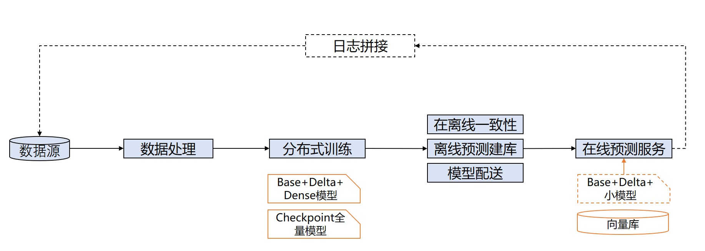
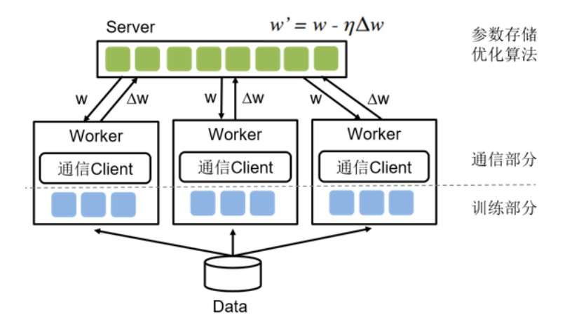
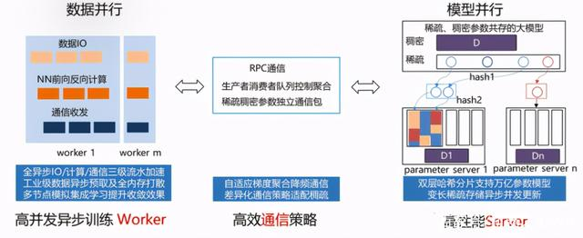
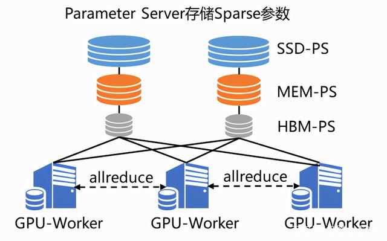
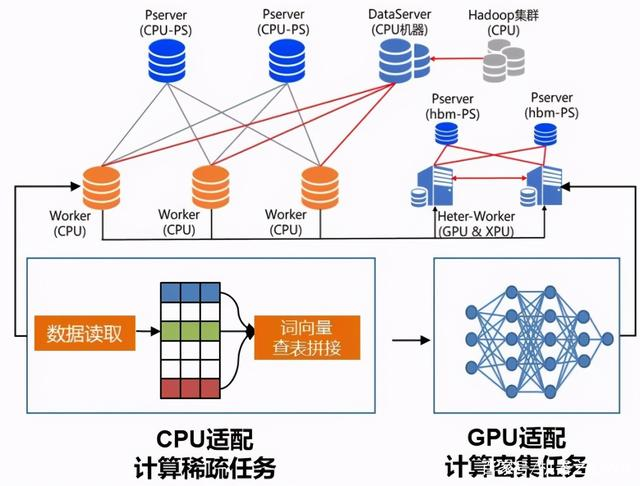
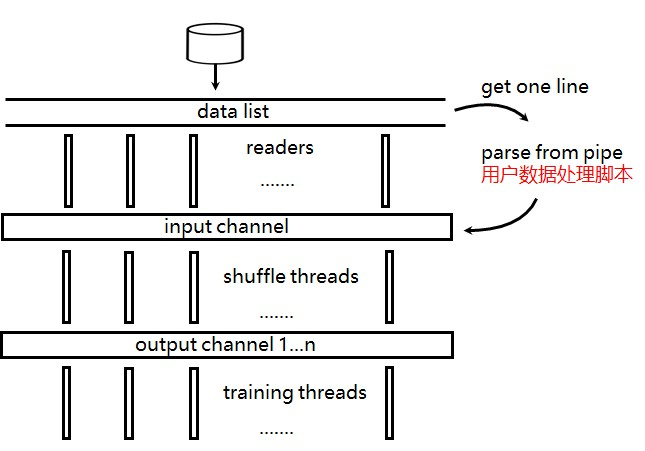

..  _cluster_overview_ps:

参数服务器概述
-------------------------
搜索推荐场景下的模型训练，经常面临数据量大、特征维度高且稀疏化、实时性高等问题。以千亿特征规模点击率预估模型、万亿边图模型为例，它们相比视觉、自然语言处理模型有以下特点：

搜索推荐线上服务预测样本的数据分布会随时间产生变化，如果使用固定数据集训练模型，在数据分布变化的情况下，模型不能很好的匹配线上数据，其效果会明显降低。为提升模型准确性，需要将线上服务产生的数据流式地加入到训练过程中去，让模型不断拟合最近的线上数据。

一个典型的推荐场景点击率预估模型的训练、推理全流程示意图如下：

图 1 点击率预估模型的训练、推理全流程

图中的分布式训练方式称为流式训练（也称在线学习），即模型训练数据集并非固定，而是随时间流式地加入到训练过程中，实时更新模型并配送到线上推理服务中，因此对训练时间和模型保存、配送时间有严格要求。

除此之外，该场景下的模型训练还有以下两个特点：

1. 稀疏参数量大：模型特征中包含大量的 id 类特征（例如 userid、itemid），这些 id 类特征会对应大量的 embedding（称为稀疏参数），通常参数量在百亿级别及以上，且随训练过程不断增加。
2. 训练数据量大：线上服务会源源不断产生训练数据进入分布式训练中，训练数据量级巨大，单机训练速度过慢。

参数服务器是解决该类问题普遍采用的分布式编程架构，其采用了一种将模型参数中心化管理的方式来实现模型参数的分布式存储和更新。

传统参数服务器模式下的节点/进程有两种不同的角色：

1. 训练节点（Trainer/Worker）：负责训练，完成数据读取、从服务节点拉取参数、前向计算、反向梯度计算等过程，并将计算出的梯度上传至服务节点。
2. 服务节点（Server）：负责模型参数的集中式存储和更新，从各个 Worker 收集汇总梯度并更新参数，供训练节点拉取进行下一轮的训练。

因此对于存储超大规模模型参数的训练场景十分友好，常被用于训练拥有海量稀疏参数的搜索推荐领域模型。

图 2 经典参数服务器架构

飞桨为了应对各种严苛的实际业务挑战，早在 2018 年，飞桨的纯 CPU 参数服务器模式就可以支持万亿规模稀疏参数的模型训练。之后随着模型中网络结构更加复杂，以及对训练效率和性价比的进一步追求，飞桨参数服务器技术也在更新换代：从早期 Worker 节点的硬件型号必须一致的纯 CPU 参数服务器到纯 GPU 参数服务器、纯 XPU 参数服务器，再到 CPU、GPU、XPU 等其它 AI 硬件混布调度训练的异构参数服务器，始终引领参数服务器技术的发展；同时也得到了更多的应用落地，如视频推荐、搜索推荐等等。

1 纯 CPU 参数服务器
^^^^^^^^^^^^^^^^^^^^^^^^^^^^^^
纯 CPU 参数服务器，由高性能异步训练 Worker、高效通信策略和高性能 Server 组成。

其中 Worker 侧为数据并行，每个 worker 独立进行样本读取、参数拉取、前向后向计算和梯度回传；

Server 端为模型并行，采用双层哈希实现了大规模参数的存储和更新。为了进一步降低成本，飞桨还支持 SSD 和 AEP 等硬件进行参数存储，即 AEP+内存或者 SSD+内存两级存储；

在通信策略上，使用了消息队列控制梯度的聚合，实现了自适应梯度聚合以降频通信；

同时，IO，计算和通信之间采用三级流水加速。

在异步训练模式下训练简单模型可以极大提升数据吞吐量，整体训练速度非常出色。

图 3 纯 CPU 参数服务器

2 纯 GPU 参数服务器
^^^^^^^^^^^^^^^^^^^^^^^^^^^^^^

随着模型网络越来越复杂，对算力要求越来越高，在数据量不变的情况下，CPU 计算性能差的弱势就会显现，虽然可以通过增加 CPU 机器数量来解决，甚至可以增加上百台，但是这种方法不仅成本大幅提高，而且集群的稳定性和扩展性也存在较大的问题。因此飞桨引入了纯 GPU 参数服务器来提升计算性能，之前 100 台 CPU 机器才能训练的模型，仅需 1 台多卡 GPU 机器即可完成训练。当然，同时也要解决因为硬件更替所带来的问题。

GPU 强大的算力毋庸置疑可以提升集群的计算性能，但随之而来的是，不仅模型规模会受到机器显存和内存的制约，而且通信带宽也会由于集群网卡数量降低而成为瓶颈。为了解决这两个问题，飞桨引入了两大亮点技术 SSD-MEM-HBM 三级存储和 RPC&NCCL 混合通信，形成了飞桨特有的纯 GPU 参数服务器（GPUPS）

SSD-MEM-HBM 三级存储允许全量参数使用 SSD 硬盘存储，高频参数存储于内存，当前 Batch 训练所用参数使用显存，并且同时支持 SSD 的参数在硬盘、内存、显存之间快速拷贝。这样通过异步流水线执行机制，隐蔽了 IO 带来的额外性能开销，在保证训练速度的同时，使训练的模型大小不再受制于显存和内存，极大提升模型的规模。

RPC&NCCL 混合通信可以将部分稀疏参数采用 RPC 协议跨节点通信，其余参数采用卡间 NCCL 方式完成通信，充分利用带宽资源。

图 4 纯 GPU 参数服务器

3 异构参数服务器
^^^^^^^^^^^^^^^^^^^^^^^^^^^^^^
在纯 GPU 的参数服务器下，所有的训练都在 GPU 中，当模型中部分网络层比较复杂的时候，GPU 利用率很难被打满，而 GPU 机器中 CPU 与 GPU 的硬件配比是固定的，无法灵活调整。针对这种情况，有两种解决方案：

1. 定制化 GPU 机型，调整机器内 CPU 与 GPU 的硬件配比。
2. 混布 CPU 和 GPU 机器节点，来调整机器间的硬件配比。

基于这两种解决方案，飞桨框架 2.0 版本创新性地推出了通用异构参数服务器功能(HeterPS)。一举解除了传统参数服务器模式下，Worker 节点必须严格使用同一种硬件型号的枷锁，使训练任务对硬件型号不敏感，即可以同时使用不同的硬件混合异构训练，如 CPU、AI 专用芯片（如百度昆仑 XPU）以及不同型号的 GPU 如 v100、P40、K40 等。同时还可以解决大规模稀疏特征模型训练场景下 IO 占比过高导致的芯片资源利用率过低的问题。通过异构参数服务器训练模式，用户可以在硬件异构集群中部署分布式训练任务，例如云服务器集群，高效利用不同算力芯片，为用户提供更高吞吐、更低资源消耗的训练能力。

图 5 异构参数服务器

4 使用方法
^^^^^^^^^^^^^^^^^^^^^^^^^^^^^^

本节会介绍参数服务器的简单使用示例，包含数据加载、分布式训练及预测、分布式指标计算、模型存储和加载等部分。

首先使用参数服务器的一个简单的代码示例如下：

.. code-block:: python

    import paddle
    # 导入分布式训练需要的依赖 fleet
    import paddle.distributed.fleet as fleet
    # 导入模型
    from model import WideDeepModel

    # 参数服务器目前只支持静态图，需要使用 enable_static()
    paddle.enable_static()

    # 加载模型并构造优化器
    model = WideDeepModel()
    model.net(is_train=True)
    optimizer = paddle.optimizer.SGD(learning_rate=0.0001)

    # 初始化 fleet
    fleet.init(is_collective=False)
    # 设置分布式策略（异步更新方式）
    strategy = fleet.DistributedStrategy()
    strategy.a_sync = True

    # 构造分布式优化器
    optimizer = fleet.distributed_optimizer(optimizer, strategy)
    optimizer.minimize(model.cost)

    if fleet.is_server():
        # 初始化服务节点
        fleet.init_server()
        # 启动服务节点，即可接收来自训练节点的请求
        fleet.run_server()

    if fleet.is_worker():
        # 训练节点的具体训练过程
        ...
        # 训练结束终止训练节点
        fleet.stop_worker()

其中示例代码中省略的，训练节点的一个完整的训练过程应该包含以下几个部分：

    1. 获取之前训练已经保存好的模型，并加载模型（如果之前没有保存模型，则跳过加载模型这一步）。
    2. 分 Pass 训练，在每一个 Pass 的训练过程中，分为如下几步：
      a. 加载数据。
      b. 分布式训练并获取训练指标（AUC 等）。
      c. 分布式预测：主要用于召回模块的离线建库部分。
    3. 保存模型：
      a. Checkpoint Model：用于下次训练开始时的模型加载部分。
      b. Inference Model：用于线上推理部署。

完整训练示例代码请参考：\ `CPUPS 示例 <https://>`_\、\ `GPUPS 示例 <https://>`_\，本节只介绍飞桨参数服务器在训练过程中需要使用到的与单机不同的 API。

4.1 大规模稀疏参数
""""""""""""

为存储海量的稀疏参数，参数服务器使用 ``paddle.static.nn.sparse_embedding()`` 取代 ``paddle.static.nn.embedding()`` 作为 embedding lookup 层的算子。

``paddle.static.nn.sparse_embedding()`` 采用稀疏模式进行梯度的计算和更新，输入接受[0, UINT64]范围内的特征 ID，支持稀疏参数各种高阶配置（特征准入、退场等），更加符合流式训练的功能需求。

.. code-block:: python

    import paddle

    # sparse_embedding 输入接受[0, UINT64]范围内的特征 ID，参数 size 的第一维词表大小无用，可指定任意整数
    # 大规模稀疏场景下，参数规模初始为 0，会随着训练的进行逐步扩展
    sparse_feature_num = 10
    embedding_size = 64

    input = paddle.static.data(name='ins', shape=[1], dtype='int64')

    emb = paddle.static.nn.sparse_embedding((
        input=input,
        size=[sparse_feature_num, embedding_size],
        param_attr=paddle.ParamAttr(name="SparseFeatFactors",
        initializer=paddle.nn.initializer.Uniform()))

4.2 数据加载
""""""""""""

由于搜索推荐场景涉及到的训练数据通常较大，为提升训练中的数据读取效率，参数服务器采用 Dataset 进行高性能的 IO。

Dataset 是为多线程及全异步方式量身打造的数据读取方式，每个数据读取线程会与一个训练线程耦合，形成了多生产者-多消费者的模式，会极大的加速模型训练过程。

Dataset 有两种不同的类型：

1. QueueDataset：随训练流式读取数据。
2. InmemoryDataset：训练数据全部读入训练节点内存，然后分配至各个训练线程，支持全局秒级打散数据（global_shuffle）。

.. code-block:: python

    dataset = paddle.distributed.QueueDataset()
    thread_num = 1

    # use_var 指定网络中的输入数据，pipe_command 指定数据处理脚本
    # 要求 use_var 中输入数据的顺序与数据处理脚本输出的特征顺序一一对应
    dataset.init(use_var=model.inputs,
                 pipe_command="python reader.py",
                 batch_size=batch_size,
                 thread_num=thread_num)

    train_files_list = [os.path.join(train_data_path, x)
                        for x in os.listdir(train_data_path)]

    # set_filelist 指定 dataset 读取的训练文件的列表
    dataset.set_filelist(train_files_list)

更多 dataset 用法参见\ `使用 InMemoryDataset/QueueDataset 进行训练 <https://fleet-x.readthedocs.io/en/latest/paddle_fleet_rst/parameter_server/performance/dataset.html>`_\。

4.3 分布式训练及预测
""""""""""""

与数据加载 dataset 相对应的，使用 ``exe.train_from_dataset()`` 接口进行分布式训练。

.. code-block:: python

    exe.train_from_dataset(paddle.static.default_main_program(),
                          dataset,
                          paddle.static.global_scope(),
                          debug=False,
                          fetch_list=[model.cost],
                          fetch_info=["loss"],
                          print_period=1)

分布式预测使用 ``exe.infer_from_dataset()`` 接口，与分布式训练的区别是，预测阶段训练节点不向服务节点发送梯度。

.. code-block:: python

    exe.infer_from_dataset(paddle.static.default_main_program(),
                          dataset,
                          paddle.static.global_scope(),
                          debug=False,
                          fetch_list=[model.cost],
                          fetch_info=["loss"],
                          print_period=1)

4.4 分布式指标计算
""""""""""""

分布式指标是指在分布式训练任务中用以评测模型效果的指标。
由于参数服务器存在多个训练节点，传统的指标计算只能评测当前节点的数据，而分布式指标需要汇总所有节点的全量数据，进行全局指标计算。

分布式指标计算的接口位于 ``paddle.distributed.fleet.metrics`` ，其中封装了包括 AUC、Accuracy、MSE 等常见指标计算。

以 AUC 指标为例，全局 AUC 指标计算示例如下：

.. code-block:: python

    # 组网阶段，AUC 算子在计算 auc 指标同时，返回正负样例中间统计结果（stat_pos, stat_neg）
    auc, batch_auc, [batch_stat_pos, batch_stat_neg, stat_pos, stat_neg] = \
        paddle.static.auc(input=pred, label=label)

    # 利用 AUC 算子返回的中间计算结果，以及 fleet 提供的分布式指标计算接口，完成全局 AUC 计算。
    global_auc = fleet.metrics.auc(stat_pos, stat_neg)

更多分布式指标用法参见\ `分布式指标计算 <https://fleet-x.readthedocs.io/en/latest/paddle_fleet_rst/parameter_server/ps_distributed_metrics.html>`_\。

4.5 模型保存与加载
""""""""""""

参数服务器的模型一般分为两种类型：

1. 明文模型（checkpoint model）：主要用于增量训练，由服务节点以明文形式保存模型全量的稀疏参数和稠密参数以及优化器状态。
2. 推理模型（inference model）：主要用于线上推理部署，其中稠密参数由某个训练节点（一般是 0 号训练节点）以二进制方式保存，稀疏参数由服务节点以明文形式保存，为节省线上推理所需的存储空间，inference model 中的稀疏参数可能并非全量，有一定的过滤逻辑。

.. code-block:: python

    exe = paddle.static.Executor(paddle.CPUPlace())
    dirname = "/you/path/to/model"

    # 保存 checkpoint model
    fleet.save_persistables(exe, dirname)

    # 保存 inference model
    # feed_var_names 和 target_vars 用于指定需要裁剪网络的输入和输出
    fleet.save_inference_model(exe, dirname, feed_var_names, target_vars)

在 checkpoint model 保存成功之后，可以在训练开始时加载已经保存好的模型，用于之后的增量训练

.. code-block:: python

    dirname = "/you/path/to/model"

    # 加载 checkpoint model
    fleet.load_model(dirname)

5 进阶教程
^^^^^^^^^^^^^^^^^^^^^^^^^^^^^^

1. GPUPS 示例
2. HeterPS 示例
3. 稀疏参数配置（accessor）
4. 二次开发
