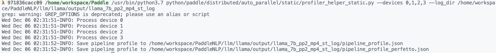
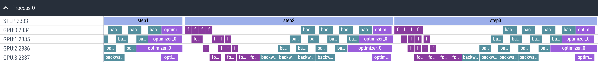
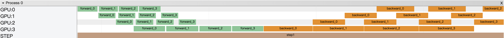
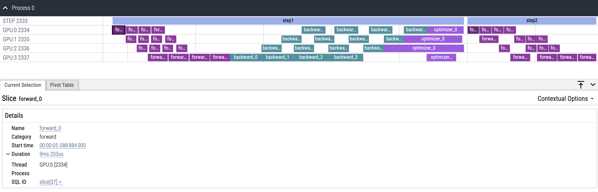

.. _visual_pipeline_parallel_static_mode:

静态图流水并行时序图可视化工具使用手册
=======================

飞桨框架提供了流水并行时序图可视化工具，可以对模型运行过程中流水并行子图的调度信息进行收集、统计和展示。

虽然在 GPU 设备上可以使用 Nsight 工具对模型进行性能分析和优化，但在分布式流水并行场景下 Nsight 工具存在以下不足：

1. 由于 GPU 程序的异步运行特性，在 CPU 端针对流水并行子图添加的 NVTX 标记无法直接与 GPU 端实际的算子执行区间相对应。在分析流水并行任务时，往往需要从一长串的 kernel 执行中人工找出每个流水子图的起始和终止算子，才能还原模型实际的流水并行情况。
2. 流水并行任务往往跨多个机器执行，完整的模型被切分成多个子图，分配给多台机器运行。nsight 工具只能单独对每台机器上的调度信息进行采集和展现，无法集中呈现多机之间流水并行的调度全貌。

新开发的可视化工具旨在填补这一空白，通过直接在 cuda 计算流上插入断点以精准统计 GPU 任务的运行区间。通过展示流水线并行的时序图，直观呈现了分布式训练中各个 GPU 设备上不同任务的运行区间。

本文主要介绍如何使用该工具可视化流水线并行时序图。

本工具使用分为两步，第一步为生成时序图数据，第二步为使用 python 脚本可视化时序图。接下来依次介绍

一、生成时序图数据
-------------------

1.1 导入 Guard 工具
^^^^^^^^^^^^^^^^^^^^^^^^^^^^^^

.. code-block:: python
    import paddle
    from paddle.profiler.utils import job_schedule_profiler_range

1.2 开启性能分析器，收集数据
^^^^^^^^^^^^^^^^^^^^^^^^^^^^^^

.. code-block:: python
    start_step = 0
    stop_step = 5

    for i in range(10):
        with job_schedule_profiler_range(i, 3, 6, True) as status:
            exe.run(program, status)

其中 ``job_schedule_profiler_range`` 函数的参数依次为：

- iter_id： 当前迭代的 id，用于区分不同的迭代
- start_step： 可视化工具的起始时间
- stop_step： 可视化工具的结束时间
- exit_after_prof： 是否在可视化工具结束后退出程序，默认为 True

开启性能分析器后，收集到的数据会存储在日志目录 ``log_dir`` 下，每个设备的数据会存储在 ``workerlog.0``, ``workerlog.1``, ``workerlog.2``, ... 中。

1.3 PaddleNLP 下开启性能分析器
^^^^^^^^^^^^^^^^^^^^^^^^^^^^^^

PaddleNLP 下，本工具将可视化功能集成到了命令行参数中，以下以 PaddleNLP 中 LLama 训练脚本为例进行说明。

PaddleNLP 中为了方便用户运行测试本模型，提供了处理好的 100k 条 doc 的训练样本：

.. code-block:: bash
    wget https://bj.bcebos.com/paddlenlp/models/transformers/llama/data/llama_openwebtext_100k_ids.npy
    wget https://bj.bcebos.com/paddlenlp/models/transformers/llama/data/llama_openwebtext_100k_idx.npz

将所有预处理得到的文件统一放入一个文件夹中，以备训练使用：

.. code-block:: bash
    mkdir data
    mv llama_openwebtext_100k_ids.npy ./data
    mv llama_openwebtext_100k_idx.npz ./data

使用下面脚本,即可在 llama-7b 的基础上收集模型性能数据：

.. code-block:: bash
    task_name="llama_7b_pp2_mp4_st"

    python -u  -m paddle.distributed.launch \
        --gpus "0,1,2,3" \
        --log_dir "output/$task_name""_log" \
        auto_parallel/run_pretrain_auto.py \
        --model_type "llama" \
        --model_name_or_path "meta-llama/Llama-2-7b" \
        --tokenizer_name_or_path "meta-llama/Llama-2-7b" \
        --input_dir "./data" \
        --output_dir "output/$task_name" \
        --split 949,50,1 \
        --max_seq_length 2048 \
        --per_device_train_batch_size 1 \
        --per_device_eval_batch_size 1 \
        --gradient_accumulation_steps 4 \
        --use_flash_attention 0 \
        --use_fused_rms_norm 0 \
        --fp16 0 \
        --fp16_opt_level "O2"  \
        --scale_loss 1024 \
        --pipeline_parallel_degree 4 \
        --tensor_parallel_degree 1 \
        --sharding_parallel_degree 1 \
        --sharding "stage1" \
        --learning_rate 0.0001 \
        --min_learning_rate 0.00001 \
        --max_steps 10 \
        --save_steps 5000 \
        --weight_decay 0.01 \
        --warmup_ratio 0.01 \
        --max_grad_norm 1.0 \
        --logging_steps 1\
        --dataloader_num_workers 1 \
        --sharding "" \
        --eval_steps 1000 \
        --report_to "visualdl" \
        --disable_tqdm true \
        --continue_training 0\
        --recompute 1 \
        --do_train \
        --do_eval 0 \
        --device "gpu" \
        --data_impl "mmap" \
        --parallel_mode "auto" \
        --job_schedule_profiler_start 0 \
        --job_schedule_profiler_end 5 \

其中，``--job_schedule_profiler_start 0`` 和 ``--job_schedule_profiler_end 5`` 用于调控可视化的时间跨度。

在程序执行完毕后，将在 ``log_dir`` 目录下生成每个设备的时序图数据，储存在 ``workerlog.0``、``workerlog.1``、``workerlog.2``、``workerlog.3`` 等文件中。

二、可视化时序图
-------------------

2.1 单机训练下的可视化
^^^^^^^^^^^^^^^^^^^^^^^^^^^^^^

在 Paddle 目录下有一个 ``python/paddle/distributed/auto_parallel/static/profiler_helper_static.py`` 脚本，用来可视化时序图。使用方法如下：

.. code-block:: bash
    python python/paddle/distributed/auto_parallel/static/profiler_helper_static.py --devices 0,1,2,3 --log_dir /home/workspace/PaddleNLP/llm/llama/output/llama_7b_pp2_mp4_st_log

其中 ``--devices`` 为需要可视化的设备，``--log_dir`` 为时序图数据所在的目录。

脚本会生成 ``Chrome tracing`` 格式的文件，可以使用 Chrome 浏览器打开，也可以使用
`perfetto <https://ui.perfetto.dev/>`__
打开 ``pipeline_profile_perfetto.json``。perfetto 提供了更好看的界面以及更流畅的体验，更推荐使用。

perfetto 可视化效果如下：

Chrome Tracing 可视化效果如下：

2.2 多机环境下的可视化
^^^^^^^^^^^^^^^^^^^^^^^^^^^^^^

由于多机环境下，每个设备的时序图数据会分别存储在不同的机器上，因此需要将时序图数据收集到一台机器上，再进行可视化。请用户在每台机器上运行训练命令，然后将每台机器上的时序图数据按照如下方式放在一台机器上：

.. code-block:: text
    multi_machine_logs
    ├── machine0
    │   ├── workerlog.0
    │   └── workerlog.1
    ├── machine1
    │   ├── workerlog.0
    │   └── workerlog.1

然后在任意一台机器上运行可视化脚本并指定 ``--log_dir`` 参数为 ``log_dir`` 目录以及开启 ``--multi_machine`` 参数即可。

.. code-block:: bash
    python python/paddle/distributed/auto_parallel/static/profiler_helper_static.py --devices 0,1 --log_dir /home/workspace/PaddleNLP/llm/llama/output/llama_7b_pp2_mp4_st_log/multi_machine_logs --multi_machine

三、统计信息和呈现
-------------------

上面已经介绍了如何使用可视化工具，本节将介绍可视化工具的统计信息和呈现。以 perfetto 为例，可视化效果如下：

目前 Timeline 提供以下特性：

- 查看不同设备上的任务运行时间区间。
- 所展示的事件名字上标注事件所持续的时间，点击具体的事件，可在下方的说明栏中看到更详细的事件信息。通过按键 w、s 可进行放大和缩小，通过 a、d 可进行左移和右移。
