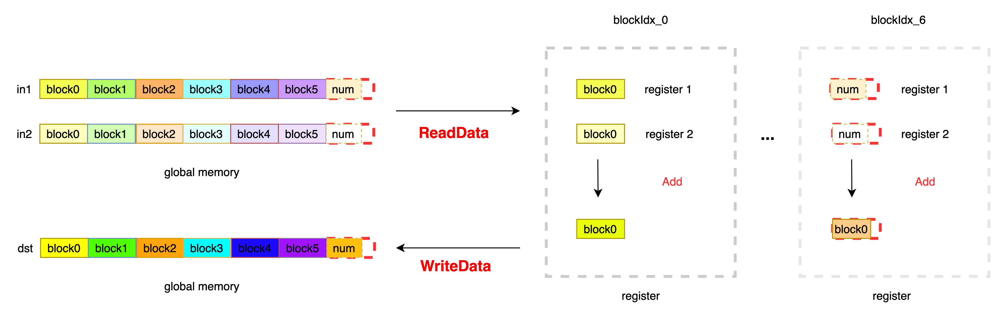

# 示例 - ElementwiseAdd
## 功能说明
+ 完成相同 Shape 的两数相加，输入为 InT 类型，输出为 OutT 类型，根据 OpFunc 完成对应的计算。

### OpFunc 定义

```
OpFunc: 用于定义当前数据的计算规则，AddFunctor 定义如下：

template <typename InT>
struct AddFunctor {
  HOSTDEVICE InT operator()(const InT &a, const InT &b) const { return (a + b); }
};

```
### Kernel 实现说明

每个线程连续读取 VecSize 个元素，根据剩余元素 num 与 VecSize * blockDim.x 的关系，将数据处理分为 2 部分，第一部分，当 VecSize * blockDim.x > num 表示当前数据处理需要进行边界处理，将 IsBoundary 设置为 true，避免访存越界; 第二部分，不需要进行边界处理，设置 IsBoundary = false。根据当前 block 的数据指针，将数据从全局内存中读取到寄存器中，完成加法操作后，将数据写入全局内存中。注意此处使用 Init 函数对寄存器 arg0，arg1 进行初始化，避免当 arg0 或者 arg1 作为分母时出现为 0 的情况。根据 OpFunc 完成两数求和操作，当需要进行两数相乘，可以直接修改对应的 Functor 即可，可以直接复用 Kernel 代码，提升开发效率。

数据处理过程如下：


### Kernel 代码

```
#include "kernel_primitives/kernel_primitives.h"
template<int VecSize, typename InT, typename OutT, typename OpFunc, bool IsBoundary>
__device__ void ElementwiseAddImpl(InT *in0, InT * in1, OutT * out, OpFunc func, int num) {

  InT arg0[VecSize];
  InT arg1[VecSize];
  OutT result[VecSize];

  // init arg0 and arg1
  Init<InT, VecSize>(arg0, static_cast<OutT>(1.0f));
  Init<InT, VecSize>(arg1, static_cast<OutT>(1.0f));

  // read data from global memory
  ReadData<InT, InT, VecSize, 1, 1, IsBoundary>(arg0, in0, num);
  ReadData<InT, InT, VecSize, 1, 1, IsBoundary>(arg1, in1, num);

  // compute resut[i] = args[i] + arg1[i]
  ElementwiseBinary<InT, OutT, VecSize, 1, 1, OpFunc>(result, arg0, arg1, func);

  // write data
  WriteData<OutT, VecSize, 1, 1, IsBoundary>(out, result, num);
}

template<int VecSize, typename InT, typename OutT>
__global__ void ElementwiseAdd(InT *in0, InT *in1, OutT *out, int size) {

  // get the data offset of this Block
  int data_offset = VecSize * blockIdx.x * blockDim.x;

  // get the stride offset the block
  int stride = gridDim.x * blockDim.x * VecSize;

  for (int offset = data_offset; offset < size; offset += stride) {
    if (offset + blockDim.x * VecSize < size) {  // set IsBoundary = false

      ElementwiseAddImpl<VecSize, InT, OutT, AddFunctor<InT, OutT>, false>(in0 + offset, in1 + offset, out + offset, AddFunctor<InT, OutT>(), size - offset);

    } else {  // left num is smaller than blockDim.x * VecSize, IsBoundary must be true

      ElementwiseAddImpl<VecSize, InT, OutT, AddFunctor<InT, OutT>, true>(in0 + offset, in1 + offset, out + offset, AddFunctor<InT, OutT>(), size - offset);

    }
  }
}

```
