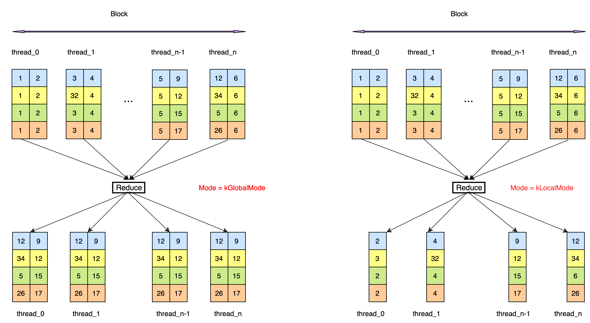

# API 介绍 - Compute
## [ElementwiseUnary](https://github.com/PaddlePaddle/Paddle/blob/develop/paddle/phi/kernels/primitive/compute_primitives.h#L176)
### 函数定义

```
template <typename InT, typename OutT, int NX, int NY, int BlockSize, class OpFunc>
__device__ void ElementwiseUnary(OutT* out, const InT* in, OpFunc compute)
```

### 函数说明

按照 OpFunc 中的计算规则对 in 进行计算，将计算结果按照 OutT 类型存储到寄存器 out 中。

### 模板参数

> InT ：输入数据的类型。</br>
> OutT ：存储到 out 寄存器中的类型。</br>
> NX ：每个线程需要计算 NX 列数据。</br>
> NY ：每个线程需要计算 NY 行数据。</br>
> BlockSize ：设备属性，标识当前设备线程索引方式。对于 GPU，threadIdx.x 用作线程索引，当前该参数暂不支持。</br>
> OpFunc ：计算规则，定义方式请参考 OpFunc 小节。</br>

### 函数参数

> out ：输出寄存器指针，大小为 NX * NY。</br>
> in ：输入寄存器指针，大小为 NX * NY。</br>
> compute ：计算函数，声明为 OpFunc&lt;InT, OutT&gt;()。</br>

## [ElementwiseBinary](https://github.com/PaddlePaddle/Paddle/blob/develop/paddle/phi/kernels/primitive/compute_primitives.h#L215)
### 函数定义

```
template <typename InT, typename OutT, int NX, int NY, int BlockSize, class OpFunc>
__device__ void ElementwiseBinary(OutT* out, const InT* in1, const InT* in2, OpFunc compute)
```

### 函数说明

按照 OpFunc 中的计算规则对 in1、in2 进行计算，将计算结果按照 OutT 类型存储到寄存器 out 中。

### 模板参数

> InT ：输入数据的类型。</br>
> OutT ：存储到 out 寄存器中的类型。</br>
> NX ：每个线程需要计算 NX 列数据。</br>
> NY ：每个线程需要计算 NY 行数据。</br>
> BlockSize ：设备属性，标识当前设备线程索引方式。对于 GPU，threadIdx.x 用作线程索引，当前该参数暂不支持。</br>
> OpFunc ：计算规则，定义方式请参考 OpFunc 小节。</br>

### 函数参数

> out ：输出寄存器指针，大小为 NX * NY。</br>
> in1 ：左操作数寄存器指针，大小为 NX * NY。</br>
> in2 ：右操作数寄存器指针，大小为 NX * NY。</br>
> compute ：声明为 OpFunc&lt;InT&gt;() 的计算对象。</br>

## [CycleBinary](https://github.com/PaddlePaddle/Paddle/blob/develop/paddle/phi/kernels/primitive/compute_primitives.h#L343)

### 函数定义

```
template <typename InT, typename OutT, int NX, int NY, int BlockSize, class OpFunc>
__device__ void CycleBinary(OutT* out, const InT* in1, const InT* in2, OpFunc compute)
```

### 函数说明

按照 OpFunc 中的计算规则对 in1、in2 进行计算，将计算结果按照 OutT 类型存储到寄存器 out 中。in1 的 Shape 为[1, NX]，in2 的 Shape 为 [NY, NX]，实现 in1，in2 的循环计算，out 的 Shape 是[NY, NX]。

### 模板参数

> InT ：输入数据的类型。</br>
> OutT ：存储到 out 寄存器中的类型。</br>
> NX ：每个线程需要计算 NX 列数据。</br>
> NY ：每个线程需要计算 NY 行数据。</br>
> BlockSize ：设备属性，标识当前设备线程索引方式。对于 GPU，threadIdx.x 用作线程索引，当前该参数暂不支持。</br>
> OpFunc ：计算规则，定义方式请参考 OpFunc 小节。</br>

### 函数参数

> out ：输出寄存器指针，大小为 NX * NY。</br>
> in1 ：左操作数寄存器指针，大小为 NX。</br>
> in2 ：右操作数寄存器指针，大小为 NX * NY。</br>
> compute ：声明为 OpFunc&lt;InT&gt;() 的计算对象。</br>

## [ElementwiseTernary](https://github.com/PaddlePaddle/Paddle/blob/develop/paddle/phi/kernels/primitive/compute_primitives.h#L256)

### 函数定义

```
template <typename InT, typename OutT, int NX, int NY, int BlockSize, class OpFunc>
 __device__ void ElementwiseTernary(OutT* out, const InT* in1, const InT* in2, const InT* in3, OpFunc compute)

```

### 函数说明

按照 OpFunc 中的计算规则对 in1、in2、in3 进行计算，将计算结果按照 OutT 类型存储到寄存器 out 中。

### 模板参数

> InT ：输入数据的类型。</br>
> OutT ：存储到 out 寄存器中的类型。</br>
> NX ：每个线程需要计算 NX 列数据。</br>
> NY ：每个线程需要计算 NY 行数据。</br>
> BlockSize ：设备属性，标识当前设备线程索引方式。对于 GPU，threadIdx.x 用作线程索引，当前该参数暂不支持。</br>
> OpFunc ：计算规则，定义方式请参考 OpFunc 小节。</br>

### 函数参数

> out ：输出寄存器指针，大小为 NX * NY。</br>
> in1 ：操作数 1 的寄存器指针，大小为 NX * NY。</br>
> in2 ：操作数 2 的寄存器指针，大小为 NX * NY。</br>
> in3 ：操作数 3 的寄存器指针，大小为 NX * NY。</br>
> compute ：声明为 OpFunc&lt;InT&gt;() 的计算对象。</br>

## [ElementwiseAny](https://github.com/PaddlePaddle/Paddle/blob/develop/paddle/phi/kernels/primitive/compute_primitives.h#L297)

### 函数定义

```
template <typename InT, typename OutT, int NX, int NY, int BlockSize, int Arity, class OpFunc>
__device__ void ElementwiseAny(OutT* out, InT (*ins)[NX * NY], OpFunc compute)
```

### 函数说明

按照 OpFunc 中的计算规则对 ins 中的输入进行计算，将计算结果按照 OutT 类型存储到寄存器 out 中，所有输入输出的维度相同。

### 模板参数

> InT ：输入数据的类型。</br>
> OutT ：存储到 out 寄存器中的类型。</br>
> NX ：每个线程需要计算 NX 列数据。</br>
> NY ：每个线程需要计算 NY 行数据。</br>
> BlockSize ：设备属性，标识当前设备线程索引方式。对于 GPU，threadIdx.x 用作线程索引，当前该参数暂不支持。</br>
> Arity ：指针数组 ins 中指针个数。</br>
> OpFunc ：计算规则，定义方式请参考 OpFunc 小节。</br>

### 函数参数

> out ：输出寄存器指针，大小为 NX * NY。</br>
> ins ：由多输入指针构成的指针数组，大小为 Arity。</br>
> compute ：声明为 OpFunc&lt;InT&gt;() 的计算对象。</br>

## [Reduce](https://github.com/PaddlePaddle/Paddle/blob/develop/paddle/phi/kernels/primitive/compute_primitives.h#L389)

### 函数定义

```
template <typename T, int NX, int NY, int BlockSize, class ReduceFunctor, details::ReduceMode Mode>
__device__ void Reduce(T* out, const T* in, ReduceFunctor reducer, bool reduce_last_dim)
```

### 函数说明

根据 reducer 对 in 中的数据进行数据规约，输入 in 的 Shape 为 [NY, NX]，当 Mode = kLocalMode 时，对 in 沿着 NX 方向进行规约，完成线程内规约，out 为[NY, 1]；当 Mode = kGlobalMode 时，使用共享内存完成 block 内线程间的规约操作，in 和 out 的 size 相同，均为[NY, NX]。</br>
ReduceMax 数据处理过程如下：</br>


### 模板参数

> T ：输入数据的类型。</br>
> NX ：每个线程需要计算 NX 列数据。</br>
> NY ：每个线程需要计算 NY 行数据。</br>
> BlockSize ：设备属性，标识当前设备线程索引方式。对于 GPU，threadIdx.x 用作线程索引，当前该参数暂不支持。</br>
> ReduceFunctor ：计算规则，定义方式请参考 OpFunc 小节。</br>
> Mode ：规约模式，可以取值为 kGlobalMode、kLocalMode。

### 函数参数

> out ：输出寄存器指针，大小为 NX * NY。</br>
> in ：输入寄存器指针，大小为 NX * NY。</br>
> reducer ：规约方式，可以使用 ReduceFunctor&lt;T&gt;() 进行定义。</br>
> reduce_last_dim ：表示原始输入的最后一维是否进行规约。</br>
