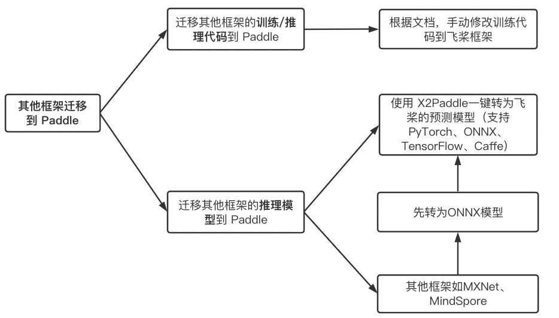

.. _cn_convert_guides:

##########
迁移指南
##########

你可以将其他深度学习框架的训练代码与模型迁移到飞桨最新版。整体思路如图所示：

.. centered:: 图1 其他框架代码/模型迁移到飞桨方案说明

如图所示，其他框架迁移到 Paddle，整体分为以下两部分：

* 迁移 **训练/推理代码** 到 Paddle： 你可以将基于其他框架的训练/推理代码迁移到 Paddle. 飞桨提供了飞桨API与其他框架的映射关系，
以及模型迁移指南，方便你快速的将其他模型迁移到飞桨。

* 迁移 **推理模型** 到 Paddle：你可以将基于其他框架的推理模型迁移到 Paddle. 如果是使用 PyTorch、TensorFlow、ONNX、Caffe 的推理模型，
可以直接使用 `X2Paddle <https://github.com/PaddlePaddle/X2Paddle>`_ ，一键转为飞桨的预测模型。如果是其他框架，比如 MXNet、 MindSpore 
等，可以先转为 ONNX 格式的模型，再使用 `X2Paddle <https://github.com/PaddlePaddle/X2Paddle>`_ 进行转换即可。

以下将详细的介绍迁移指南相关的内容：

- `Paddle & PyTorch API映射表 <./pytorch_api_mapping_cn.html>`_ : 说明 PyTorch 1.8 版本与 Paddle 2.0 API对应关系。
- `CV 模型迁移指南 <./ArticleReproduction_CV.html>`_ : 如何将其他框架的CV模型，迁移到 Paddle。

..  toctree::
    :hidden:

    pytorch_api_mapping_cn.rst
    ArticleReproduction_CV.md
