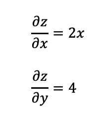
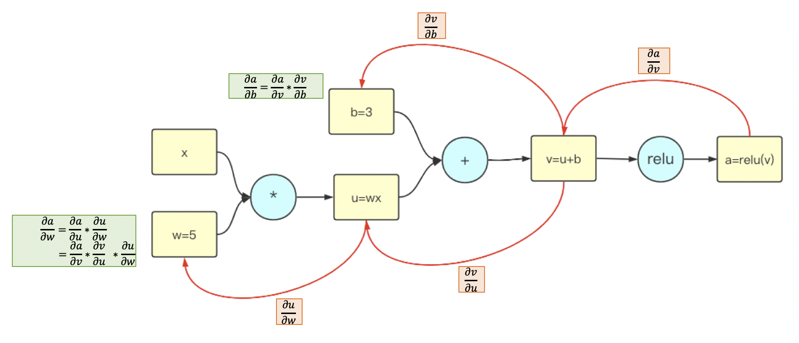
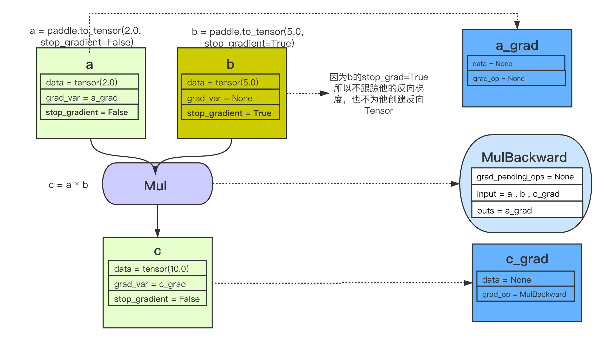
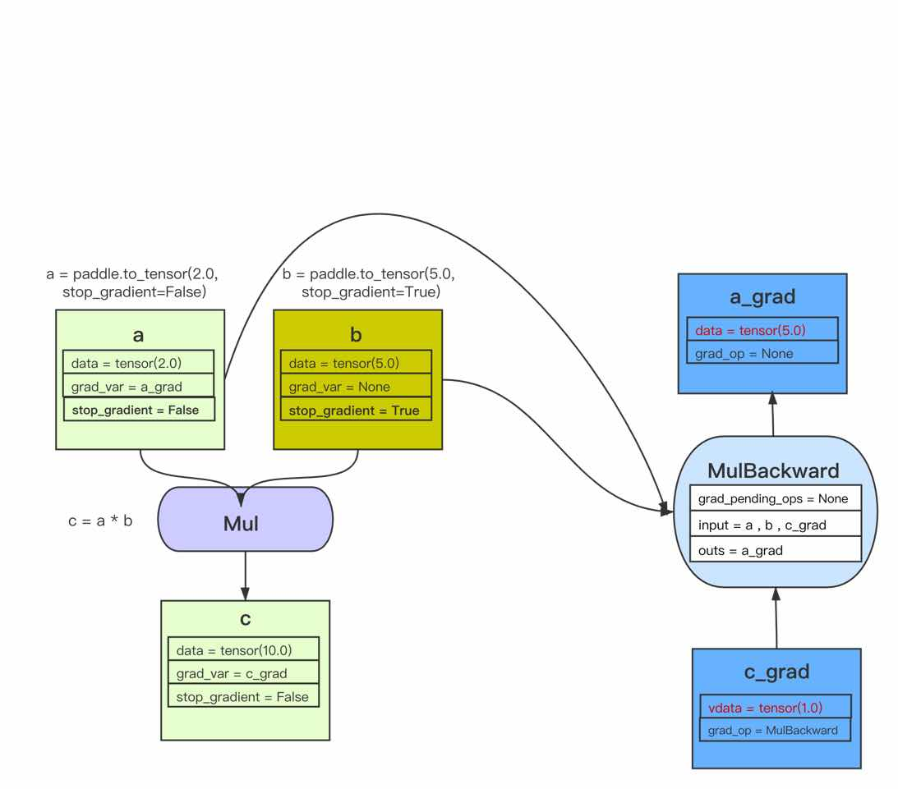
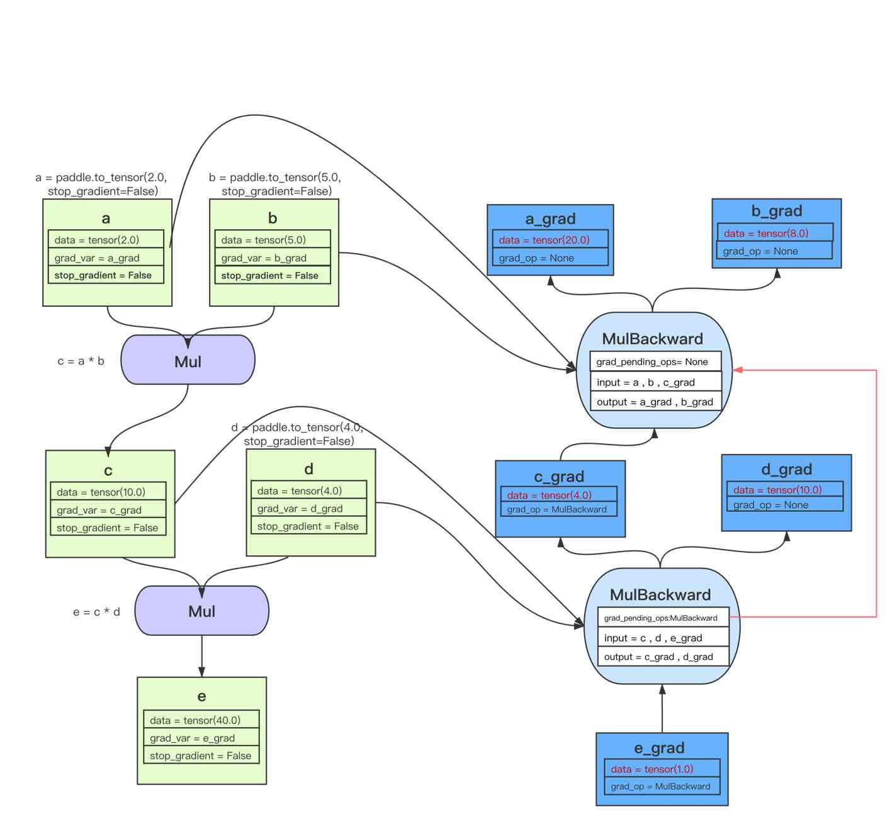

自动微分机制介绍
================

PaddlePaddle 的神经网络核心是自动微分，本篇文章主要为你介绍如何使用飞桨的自动微分，以及飞桨的自动微分机制，帮助你更好的使用飞桨进行训练。

一、背景
--------

神经网络是由节点和节点间的相互连接组成的。网络中每层的每个节点代表一种特定的函数，来对输入进行计算。每个函数都是由不同参数（权重\ ``w``\ 和偏置\ ``b``\ ）组成。神经网络训练的过程，就是不断让这些函数的参数进行学习、优化，以能够更好的处理后面输入的过程。

为了让神经网络的判断更加准确，首先需要有衡量效果的工具，于是损失函数应运而生。如果你想要神经网络的效果好，那么就要让损失函数尽可能的小，于是深度学习引入了能够有效计算函数最小值的算法–梯度下降等优化算法，以及参数优化更新过程–反向传播。

-  前向传播是输入通过每一层节点计算后得到每层输出，上层输出又作为下一层的输入，最终达到输出层。然后通过损失函数计算得到 loss 值。

-  反向传播是通过 loss 值来指导前向节点中的函数参数如何改变，并更新每层中每个节点的参数，来让整个神经网络达到更小的 loss 值。

自动微分机制就是让你只关注组网中的前向传播过程，然后飞桨框架来自动完成反向传播过程，从而来让你从繁琐的求导、求梯度的过程中解放出来。

二、如何使用飞桨的自动微分机制
------------------------------

本文通过一个比较简单的模型来还原飞桨的自动微分过程。
本示例基于 Paddle2.0 编写。

.. code:: ipython3

    #加载飞桨和相关类库
    import paddle
    from paddle.vision.models import vgg11
    import paddle.nn.functional as F
    import numpy as np

    print(paddle.__version__)

.. parsed-literal::

    2.2.0

本案例首先定义网络。因为本示例着重展示如何使用飞桨进行自动微分，故组网部分不过多展开，直接使用高层 API 中封装好的模型 :ref:`paddle.vision.models.vgg11 <vgg11>` 。

然后随机初始化一个输入\ ``x``\ ，和对应标签\ ``label``\ 。

.. code:: ipython3

    model = vgg11()

    x = paddle.rand([1,3,224,224])
    label = paddle.randint(0,1000)

然后将输入传入到模型中，进行前向传播过程。

.. code:: ipython3

    # 前向传播
    predicts = model(x)

前向传播结束后，你就得到模型的预测结果\ ``predicts``\ ，这时可以使用飞桨中的对应损失函数 API 进行损失函数的计算。该例子中使用\ ``cross_entropy``\ 来计算损失函数，来衡量模型的预测情况。

.. code:: ipython3

    # 计算损失
    loss = F.cross_entropy(predicts, label)

随后进行反向传播，在飞桨中你只需要调用\ ``backward()``\ 即可自动化展开反向传播过程。各梯度保存在\ ``grad``\ 属性中。

.. code:: ipython3

    # 开始进行反向传播
    loss.backward()

然后来定义优化器，本例子中使用\ ``Adam``\ 优化器，设置\ ``learning_rate``\ 为\ ``0.001``\ ，并把该模型的所有参数传入优化器中。

.. code:: ipython3

    # 设置优化器
    optim = paddle.optimizer.Adam(learning_rate=0.001, parameters=model.parameters())

最后通过\ ``step``\ 来开始执行优化器，并进行模型参数的更新

.. code:: ipython3

    # 更新参数
    optim.step()

通过以上步骤，你已经完成了一个神经网络前向传播、反向传播的所有过程。快自己动手试试吧！

三、飞桨中自动微分相关所有的使用方法说明
----------------------------------------

此章主要介绍飞桨中所有自动微分过程中会使用到的方法、属性等。属于第二部分的扩展阅读。

1、飞桨中的\ ``Tensor``\ 有\ ``stop_gradient``\ 属性，这个属性可以查看一个\ ``Tensor``\ 是否计算并传播梯度。

- 如果为\ ``True``\ ，则该\ ``Tensor``\ 不会计算梯度，并会阻绝 Autograd 的梯度传播。

- 反之，则会计算梯度并传播梯度。用户自行创建的的\ ``Tensor``\ ，默认\ ``stop_gradient``\ 为\ ``True``\ ，即默认不计算梯度；模型参数的\ ``stop_gradient``\ 默认都为\ ``False``\ ，即默认计算梯度。

.. code:: ipython3

    import paddle

    a = paddle.to_tensor([1.0, 2.0, 3.0])
    b = paddle.to_tensor([1.0, 2.0, 3.0], stop_gradient=False) # 将 b 设置为需要计算梯度的属性
    print(a.stop_gradient)
    print(b.stop_gradient)

.. parsed-literal::

    True
    False

.. code:: ipython3

    a.stop_gradient = False
    print(a.stop_gradient)

.. parsed-literal::

    False

2、接下来，本文用一个简单的计算图来了解如何调用\ ``backward()``\ 函数。开始从当前\ ``Tensor``\ 开始计算反向的神经网络，传导并计算计算图中\ ``Tensor``\ 的梯度。

.. code:: ipython3

    import paddle

    x = paddle.to_tensor([1.0, 2.0, 3.0], stop_gradient=False)
    y = paddle.to_tensor([4.0, 5.0, 6.0], stop_gradient=False)
    z = x ** 2 + 4 * y

假设上面创建的\ ``x``\ 和\ ``y``\ 分别是神经网络中的参数，\ ``z``\ 为神经网络的损失值\ ``loss``\ 。

对 z 调用\ ``backward()``\ ，飞桨即可以自动计算\ ``x``\ 和\ ``y``\ 的梯度，并且将他们存进\ ``grad``\ 属性中。

.. code:: ipython3

    z.backward()
    print("Tensor x's grad is: {}".format(x.grad))
    print("Tensor y's grad is: {}".format(y.grad))

.. parsed-literal::

    Tensor x's grad is: [2. 4. 6.]
    Tensor y's grad is: [4. 4. 4.]

此外，飞桨默认会释放反向计算图。如果在\ ``backward()``\ 之后继续添加 OP，需要将\ ``backward()``\ 中的\ ``retain_graph``\ 参数设置为\ ``True``\ ，此时之前的反向计算图会保留。

温馨小提示：将其设置为\ ``False``\ 会更加节省内存。因为他的默认值是\ ``False``\ ，所以也可以直接不设置此参数。

.. code:: ipython3

    import paddle

    x = paddle.to_tensor([1.0, 2.0, 3.0], stop_gradient=False)
    y = x + 3
    y.backward(retain_graph=True) # 设置 retain_graph 为 True，保留反向计算图
    print("Tensor x's grad is: {}".format(x.grad))

.. parsed-literal::

    Tensor x's grad is: [1. 1. 1.]

3、因为\ ``backward()``\ 会累积梯度，所以飞桨还提供了\ ``clear_grad()``\ 函数来清除当前\ ``Tensor``\ 的梯度。

.. code:: ipython3

    import paddle
    import numpy as np

    x = np.ones([2, 2], np.float32)
    inputs2 = []

    for _ in range(10):
        tmp = paddle.to_tensor(x)
        tmp.stop_gradient = False
        inputs2.append(tmp)

    ret2 = paddle.add_n(inputs2)
    loss2 = paddle.sum(ret2)

    loss2.backward()
    print("Before clear {}".format(loss2.gradient()))

    loss2.clear_grad()
    print("After clear {}".format(loss2.gradient()))

.. parsed-literal::

    Before clear [1.]
    After clear [0.]

四、飞桨自动微分运行机制
------------------------

本章主要介绍飞桨在实现反向传播进行自动微分计算时，内部是如何运行工作的。此部分为选读部分，更多是介绍飞桨内部实现机制，可以选择跳过，跳过不会影响你的正常使用。

飞桨的自动微分是通过\ ``trace``\ 的方式，记录\ ``前向 OP``\ 的执行，并自动创建\ ``反向 var``\ 和添加相应的\ ``反向 OP``\ ，然后来实现反向梯度计算的。

下面本文用一些的例子，来模拟这个过程。

例子一：首先用一个比较简单的例子来让你了解整个过程。

.. code:: ipython3

    import paddle

    a = paddle.to_tensor(2.0, stop_gradient=False)
    b = paddle.to_tensor(5.0, stop_gradient=True)
    c = a * b
    c.backward()
    print("Tensor a's grad is: {}".format(a.grad))
    print("Tensor b's grad is: {}".format(b.grad))

.. parsed-literal::

    Tensor a's grad is: [5.]
    Tensor b's grad is: None

在上面代码中\ ``c.backward()``\ 执行前，你可以理解整个计算图是这样的：

当创建\ ``Tensor``\ ，\ ``Tensor``\ 的\ ``stop_grad=False``\ 时，会自动为此\ ``Tensor``\ 创建一个\ ``反向 Tensor``\ 。在此例子中，a 的反向 Tensor 就是\ ``a_grad``\ 。在\ ``a_grad``\ 中，会记录他的反向 OP，因为 a 没有作为任何反向 op 的输入，所以它的\ ``grad_op``\ 为\ ``None``\ 。

当执行 OP 时，会自动创建反向 OP，不同的 OP 创建反向 OP 的方法不同，传的内容也不同。本文以这个乘法 OP 为例：

-乘法 OP 的反向 OP，即\ ``MulBackward``\ 的输入是，正向 OP 的两个输入，以及正向 OP 的输出 Tensor 的反向 Tensor。在此例子中就是，\ ``a``\ 、\ ``b``\ 、\ ``c_grad``

-乘法 OP 的反向 OP，即\ ``MulBackward``\ 的输出是，正向 OP 的两个输入的反向 Tensor（如果输入是 stop_gradient=True，则即为 None）。在此例子中就是，\ ``a_grad``\ 、\ ``None（b_grad）``

-乘法 OP 的反向 OP，即\ ``MulBackward``\ 的\ ``grad_pending_ops``\ 是自动构建反向网络的时候，让这个反向 op 知道它下一个可以执行的反向 op 是哪一个，可以理解为反向网络中，一个反向 op 指向下一个反向 op 的边。

当 c 通过乘法 OP 被创建后，c 会创建一个反向 Tensor：\ ``c_grad``,他的\ ``grad_op``\ 为该乘法 OP 的反向 OP，即\ ``MulBackward``\ 。

调用\ ``backward()``\ 后，正式开始进行反向传播过程，开始自动计算微分。

例子二：用一个稍微复杂一点的例子让你深入了解这个过程。

.. code:: ipython3

    import paddle

    a = paddle.to_tensor(2.0, stop_gradient=False)
    b = paddle.to_tensor(5.0, stop_gradient=False)
    c = a * b
    d = paddle.to_tensor(4.0, stop_gradient=False)
    e = c * d
    e.backward()
    print("Tensor a's grad is: {}".format(a.grad))
    print("Tensor b's grad is: {}".format(b.grad))
    print("Tensor c's grad is: {}".format(c.grad))
    print("Tensor d's grad is: {}".format(d.grad))

.. parsed-literal::

    Tensor a's grad is: Tensor(shape=[1], dtype=float32, place=Place(cpu), stop_gradient=False,
       [20.])
    Tensor b's grad is: Tensor(shape=[1], dtype=float32, place=Place(cpu), stop_gradient=False,
       [8.])
    Tensor c's grad is: Tensor(shape=[1], dtype=float32, place=Place(cpu), stop_gradient=False,
       [4.])
    Tensor d's grad is: Tensor(shape=[1], dtype=float32, place=Place(cpu), stop_gradient=False,
       [10.])

该例子的正向和反向图构建过程即：

五、基于自动微分基础算子的新自动微分机制
------------------------
在科学计算领域的深度学习任务中，由于引入偏微分方程组，往往需要使用到高阶导数。一些其他复杂的深度学习任务中，有时也会使用到高阶导数。为了更好地支持这些应用场景，飞桨在静态图模式下实现了一套基于自动微分基础算子的新自动微分机制，目前已经支持全联接网络模型，详细介绍可以参考 :ref:`paddle.incubate.autograd <cn_overview_paddle_incubate_autograd>` 。

六、总结
------------------------

本文章主要介绍了如何使用飞桨的自动微分，以及飞桨的自动微分机制。
