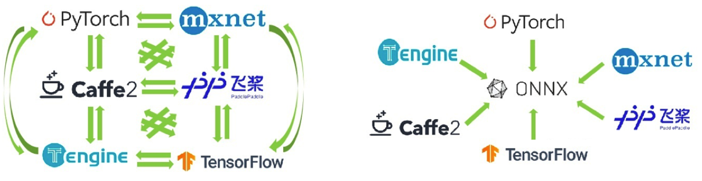
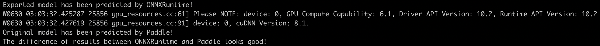
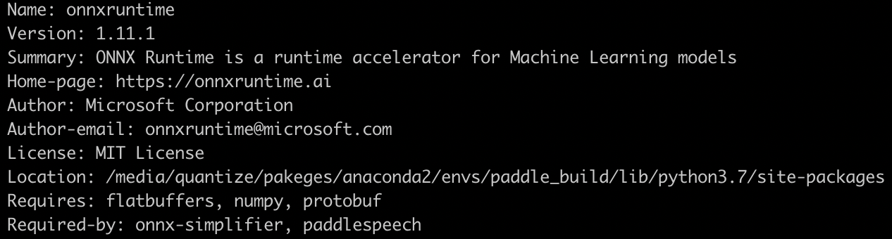

# 飞桨模型转 ONNX 模型

## 一、ONNX 简介
开放神经网络交换（Open Neural Network Exchange，简称 ONNX），是一种针对机器学习所设计的开放式的文件格式，用于存储训练好的模型。借助它支持不同的人工智能框架（如 PyTorch、MXNet）采用相同格式存储模型数据并交互。



没有 ONNX 模型之前，采用各个框架训练的模型只能通过特定的转换工具进行转换。有了 ONNX 协议后，无论使用何种框架训练模型，训练完毕后都可以将模型转换为 ONNX 这种统一的格式进行存储。这就大大方便了算法及模型在不同框架之间的迁移。

目前官方支持加载 ONNX 模型并进行推理的深度学习框架，除飞桨外，还有 PyTorch、MXNet、Caffe2、ML.NET、TensorRT 和 Microsoft CNTK 等主流框架都对 ONNX 有着不同程度的支持；并且 TensorFlow 也非官方的支持 ONNX。除深度学习框架外，大多推理引擎或者国产硬件，比如如 RK、地平线、鲲云等也都支持加载 ONNX 模型进行推理，如果需要在这类硬件上部署，可通过 [Paddle2ONNX](https://github.com/PaddlePaddle/Paddle2ONNX) 将飞桨模型导出成 ONNX 后进行部署。

## 二、Paddle2ONNX 安装
[Paddle2ONNX](https://github.com/PaddlePaddle/Paddle2ONNX) 作为飞桨提供的模型转换工具，可以将飞桨模型转换为 ONNX 格式，[Paddle2ONNX](https://github.com/PaddlePaddle/Paddle2ONNX) 的安装非常简单，只需要输入以下命令就可以完成 [Paddle2ONNX](https://github.com/PaddlePaddle/Paddle2ONNX) 的安装。

```
python -m pip install paddle2onnx
```

## 三、获取 Paddle2ONNX 模型库
[Paddle2ONNX](https://github.com/PaddlePaddle/Paddle2ONNX) 目前提供了包括图像分类、图像分割、目标检测、文字识别四个类别的模型和部署示例代码，供开发者进行参考使用，可以点击[链接](https://github.com/PaddlePaddle/Paddle2ONNX/tree/develop/model_zoo)获取。其他更多的飞桨官方模型套件的各类常用模型，可以到对应的官方 Repo 下进行下载，然后再进行转换。

## 四、飞桨转 ONNX 教程
在本教程中，我们将描述如何将飞桨模型转换为 ONNX 格式，然后使用 ONNXRuntime 运行它。具体操作分以下两种场景：
* 如果使用飞桨训练模型，并将其导出为 ONNX 格式，请参考 4.1 节导出为 ONNX 模型。
* 如果是从 PaddleOCR、PaddleClas 或 PaddleHub 等 Repo 中下载的部署模型，或者是通过飞桨训练好并保存的部署模型，则参考 4.2 节转换为 ONNX 模型。

### 4.1 飞桨训练模型导出为 ONNX 模型
本小节以 MNIST 手写数字识别网络作为例子，展示如何将训练模型导出为 ONNX 模型。

『手写数字识别任务』比较简单，普通的神经网络就能达到很高的精度，以下代码直接来自前面的[手写数字识别任务](https://www.paddlepaddle.org.cn/documentation/docs/zh/guides/beginner/quick_start_cn.html)，无需修改。

```
import paddle
from paddle.vision.transforms import Normalize

transform = Normalize(mean=[127.5], std=[127.5], data_format='CHW')
# 下载数据集并初始化 DataSet
train_dataset = paddle.vision.datasets.MNIST(mode='train', transform=transform)
test_dataset = paddle.vision.datasets.MNIST(mode='test', transform=transform)

# 模型组网并初始化网络
lenet = paddle.vision.models.LeNet(num_classes=10)
model = paddle.Model(lenet)

# 模型训练的配置准备，准备损失函数，优化器和评价指标
model.prepare(paddle.optimizer.Adam(parameters=model.parameters()),
              paddle.nn.CrossEntropyLoss(),
              paddle.metric.Accuracy())

# 模型训练
model.fit(train_dataset, epochs=5, batch_size=64, verbose=1)
# 模型评估
model.evaluate(test_dataset, batch_size=64, verbose=1)
```
完成以上代码，就可以训练这个模型。请注意，此模型未完全训练以获得良好的准确性，此处仅用于演示目的。
使用飞桨完成模型训练之后，要导出模型，需要调用 [paddle.onnx.export](https://www.paddlepaddle.org.cn/documentation/docs/zh/api/paddle/onnx/export_cn.html) 接口，在导出模型时我们需要使用 [paddle.static.InputSpec](https://www.paddlepaddle.org.cn/documentation/docs/zh/api/paddle/static/InputSpec_cn.html#inputspec) API 指定输入的 shape，如果输入中某一维为动态的，可以将该维指定为 None，在本例中我们设置第一维为动态，表示推理过程中该维可变。

使用飞桨完成模型训练之后，转换成 ONNX 格式只需要调用 [paddle.onnx.export](https://www.paddlepaddle.org.cn/documentation/docs/zh/api/paddle/onnx/export_cn.html) 接口，便会在指定的路径下生成 ONNX 模型。关于 [paddle.onnx.export](https://www.paddlepaddle.org.cn/documentation/docs/zh/api/paddle/onnx/export_cn.html) 接口更详细的使用方法，请参考 [API 文档](https://www.paddlepaddle.org.cn/documentation/docs/zh/api/paddle/onnx/export_cn.html) 。
添加如下脚本，可以在 onnx.save 下生成 lenet.onnx 模型。
```
# export to ONNX
save_path = 'onnx.save/lenet' # 需要保存的路径
x_spec = paddle.static.InputSpec([None, 1, 28, 28], 'float32', 'x') # 为模型指定输入的形状和数据类型，支持持 Tensor 或 InputSpec ，InputSpec 支持动态的 shape。
paddle.onnx.export(lenet, save_path, input_spec=[x_spec], opset_version=11)
```

### 4.2 飞桨部署模型转为 ONNX 模型
如果模型是从 PaddleOCR、PaddleClas 或 PaddleHub 等 Repo 中下载的部署模型，或者将飞桨模型保存为部署模型，均可以使用 Paddle2ONNX 的命令行进行转换。

本小节以 PaddleClas 提供的 MobileNetV3 分类模型作为例子，演示转换的过程。

1.首先可以使用如下命令下载保存下来的飞桨模型并解压，如果你已经有下载好的飞桨部署模型，则可以跳过此步骤。解压成功后在 mobilenetv3 文件夹下有飞桨的模型和参数文件。

```
wget https://bj.bcebos.com/paddle2onnx/model_zoo/mobilenetv3.tar.gz
tar xvf mobilenetv3.tar.gz
```

2.接下来可以使用 Paddle2ONNX 命令行工具将 MobileNetV3 转换为 ONNX 格式。转换成功后会生成 model.onnx 模型。命令相关的说明请参考：[Paddle2ONNX 命令行参数说明](https://github.com/PaddlePaddle/Paddle2ONNX)

```
paddle2onnx --model_dir mobilenetv3 --model_filename inference.pdmodel --params_filename inference.pdiparams --save_file model.onnx --enable_dev_version True --opset_version 13 --enable_onnx_checker True
```
### 4.3 验证 ONNX 模型

接下来，我们验证一下导出的 ONNX 模型的正确性。

#### (1) 检查 ONNX 模型的有效性

可以使用如下脚本验证导出的 ONNX 模型是否合理，包括检查模型的版本、图的结构、节点及其输入和输出。如下脚本的输出为 None 则表示模型转换正确。

```
# 导入 ONNX 库
import onnx
# 载入 ONNX 模型
onnx_model = onnx.load("model.onnx")
# 使用 ONNX 库检查 ONNX 模型是否合理
check = onnx.checker.check_model(onnx_model)
# 打印检查结果
print('check: ', check)
```

#### (2) 验证模型是否匹配

接下来我们验证原始的飞桨模型和导出的 ONNX 模型是否有相同的计算结果。

```
# 导入所需的库
import numpy as np
import onnxruntime
import paddle

# 随机生成输入，用于验证飞桨和 ONNX 的推理结果是否一致
x = np.random.random((1, 3, 224, 224)).astype('float32')

# predict by ONNXRuntime
ort_sess = onnxruntime.InferenceSession("model.onnx")
ort_inputs = {ort_sess.get_inputs()[0].name: x}
ort_outs = ort_sess.run(None, ort_inputs)

print("Exported model has been predicted by ONNXRuntime!")

# predict by Paddle
model = paddle.jit.load("mobilenetv3/inference")
model.eval()
paddle_input = paddle.to_tensor(x)
paddle_outs = model(paddle_input)

print("Original model has been predicted by Paddle!")

# compare ONNXRuntime and Paddle results
np.testing.assert_allclose(ort_outs[0], paddle_outs.numpy(), rtol=1.0, atol=1e-05)

print("The difference of results between ONNXRuntime and Paddle looks good!")
```

运行结果如下，可以看到飞桨模型和导出的 ONNX 模型在输入相同时计算结果一致：



ONNXRuntime 的 API 和相关文档请查阅：[ONNXRuntime 文档](https://onnxruntime.ai/docs/)。

### 4.4 使用 ONNX 模型进行推理

导出的 ONNX 模型可以用支持 ONNX 模型的推理引擎进行推理，比如 ONNXRuntime 或 TensorRT 等。本节将用 ONNXRuntime 和 4.2 节导出的 ONNX 模型来进行展示如何使用 ONNXRuntime 对 ONNX 模型进行推理预测。

为了使用 ONNXRuntime 运行模型，需要使用所选配置参数为模型创建一个推理会话（这里我们使用默认配置）。可以使用如下命令，安装依赖、下载推理脚本和测试图片。

```
# 安装 ONNXRuntime 用于 ONNX 模型的推理
python -m pip install onnxruntime
# 下载推理用的 infer.py 脚本
wget https://raw.githubusercontent.com/PaddlePaddle/Paddle2ONNX/develop/model_zoo/classification/infer.py
# 下载测试用的图片
wget https://github.com/PaddlePaddle/Paddle2ONNX/raw/develop/model_zoo/classification/images/ILSVRC2012_val_00000010.jpeg
```

以下脚本是 ONNX Runtme 使用 ONNX 模型推理的必要步骤，只需将前后处理改为实际应用场景下的逻辑便可使用，4.1 中的手写数字识别模型导出为 ONNX 格式之后，只需将图像前后处理逻辑加入进来便可用于部署。

```
# 导入 ONNX 包
import onnxruntime
# 加载 ONNX 模型生成推理用 sess
sess = onnxruntime.InferenceSession("model.onnx")
# 数据预处理
data = preprocess(image_path)
# 使用 ONNXRuntime 推理
result, = sess.run(None, {"inputs": data})
# 推理结果后处理
postprocess(result)
```

使用如下命令运行脚本，使用 ONNXRuntime 推理。

```
# 使用 ONNX 模型和 ONNXRuntime 推理，对图片进行分类
python infer.py --model model.onnx --image_path images/ILSVRC2012_val_00000010.jpeg
```

输入图片和最终的推理结果如下，可以看到准确的预测出输入的图片是一只贵宾犬。


```
# 分类出的前 5 个类别
TopK Indices:  [265 153 850 332 283]
# 前 5 个类别的置信度
TopK Scores:  [0.4966848  0.25181034 0.15389322 0.01496286 0.01342606]
```

备注：各类别 id 与明文标签请参考[ImageNet 标签](https://github.com/PaddlePaddle/PaddleClas/blob/release/2.3/deploy/utils/imagenet1k_label_list.txt)

## 五、注意事项

1. 目前 [Paddle2ONNX](https://github.com/PaddlePaddle/Paddle2ONNX) 已经支持 170 多个飞桨算子，多数飞桨的模型都可顺利导出为 ONNX 格式，如果在转换中遇到不支持的 OP，请到 Paddle2ONNX Repo 下提 Issue，我们都会尽快支持。

2. PaddleSlim 量化模型导出 ONNX，参考量化导出说明文档：[量化模型导出说明](https://github.com/PaddlePaddle/Paddle2ONNX/blob/develop/docs/zh/quantize.md)，如在导出 ONNX 过程遇到问题，欢迎通过[Paddle2ONNX](https://github.com/PaddlePaddle/Paddle2ONNX)开源项目 Issue 方式反馈。

3. 使用 ONNXRuntime 验证转换模型, 请注意安装最新版本，最低要求 1.10.0 版本。查询 ONNXRuntime 版本可以使用如下命令：

```
python -m pip show onnxruntime
```

该命令的输出如下，Version 则为 ONNXRuntime 的版本：



4. 模型转换过程会将飞桨的算子逐一转换为 ONNX 的算子。由于 ONNX 的算子随版本迭代不断升级，不同的推理引擎对 ONNX 算子版本支持也不完全一致，因此，使用 Paddle2ONNX 对飞桨模型进行转换时，需要指定 ONNX 的算子版本，此参数应根据待部署的推理引擎进行设置，在转换中可以使用 Paddle2ONNX 的 opset_version 选项进行指定，具体设置方法请参见[参数选项](https://github.com/PaddlePaddle/Paddle2ONNX#%E5%8F%82%E6%95%B0%E9%80%89%E9%A1%B9)。
