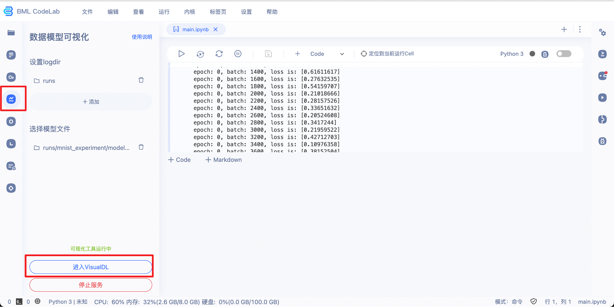
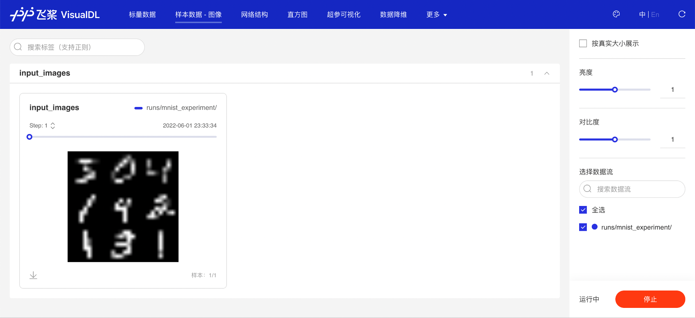
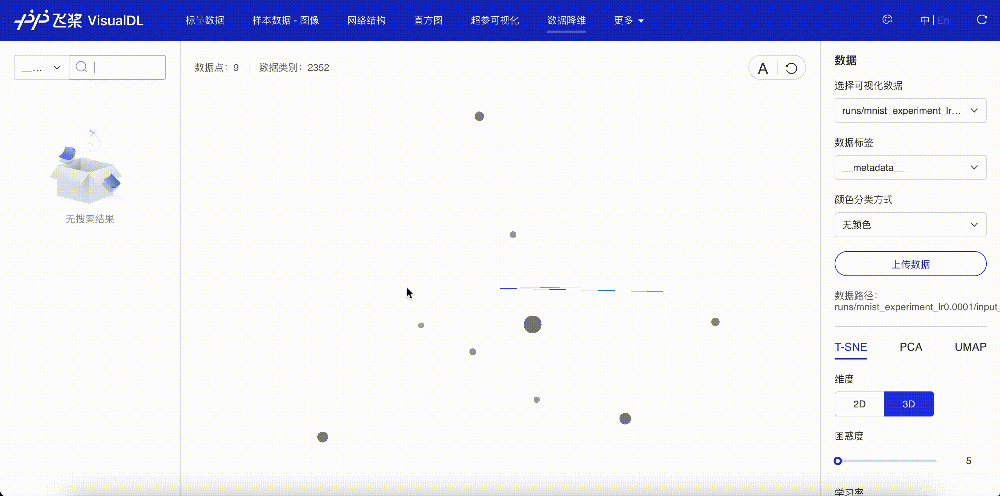
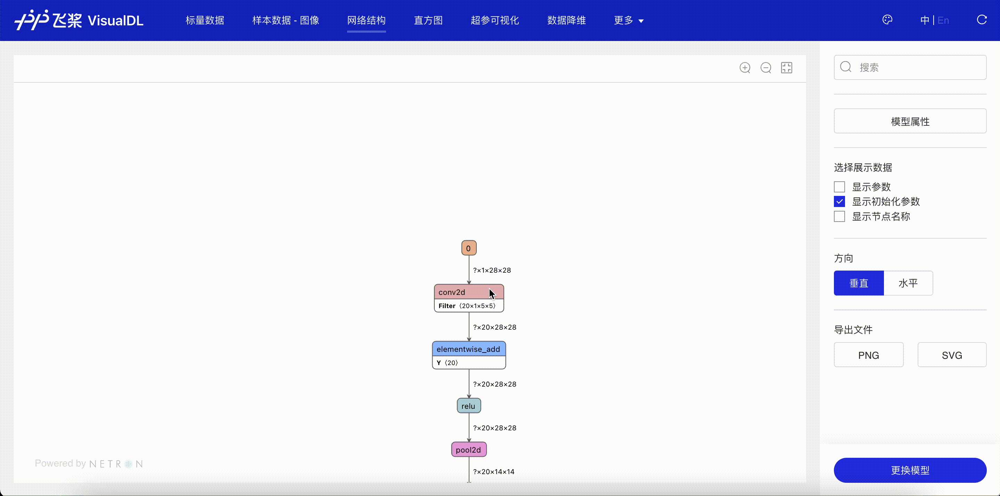
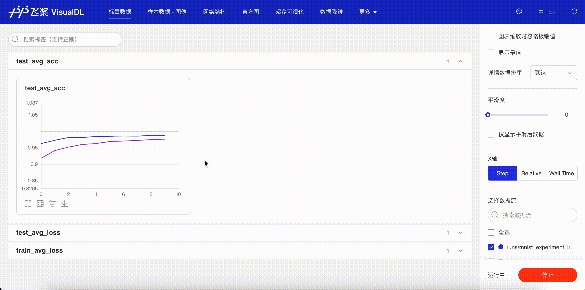
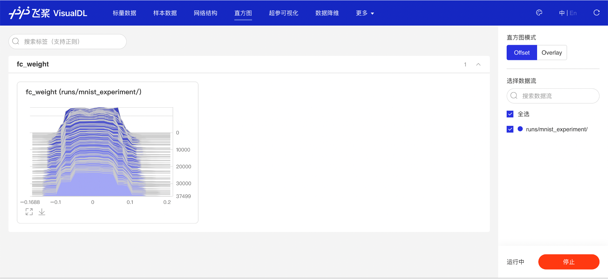
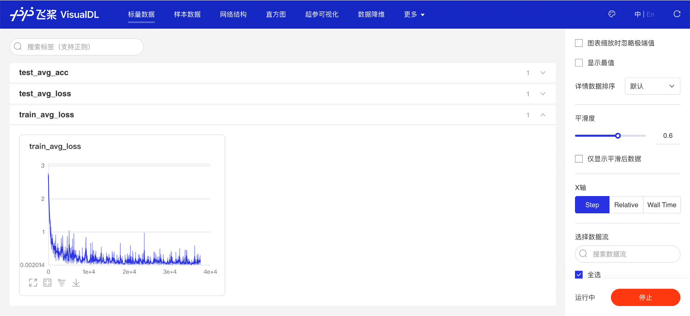
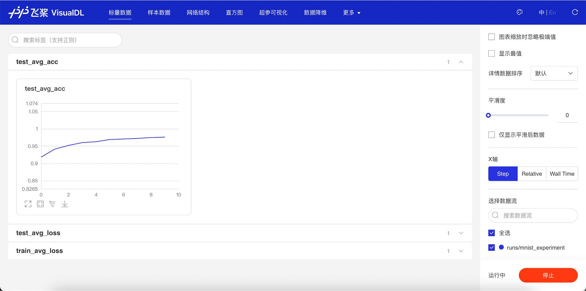
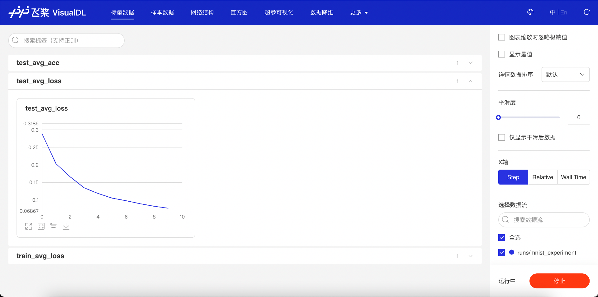
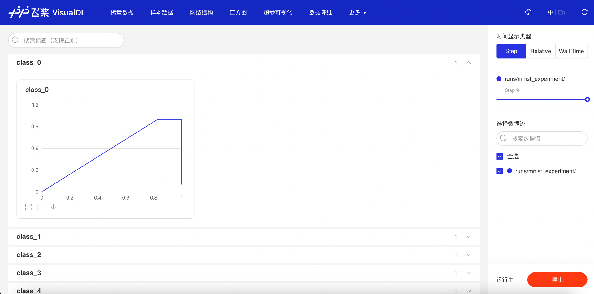

# 使用 VisualDL 可视化模型，数据和训练

在[构建手写数字识别模型](https://www.paddlepaddle.org.cn/documentation/docs/zh/guides/beginner/quick_start_cn.html)教学案例中，介绍了如何使用飞桨的 paddle.io 进行数据处理，通过 paddle.nn 构建模型，以及如何在训练数据上进行模型的训练和在测试数据上对模型效果进行评估。为了了解模型的训练过程，之前通过打印损失函数 loss 的值来观察发生的变化，但是这种观测方式非常不直观。本文将详细介绍如何使用飞桨的可视化工具 VisualDL 来提高训练神经网络的体验。

在本教程中，可以学习：

1. 设置 VisualDL
2. 写入数据并可视化

具体来说，在第 2 点可以看到：

- 如何检查训练数据
- 在训练模型时如何跟踪其表现
- 在训练后如何评估模型的表现

本教程基于前文“构建手写数字识别模型”案例的样板代码进行说明。该案例的详细讲解，请参考“[十分钟快速上手飞桨](https://www.paddlepaddle.org.cn/documentation/docs/zh/guides/beginner/quick_start_cn.html)”。

```python
import os
import random

import numpy as np
# 加载飞桨相关库
import paddle
from paddle.nn import Conv2D, MaxPool2D, Linear
import paddle.nn.functional as F

# 数据载入
class MNISTDataset():
  def __init__(self, mode='train'):
    self.mnist_data = paddle.vision.datasets.MNIST(mode=mode)

  def __getitem__(self, idx):
    data, label = self.mnist_data[idx]
    data = np.reshape(data, [1, 28, 28]).astype('float32') / 255
    label = np.reshape(label, [1]).astype('int64')
    return (data, label)

  def __len__(self):
    return len(self.mnist_data)

train_loader = paddle.io.DataLoader(MNISTDataset(mode='train'),
                                    batch_size=16,
                                    shuffle=True)

test_loader = paddle.io.DataLoader(MNISTDataset(mode='test'),
                                    batch_size=16,
                                    shuffle=False)

# 定义 mnist 数据识别网络模型结构
class MNIST(paddle.nn.Layer):
     def __init__(self):
         super().__init__()

         # 定义卷积层，输出特征通道 out_channels 设置为 20，卷积核的大小 kernel_size 为 5，卷积步长 stride=1，padding=2
         self.conv1 = Conv2D(in_channels=1, out_channels=20, kernel_size=5, stride=1, padding=2)
         # 定义池化层，池化核的大小 kernel_size 为 2，池化步长为 2
         self.max_pool1 = MaxPool2D(kernel_size=2, stride=2)
         # 定义卷积层，输出特征通道 out_channels 设置为 20，卷积核的大小 kernel_size 为 5，卷积步长 stride=1，padding=2
         self.conv2 = Conv2D(in_channels=20, out_channels=20, kernel_size=5, stride=1, padding=2)
         # 定义池化层，池化核的大小 kernel_size 为 2，池化步长为 2
         self.max_pool2 = MaxPool2D(kernel_size=2, stride=2)
         # 定义一层全连接层，输出维度是 10
         self.fc = Linear(in_features=980, out_features=10)

   # 定义网络前向计算过程，卷积后紧接着使用池化层，最后使用全连接层计算最终输出
   # 卷积层激活函数使用 Relu，全连接层激活函数使用 softmax
     def forward(self, inputs):
         x = self.conv1(inputs)
         x = F.relu(x)
         x = self.max_pool1(x)
         x = self.conv2(x)
         x = F.relu(x)
         x = self.max_pool2(x)
         x = paddle.reshape(x, [x.shape[0], -1])
         x = self.fc(x)
         return x

#创建模型
model = MNIST()


#设置优化器
opt = paddle.optimizer.SGD(learning_rate=0.001, parameters=model.parameters())
EPOCH_NUM = 10
for epoch_id in range(EPOCH_NUM):
    model.train()
    for batch_id, data in enumerate(train_loader()):
        #准备数据
        images, labels = data

        #前向计算的过程
        predicts = model(images)

        #计算损失，取一个批次样本损失的平均值
        loss = F.cross_entropy(predicts, labels)
        avg_loss = paddle.mean(loss)

        #每训练了 100 批次的数据，打印下当前 Loss 的情况
        if batch_id % 200 == 0:
            print("epoch: {}, batch: {}, loss is: {}".format(epoch_id, batch_id, avg_loss.numpy()))

        #后向传播，更新参数的过程
        avg_loss.backward()
        # 最小化 loss,更新参数
        opt.step()
        # 清除梯度
        opt.clear_grad()

    # evaluate model after one epoch
    model.eval()
    accuracies = []
    losses = []
    for batch_id, data in enumerate(test_loader):
        #准备数据
        images, labels = data
        #前向计算的过程
        predicts = model(images)
        #计算损失
        loss = F.cross_entropy(predicts, labels)
        #计算准确率
        acc = paddle.metric.accuracy(predicts, labels)
        accuracies.append(acc.numpy())
        losses.append(loss.numpy())

    avg_acc, avg_loss = np.mean(accuracies), np.mean(losses)
    print("[validation]After epoch {}: accuracy/loss: {}/{}".format(epoch_id, avg_acc, avg_loss))

#保存模型参数
paddle.save(model.state_dict(), 'mnist.pdparams')
```

通过以上代码，完成 MNIST 数据集载入、构建了简单的卷积神经网络模型、使用 SGD 优化器在训练数据上优化了 10 个 epoch 的模型参数，并且将训练后的模型参数进行了保存。

接下来，只需要在前面代码的合适位置添加一些 VisualDL 接口（下文有详细解释并在代码块中注释提醒）以及简单的设置，就可以实现模型的 VisualDL 可视化开发。

VisualDL 以丰富的图表呈现训练参数变化趋势、模型结构、数据样本、高维数据分布等，可以帮助用户更清晰直观地理解深度学习模型训练过程及模型结构，进而实现高效的模型优化。

添加 VisualDL 接口后的完整代码，可点击[链接](https://aistudio.baidu.com/aistudio/projectdetail/4188061?contributionType=1)在线运行。代码运行完成后，点击左侧的可视化图标📈即可查看可视化图像。

接下来，将介绍如何使用 VisualDL 进行模型开发可视化。

## 一、环境准备

### 1.1 安装 VisualDL

如果还没有安装 visualdl，可以使用 pip 进行安装。

```bash
pip install visualdl
```

安装完成后，打开命令行，如果可以执行如下命令代表安装成功。

```bash
visualdl --version
```

### 1.2 设置 VisualDL

VisualDL 通常分为“写”和“读”两部分：

- “写”数据：通过在训练程序中加入代码，将所要监控的数据记录到日志文件；
- “读”数据：启动 VisualDL 的服务、解析日志文件中的数据、并在浏览器中以图表的形式呈现，从而实现可视化。

使用 VisualDL 写数据，需要先导入 visualdl 库的 LogWriter 类。所有写入数据的操作都将基于 LogWriter 的对象进行。

可以按照下列方式在文件头部导入 visualdl 库，并使用 LogWriter 类。

```python
import os
import random

import numpy as np
# 加载飞桨相关库
import paddle
from paddle.nn import Conv2D, MaxPool2D, Linear
import paddle.nn.functional as F

# 从 visualdl 库中引入 LogWriter 类
from visualdl import LogWriter
# 创建 LogWriter 对象，指定 logdir 参数，如果指定路径不存在将会创建一个文件夹
logwriter = LogWriter(logdir='./runs/mnist_experiment')
```

运行该代码后，将会创建一个./runs/mnist_experiment 文件夹，用于存储写入到 VisualDL 的数据。

可以在训练程序执行前、中、后任意一个阶段，启动 VisualDL 的可视化服务、读取数据、并进入浏览器查看。启动命令为：

```bash
visualdl --logdir ./runs/mnist_experiment --model ./runs/mnist_experiment/model.pdmodel --host 0.0.0.0 --port 8040
```

--logdir：与使用 LogWriter 时指定的参数相同。

--model：（可选）为保存的网络模型结构文件。

--host：指定服务的 IP 地址。

--port：指定服务的端口地址。

在命令行中输入上述命令启动服务后，可以在浏览器中输入 [http://localhost:8040](http://localhost:8040/) (也可以查看 ip 地址，将 localhost 换成 ip)进行查看。

如果是在[AI Studio](https://aistudio.baidu.com/aistudio/projectdetail/4188061?contributionType=1)上训练程序，可以在模型训练结束后，参考如下界面设置日志文件所在目录和模型文件，启动 VisualDL 的可视化服务。




## 二、写入数据并可视化

创建了 LogWriter 对象之后，就可以写入想要观察的数据了。需要监控的数据通常包含以下几类：

查看训练数据、查看网络模型结构、查看训练过程网络中模型参数的变化、查看训练过程中损失函数值的变化，以及测试集上损失函数值和准确率的变化。

下面依次说明如何添加对这些数据的监控。

### 2.1 检查训练数据

#### 2.1.1 查看输入图像

如果想知道训练或测试数据集中的输入图像是什么样的，可以按如下方式使用[add_image_matrix](https://github.com/PaddlePaddle/VisualDL/blob/develop/docs/components/README.md#Image--Image-Visualization)接口将输入图像列表写入 VisualDL，VisualDL 会自动将图像排列成网格进行展示。

```python
# 数据载入
class MNISTDataset():
  def __init__(self, mode='train'):
    self.mnist_data = paddle.vision.datasets.MNIST(mode=mode)

  def __getitem__(self, idx):
    data, label = self.mnist_data[idx]
    data = np.reshape(data, [1, 28, 28]).astype('float32') / 255
    label = np.reshape(label, [1]).astype('int64')
    return (data, label)

  def __len__(self):
    return len(self.mnist_data)

# 查看 9 张输入的训练图像的样例
dataset = MNISTDataset(mode='train')
image_matrix = []
for i in range(9):
  image, label = dataset[i]
  # 将 dataset 中的 CHW 排列的图像转换成 HWC 排列再写入 VisualDL
  image_matrix.append(image.transpose([1,2,0]))
# 将九张输入图像合成长宽相同的图像网格，即 3X3 的图像网格
logwriter.add_image_matrix(tag='input_images', step=1, imgs=image_matrix, rows=-1)
```

“样本数据·图像”页面显示了通过 add_image_matrix 接口写入的图像列表，可以看到写入的 9 张图像按照 3*3 的排列方式展示了出来，用于训练的数据是手写字体的数字。



图 1：查看输入图像

还可以进一步查看输入数据映射到低维空间时的关系。使用[add_embeddings](https://github.com/PaddlePaddle/VisualDL/blob/develop/docs/components/README.md#High-Dimensional--Data-Dimensionality-Reduction)接口将输入图像列表写入 VisualDL。

```python
# 将九张输入图像以向量的形式写入 embeddings，查看数据降维后的关系
tags = ['image_{}'.format(i) for i in range(9)]
logwriter.add_embeddings('input_image_embeddings', mat=[img.reshape(-1) for img in image_matrix], metadata=tags)
```

“数据降维”页面显示了通过 add_embeddings 接口写入的向量降维后的位置关系。一般来说，越相似的图像投射到低维空间的距离就会越相近。



图 2：查看数据降维的结果

#### 2.1.2 查看网络结构

如果是通过飞桨组建的网络结构，可以使用[paddle.jit.save](https://www.paddlepaddle.org.cn/documentation/docs/zh/api/paddle/jit/save_cn.html)接口将网络结构保存下来，然后使用 VisualDL 进行查看。

```python
#创建模型
model = MNIST()
#保存模型，获取模型结构文件
paddle.jit.save(model, './runs/mnist_experiment/model', [paddle.static.InputSpec([-1,1,28,28])])
```

该代码会在./runs/mnist_experiment/目录下生成模型结构文件 model.pdmodel。

“网络结构”页面显示了使用飞桨搭建的网络结构。可以清晰的看到其拓扑连接方式以及每个结构单元的详细信息。通过网络结构图，可以分析自己搭建的网络拓扑是否符合设计时的预期，辅助做网络搭建的调试；以及查看每个节点输出的变量的形状，并通过此形状评估参数量的大小。



图 3：查看网络结构

#### 2.1.3 记录训练时的超参数配置

通过[add_hparams](https://github.com/PaddlePaddle/VisualDL/blob/develop/docs/components/README.md#hyperparameters--hyperparameter-visualization)接口记录下当前实验的超参数配置信息，比如学习率 lr、batch、所用的优化器等信息，并且关联该超参数配置下记录过的曲线的名称，方便进行多个不同超参数设定下实验的对比。

比如第一次实验设置学习率为 1e-3，并使用 sgd 优化器，记录相关超参数的配置情况。

```python
logwriter.add_hparams(hparams_dict={'lr': 0.001, 'batch_size': 16, 'opt': 'sgd'},
                           metrics_list=['train_avg_loss', 'test_avg_loss', 'test_avg_acc'])
```

为了比较不同超参数设置对实验的影响，进行第二次实验，并设置学习率为 1e-4，选用 adam 作为优化器。

```python
logwriter.add_hparams(hparams_dict={'lr': 0.0001, 'batch_size': 16, 'opt': 'adam'},
                           metrics_list=['train_avg_loss', 'test_avg_loss', 'test_avg_acc'])
```


“超参可视化”页面会显示通过 add_hparams 接口记录这两次不同实验的超参数信息，并对关联的曲线进行对比。通过表格视图，平行坐标图和散点图三种图，可以发现在学习率为 1e-4，优化器为 adam 的时候，训练的平均损失值更低，测试集上的测试精度更高。


图 4：超参实验对比-表格视图


图 5：超参实验对比-平行坐标图


图 6：超参实验对比-散点图

回到“标量数据”页面，查看 test_avg_acc 曲线。同样可以发现，学习率为 1e-4、优化器为 adam 的测试准确率曲线，在学习率为 1e-3、优化器为 sgd 对应的曲线之上。通过此对比，可以直观了解超参实验结果。



图 7：查看测试准确率曲线

### 2.2 跟踪模型训练

#### 2.2.1 查看网络模型参数变化

在网络模型训练的过程中，模型的参数会随着优化算法的更新而不断变化。通过将模型参数写入 VisualDL，可以了解模型参数的值的分布是如何随着训练过程而发生改变的。使用[add_histogram](https://github.com/PaddlePaddle/VisualDL/blob/develop/docs/components/README.md#Histogram--Distribution-of-Tensors)接口可以写入模型参数。

```python
  for epoch_id in range(EPOCH_NUM):
      model.train()
      train_batchs_per_epoch = len(train_loader)
      for batch_id, data in enumerate(train_loader):
          #准备数据
          images, labels = data

          #前向计算的过程
          predicts = model(images)

          #计算损失，取一个批次样本损失的平均值
          loss = F.cross_entropy(predicts, labels)
          avg_loss = paddle.mean(loss)

          #记录当前训练 Loss 到 VisualDL
          logwriter.add_scalar("train_avg_loss", value=avg_loss.numpy(), step=batch_id+epoch_id*(train_batchs_per_epoch))

          #记录网络中最后一个 fc 层的参数到 VisualDL
          logwriter.add_histogram("fc_weight", values=model.fc.weight.numpy(), step=batch_id+epoch_id*(train_batchs_per_epoch))

          #每训练了 100 批次的数据，打印下当前 Loss 的情况
          if batch_id % 200 == 0:
              print("epoch: {}, batch: {}, loss is: {}".format(epoch_id, batch_id, avg_loss.numpy()))

          #后向传播，更新参数的过程
          avg_loss.backward()
          # 最小化 loss,更新参数
          opt.step()
          # 清除梯度
          opt.clear_grad()
```

“直方图”页面显示了 add_histogram 接口写入的模型参数。直方图的横坐标是值的大小，纵坐标是 step，高度代表值对应的元素数量。一般正常训练过程的参数分布变化，即向下图一样，由较大的方差向较小方差变化，从类似均匀分布偏向类似高斯分布。



图 8：查看网络模型参数变化

#### 2.2.2 查看训练过程损失函数值变化

网络模型的训练即是目标损失函数的优化过程。通常损失函数的值会随着优化算法的迭代不断变小，但是也可能会因为梯度爆炸或者不收敛等原因并没有达到预期的效果，可以通过[add_scalar](https://github.com/PaddlePaddle/VisualDL/blob/develop/docs/components/README.md#Scalar--Line-Chart)接口将训练过程的损失函数的值记录下来观察变化。

```python
for epoch_id in range(EPOCH_NUM):
      model.train()
      train_batchs_per_epoch = len(train_loader)
      for batch_id, data in enumerate(train_loader):
          #准备数据
          images, labels = data

          #前向计算的过程
          predicts = model(images)

          #计算损失，取一个批次样本损失的平均值
          loss = F.cross_entropy(predicts, labels)
          avg_loss = paddle.mean(loss)

          #记录当前训练 Loss 到 VisualDL
          logwriter.add_scalar("train_avg_loss", value=avg_loss.numpy(), step=batch_id+epoch_id*(train_batchs_per_epoch))

          #记录网络中最后一个 fc 层的参数到 VisualDL
          logwriter.add_histogram("fc_weight", values=model.fc.weight.numpy(), step=batch_id+epoch_id*(train_batchs_per_epoch))

          #每训练了 100 批次的数据，打印下当前 Loss 的情况
          if batch_id % 200 == 0:
              print("epoch: {}, batch: {}, loss is: {}".format(epoch_id, batch_id, avg_loss.numpy()))

          #后向传播，更新参数的过程
          avg_loss.backward()
          # 最小化 loss,更新参数
          opt.step()
          # 清除梯度
          opt.clear_grad()
```

“标量数据”页面显示了 add_scalar 接口写入的每个 step 的损失函数值。可以看到随着网络的训练，损失函数的值趋势是先快速下降，然后缓慢下降并趋于稳定，说明模型的训练过程正常并且最后收敛了。



图 9：查看训练过程中损失函数值变化

### 2.3 评估模型训练效果

#### 2.3.1 查看测试集的损失函数值和准确率

网络模型训练完成后，需要在测试集上验证其效果。可以使用 add_scalar 接口记录测试集上损失函数值和准确率是如何随着训练迭代的深入而发生变化的。

```python
for batch_id, data in enumerate(test_loader):
      #准备数据
      images, labels = data
      #前向计算的过程
      predicts = model(images)
      #计算损失
      loss = F.cross_entropy(predicts, labels)
      #计算准确率
      acc = paddle.metric.accuracy(predicts, labels)
      accuracies.append(acc.numpy())
      losses.append(loss.numpy())

avg_acc, avg_loss = np.mean(accuracies), np.mean(losses)
print("[validation]After epoch {}: accuracy/loss: {}/{}".format(epoch_id, avg_acc, avg_loss))
#记录当前测试集平均 Loss 和准确率到 VisualDL
logwriter.add_scalar("test_avg_loss", value=avg_acc, step=epoch_id)
logwriter.add_scalar("test_avg_acc", value=avg_loss, step=epoch_id)
```

add_scalar 接口写入的测试集的损失函数值和准确率的值，同样可以在“标量数据”页面看到。可以看到随着模型的训练，测试集上的损失函数值也在下降并且预测准确率在不断的升高，同样说明了模型的训练符合我们想要的预期。



图 10：查看测试集的准确率值变化



图 11：查看测试集的损失函数值变化

#### 2.3.2 查看 pr 曲线

VisualDL 可以在每个训练的 epoch 结束后，在测试集上画出对应的 pr 曲线，参照下述代码，使用[add_pr_curve](https://github.com/PaddlePaddle/VisualDL/blob/develop/docs/components/README.md#Scalar--Line-Chart)接口记录每个类别的 pr 曲线。

```python
# evaluate model after one epoch
    model.eval()
    accuracies = []
    losses = []
    class_probs = []
    class_preds = []
    for batch_id, data in enumerate(test_loader):
        #准备数据
        images, labels = data
        #前向计算的过程
        predicts = model(images)
        #计算损失
        loss = F.cross_entropy(predicts, labels)
        #计算准确率
        acc = paddle.metric.accuracy(predicts, labels)
        accuracies.append(acc.numpy())
        losses.append(loss.numpy())
        #记录用于画 pr 曲线需要的预测概率和类别
        class_probs_batch = [F.softmax(predict, axis=0) for predict in predicts]
        class_preds_batch = paddle.argmax(predicts, 1)

        class_probs.append(class_probs_batch)
        class_preds.append(class_preds_batch)

    test_probs = paddle.concat([paddle.stack(batch) for batch in class_probs]).numpy()
    test_preds = paddle.concat(class_preds).numpy()

    for i in range(10):
      logwriter.add_pr_curve('class_{}'.format(i), labels=(test_preds == i),predictions=test_probs[:,i], step=epoch_id)
```

在“更多·PR 曲线”页面显示了所计算的每个类别的 PR 曲线。可以观察测试集上的 PR 曲线随着训练过程的变化情况，以及对比不同类别下 PR 曲线的差异。



图 12：查看 PR 曲线


### 2.4 更多用法

以上介绍了如何结合 VisualDL 可视化工具来辅助您进行网络模型的训练。还可以根据自己的需要，加入任何想要观察的数据。更多的写入接口说明可以参考[VisualDL 的官方文档](https://github.com/PaddlePaddle/VisualDL)。此外，可以在 Paddle 官网体验 VisualDL 全功能展示的[demo](https://www.paddlepaddle.org.cn/paddle/visualdl/demo/)。
