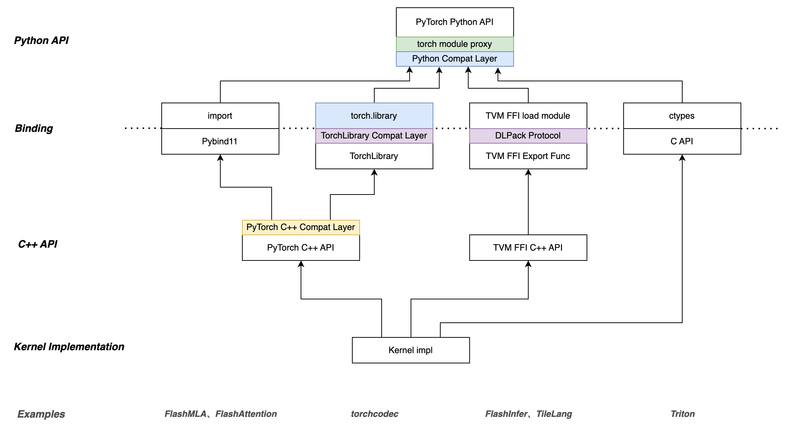

## 原理和迁移方式

### 实现原理

为了方便 PyTorch 自定义算子快速接入 PaddlePaddle 框架，我们提供了如下图所示的兼容机制：

正如图上所示，我们自底向上提供了如下几层支持：

- **C++ API 兼容层**：该层实现了常用 PyTorch C++ API 的兼容接口，用户仍然可以通过调用 PyTorch 风格的 `at::*`、`torch::*`、`c10::*` 等命名空间下的函数和类来实现自定义算子逻辑，从而最大限度地复用现有代码，使迁移工作量降至最低。
- **算子注册兼容层**：对于使用 pybind11 进行算子注册的 PyTorch 自定义算子，PaddlePaddle 无需额外修改注册代码；而对于使用 `TORCH_LIBRARY` 宏进行注册并通过 `torch.ops` 调用的算子，我们提供了同名的注册接口，用户无需修改注册代码即可完成迁移。
- **Python 接口兼容层**：对于 Python 端自定义算子封装部分，会不可避免地调用一些 PyTorch 内的 Python 组网 API。为此，我们正在致力于提升 Python 端 API 与 PyTorch 的兼容性，力求让用户在迁移过程中无需修改 Python 端代码。
- **Python API 代理层**：在 Python 端，即便 API 能够完全兼容，用户仍然需要将 `import torch` 替换为 `import paddle`。为此，我们提供了一个轻量级的代理层，用户只需在迁移后的代码开头添加一行 `import paddle.compat.enable_torch_proxy`，后续的 `torch` 下的模块将被重定向至 `paddle` 下的模块，从而实现无缝迁移。

通过以上几层兼容机制，用户可以在最大程度上复用现有的 PyTorch 自定义算子代码，从而大幅降低迁移成本。

此外，对于 TVM FFI 生态的自定义算子，由于我们已经对 TVM FFI 中所需的 DLPack 协议提供了最佳支持，因此用户可以直接将 TVM FFI 生态的自定义算子迁移至 PaddlePaddle 框架，无需额外修改。当然，如果相关算子库在 Python 端调用了 PyTorch 的组网 API，则仍然需要借助上述的 Python API 代理层来完成迁移。

## 迁移步骤

下面我们以一个简单的 PyTorch 自定义算子为例，介绍如何将其迁移至 PaddlePaddle 框架。
