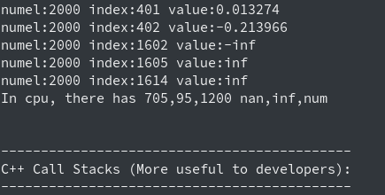

# check nan inf 工具

check nan inf 工具用于检查 Operator 的结果是否含有 nan(not a number，非有效数)或 inf(infinite，无穷大数)。支持 float32、double、float16 三类浮点型，整型由于不存在 nan、inf 不作检查。

## <span id="use">使用</span>

#### 1. 使用方法
设置环境变量为 FLAGS_check_nan_inf 为 True 或者 1 即可。
```
export FLAGS_check_nan_inf=1   # 或者=True
```

#### 2. 进阶使用
添加上述环境变量后，可以通过设置环境变量跳过 op、op 类型及 op 变量的检查。设置的格式如下：
```
PADDLE_INF_NAN_SKIP_OP="op0,op1,op2"
PADDLE_INF_NAN_SKIP_ROLE="role1,role2,role3"
PADDLE_INF_NAN_SKIP_VAR="op0:var0,op0:var1,op1:var0"
```
其中上面三个环境变量分别表示跳过 op、op 类型和 op 里变量的检查。
##### 2.1 跳过 op 检查
如下设置中前一个只跳过 mul op 的 nan inf 检查，后一个设置则跳过 mul、softmax_with_cross_entropy 这两个 op 的检查。
`注意`：op 跳过只接受精准匹配，要跳过 softmax_with_cross_entropy 的检查，不能设置环境变量为 softmax_with 或者 with_cross 进行模糊匹配，必须设置 softmax_with_cross_entropy 全名。
```
export PADDLE_INF_NAN_SKIP_OP="mul"
export PADDLE_INF_NAN_SKIP_OP="mul,softmax_with_cross_entropy"
```
##### 2.2 跳过 op 类型检查
目前接受的类型有: forward、backward、optimize、rpc、dist、lrsched、loss、default。正常 fp32 训练中，不需要跳过 op 类型进行 nan inf 检查。但在`fp16`中，在反向过程出现 inf 会对其进行修正，所以一般需要跳过 backward 的检查，这也是添加该功能的缘由。
如下设置中前一个只跳过 backward 的检查，后一个设置跳过 backward、optimize 两种类型的检查。同上，op 类型跳过也只支持精准匹配。
```
export PADDLE_INF_NAN_SKIP_ROLE="backward"
export PADDLE_INF_NAN_SKIP_ROLE="backward,optimize"
```
##### 2.3 跳过指定 op 中变量的检查
如下设置中前一个跳过 mul op 中 fc_0.tmp_0 变量，后一个设置则跳过 mul op 中 fc_0.tmp_0 和 fc_0.tmp_1 变量及 dropout op 的 new_relative 变量。
```
export PADDLE_INF_NAN_SKIP_VAR="mul:fc_0.tmp_0"
export PADDLE_INF_NAN_SKIP_VAR="mul:fc_0.tmp_0,mul:fc_0.tmp_1,dropout:new_relative"
```
`注意`：指定 op 变量检查中，对于 op 只接受精准匹配，对于变量则为模糊匹配，如上述的 mlu op 中的 fc_0.tmp_0 和 fc_0.tmp_1 变量可用 c_0.tmp 进行匹配。

## <span id="test">试用</span>
可以使用单测中的[check_nan_inf_base.py](https://github.com/PaddlePaddle/Paddle/blob/develop/test/legacy_test/check_nan_inf_base.py)文件进行试用。该脚本已设置 FLAGS_check_nan_inf=1 打开 check nan inf 功能。直接 python check_nan_inf_base.py 执行即可。
#### 1. GPU 日志信息
其中 GPU 的 check nan 信息由于在 GPU 中打印，所以 nan inf 信息会出现在出错信息栈前面。工具中会打印出现 inf、nan 的 op 及 tensor 名称，每个 block 会打印 nan、inf、num 中的 3 个值，并打印各自 block 中 nan、inf、num 的数量。

#### 2. CPU 日志信息
CPU 中打印的 nan、inf、num 会在出错信息栈前面显示，同样打印了 nan、inf、num 中的三个值，并打印 nan、inf、num 的数量。check nan 信息中 op 及 tensor 的名称会在最后显示。




## <span id="speed">速度</span>
测试环境：v100 32G 单卡测试，Resnet50 模型，imagenet 数据集。`不同环境模型数据集下速度可能不同，以下速度仅供参考`
>不检查 nan inf 速度，每张卡 307.7 images/s。
检查 nan inf 速度，每张卡 250.2 images/s。

## <span id="principle">原理</span>
#### 1. 工具原理
对于浮点类型操作，正常数值 num，无穷大 inf，非数值 nan 有如下运行关系。更详细可查看[INF, NAN, and NULL](https://wiki.analytica.com/index.php?title=INF,_NAN,_and_NULL_-_Exception_values&title=INF,_NAN,_and_NULL_-_Exception_values)
```
nan - nan = nan, inf - inf = nan, num - num = 0,
nan + nan = nan, inf + inf = inf, nan + 0 = nan,
inf + 0 = inf, nan + inf = nan, 0 + 0 = 0
```
基于此使用如下操作仅需最后检查 sum 是否为 nan 或者 inf 就行了。
```
for(value:values): sum += (value-value)
```

***`注意`：本文档的进阶使用、速度、原理目前仅在 develop 版本的 paddle 生效，并将随 1.7 版本的 paddle 发布。
此前版本的 check nan inf 工具在 GPU 上不推荐使用，旧工具速度为 0.25 images/s，测试会拖慢 1000 多倍的训练速度。***
