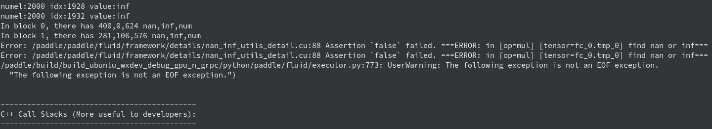

# check nan inf tool

The check nan inf tool is used to check whether the result of the Operator contains nan(not a number) or inf(infinite number).
Float32, double, and float16 are supported. Integers are not checked because there is no nan or inf.

## <span id="use">Use</span>
#### 1. Method of use
Set the environment variable FLAGS_check_nan_inf to True or 1.
```
export FLAGS_check_nan_inf=1  # or set =True
```

#### 2. Advanced use
After adding the above environment variables, you can skip the check of op, op role, and variables by setting environment variables.
The format of the setting is as follows:
```
PADDLE_INF_NAN_SKIP_OP="op0,op1,op2"
PADDLE_INF_NAN_SKIP_ROLE="role1,role2,role3"
PADDLE_INF_NAN_SKIP_VAR="op0:var0,op0:var1,op1:var0"
```
The three above environment variables respectively indicate skipping the checks of op, op role, and variables in op.
##### 2.1 Skip op check
In the following settings, the previous one only skips the nan inf check of the mul op, and the latter setting skips the check of mul and softmax_with_cross_entropy op.
`Note`: Op skip only accepts exact matches. To skip the softmax_with_cross_entropy check, you cannot set the environment variable to softmax_with or with_cross for fuzzy matching.
You must set the full softmax_with_cross_entropy name.
```
export PADDLE_INF_NAN_SKIP_OP="mul"
export PADDLE_INF_NAN_SKIP_OP="mul,softmax_with_cross_entropy"
```
##### 2.2 Skip op role check
The currently accepted types are: forward, backward, optimize, rpc, dist, lrsched, loss, default.
In fp32 training, it is not necessary to skip the nan inf check of the op role.
However in `fp16` training, inf will be corrected in the backpropagation, so it is generally necessary to skip the backward check, which is why this feature is added.
In the following setting, the previous setting only skips the backward check, and the latter setting skips both the backward and optimize checks.
Same as above, the op role skipping only supports exact matching.
```
export PADDLE_INF_NAN_SKIP_ROLE="backward"
export PADDLE_INF_NAN_SKIP_ROLE="backward,optimize"
```
##### 2.3 Skip the checking of variables in the specified op
In the following setting, the former skip the fc_0.tmp_0 variable in mul op, and the latter setting skips the fc_0.tmp_0 and fc_0.tmp_1 variables in mul op and the new_relative variable in dropout op.
```
export PADDLE_INF_NAN_SKIP_VAR="mul:fc_0.tmp_0"
export PADDLE_INF_NAN_SKIP_VAR="mul:fc_0.tmp_0,mul:fc_0.tmp_1,dropout:new_relative"
```
`Note`: In the specified op variable check, only exact matching is accepted for op, and fuzzy matching is used for variables.
For example, the fc_0.tmp_0 and fc_0.tmp_1 variables in mul op mentioned above can be matched by c_0.tmp

## <span id="test">Test</span>
You can use the [check_nan_inf_base.py](https://github.com/PaddlePaddle/Paddle/tree/develop/test/legacy_test/check_nan_inf_base.py) file for test.
The script has set FLAGS_check_nan_inf=1 to enable the nan inf check. Just execute `python check_nan_inf_base.py` to test.

#### 1. GPU log information
The check information of the GPU is printed in the GPU, so the nan inf information appears in front of the error information stack.
The tool will print the name of the op and tensor which find inf or nan. Each block will print the three values of nan, inf, and num.
And will print the number of nan, inf, and num in the respective block.


#### 2. CPU log information
The nan, inf, and num printed in the CPU are displayed in front of the error message stack.
The three values of nan, inf, and num are also printed, and the number of nan, inf, and num is printed.
The name of the op and tensor which has nan or inf will be displayed in the end.


## <span id="speed">Speed</span>
Test environment: v100 32G single card, Resnet50 model, Imagenet dataset.
`The speed may be different under different environments and different model datasets. The following speeds are only for reference`
> Without check nan inf speed, 307.7 images/s per card.
Check nan inf speed, 250.2 images/s per card.

## <span id="printciple">Principle</span>
#### 1. Tool principle
For floating-point operations, num(normal numeric), inf(infinite), and nan(not a number) have the following relations.
More details can be found in [INF, NAN, and NULL](https://wiki.analytica.com/index.php?title=INF,_NAN,_and_NULL_-_Exception_values&title=INF,_NAN,_and_NULL_-_Exception_values)
```
nan - nan = nan, inf - inf = nan, num - num = 0,
nan + nan = nan, inf + inf = inf, nan + 0 = nan,
inf + 0 = inf, nan + inf = nan, 0 + 0 = 0
```
Based on this, using the following operation and only check the sum is nan or inf is enough.
```
for(value:values): sum += (value-value)
```

***`Note`: The Advanced use, Speed, and Principles of this document are currently only effective in the develop version of the Paddle, and will be released with the 1.7 version of the Paddle.
It is not recommended to use the previous version of the check nan inf tool on the GPU, the speed of old tools is 0.25 images/s，will slow down the training speed by a thousand times.***
