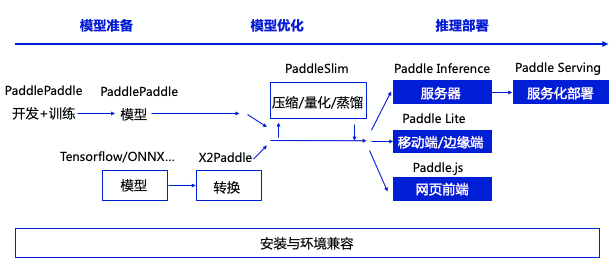

########
推理部署
########

飞桨推理产品简介
==================

作为飞桨生态重要的一部分，飞桨提供了多个推理产品，完整承接深度学习模型应用的最后一公里。

整体上分，推理产品主要包括如下子产品

.. csv-table::
    :header: "名称", "英文表示", "适用场景"
    :widths: 10, 10, 30

    "飞桨原生推理库", "`Paddle Inference <http://paddleinference.paddlepaddle.org.cn/introduction/summary.html>`_ ", "高性能服务器端、云端推理"
    "飞桨服务化推理框架", "Paddle Serving", "自动服务、模型管理等高阶功能"
    "飞桨轻量化推理引擎", "`Paddle Lite <http://paddlelite.paddlepaddle.org.cn/introduction/tech_highlights.html>`_ ", "移动端、物联网等"
    "飞桨前端推理引擎", "Paddle.js", "浏览器中推理、小程序等"

各产品在推理生态中的关系如下

**用户使用飞桨推理产品的工作流** 如下

1. 获取一个飞桨的推理模型，其中有两种方法

    1. 利用飞桨训练得到一个推理模型
    2. 用 X2Paddle 工具从第三方框架（比如 TensorFlow 或者 Caffe 等）产出的模型转化

2. （可选）对模型进行进一步优化， PaddleSlim 工具可以对模型进行压缩，量化，裁剪等工作，显著提升模型执行的速度性能，降低资源消耗

3. 将模型部署到具体的推理产品上

..  toctree::
    :hidden:

    inference/inference_cn.rst
    mobile/mobile_index_cn.md
    paddleslim/paddle_slim_cn.md
