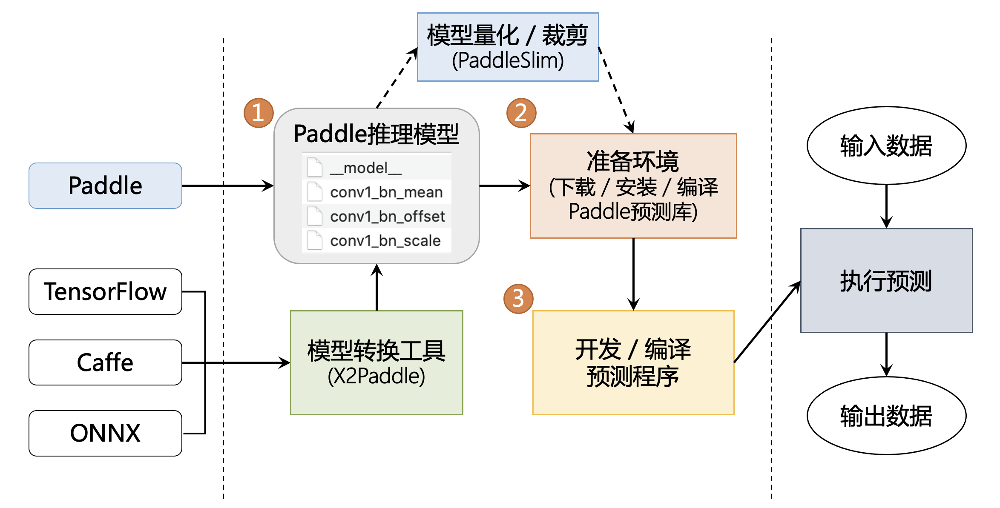

# 服务器部署 — Paddle Inference

Paddle Inference 是飞桨的原生推理库， 作用于服务器端和云端，提供高性能的推理能力。

由于能力直接基于飞桨的训练算子，因此 Paddle Inference 可以通用支持飞桨训练出的所有模型。

Paddle Inference 功能特性丰富，性能优异，针对不同平台不同的应用场景进行了深度的适配优化，做到高吞吐、低时延，保证了飞桨模型在服务器端即训即用，快速部署。

一些常见的文档链接如下：
- 完整使用文档位于：[Paddle Inference 文档](https://www.paddlepaddle.org.cn/inference/product_introduction/inference_intro.html)
- 代码示例位于[inference demo](https://github.com/PaddlePaddle/Paddle-Inference-Demo)
- 点此 [下载安装 Linux 预测库](https://www.paddlepaddle.org.cn/inference/master/guides/install/download_lib.html#linux)
- 点此 [下载安装 Windows 预测库](https://www.paddlepaddle.org.cn/inference/master/guides/install/download_lib.html#windows)

## 与主框架 model.predict 区别

飞桨推理产品 paddle inference 和主框架的 Model.predict 均可实现推理预测，Paddle Inference 是飞桨的原生推理库， 作用于服务器端和云端，提供高性能的推理能力，主框架的 Model 对象是一个具备训练、测试、推理的神经网络。相比于 Model.predict，inference 可使用 MKLDNN、CUDNN、TensorRT 进行预测加速，同时支持用 X2Paddle 工具从第三方框架（TensorFlow、PyTorch、Caffe 等）产出的模型，可联动 PaddleSlim，支持加载量化、裁剪和蒸馏后的模型部署。Model.predict 适用于训练好的模型直接进行预测，paddle inference 适用于对推理性能、通用性有要求的用户，针对不同平台不同的应用场景进行了深度的适配优化，保证模型在服务器端即训即用，快速部署。

## 预测流程图

## 高性能实现

### 内存/显存复用提升服务吞吐量

在推理初始化阶段，对模型中的 OP 输出 Tensor 进行依赖分析，将两两互不依赖的 Tensor 在内存/显存空间上进行复用，进而增大计算并行量，提升服务吞吐量。

### 细粒度 OP 横向纵向融合减少计算量

在推理初始化阶段，按照已有的融合模式将模型中的多个 OP 融合成一个 OP，减少了模型的计算量的同时，也减少了 Kernel Launch 的次数，从而能提升推理性能。目前 Paddle Inference 支持的融合模式多达几十个。

### 内置高性能的 CPU/GPU Kernel

内置同 Intel、Nvidia 共同打造的高性能 kernel，保证了模型推理高性能的执行。

## 多功能集成

### 集成 TensorRT 加快 GPU 推理速度

Paddle Inference 采用子图的形式集成 TensorRT，针对 GPU 推理场景，TensorRT 可对一些子图进行优化，包括 OP 的横向和纵向融合，过滤冗余的 OP，并为 OP 自动选择最优的 kernel，加快推理速度。

### 集成 oneDNN CPU 推理加速引擎

一行代码开始 oneDNN 加速，快捷高效。

### 支持 PaddleSlim 量化压缩模型的部署

PaddleSlim 是飞桨深度学习模型压缩工具，Paddle Inference 可联动 PaddleSlim，支持加载量化、裁剪和蒸馏后的模型并部署，由此减小模型存储空间、减少计算占用内存、加快模型推理速度。其中在模型量化方面，Paddle Inference 在 X86 CPU 上做了深度优化，常见分类模型的单线程性能可提升近 3 倍，ERNIE 模型的单线程性能可提升 2.68 倍。

### 支持 X2Paddle 转换得到的模型

除支持飞桨训练的模型外，也支持用 X2Paddle 工具从第三方框架（比如 TensorFlow、PyTorch 或者 Caffe 等）产出的模型。

## 多场景适配

### 主流软硬件环境兼容适配

支持服务器端 X86 CPU、NVIDIA GPU 芯片，兼容 Linux/Mac/Windows 系统，同时对飞腾、鲲鹏、曙光、昆仑芯等国产 CPU/NPU 进行适配。支持所有飞桨训练产出的模型，完全做到即训即用。

### 主流、国产操作系统全适配

适配主流操作系统 Linux、Windows、macOS，同时适配麒麟 OS、统信 OS、普华 OS、中科方德等国产操作系统。

### 多语言接口支持

支持 C++、Python、C、Go、Java 和 R 语言 API，对于其他语言，提供了 ABI 稳定的 C API，提供配套的教程、API 文档及示例。

## 交流与反馈

- 欢迎您通过 GitHub Issues 来提交问题、报告与建议
- 微信公众号：飞桨 PaddlePaddle
- 微信群: 部署交流群

&#8194;&#8194;&#8194;&#8194;&#8194;

  &#8194;&#8194;&#8194;微信公众号&#8194;&#8194;&#8194;&#8194;&#8194;&#8194;&#8194;&#8194;&#8194;&#8194;&#8194;&#8194;&#8194;&#8194;&#8194;&#8194;官方技术交流微信群

