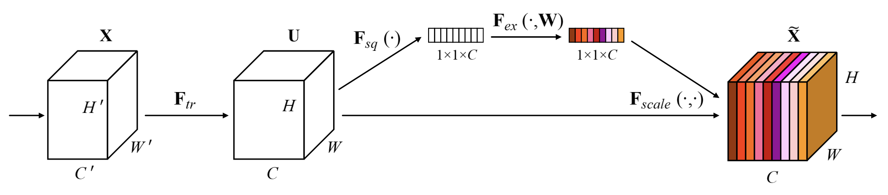
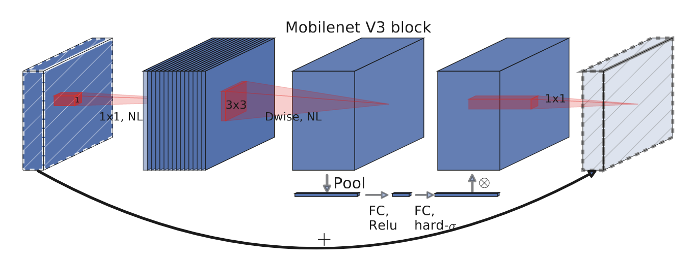
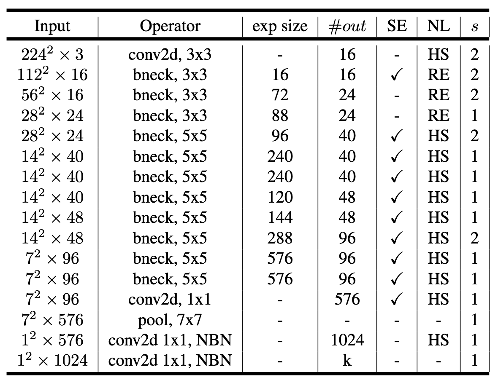
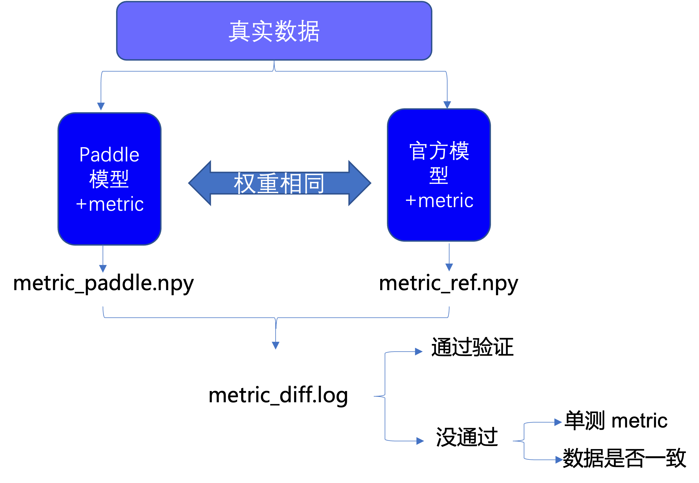
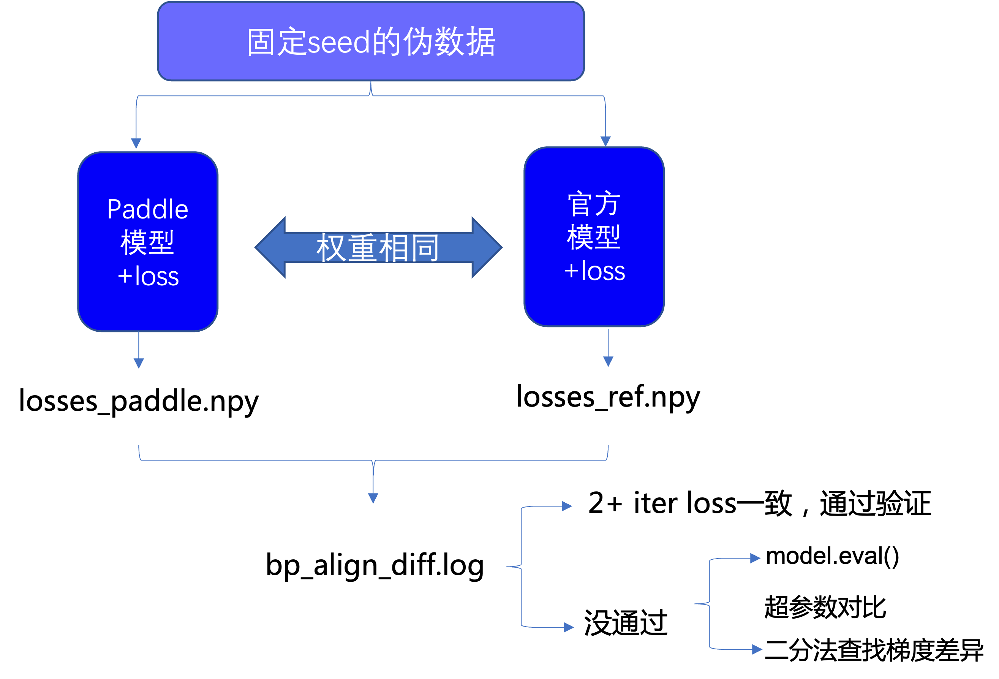

# CV - 快速上手

本文以经典网络 MobileNetV3 为例，结合代码来详细介绍如何从 PyTorch 迁移到飞桨，以便快速掌握迁移的基本思路和解决方法。

## 一、概述

### 1.1 框架对比

在介绍迁移之前，先以 MobileNetV3-Small 典型网络为例，对比一下飞桨与 PyTorch 的训练代码。

飞桨代码

```python
import paddle
from paddle.vision import transforms
from paddle.vision.models import MobileNetV3Small

# 1. 定义数据集、数据预处理方法与 DataLoader
transform = transforms.Compose([
    transforms.Resize(224),
    transforms.ToTensor(),
    transforms.Normalize((0.5, 0.5, 0.5), (0.5, 0.5, 0.5))
])
train_set = paddle.vision.datasets.Cifar10(mode='train', transform=transform)
train_loader = paddle.io.DataLoader(train_set, batch_size=256, num_workers=8)
# 2. 定义网络结构
net = MobileNetV3Small(num_classes=10)
# 3. 定义损失函数
net_loss = paddle.nn.CrossEntropyLoss()
# 4. 定义优化器
optimizer = paddle.optimizer.Adam(learning_rate=0.001, parameters=net.parameters())

net.train()
for epoch in range(10):
    for batch_idx, data in enumerate(train_loader, start=0):
        inputs, labels = data
        optimizer.clear_grad()
        # 5. 前向传播并计算损失
        outputs = net(inputs)
        loss = net_loss(outputs, labels)
        # 6. 反向传播
        loss.backward()
        # 7. 更新参数
        optimizer.step()
        print('Epoch %d, Iter %d, Loss: %.5f' % (epoch + 1, batch_idx + 1, loss))
print('Finished Training')
# 8. 保存模型
path = './mobilenetv3.pdparams'
paddle.save(net.state_dict(), path)
```

PyTorch 代码

```python
import torch
import torchvision
from torchvision import transforms
from torchvision.models import mobilenet_v3_small

# 1. 定义数据集、数据预处理方法与 DataLoader
transform = transforms.Compose([
    transforms.Resize(224),
    transforms.ToTensor(),
    transforms.Normalize((0.5, 0.5, 0.5), (0.5, 0.5, 0.5))
])
train_set = torchvision.datasets.CIFAR10(
    root='./data',
    train=True,
    download=True,
    transform=transform
)
train_loader = torch.utils.data.DataLoader(train_set, 256, num_workers=8)
# 2. 定义网络结构
net = mobilenet_v3_small(num_classes=10)
# 3. 定义损失函数
net_loss = torch.nn.CrossEntropyLoss()
# 4. 定义优化器
optimizer = torch.optim.Adam(net.parameters(), lr=0.001)

device = torch.device('cuda' if torch.cuda.is_available() else 'cpu')
net.to(device)
net.train()
for epoch in range(10):
    for batch_idx, data in enumerate(train_loader, start=0):
        inputs, labels = data
        optimizer.zero_grad()
        # 5. 前向传播并计算损失
        inputs = inputs.to(device)
        labels = labels.to(device)
        outputs = net(inputs)
        loss = net_loss(outputs, labels)
        # 6. 反向传播
        loss.backward()
        # 7. 更新参数
        optimizer.step()
        print('Epoch %d, Iter %d, Loss: %.5f' % (epoch + 1, batch_idx + 1, loss))
print('Training Finished')
# 8. 保存模型
path = './mobilenetv3.pth'
torch.save(net.state_dict(), path)
```

通过上面的代码对比可以看到：

* 使用飞桨搭训练神经网络流程与 PyTorch 类似，主要包括：构建数据集对象、定义正向网络结构、定义 Loss、定义优化器、迭代数据集对象、执行正向传播、输出 Loss、执行反向传播计算梯度、优化器更新参数。
* 飞桨支持的算子在命名或者功能上与 PyTorch 存在一定差异。

### 1.2 迁移任务简介

MobileNetV3 是 CV 中经典的深度神经网络，有较多开发者关注和复现，并且在算子支持方面，飞桨与 PyTorch 也比较一致，因此，本任务以 MobileNetV3 为例 。任务目标是参考 MobileNetV3 的论文，将 PyTorch 实现的模型迁移为飞桨模型，在 GPU 单卡下通过模型训练、评估和预测，并在相同条件下迁移后的模型训练精度达到预期效果。

需要注意的是对于部分网络，即使使用相同的硬件环境和脚本代码，由于数据增广、模型初始化的随机性，最终达到的收敛精度和性能也可能与原项目的结果有细微差别，这属于正常的波动范围。

* 论文：https://arxiv.org/abs/1905.02244
* PyTorch 源代码：
https://github.com/PaddlePaddle/models/tree/release/2.3/tutorials/mobilenetv3_prod/Step1-5/mobilenetv3_ref

**【迁移任务解析】**

根据模型训练的常规流程，可将整个迁移任务划分为：模型前向对齐、数据读取对齐、评估指标对齐、损失函数对齐、反向梯度对齐、训练精度对齐。

* 模型前向对齐：PyTorch 的大部分 API 在飞桨中可找到对应 API，可以参考 PyTorch-PaddlePaddle API 映射表，模型组网部分代码直接进行手动转换即可；为了判断转换后的 飞桨模型组网能获得和 PyTorch 参考实现同样的输出，可将两个模型参数固定，并输入相同伪数据，观察两者的产出差异是否在阈值内。
* 数据读取对齐：相同的神经网络使用不同的数据训练和测试得到的结果往往会存在较大差异。为了能完全复现原始的模型，需要保证使用的数据完全相同，包括数据集的版本、使用的数据增强方式。
* 模型训练对齐：为了验证迁移后的模型能达到相同的精度，需要确保迁移模型使用的评价指标、损失函数与原模型相同，以便原模型与迁移后的模型对比。
  * 评估指标对齐：飞桨提供了一系列 Metric 计算类，而 PyTorch 中目前可以通过组合的方式实现。应确保使用的指标与原代码含义一致，以便对照精度。
  * 损失函数对齐：训练迁移后的模型时，需要使用与原代码相同的损失函数。飞桨与 PyTorch 均提供了常用的损失函数，二者的 API 对应关系可参考 Loss 类 API 映射列表。
  * 超参代码转换：训练过程中需要保证学习率、优化器、正则化系统等超参对齐。飞桨中的 optimizer 有 paddle.optimizer 等一系列实现，PyTorch 中则有 torch.optim 等一系列实现。对照 PaddlePaddle 正则化 API 文档与参考代码的优化器实现进行转换，用之后的反向梯度对齐统一验证该模块的正确性。
  * 反向梯度对齐：前向对齐完成后，还需进行反向对齐，即确保迁移后的模型反向传播、权重更新与原模型一致。可以通过两轮训练进行检查，若迁移前后的模型第二轮训练的 loss 一致，则可以认为二者反向已对齐。
  * 训练精度对齐：对比迁移前后模型的训练精度，若二者的差值在可以接受的误差范围内，则精度对齐完成。
  * 训练性能对齐：在相同的硬件条件下，迁移前后的模型训练速度应接近。若二者差异非常大，则需要排查原因。

为了更方便地对齐验证，飞桨提供了 reprod_log 差异核验工具辅助查看飞桨和 PyTorch 模型在同样输入下的输出是否相同，这样的查看方式具有标准统一、比较过程方便等优势。

**【迁移任务结果】**

迁移后的飞桨实现：
https://github.com/PaddlePaddle/models/tree/release/2.3/tutorials/mobilenetv3_prod/Step1-5/mobilenetv3_paddle

## 二、迁移准备工作

模型迁移前，需要准备运行环境，并准备好参考代码以及模型对齐所需的数据集。

### 2.1 准备环境

准备环境包括安装飞桨、安装差异核验工具 reprod_log 和安装 PyTorch。

1. 安装飞桨

    ```bash
    # 推荐安装最新版本的飞桨
    # 安装 GPU 版本的飞桨
    pip install paddlepaddle-gpu
    ```

    运行 Python，输入下面的命令：

    ```Python
    import paddle
    paddle.utils.run_check()
    ```
2. 安装差异核验工具 reprod_log

    在对齐验证的流程中，依靠差异核验工具 reprod_log 查看飞桨和 PyTorch 同样输入下的输出是否相同，这样的查看方式具有标准统一，比较过程方便等优势。

    reprod_log 是一个用于 numpy 数据记录和对比工具，通过传入需要对比的两个 numpy 数组就可以在指定的规则下得到数据之差是否满足期望的结论。其主要接口的说明可以查看其 [GitHub 主页](https://github.com/PaddlePaddle/models/tree/release/2.3/tutorials/reprod_log)。

    安装 reprod_log 的命令如下：

    ```bash
    pip3 install reprod_log --force-reinstall
    ```

3. 安装 PyTorch

    对于 PyTorch 的安装，请参阅 [PyTorch 官网](https://pytorch.org/get-started/locally/)，选择操作系统和 CUDA 版本，使用相应的命令安装。

    运行 Python，输入下面的命令，如果可以正常输出，则说明 PyTorch 安装成功。

    ```python
    import torch
    print(torch.__version__)
    # 如果安装的是 gpu 版本，可以按照下面的命令确认 torch 是否安装成功
    # 期望输出为 tensor([1.], device='cuda:0')
    print(torch.Tensor([1.0]).cuda())
    ```

### 2.2 准备数据

* 了解该模型输入输出格式：以 Mobilenet V3 图像分类任务为例，通过阅读论文与参考代码，了解到模型输入为[batch_size, 3, 224, 244]的 tensor，类型为 float32 或者 float16，label 为[batch, ]的 label，类型为 int64。
* 准备伪输入数据（fake input data）以及伪标签（fake label）：通过运行生成伪数据的参考代码：[mobilenetv3_prod/Step1-5/utilities.py](https://github.com/PaddlePaddle/models/blob/release%2F2.2/tutorials/mobilenetv3_prod/Step1-5/utilities.py)，生成和模型输入 shape、type 等保持一致的伪数据，并保存在本地，用于后续模型前反向对齐时同时作为两个模型的输入。这样的方式能够使保证模型对齐不会受到输入数据的影响，有助于将模型结构对齐和数据对齐解耦，更为方便地排查问题。伪数据可以通过如下代码生成，data 目录下也提供了生成好的伪数据（./data/fake_*.npy）。

```python
def gen_fake_data():
    fake_data=np.random.rand(1, 3, 224, 224).astype(np.float32) -0.5
    fake_label=np.arange(1).astype(np.int64)
    np.save("fake_data.npy", fake_data)
    np.save("fake_label.npy", fake_label)
```

### 2.3 分析并运行参考代码

需在特定设备(CPU/GPU)上，利用少量伪数据，跑通参考代码的预测过程(前向)以及至少 2 轮(iteration)迭代过程，用于生成和迁移代码进行对比的结果。

PyTorch 的实现：

https://github.com/PaddlePaddle/models/tree/release/2.3/tutorials/mobilenetv3_prod/Step1-5/mobilenetv3_ref

项目的目录结构如下：

```
torchvision
    |--datasets                             # 用到的 torchvision 库中的代码
    |--models                               # 模型组网相关代码
         |--__init__.py
         |--_utils.py                       # 工具类及函数
         |--misc_torch.py                   # 组成网络的子模块
         |--mobilenet_v3_torch.py           # 模型网络结构定义
    |--transforms                           # 数据增强实现
    |--__init__.py
    |--_internally_replaced_utils.py
__init__.py
metric.py                                   # 评价指标(Top-k)实现
presets.py                                  # 数据增强设定
train.py                                    # 模型训练代码
utils.py                                    # 工具类及函数
```

为便于对比，已将使用到的 torchvision 库的代码提取出来放到 torchvision 目录下，三个子目录内的代码分别对应 torchvision.Datasets, torchvision.models 和 torchvision.transforms。checkpoint.pth 是保存的权重文件，以便前向对齐时加载使用。

为了便于实例的演示，可将以上参考代码下载到本地。

```bash
# 克隆参考代码所在的项目 repo 到本地
git clone https://github.com/PaddlePaddle/models.git
cd models/tutorials/mobilenetv3_prod/
```

完成以上迁移准备之后，通过下面对应训练流程的拆解步骤进行迁移对齐。

## 三、模型前向对齐

模型前向对齐，是指给定相同的输入数据和权重，迁移后的模型与原模型前向传播的输出结果一致。前向对齐一般分为 3 个主要步骤：

* 网络结构代码转换
* 权重转换
* 模型组网正确性验证

下面详细介绍这 3 个部分。

### 3.1 网络结构代码转换

PyTorch 模块通常继承 torch.nn.Module，飞桨模块通常继承 paddle.nn.Layer；二者对模块的定义方法是类似的，即在 __init__中定义模块中用到的子模块，然后 forward 函数中定义前向传播的方式。因此，网络结构代码转换，主要工作是 API 的转换，即将调用的 PyTorch API 替换成对应的飞桨 API 即可。PyTorch 的 API 和飞桨的 API 非常相似，可以参考[PyTorch-飞桨 API 映射表](https://www.paddlepaddle.org.cn/documentation/docs/zh/guides/model_convert/pytorch_api_mapping_cn.html)，直接对组网部分代码进行手动转换。

**【转换前】**

PyTorch 实现的 MobileNetV3 网络结构代码：[mobilenetv3_ref/torchvision/models](https://github.com/PaddlePaddle/models/tree/release/2.2/tutorials/mobilenetv3_prod/Step1-5/mobilenetv3_ref/torchvision/models)。

```
models                               # 模型组网相关代码
  |--__init__.py
  |--_utils.py                       # 工具类及函数
  |--misc_torch.py                   # 组成网络的子模块
  |--mobilenet_v3_torch.py           # 模型网络结构定义
```

**【转换后】**

转换后的飞桨实现：[mobilenetv3_paddle/paddlevision/models](https://github.com/PaddlePaddle/models/tree/release/2.3/tutorials/mobilenetv3_prod/Step1-5/mobilenetv3_paddle/paddlevision/models)

**【源码分析】**

分析 MobileNetV3 网络代码，主要分为以下几个模块：

* [SqueezeExcitation](https://github.com/PaddlePaddle/models/blob/release/2.2/tutorials/mobilenetv3_prod/Step1-5/mobilenetv3_ref/torchvision/models/misc_torch.py#L157)：定义了 SE 模块，由全局平均池化（AdaptiveAvgPool2D）、全连接层（Linear）以及激活函数组成。



图 Squeeze Excitation 模块

* [ConvNormActivation](https://github.com/PaddlePaddle/models/blob/release/2.2/tutorials/mobilenetv3_prod/Step1-5/mobilenetv3_ref/torchvision/models/misc_torch.py#L99)：继承自 `torch.nn.Sequential`，由 Conv、BatchNorm 和激活函数构成。
* [InvertedResidual](https://github.com/PaddlePaddle/models/blob/release/2.2/tutorials/mobilenetv3_prod/Step1-5/mobilenetv3_ref/torchvision/models/mobilenet_v3_torch.py#L65)：MobileNetV3 网络中的基本模块，由三个 Conv-BN-Activation 模块组成，分别实现通道扩张、深度可分离卷积和投影。



图 Inverted Residual 模块

* MobileNetV3：定义了整体网络架构。封装了多个 `InvertedResidual` 模块以及 `ConvNormActivation` 和 `Linear` 模块，传入不同的参数即可构造不同的 MobileNetV3 系列网络。在该结构中，也使用了一些 PyTorch 自定义的初始化功能。



图 MobileNetV3-Small 网络结构

**【转换步骤】**

基于以上子网划分，我们根据 PyTorch 与飞桨 API，完成上述模块的转换：

1. [SqueezeExcitation](https://github.com/PaddlePaddle/models/blob/release/2.3/tutorials/mobilenetv3_prod/Step1-5/mobilenetv3_paddle/paddlevision/models/misc_paddle.py#L43) 模块：将继承的基类由 `torch.nn.Module` 改成 `paddle.nn.Layer`，将 `torch.nn.AdaptiveAvgPool2d` 替换成 `paddle.nn.AdaptiveAvgPool2D`， `torch.nn.Conv2d` 替换成 `paddle.nn.Conv2D` 即可。
2. [ConvNormActivation](https://github.com/PaddlePaddle/models/blob/release/2.3/tutorials/mobilenetv3_prod/Step1-5/mobilenetv3_paddle/paddlevision/models/misc_paddle.py#L7) 模块：需要将 `torch.nn.Conv2d` 替换成 `paddle.nn.Conv2D` 即可。
3. [InvertedResidual](https://github.com/PaddlePaddle/models/blob/release/2.3/tutorials/mobilenetv3_prod/Step1-5/mobilenetv3_paddle/paddlevision/models/mobilenet_v3_paddle.py#L67) 模块：只需要将继承的基类由 `torch.nn.Module` 改成 `paddle.nn.Layer` 即可。
4. [MobileNetV3](https://github.com/PaddlePaddle/models/blob/release/2.3/tutorials/mobilenetv3_prod/Step1-5/mobilenetv3_paddle/paddlevision/models/mobilenet_v3_paddle.py#L130)：将继承的基类由 `torch.nn.Module` 改成 `paddle.nn.Layer`，由于飞桨的 `nn.Hardswish` 和 `nn.Dropout` 不提供 `inplace` 参数，因此需要将 PyTorch 代码中的 `inplace=True` 参数删去。

    PyTorch 代码

    ```python
    self.classifier = nn.Sequential(
        nn.Linear(lastconv_output_channels, last_channel),
        nn.Hardswish(inplace=True),
        nn.Dropout(
            p=dropout, inplace=True),
        nn.Linear(last_channel, num_classes), )
    ```

    飞桨代码

    ```python
    self.classifier = nn.Sequential(
        nn.Linear(lastconv_output_channels, last_channel),
        nn.Hardswish(),
        nn.Dropout(p=dropout),
        nn.Linear(last_channel, num_classes), )
    ```
5. 权重初始化

    对于权重初始化，飞桨提供了大量的初始化方法，包括 `Constant`, `KaimingUniform`, `KaimingNormal`,  `TruncatedNormal`,  `Uniform`,  `XavierNormal`,  `XavierUniform` 等，有关初始化 API 的详细介绍，请参阅[初始化 API 官网文档](https://www.paddlepaddle.org.cn/documentation/docs/zh/api/paddle/nn/Overview_cn.html#chushihuaxiangguan)。

    考虑到向下兼容，飞桨的权重初始化定义方式与 PyTorch 存在区别。在 PyTorch 中，通常调用 `torch.nn.init` 下的函数来定义权重初始化方式，例如：
    ```python
    for m in self.modules():
        if isinstance(m, nn.Conv2d):
            nn.init.kaiming_normal_(m.weight, mode="fan_out")
        elif isinstance(m, (nn.BatchNorm2d, nn.GroupNorm)):
            nn.init.ones_(m.weight)
            nn.init.zeros_(m.bias)
        elif isinstance(m, nn.Linear):
            nn.init.normal_(m.weight, 0, 0.01)
            nn.init.zeros_(m.bias)
    ```
    飞桨的权重初始化是在定义模块时直接修改 API 的 ParamAttr 属性，与 torch.nn.init 系列 API 的使用方式不同，例如：
    ```python
    self.conv = nn.Conv2D(in_channels, out_channels, kernel_size, weight_attr=nn.initializer.KaimingNormal())
    self.fc = paddle.nn.Linear(4096, 512,
                weight_attr=init.Normal(0, 0.01),
                bias_attr=init.Constant(0))
    ```
    然而，对于较为复杂的网络结构代码，例如本例中的 MobileNetV3（它的 block 定义在 `InvertedResidual` 中，而 block 又用到 `Conv2dNormActivation` 模块），如果按照上述方式进行转换，需要到每一个相关的模块（`nn.Layer` 和 `nn.Sequential`）调用有关 API 处指定初始化方式，过程较为繁琐。因此，为了便于将 PyTorch 代码转换为飞桨代码，飞桨 [PaddleDetection](https://github.com/PaddlePaddle/PaddleDetection) 开发套件实现了与 torch.nn.init 系列 API 完全对齐的初始化 API，包括 `uniform_`, `normal_`, `constant_`, `ones_`, `zeros_`, `xavier_uniform_`, `xavier_normal_`, `kaiming_uniform_`, `kaiming_normal_`, `linear_init_`, `conv_init_`。关于上述 API 的实现细节，可以参考 [initializer.py](https://github.com/PaddlePaddle/PaddleDetection/blob/develop/ppdet/modeling/initializer.py)。

    为了提高迁移效率，这里直接使用上述 PaddleDetection 中的 API 进行初始化。转换后的初始化代码如下：
    ```python
    # 需要导入 initializer.py
    import initializer as init
    for _, m in self.named_sublayers():
        if isinstance(m, nn.Conv2D):
            init.kaiming_normal_(m.weight, mode="fan_out")
            if m.bias is not None:
                init.zeros_(m.bias)
        elif isinstance(m, (nn.BatchNorm2D, nn.GroupNorm)):
            init.ones_(m.weight)
            init.zeros_(m.bias)
        elif isinstance(m, nn.Linear):
            init.normal_(m.weight, 0, 0.01)
            init.zeros_(m.bias)
    ```
    关于模型权重初始化对齐的更多信息，请参阅[模型参数初始化对齐方法](https://github.com/PaddlePaddle/models/blob/release/2.3/tutorials/article-implementation/initializer.md)。

**【API 对比】**

本节用到的 PyTorch 与飞桨 API 对比如下表所示：

| PyTorch 组网 API   | 飞桨组网 API       | 主要差异说明   |
| ----------------- | ----------------- | ----------- |
| [torch.nn.Conv2d](https://pytorch.org/docs/stable/generated/torch.nn.Conv2d.html?highlight=conv2d#torch.nn.Conv2d)   | [paddle.nn.Conv2D](https://www.paddlepaddle.org.cn/documentation/docs/zh/api/paddle/nn/Conv2D_cn.html#conv2d)  | PyTorch `bias` 默认为 True，表示使用可更新的偏置参数。飞桨 `weight_attr`/`bias_attr` 默认使用默认的权重/偏置参数属性，否则为指定的权重/偏置参数属性，具体用法参见 [ParamAttr](https://www.paddlepaddle.org.cn/documentation/docs/zh/api/paddle/ParamAttr_cn.html#paramattr)；当 bias_attr 设置为 bool 类型与 PyTorch 的作用一致。其余差异请参阅 [paddle.nn.Conv2D 与 torch.nn.Conv2d 差异对比](https://github.com/PaddlePaddle/X2Paddle/blob/develop/docs/pytorch_project_convertor/API_docs/nn/torch.nn.Conv2d.md) |
| [torch.nn.BatchNorm2d](https://pytorch.org/docs/stable/generated/torch.nn.BatchNorm2d.html?highlight=batchnorm2d#torch.nn.BatchNorm2d) | [paddle.nn.BatchNorm2D](https://pytorch.org/docs/stable/generated/torch.nn.BatchNorm2d.html?highlight=batchnorm2d#torch.nn.BatchNorm2d) | 参数不一致，飞桨具有 `weight_Attr` 与 `bias_attr` 参数，用于指定通道的伸缩与偏移属性，而 PyTorch 无此参数；PyTorch 中有 `affine` 参数，表示是否进行仿射变换，飞桨无此参数。其余差异请参阅 [paddle.nn.BatchNorm2D 与 torch.nn.BatchNorm2d 差异对比](https://github.com/PaddlePaddle/X2Paddle/blob/develop/docs/pytorch_project_convertor/API_docs/nn/torch.nn.BatchNorm2d.md) |
| [torch.nn.AdaptiveAvgPool2d](https://pytorch.org/docs/stable/generated/torch.nn.AdaptiveAvgPool2d.html?highlight=adaptiveavgpool2d#torch.nn.AdaptiveAvgPool2d) | [paddle.nn.AdaptiveAvgPool2D](https://www.paddlepaddle.org.cn/documentation/docs/zh/api/paddle/nn/AdaptiveAvgPool2D_cn.html#adaptiveavgpool2d) | 功能一致，参数名不一致 |
| [torch.nn.Dropout](https://pytorch.org/docs/stable/generated/torch.nn.Dropout.html?highlight=dropout#torch.nn.Dropout) | [paddle.nn.Dropout](https://www.paddlepaddle.org.cn/documentation/docs/zh/api/paddle/nn/Dropout_cn.html#dropout) | PyTorch 有 `inplace` 参数，表示在不更改变量的内存地址的情况下，直接修改变量的值，飞桨无此参数。 |
| [torch.nn.Hardswish](https://pytorch.org/docs/stable/generated/torch.nn.Hardswish.html?highlight=hardswish#torch.nn.Hardswish) | [paddle.nn.Hardswish](https://www.paddlepaddle.org.cn/documentation/docs/zh/2.4rc/api/paddle/nn/Hardswish_cn.html#hardswish) | PyTorch 有 `inplace` 参数，表示在不更改变量的内存地址的情况下，直接修改变量的值，飞桨无此参数。 |
| [torch.nn.Linear](https://pytorch.org/docs/stable/generated/torch.nn.Linear.html?highlight=linear#torch.nn.Linear) | [paddle.nn.Linear](https://www.paddlepaddle.org.cn/documentation/docs/zh/api/paddle/nn/Linear_cn.html#linear) | PyTorch `bias` 默认为 True，表示使用可更新的偏置参数。飞桨 `weight_attr` / `bias_attr` 默认使用默认的权重/偏置参数属性，否则为指定的权重/偏置参数属性，具体用法参见 [ParamAttr](https://www.paddlepaddle.org.cn/documentation/docs/zh/api/paddle/ParamAttr_cn.html#paramattr)；当 `bias_attr` 设置为 bool 类型与 PyTorch 的作用一致。 |

### 3.2 模型权重转换

网络结构代码转换完成之后，由于 PyTorch 与飞桨的权重保存格式略有不同，需要对模型权重进行转换，才能被飞桨模型正确读取。

**【转换前】**

PyTorch 的模型权重：[data/mobilenet_v3_small-047dcff4.pth](https://github.com/PaddlePaddle/models/blob/release/2.2/tutorials/mobilenetv3_prod/Step1-5/data/mobilenet_v3_small-047dcff4.pth)

**【转换后】**

转换后的飞桨模型权重保存为：[data/mv3_small_paddle.pdparams](https://github.com/PaddlePaddle/models/blob/release/2.2/tutorials/mobilenetv3_prod/Step1-5/data/mobilenet_v3_small-047dcff4.pth)

**【转换步骤】**

1. 将 PyTorch 格式的 MobileNetV3 模型参数 [data/mobilenet_v3_small-047dcff4.pth](https://github.com/PaddlePaddle/models/blob/release/2.2/tutorials/mobilenetv3_prod/Step1-5/data/mobilenet_v3_small-047dcff4.pth) 保存在本地。

    本实例 PyTorch 代码中已经提供权重，直接下载并进行后续的转换即可。如果没有提供，则可以基于 PyTorch 代码，随机生成一个初始化权重(定义完 model 以后，使用 torch.save() API 保存模型权重)。

2. 执行 [torch2paddle.py](https://github.com/PaddlePaddle/models/blob/release/2.3/tutorials/mobilenetv3_prod/Step1-5/torch2paddle.py) 进行权重转换。

    运行完成之后，会在当前目录生成 mv3_small_paddle.pdparams 文件，即为转换后的飞桨预训练模型。

    [torch2paddle.py](https://github.com/PaddlePaddle/models/blob/release/2.3/tutorials/mobilenetv3_prod/Step1-5/torch2paddle.py) 实现的功能是将 PyTorch 的权重字典转换为飞桨的权重字典，将 `Linear` 层的 `weight` 参数以及 `BatchNorm2D` 的参数名转换成飞桨的形式。代码实现如下：

    ```python
    import numpy as np
    import torch
    import paddle

    def torch2paddle():
        torch_path = "./data/mobilenet_v3_small-047dcff4.pth"
        paddle_path = "./data/mv3_small_paddle.pdparams"
        torch_state_dict = torch.load(torch_path)
        fc_names = ["classifier"]
        paddle_state_dict = {}
        for k in torch_state_dict:
            if "num_batches_tracked" in k:  # 飞桨中无此参数，无需保存
                continue
            v = torch_state_dict[k].detach().cpu().numpy()
            flag = [i in k for i in fc_names]
            if any(flag) and "weight" in k:
                new_shape = [1, 0] + list(range(2, v.ndim))
                print(
                    f"name: {k}, ori shape: {v.shape}, new shape: {v.transpose(new_shape).shape}"
                )
                v = v.transpose(new_shape)   # 转置 Linear 层的 weight 参数
            # 将 torch.nn.BatchNorm2d 的参数名称改成 paddle.nn.BatchNorm2D 对应的参数名称
            k = k.replace("running_var", "_variance")
            k = k.replace("running_mean", "_mean")
            # 添加到飞桨权重字典中
            paddle_state_dict[k] = v
        paddle.save(paddle_state_dict, paddle_path)


    if __name__ == "__main__":
        torch2paddle()
    ```

### 3.3 模型前向对齐验证

为了判断模型组网部分能获得和原论文同样的输出，将两个模型参数固定，并输入相同伪数据，观察飞桨模型产出的 logit 是否和 PyTorch 模型一致。该步骤可使用 reprod_log 工具验证。

**【验证步骤】**

使用脚本 [mobilenetv3_prod/Step1-5/01_test_forward.py](https://github.com/PaddlePaddle/models/blob/release/2.3/tutorials/mobilenetv3_prod/Step1-5/01_test_forward.py)，运行如下命令，验证模型前向对齐效果。

验证结果存放的日志文件：[mobilenetv3_prod/Step1-5/result/log/forward_diff.log](https://github.com/PaddlePaddle/models/blob/release/2.2/tutorials/mobilenetv3_prod/Step1-5/result/log/forward_diff.log)

```bash
# 运行验证正确性的脚本
cd models/tutorials/mobilenetv3_prod/
python 01_test_forward.py
```

验证脚本执行了如下操作：

1. 将“2.2 准备数据”章节生成的伪数据 (fake_data.npy 和 fake_label.npy)，送入 PyTorch 模型获取输出，使用 reprod_log 保存结果。

    ```python
    # 加载 torch 模型及权重
    torch_model = mv3_small_torch()
    torch_model.eval()
    torch_state_dict = torch.load("./data/mobilenet_v3_small-047dcff4.pth")
    torch_model.load_state_dict(torch_state_dict)
    torch_model.to(torch_device)

    # 加载数据
    inputs = np.load("./data/fake_data.npy")

    # 保存 torch 模型的输出结果
    torch_out = torch_model(
        torch.tensor(
            inputs, dtype=torch.float32).to(torch_device))
    reprod_logger.add("logits", torch_out.cpu().detach().numpy())
    reprod_logger.save("./result/forward_ref.npy")
    ```

2. 将“2.2 准备数据”章节生成的伪数据 (fake_data.npy 和 fake_label.npy)，送入飞桨模型获取输出，使用 reprod_log 保存结果。

    ```python
    # 加载飞桨模型及权重
    paddle_model = mv3_small_paddle()
    paddle_model.eval()
    paddle_state_dict = paddle.load("./data/mv3_small_paddle.pdparams")
    paddle_model.set_dict(paddle_state_dict)

    # 加载数据
    inputs = np.load("./data/fake_data.npy")

    # 保存飞桨模型的输出结果
    reprod_logger = ReprodLogger()
    paddle_out = paddle_model(paddle.to_tensor(inputs, dtype="float32"))
    reprod_logger.add("logits", paddle_out.cpu().detach().numpy())
    reprod_logger.save("./result/forward_paddle.npy")
    ```

3. 使用 reprod_log 检查两个 tensor 的差值，小于阈值则核验通过。

    ```python
    # 分别加载两个模型的输出结果
    diff_helper = ReprodDiffHelper()
    torch_info = diff_helper.load_info("./result/forward_ref.npy")
    paddle_info = diff_helper.load_info("./result/forward_paddle.npy")

    # 比较输出结果并生成日志文件
    diff_helper.compare_info(torch_info, paddle_info)
    diff_helper.report(
        path="./result/log/forward_diff.log", diff_threshold=1e-5)
    ```
    查看日志文件 result/log/forward_diff.log。
    ```
    INFO: logits:
    INFO:     mean diff: check passed: True, value: 1.7629824924370041e-06
    INFO: diff check passed
    ```
    由于前向算子计算导致的微小的差异，一般而言前向误差在 1e-5 左右的 diff 是可以接受的。通过以上结果，可以判断网络已前向对齐。

## 四、数据读取对齐
相同的神经网络使用不同的数据训练和测试得到的结果往往会存在较大差异。为了能复现原始模型的结果，需要保证迁移后的数据加载与原始代码一致，包括数据集的版本、使用的数据增强方式、数据的采样方式。

### 4.1 小数据集准备

为快速验证数据读取以及后续的训练/评估/预测，建议准备一个小数据集（训练集和验证集各 8~16 张图像即可，压缩后数据大小建议在 20MB 以内），放在 Step1-5/lite_data 文件夹下；也可以直接解压 [lite_data.tar](https://github.com/PaddlePaddle/models/blob/release%2F2.2/tutorials/mobilenetv3_prod/Step6/test_images/lite_data.tar) 作为测试数据，放在 Step1-5/lite_data 文件夹下。

```bash
cd models/tutorials/mobilenetv3_prod/Step6/test_images
tar -xvf lite_data.tar
mv lite_data ../../Step1-5
```

### 4.2 数据读取代码转换

读取相同的输入，比较预处理、数据增强后输出之间的差异，即可验证预处理及数据增强是否和参考实现保持一致。

**【源码分析】**

PyTorch 实现的数据加载[代码](https://github.com/PaddlePaddle/models/blob/release/2.3/tutorials/mobilenetv3_prod/Step1-5/utilities.py#L48)：

```python
from torchvision.transforms import transforms
import torchvision.datasets
import torch.utils.data
import mobilenetv3_ref.presets as presets_torch

# mobilenetv3_ref/presets.py
class ClassificationPresetEval:
    def __init__(self,
                 crop_size,
                 resize_size=256,
                 mean=(0.485, 0.456, 0.406),
                 std=(0.229, 0.224, 0.225)):

        # 定义数据预处理方法
        self.transforms = transforms.Compose([
            transforms.Resize(resize_size),
            transforms.CenterCrop(crop_size),
            transforms.ToTensor(),
            transforms.Normalize(
                mean=mean, std=std),
        ])

    def __call__(self, img):
        return self.transforms(img)

def build_torch_data_pipeline():
    # 从文件夹中加载数据集
    dataset_test = torchvision.datasets.ImageFolder(
        "./lite_data/val/",
        presets_torch.ClassificationPresetEval(
            crop_size=224, resize_size=256),
        is_valid_file=None)

    test_sampler = torch.utils.data.SequentialSampler(dataset_test)

    data_loader_test = torch.utils.data.DataLoader(
        dataset_test,
        batch_size=4,
        sampler=test_sampler,
        num_workers=0,
        pin_memory=True)
    return dataset_test, data_loader_test
```

这里采用了 `Resize`、`CenterCrop`、`ToTensor` 和 `Normalize` 4 种预处理方法，为了保证数据读取对齐，从前面准备好的小数据集文件夹中读取数据构建数据集，并采用顺序采样方式，DataLoader 的 `batch_size` 设为 4。

**【转换步骤】**

PyTorch 使用到的 torchvision 的数据预处理和数据增强 API 在飞桨中均有直接对应，且名称相同，直接转换即可。

转换后的飞桨实现：

```python
import paddle.vision.transforms
import paddle.io
import mobilenetv3_paddle.presets as presets_paddle

# mobilenetv3_paddle/presets.py
class ClassificationPresetEval:
    def __init__(self,
                 crop_size,
                 resize_size=256,
                 mean=(0.485, 0.456, 0.406),
                 std=(0.229, 0.224, 0.225)):

        # 定义数据预处理方法
        self.transforms = transforms.Compose([
            transforms.Resize(resize_size),
            transforms.CenterCrop(crop_size),
            transforms.ToTensor(),
            transforms.Normalize(
                mean=mean, std=std),
        ])

    def __call__(self, img):
        return self.transforms(img)

def build_paddle_data_pipeline():
    # 从文件夹中加载数据集
    dataset_test = paddlevision.datasets.ImageFolder(
        "./lite_data/val/",
        presets_paddle.ClassificationPresetEval(
            crop_size=224, resize_size=256))

    test_sampler = paddle.io.SequenceSampler(dataset_test)

    test_batch_sampler = paddle.io.BatchSampler(
        sampler=test_sampler, batch_size=4)

    data_loader_test = paddle.io.DataLoader(
        dataset_test, batch_sampler=test_batch_sampler, num_workers=0)

    return dataset_test, data_loader_test
```

**【API 对比】**

PyTorch 在 torchvision.transforms 中提供了很多数据预处理及数据增强 API，而飞桨在 paddle.vision.transform 中提供了相应的数据增强 API。二者大多数 API 功能一致，少部分 API 存在差异，详情请参阅 [视觉类 API 映射表](https://www.paddlepaddle.org.cn/documentation/docs/zh/guides/model_convert/pytorch_api_mapping_cn.html#id4)。

飞桨与 PyTorch 的数据加载类 API 对比如下表所示 。

| PyTorch 数据读取相关 API | 飞桨数据读取相关 API | 主要差异说明 | 作用 |
| ---------------------- | ----------------- | ---------- | ---- |
| torch.utils.data.Dataset | paddle.io.Dataset | - | 提供多种已有的数据集用于后续加载，可以理解为官方构建的 `Dataset` 类 |
| torch.utils.data.DataLoader | paddle.io.DataLoader | 飞桨没有 `pin_memory` 参数；飞桨增加了 `use_shared_memory` 参数用于选择是否使用共享内存加速数据加载过程 | 进行数据加载，将数据分成批数据，并提供加载过程中的采样方式 |

### 4.3 数据读取对齐验证
读取相同的输入，比较数据增强后输出之间的差异，即可判断迁移后的数据增强是否和[参考实现](https://github.com/PaddlePaddle/models/blob/release/2.3/tutorials/mobilenetv3_prod/Step1-5/mobilenetv3_ref/presets.py)保持一致。

**【验证步骤】**

执行以下命令运行 [02_test_data.py](https://github.com/PaddlePaddle/models/blob/release/2.3/tutorials/mobilenetv3_prod/Step1-5/02_test_data.py) ，检查数据读取部分对齐。

```bash
python 02_test_data.py
```

运行脚本后，查看日志文件 result/log/data_diff.log，如果输出以下命令行，说明验证结果满足预期，数据读取部分验证通过。

```
[2022/01/03 16:51:05] root INFO: length:
[2022/01/03 16:51:05] root INFO:        mean diff: check passed: True, value: 0.0
[2022/01/03 16:51:05] root INFO: dataloader_0:
[2022/01/03 16:51:05] root INFO:        mean diff: check passed: True, value: 0.0
[2022/01/03 16:51:05] root INFO: dataloader_1:
[2022/01/03 16:51:05] root INFO:        mean diff: check passed: True, value: 0.0
[2022/01/03 16:51:05] root INFO: dataloader_2:
[2022/01/03 16:51:05] root INFO:        mean diff: check passed: True, value: 0.0
[2022/01/03 16:51:05] root INFO: dataloader_3:
[2022/01/03 16:51:05] root INFO:        mean diff: check passed: True, value: 0.0
[2022/01/03 16:51:05] root INFO: diff check passed
```

验证脚本 [02_test_data.py](https://github.com/PaddlePaddle/models/blob/release/2.3/tutorials/mobilenetv3_prod/Step1-5/02_test_data.py) 主要执行以下操作：

1. 分别调用 `build_paddle_data_pipeline` 和 `build_torch_data_pipeline` 生成数据集和 DataLoader。
2. 分别取两个 DataLoader 产生的前 4 个 batch 的数据，转换为 numpy 数组，写入文件中。
3. 利用 ReprodDiffHelper 检查两个文件中的数据是否一致。

    [02_test_data.py](https://github.com/PaddlePaddle/models/blob/release/2.3/tutorials/mobilenetv3_prod/Step1-5/02_test_data.py) 的代码实现如下：

    ```python
    import os
    import sys
    import torch
    import paddle
    import numpy as np
    from PIL import Image
    from reprod_log import ReprodLogger, ReprodDiffHelper
    from utilities import build_paddle_data_pipeline, build_torch_data_pipeline


    def test_data_pipeline():
        paddle_dataset, paddle_dataloader = build_paddle_data_pipeline()
        torch_dataset, torch_dataloader = build_torch_data_pipeline()

        logger_paddle_data = ReprodLogger()
        logger_torch_data = ReprodLogger()

        # 记录数据集的大小，检查是否一致
        logger_paddle_data.add("length", np.array(len(paddle_dataset)))
        logger_torch_data.add("length", np.array(len(torch_dataset)))

        for idx, (paddle_batch, torch_batch
                ) in enumerate(zip(paddle_dataloader, torch_dataloader)):
            if idx >= 5:  # 验证前 4 个 batch
                break
            logger_paddle_data.add(f"dataloader_{idx}", paddle_batch[0].numpy())
            logger_torch_data.add(f"dataloader_{idx}",
                                torch_batch[0].detach().cpu().numpy())
        logger_paddle_data.save("./result/data_paddle.npy")
        logger_torch_data.save("./result/data_ref.npy")


    if __name__ == "__main__":
        test_data_pipeline()

        # 从文件中加载数据
        diff_helper = ReprodDiffHelper()
        torch_info = diff_helper.load_info("./result/data_ref.npy")
        paddle_info = diff_helper.load_info("./result/data_paddle.npy")

        # 比较结果并输出到日志中
        diff_helper.compare_info(torch_info, paddle_info)
        diff_helper.report(path="./result/log/data_diff.log")
    ```

## 五、模型训练对齐

### 5.1 评估指标对齐

#### 5.1.1 评估指标代码转换

对于分类问题，常用的指标为 Top-1 acc 和 Top-5 acc，示例 PyTorch 源代码中给出了 Top-k acc 的实现，下面给出转换为飞桨代码的示例。

**【转换前】**

PyTorch 实现的 Top-k 指标[代码](https://github.com/PaddlePaddle/models/blob/release/2.3/tutorials/mobilenetv3_prod/Step1-5/mobilenetv3_ref/metric.py)：

```python
def accuracy_torch(output, target, topk=(1, )):
    """Computes the accuracy over the k top predictions for the specified values of k"""
    with torch.no_grad():
        maxk = max(topk)
        batch_size = target.size(0)

        _, pred = output.topk(maxk, 1, True, True)  # 得到前 k 个最大概率值的索引,从大到小排列
        pred = pred.t()
        correct = pred.eq(target[None])

        res = []
        for k in topk:
            correct_k = correct[:k].flatten().sum(dtype=torch.float32)
            res.append(correct_k * (100.0 / batch_size))
        return res
```

**【转换后】**

PyTorch 源代码中主要用到了 `torch.topk` 获得前 k 个最大概率值的索引，飞桨中对应的 `paddle.topk` API 与其用法基本一致，二者差异在于 `torch.topk` 提供了一个 `out` 参数而 `paddle.topk` 则不提供，但这里并没有用到此参数，因此无需对代码进行转换。其他代码进行简单映射即可，例如 `torch.eq` 对应 `paddle.equal`，数据类型 `torch.float32` 在飞桨中以字符串 `"float32"` 指定。

转换后的飞桨实现：

```python
def accuracy_paddle(output, target, topk=(1, )):
    """Computes the accuracy over the k top predictions for the specified values of k"""
    with paddle.no_grad():
        maxk = max(topk)
        batch_size = target.shape[0]

        _, pred = output.topk(maxk, 1, True, True)  # 得到前 k 个最大概率值的索引,从大到小排列
        pred = pred.t()
        correct = pred.equal(target)

        res = []
        for k in topk:
            correct_k = correct.astype(paddle.int32)[:k].flatten().sum(
                dtype='float32')
            res.append(correct_k * (100.0 / batch_size))
        return res
```

`torch.topk` 与 `paddle.topk` 的差异如下：

| PyTorch | 飞桨 | 主要差异 | 作用 |
| ------- | --- | ------- | --- |
| [torch.topk](https://pytorch.org/docs/stable/generated/torch.topk.html) | [paddle.topk](https://www.paddlepaddle.org.cn/documentation/docs/zh/api/paddle/topk_cn.html#topk) | 飞桨未定义 `out` 出参数代表输出 Tensor | 返回给定 Tensor 的前 k 个最大或最小结果及结果所在的索引 |

#### 5.1.2 评估指标对齐验证

**【验证步骤】**

运行 [mobilenetv3_prod/03_test_metric.py](https://github.com/PaddlePaddle/models/blob/release/2.3/tutorials/mobilenetv3_prod/Step1-5/03_test_metric.py) 脚本，验证评估指标对齐效果。

```bash
cd models/tutorials/mobilenetv3_prod/
python 03_test_metric.py
```

验证后结果存放的日志文件：result/log/metric_diff.log。查看 metric_diff.log，若输出以下结果，则说明评估指标的实现正确。

```
INFO: acc_top1:
INFO:     mean diff: check passed: True, value: 0.0
INFO: acc_top5:
INFO:     mean diff: check passed: True, value: 0.0
INFO: diff check passed
```

验证脚本 [03_test_metric.py](https://github.com/PaddlePaddle/models/blob/release/2.3/tutorials/mobilenetv3_prod/Step1-5/03_test_metric.py) 的主要步骤包括：

1. 分别加载飞桨模型与 PyTorch 模型以及模型权重
2. 加载数据，生成飞桨与 PyTorch 的 DataLoader
3. 分别将一个 batch 的数据输入到飞桨与 PyTorch 模型，根据模型的输出，利用转换前后的 Top-k 函数计算 Top-1 和 Top-5 acc，并将结果转换为 numpy 数组保存到文件中
4. 利用 ReprodDiffHelper 检查两个文件中的数据是否一致

流程图如下：




代码实现如下：

```python
import torch
import paddle
import numpy as np
from reprod_log import ReprodLogger
from reprod_log import ReprodDiffHelper

from mobilenetv3_paddle.paddlevision.models import mobilenet_v3_small as mv3_small_paddle
from mobilenetv3_ref.torchvision.models import mobilenet_v3_small as mv3_small_torch
from mobilenetv3_ref import accuracy_torch
from mobilenetv3_paddle import accuracy_paddle
from utilities import build_paddle_data_pipeline, build_torch_data_pipeline
from utilities import evaluate


def test_forward():
    # 加载飞桨模型
    paddle_model = mv3_small_paddle()
    paddle_model.eval()
    paddle_state_dict = paddle.load("./data/mv3_small_paddle.pdparams")
    paddle_model.set_dict(paddle_state_dict)

    # 加载 torch 模型
    torch_model = mv3_small_torch()
    torch_model.eval()
    torch_state_dict = torch.load("./data/mobilenet_v3_small-047dcff4.pth")
    torch_model.load_state_dict(torch_state_dict)

    # 准备 logger 并加载数据
    reprod_logger = ReprodLogger()
    paddle_dataset, paddle_dataloader = build_paddle_data_pipeline()
    torch_dataset, torch_dataloader = build_torch_data_pipeline()
    for idx, (paddle_batch, torch_batch
              ) in enumerate(zip(paddle_dataloader, torch_dataloader)):
        if idx > 0:  # 用一个 batch 的数据评估
            break
        # 计算评估指标并保存到文件中
        evaluate(paddle_batch[0], paddle_batch[1], paddle_model,
                 accuracy_paddle, 'paddle', reprod_logger)
        evaluate(torch_batch[0], torch_batch[1], torch_model, accuracy_torch,
                 'ref', reprod_logger)


if __name__ == "__main__":
    test_forward()

    # 从文件中加载数据
    diff_helper = ReprodDiffHelper()
    torch_info = diff_helper.load_info("./result/metric_ref.npy")
    paddle_info = diff_helper.load_info("./result/metric_paddle.npy")
    print(torch_info, paddle_info)

    # 比较结果并输出到日志中
    diff_helper.compare_info(torch_info, paddle_info)
    diff_helper.report(path="./result/log/metric_diff.log")
```

其中，`evaluate` 函数的代码实现如下：

```python
def evaluate(image, labels, model, acc, tag, reprod_logger):
    model.eval()
    output = model(image)

    accracy = acc(output, labels, topk=(1, 5))

    reprod_logger.add("acc_top1", np.array(accracy[0]))
    reprod_logger.add("acc_top5", np.array(accracy[1]))

    reprod_logger.save("./result/metric_{}.npy".format(tag))
```

### 5.2 损失函数对齐

#### 5.2.1 损失函数代码转换

**【转换前】**

PyTorch 实现的损失函数[代码](https://github.com/PaddlePaddle/models/blob/release/2.3/tutorials/mobilenetv3_prod/Step1-5/04_test_loss.py#L45)：

```python
loss = torch.nn.CrossEntropyLoss(
    output, torch.tensor(
        labels, dtype=torch.int64))
```

**【转换后】**

转换后的飞桨[代码](https://github.com/PaddlePaddle/models/blob/release/2.3/tutorials/mobilenetv3_prod/Step1-5/04_test_loss.py#L37)：

```python
loss = paddle.nn.CrossEntropyLoss(
        output, paddle.to_tensor(
            labels, dtype="int64"))
```

**【转换步骤】**

本例采用的是分类任务中最常用的交叉熵损失函数，PyTorch 与飞桨均提供了这一函数。

转换步骤包括：

1. 将 `torch.nn.CrossEntropyLoss` 替换成 `paddle.nn.CrossEntropyLoss`。
2. 将 `torch.tensor` 函数替换成 `paddle.to_tensor`。
3. 将 `torch.int64` 改为字符串 `"int64"`。

**【API 对比】**

| PyTorch | 飞桨 | 主要差异 | 作用 |
| ------- | --- | ------- | --- |
| [torch.nn.CrossEntropyLoss](https://pytorch.org/docs/stable/generated/torch.nn.CrossEntropyLoss.html) | [paddle.nn.CrossEntropyLoss](https://www.paddlepaddle.org.cn/documentation/docs/zh/api/paddle/nn/CrossEntropyLoss_cn.html#crossentropyloss) | 飞桨提供了对软标签、指定 softmax 计算维度的支持 | 计算预测向量与标签之间的交叉熵损失 |

#### 5.2.2 损失函数对齐验证

**【验证步骤】**

执行 [mobilenetv3_prod/04_test_loss.py](https://github.com/PaddlePaddle/models/blob/release/2.3/tutorials/mobilenetv3_prod/Step1-5/04_test_loss.py) 脚本，验证损失函数的输出是否一致。

```bash
cd models/tutorials/mobilenetv3_prod/
python 04_test_loss.py
```

验证后结果存放的日志文件为：result/log/loss_diff.log，查看 loss_diff.log，若输出以下结果，则说明损失函数的实现正确。

```
INFO: loss:
INFO:     mean diff: check passed: True, value: 0.0
INFO: diff check passed
```

验证脚本 [04_test_loss.py](https://github.com/PaddlePaddle/models/blob/release/2.3/tutorials/mobilenetv3_prod/Step1-5/04_test_loss.py) 执行的主要步骤包括：

1. 分别加载飞桨模型与 PyTorch 模型以及模型权重
2. 加载前面生成好的伪数据
3. 分别将伪数据输入到飞桨与 PyTorch 模型，计算模型预测与标签间的损失函数，将损失函数的输出结果转换为 numpy 数组保存到文件中
4. 利用 ReprodDiffHelper 检查两个文件中的数据是否一致

[04_test_loss.py](https://github.com/PaddlePaddle/models/blob/release/2.3/tutorials/mobilenetv3_prod/Step1-5/04_test_loss.py) 代码实现如下：

```python
import torch
import paddle
import numpy as np
from reprod_log import ReprodLogger
from reprod_log import ReprodDiffHelper

from mobilenetv3_paddle.paddlevision.models import mobilenet_v3_small as mv3_small_paddle
from mobilenetv3_ref.torchvision.models import mobilenet_v3_small as mv3_small_torch


def test_forward():
    # 定义损失函数
    criterion_paddle = paddle.nn.CrossEntropyLoss()
    criterion_torch = torch.nn.CrossEntropyLoss()

    # 加载飞桨模型
    paddle_model = mv3_small_paddle()
    paddle_model.eval()
    paddle_state_dict = paddle.load("./data/mv3_small_paddle.pdparams")
    paddle_model.set_dict(paddle_state_dict)

    # 加载 torch 模型
    torch_model = mv3_small_torch()
    torch_model.eval()
    torch_state_dict = torch.load("./data/mobilenet_v3_small-047dcff4.pth")
    torch_model.load_state_dict(torch_state_dict)

    # 准备 logger 并加载前面生成的伪数据
    reprod_logger = ReprodLogger()
    inputs = np.load("./data/fake_data.npy")
    labels = np.load("./data/fake_label.npy")

    # 保存飞桨模型的输出结果
    paddle_out = paddle_model(paddle.to_tensor(inputs, dtype="float32"))
    loss_paddle = criterion_paddle(
        paddle_out, paddle.to_tensor(
            labels, dtype="int64"))
    reprod_logger.add("loss", loss_paddle.cpu().detach().numpy())
    reprod_logger.save("./result/loss_paddle.npy")

    # 保存 torch 模型的输出结果
    torch_out = torch_model(torch.tensor(inputs, dtype=torch.float32))
    loss_torch = criterion_torch(
        torch_out, torch.tensor(
            labels, dtype=torch.int64))
    reprod_logger.add("loss", loss_torch.cpu().detach().numpy())
    reprod_logger.save("./result/loss_ref.npy")


if __name__ == "__main__":
    test_forward()

    # 分别加载两个模型的输出结果
    diff_helper = ReprodDiffHelper()
    torch_info = diff_helper.load_info("./result/loss_ref.npy")
    paddle_info = diff_helper.load_info("./result/loss_paddle.npy")

    # 比较结果并输出到日志中
    diff_helper.compare_info(torch_info, paddle_info)
    diff_helper.report(path="./result/log/loss_diff.log")
```

#### 5.3 优化器代码转换

**【转换前】**

PyTorch 实现的优化器相关代码：

```python
max_iter = 3
lr = 1e-3
momentum = 0.9
opt_torch = torch.optim.SGD(torch_model.parameters(), lr=lr, momentum=momentum)
```

**【转换后】**

转换后的飞桨实现：

```python
max_iter = 3
lr = 1e-3
momentum = 0.9
opt_paddle = paddle.optimizer.Momentum(
        learning_rate=lr,
        momentum=momentum,
        parameters=paddle_model.parameters())
```

**【转换步骤】**

PyTorch 源代码中使用的是带有动量的 SGD。值得注意的是，飞桨中的 `paddle.optimizer.SGD` 不支持动量，因此此处转换使用 `paddle.optimizer.Momentum` 优化器，详情请参见 [Momentum-API 文档](https://www.paddlepaddle.org.cn/documentation/docs/zh/api/paddle/optimizer/Momentum_cn.html#momentum)。

**【API 对比】**

飞桨与 PyTorch 优化器相关 API 对比：

| PyTorch | 飞桨 | 主要差异 | 作用 |
| ------- | --- | ------- | --- |
| [paddle.optimizer.SGD](https://www.paddlepaddle.org.cn/documentation/docs/zh/api/paddle/optimizer/SGD_cn.html#sgd) | [torch.optim.SGD](https://pytorch.org/docs/stable/generated/torch.optim.SGD.html?highlight=sgd#torch.optim.SGD) | 1. 飞桨增加对梯度裁剪（grad_clip）的支持；2. 飞桨不支持动量更新、动量衰减和 Nesterov 动量（需要使用 paddle.optimiaer.Momentum API） | 以随机梯度下降的方式更新参数 |
| [paddle.optimizer.lr.StepDecay](https://www.paddlepaddle.org.cn/documentation/docs/zh/api/paddle/optimizer/lr/StepDecay_cn.html#stepdecay) | [torch.optim.lr_scheduler.StepLR](https://pytorch.org/docs/stable/generated/torch.optim.lr_scheduler.StepLR.html?highlight=steplr#torch.optim.lr_scheduler.StepLR) | 二者参数不同，飞桨传入初始学习率 learning_rate，PyTorch 则是传入优化器 optimizer。 | 每隔固定轮次调整学习率下降 |

#### 5.4 反向梯度对齐

**【验证步骤】**

执行 [mobilenetv3_prod/05_test_backward.py](https://github.com/PaddlePaddle/models/blob/release/2.3/tutorials/mobilenetv3_prod/Step1-5/05_test_backward.py) 脚本，验证反向传播对齐效果。

```bash
cd models/tutorials/mobilenetv3_prod/
python 05_test_backward.py
```

验证结果存放的日志文件为：result/log/backward_diff.log，查看 loss_diff.log，若输出以下结果，表示三轮损失的差异在 1e-6 附近，说明反向梯度实现了对齐。

```
INFO: loss_0:
INFO:     mean diff: check passed: False, value: 1.9073486328125e-06
INFO: lr_0:
INFO:     mean diff: check passed: True, value: 0.0
INFO: loss_1:
INFO:     mean diff: check passed: False, value: 2.384185791015625e-06
INFO: lr_1:
INFO:     mean diff: check passed: True, value: 0.0
INFO: loss_2:
INFO:     mean diff: check passed: False, value: 1.1920928955078125e-05
INFO: lr_2:
INFO:     mean diff: check passed: True, value: 0.0
INFO: diff check failed
```

验证脚本 [05_test_backward.py](https://github.com/PaddlePaddle/models/blob/release/2.3/tutorials/mobilenetv3_prod/Step1-5/05_test_backward.py) 的主要步骤包括：

1. 分别加载飞桨模型与 PyTorch 模型以及模型权重。
2. 分别初始化飞桨与 PyTorch 的损失函数及优化器。
3. 加载前面生成好的伪数据。
4. 利用伪数据，分别训练飞桨与 PyTorch 模型，训练 `max_iter`（这里设置为 3）之后，分别将每一个 iter 的 loss 和学习率保存到文件中。
5. 利用 ReprodDiffHelper 检查两个文件中的数据是否一致。
验证脚本的执行过程可用以下框图表示：



验证脚本的代码实现如下：

```python
import paddle
import numpy as np
import torch
import torch.optim.lr_scheduler as lr_scheduler
from reprod_log import ReprodLogger
from reprod_log import ReprodDiffHelper

from mobilenetv3_paddle.paddlevision.models import mobilenet_v3_small as mv3_small_paddle
from mobilenetv3_ref.torchvision.models import mobilenet_v3_small as mv3_small_torch
from utilities import train_one_epoch_paddle, train_one_epoch_torch


def test_backward():
    max_iter = 3
    lr = 1e-3
    momentum = 0.9
    lr_gamma = 0.1

    # set determinnistic flag
    torch.backends.cudnn.deterministic = True
    torch.backends.cudnn.benchmark = False
    FLAGS_cudnn_deterministic = True

    # 加载飞桨模型
    paddle.set_device("gpu")
    paddle_model = mv3_small_paddle(dropout=0.0)
    paddle_model.eval()
    paddle_state_dict = paddle.load("./data/mv3_small_paddle.pdparams")
    paddle_model.set_dict(paddle_state_dict)

    # 加载 torch 模型
    torch_model = mv3_small_torch(dropout=0.0)
    torch_model.eval()
    torch_state_dict = torch.load("./data/mobilenet_v3_small-047dcff4.pth")
    torch_model.load_state_dict(torch_state_dict, strict=False)

    # 定义损失函数
    criterion_paddle = paddle.nn.CrossEntropyLoss()
    criterion_torch = torch.nn.CrossEntropyLoss()

    # 初始化优化器，Paddle 需要先初始化学习率，再初始化优化器
    lr_scheduler_paddle = paddle.optimizer.lr.StepDecay(
        lr, step_size=max_iter // 3, gamma=lr_gamma)
    opt_paddle = paddle.optimizer.Momentum(
        learning_rate=lr,
        momentum=momentum,
        parameters=paddle_model.parameters())

    opt_torch = torch.optim.SGD(torch_model.parameters(),
                                lr=lr,
                                momentum=momentum)
    lr_scheduler_torch = lr_scheduler.StepLR(
        opt_torch, step_size=max_iter // 3, gamma=lr_gamma)

    # 准备 logger 并加载伪数据
    reprod_logger = ReprodLogger()
    inputs = np.load("./data/fake_data.npy")
    labels = np.load("./data/fake_label.npy")

    # 分别训练 3 个 iter 并将每一个 iter 的 loss 和学习率保存到文件
    train_one_epoch_paddle(inputs, labels, paddle_model, criterion_paddle,
                           opt_paddle, lr_scheduler_paddle, max_iter,
                           reprod_logger)

    train_one_epoch_torch(inputs, labels, torch_model, criterion_torch,
                          opt_torch, lr_scheduler_torch, max_iter,
                          reprod_logger)


if __name__ == "__main__":
    test_backward()

    # 从文件中读取输出结果
    diff_helper = ReprodDiffHelper()
    torch_info = diff_helper.load_info("./result/losses_ref.npy")
    paddle_info = diff_helper.load_info("./result/losses_paddle.npy")

    # 比较结果并输出到日志中
    diff_helper.compare_info(torch_info, paddle_info)
    diff_helper.report(path="./result/log/backward_diff.log")
```

#### 5.5 训练精度对齐

至此，模型、数据读取、评估指标、损失函数、超参、反向梯度均已完成转换并验证正确。最后，需要分别训练迁移前后的模型，比较训练后的精度。

* PyTorch 训练代码：[mobilenetv3_ref/train.py](https://github.com/PaddlePaddle/models/blob/release/2.3/tutorials/mobilenetv3_prod/Step1-5/mobilenetv3_ref/train.py)
* 飞桨训练代码：[mobilenetv3_paddle/train.py](https://github.com/PaddlePaddle/models/blob/release/2.3/tutorials/mobilenetv3_prod/Step1-5/mobilenetv3_paddle/train.py)

可以直接观察输出对比，也可以使用 reprod_logger 工具。在迁移前后的 train.py 代码中分别使用 reprod_logger 将结果输出到日志文件。

```python
if paddle.distributed.get_rank() == 0:
    reprod_logger = ReprodLogger()
    reprod_logger.add("top1", np.array([top1]))
    reprod_logger.save("train_align_paddle.npy")
if paddle.distributed.get_rank() == 0:
    reprod_logger = ReprodLogger()
    reprod_logger.add("top1", np.array([top1]))
    reprod_logger.save("train_align_torch.npy")
```

使用 ReprodDiffHelper 检查两个文件中的数据是否一致。

```python
from reprod_log import ReprodDiffHelper

# 从文件中读取输出结果
diff_helper = ReprodDiffHelper()
torch_info = diff_helper.load_info("./result/train_align_torch.npy")
paddle_info = diff_helper.load_info("./result/train_align_paddle.npy")

# 比较结果并输出到日志中
diff_helper.compare_info(torch_info, paddle_info)
diff_helper.report(path="./result/log/train_diff.log")
```

结果输出如下所示：

```
[2022/10/08 07:19:35] root INFO: top1:
[2022/10/08 07:19:35] root INFO:        mean diff: check passed: False, value: 0.0010000000000000009
[2022/10/08 07:19:35] root INFO: diff check failed
```

若最终训练精度与原模型精度的差异在期望差异内，则说明迁移成功。
该任务为基于 ImageNet1k 数据集的图像分类任务，可以看出飞桨代码的精度与原始代码的精度差异为 0.1%，在可接受范围内，因此认为迁移成功。

### 5.6 训练性能对齐

在相同的硬件条件下（相同的 GPU 型号和数量）训练相同的轮数，迁移前后的模型训练时间应当接近。若二者差异过大，且前面的步骤均已对齐，可以 [Github Issues](https://github.com/PaddlePaddle/X2Paddle/issues) 的方式报告问题。

## 六、总结

本文以 MobileNetV3 为例，完成了一个完整的从 PyTorch 到飞桨的模型迁移实践流程，包括迁移准备、模型结构、数据处理、损失函数、超参、模型训练。希望通过这个简单的实例，让你对 CV 领域的模型迁移有个初步的了解。

关于飞桨模型迁移更详细的指导文档，请参考：模型迁移详解。

更多关于飞桨模型训练推理部署的开发文档，请参考：
https://github.com/PaddlePaddle/models/blob/release/2.3/tutorials/tipc/README.md

流程打通：完成迁移后，接下来就是飞桨训推一体全流程实战，详情请参考：
https://github.com/PaddlePaddle/models/blob/release%2F2.3/tutorials/mobilenetv3_prod/README.md
