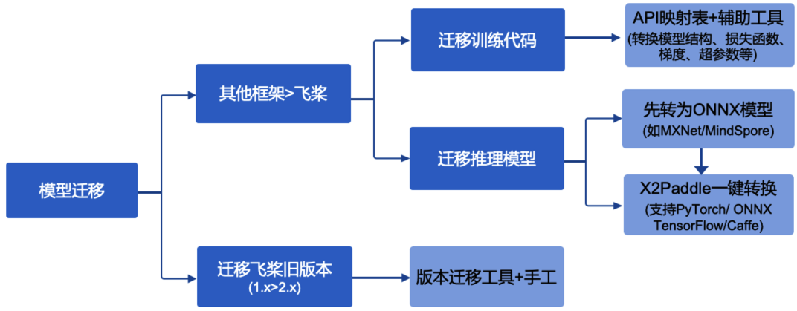

# 迁移指南

## 迁移场景概览

模型迁移包含将其他深度学习框架的训练代码与推理模型迁移到飞桨、以及将飞桨 1.X 旧版本升级到飞桨 2.x，迁移场景如下图所示。

图 1 模型迁移场景概览

如图所示，模型迁移包括以下几种场景：

* 迁移其他框架到飞桨：
  * 迁移训练代码：你可以将基于其他框架的训练代码迁移到飞桨，本质上需要从模型训练与预测的角度去完成该任务，保证训练结果与预测结果与参考代码保持一致。可以借助飞桨 API 与其他框架的映射关系、以及辅助迁移转换工具（正在开发中），参考本文档对训练代码进行模型结构、损失函数、梯度、超参数等的转换，然后启动模型训练，最后通过查看训练结果和预测结果检验迁移操作是否成功。
  * 迁移推理模型：如果不需要使用飞桨进行模型训练，只需要将基于其他框架的推理模型迁移到飞桨，可以采用此方案。如果是基于 PyTorch、TensorFlow、ONNX、Caffe 的推理模型，可以直接使用 [X2Paddle](https://github.com/PaddlePaddle/X2Paddle) ，一键转为飞桨的预测模型。如果是基于其他框架，比如 MXNet、 MindSpore 等，可以先转为 ONNX 格式的模型，再使用 [X2Paddle](https://github.com/PaddlePaddle/X2Paddle) 进行转换。
* 迁移飞桨旧版：将飞桨 1.X 版本的训练代码与模型迁移到飞桨最新版。为了降级代码升级的成本，飞桨提供了转换工具，可以帮助将 Paddle 1.8 版本开发的代码，升级为 2.0 的 API。由于相比于 Paddle 1.8 版本，2.0 版本的 API 进行了大量的升级，包括 API 名称，参数名称，行为等。转换工具当前还不能覆盖所有的 API 升级；对于无法转换的 API，转换工具会报错，提示手动升级。

## 关于本章

本文档围绕前面介绍的几种模型迁移场景，为您提供以下详细指导：

* 迁移训练代码：按照 CV、NLP 任务场景，提供详细文档。
  * 快速上手：以经典模型 MobileNetV3（CV 场景）、Bert（NLP 场景）PyTorch 迁移到飞桨为例，并提供完整的代码，帮助您快速了解将其他框架的训练代码迁移到飞桨的完整流程。
  * 迁移经验汇总：迁移工作属于实践性非常强的一项工作，在实际迁移过程中可能会遇到各种问题，本文汇总了 CV、NLP 领域，从 PyTorch 迁移到飞桨的通用操作流程、常见问题的分析思路及解决方法，供您查阅参考。
  * 扩展解读：模型迁移需要开发者对模型结构、框架实现有一个详细的了解，本文对网络结构、模型权重转化进行详细解读，可以加深开发者对框架和模型的理解。
  * API 映射表：提供 PyTorch（v1.8.1)常用 API 与 PaddlePaddle 2.0.0 API 对应关系与差异分析，供开发者在迁移时参考查阅。
* 迁移推理模型：介绍如何将其他框架的推理模型，迁移到飞桨。
* 迁移飞桨旧版本：介绍如何将飞桨 1.X 版本的训练代码与模型迁移到飞桨最新版。
附录
2.x 文档参考
以下提供了 2.x 版本的一些参考文档：
* 飞桨框架 2.x：对动态图、API、以及如何用 API 进行模型训练和推理进行简单介绍，方便你快速了解飞桨 2.x 框架。
* API：通过官网[API 文档](https://www.paddlepaddle.org.cn/documentation/docs/zh/develop/api/index_cn.html)了解飞桨各接口的相关信息。
* 示例文档：你可以在官网[应用实践](https://www.paddlepaddle.org.cn/documentation/docs/zh/develop/practices/index_cn.html)栏目内进行在线浏览，也可以下载在这里提供的源代码:
<https://github.com/PaddlePaddle/docs/tree/develop/docs/practices>
* 教程：通过官网[教程](https://aistudio.baidu.com/aistudio/course/introduce/1297)系统掌握如何使用飞桨进行训练、调试、调优、推理。
