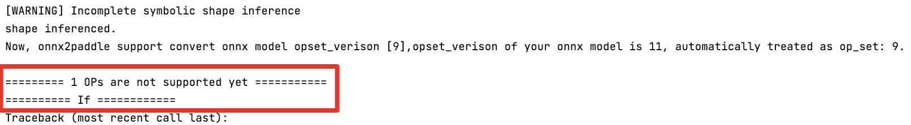

# 使用 X2Paddle 迁移推理模型

飞桨开源了模型转换工具 X2Paddle，可帮助其它深度学习框架用户快速迁移至飞桨框架。本文介绍推理模型的迁移方法，迁移后的推理模型可直接使用飞桨一系列的模型部署工具（如服务器部署 Paddle Inference、移动/IoT 端部署 Paddle Lite 等）完成模型推理部署。

> 说明：通常情况下，如果迁移后的模型不需要再训练，仅用于推理部署，可采用本章方法；如果还需要训练，则不能用此方法，需参考迁移训练代码的方法，如 [从 PyTorch 迁移到飞桨](./convert_from_pytorch/index_cn.html) 章节。

## 一、概述

### 1.1 支持迁移的源模型

- PyTorch、ONNX、TensorFlow、Caffe 模型，可以通过 X2Paddle 直接完成模型转换，各框架支持的版本请参见下文 [1.4 迁移环境依赖](#requirements)。
- 其他框架如 MXNet、MindSpore 等，可以先转为 ONNX 格式的模型，再使用 X2Paddle 进行转换。

> 说明：需要模型中用到的算子（OP）X2Paddle 均支持，才能实现转换，如果存在不支持的 OP 转换时会给出报错提示。目前 X2Paddle 支持大部分主流的 CV 和 NLP 模型转换，支持 130 多个 PyTorch OP，90 多个 ONNX OP，90 多个 TensorFlow OP 以及 30 多个 Caffe OP，详见 [X2Paddle 支持 OP 列表](https://github.com/PaddlePaddle/X2Paddle/blob/develop/docs/inference_model_convertor/op_list.md)。

### 1.2 支持迁移的目标模型

飞桨提供了一系列的模型部署工具，覆盖服务器端、移动/IoT 端、网页端、服务化部署等各种场景。如果转换后的推理模型要部署到：

- 服务器端，可以通过 X2Paddle 直接转换为 [Paddle Inference](https://www.paddlepaddle.org.cn/inference/product_introduction/inference_intro.html) 支持的格式，即 `.pdmodel`、`.pdiparams`、`.pdiparams.info` 格式文件。
- 移动/IoT 端，可以通过 X2Paddle 直接转换为 [Paddle Lite](https://www.paddlepaddle.org.cn/lite) 支持的格式，即 `.nb` 格式文件。
- 其他部署环境，如服务化部署（[Paddle Serving](https://github.com/PaddlePaddle/Serving)）、网页端部署（[Paddle.js](https://github.com/PaddlePaddle/Paddle.js)），可以通过 X2Paddle 先转为 Paddle Inference 的模型格式，再使用对应工具转为其支持的格式。飞桨所有部署工具支持的模型格式，其实都可以用原生推理库 Paddle Inference 支持的模型格式转换而来。

### 1.3 迁移工具和用法

#### 1.3.1 飞桨模型转换工具 X2Paddle

X2Paddle 是飞桨官方提供的模型转换工具，简洁易用，通过一条命令行或者一个 API 即可完成模型转换。已在 GitHub 社区开源：[https://github.com/PaddlePaddle/X2Paddle](https://github.com/PaddlePaddle/X2Paddle)

#### 1.3.2 使用 Python API 迁移

X2Paddle 提供了一组 Python API，支持不同框架的模型迁移：

- PyTorch 模型迁移：[x2paddle.convert.pytorch2paddle](https://github.com/PaddlePaddle/X2Paddle/blob/develop/docs/inference_model_convertor/x2paddle_api.md#4)
- ONNX 模型迁移：[x2paddle.convert.onnx2paddle](https://github.com/PaddlePaddle/X2Paddle/blob/develop/docs/inference_model_convertor/x2paddle_api.md#3)
- TensorFlow 模型迁移：[x2paddle.convert.tf2paddle](https://github.com/PaddlePaddle/X2Paddle/blob/develop/docs/inference_model_convertor/x2paddle_api.md#1)
- Caffe 模型迁移：[x2paddle.convert.caffe2paddle](https://github.com/PaddlePaddle/X2Paddle/blob/develop/docs/inference_model_convertor/x2paddle_api.md#2)

以 x2paddle.convert.pytorch2paddle 为例，迁移 PyTorch 模型的使用方式如下：

```python
from x2paddle.convert import pytorch2paddle

# 省略模型定义和参数加载的代码
torch_module.eval()
pytorch2paddle(module=torch_module,
               save_dir="./pd_model",
               jit_type="trace",
               input_examples=[torch_input])
               enable_code_optim=False,
               convert_to_lite=False,
               lite_valid_places="arm",
               lite_model_type="naive_buffer")
```


**（1）模型迁移配置说明**

PyTorch 模型的迁移主要需要获取 Module 组网，加载模型参数 `state_dict()`，然后切换到 `eval()` 模式进行转换，使用默认参数下将转换为 Paddle Inference 的模型格式，通过 `convert_to_lite` 参数设置是否转换为 Paddle Lite 的模型格式。

> 说明：
>
> - PyTorch 模型迁移需要准备 Module 组网代码和训练好的 `.pth` 模型参数文件；
> - ONNX 模型迁移需要准备 `.onnx` 模型文件；
> - TensorFlow 模型迁移需要准备 `.pb` 模型文件；
> - Caffe 模型迁移需要准备 `.prototxt` 模型文件和 `.caffemodel`模型参数文件。

**（2）模型迁移过程说明**

通常情况下，实际转换过程是先将 PyTorch 模型代码转为 PaddlePaddle 动态图代码（为中间产物，将保存在 `x2paddle_code.py` 文件中）和模型参数文件（`model.pdparams` 文件），然后执行动转静，保存静态图模型到磁盘中（即 `inference_model`文件夹）。

**（3）x2paddle.convert.pytorch2paddle API 参数说明：**

| **参数**          | **说明**                                                     |
| ----------------- | ------------------------------------------------------------ |
| module            | PyTorch 的 Module。                                          |
| save_dir          | 转换后模型保存路径。                                         |
| jit_type          | 转换方式，对应 PyTorch 中定义的两种模型转换方式 [trace](https://pytorch.org/docs/master/generated/torch.jit.trace.html) 和 [script](https://pytorch.org/docs/master/generated/torch.jit.script.html)。默认为 trace。"trace" 方式生成的代码可读性较强，较为接近原版 PyTorch 代码的组织结构，支持大部分模型，但是不支持模型输入是动态 shape 的情况；"script" 方式不需要知道输入数据的类型和大小即可转换（支持动态 shape），使用上较为方便，但目前 PyTorch 支持的 script 代码方式有所限制，可能存在一些 op 和语法不支持。优先推荐使用 "trace" 方式。 |
| input_examples    | torch.nn. Module 的输入示例，list 的长度必须与输入的长度一致。默认为 None。jit_type 为 "trace" 时，input_examples 不可为 None，转换后自动进行动转静；jit_type 为 "script" 时，当 input_examples 为 None 时，只生成动态图代码；当 input_examples 不为 None 时，才能自动动转静。 |
| enable_code_optim | 是否对转换后的代码进行优化，默认为 False。对生成的 PaddlePaddle 动态图代码做一定优化，比如模块化处理，以增加生成的代码可读性。无论是否优化，通常不影响动转静后生成的静态图模型，一般使用默认值 False 即可。 |
| convert_to_lite   | 是否使用 [opt 工具](https://www.paddlepaddle.org.cn/lite/develop/user_guides/model_optimize_tool.html) 转成 Paddle Lite 支持的格式，默认为 False。 |
| lite_valid_places | lite_valid_places 参数目前可支持 arm、 opencl、 x86、 metal、 xpu、 bm、 mlu、 intel_fpga、 huawei_ascend_npu、imagination_nna、 rockchip_npu、 mediatek_apu、 huawei_kirin_npu、 amlogic_npu，可以同时指定多个硬件平台(以逗号分隔，优先级高的在前)，opt 将会自动选择最佳方式。如果需要支持华为麒麟 NPU，应当设置为 "huawei_kirin_npu,arm"。 |
| lite_model_type   | 指定模型转化类型，目前支持两种类型：protobuf 和 naive_buffer，默认为 naive_buffer。其中 naive_buffer 是一种更轻量级的序列化/反序列化实现。若需要在移动端执行模型预测，请将此选项设置为 naive_buffer。 |

#### 1.3.3 使用命令行迁移

除了 Python API 方式，X2Paddle 还提供了更加便捷的命令行迁移方式，该方式支持 ONNX、TensorFlow、Caffe 模型迁移，不支持 PyTorch 模型迁移。

- **ONNX 模型迁移**

```bash
x2paddle --framework=onnx --model=onnx_model.onnx --save_dir=pd_model
```

-  **TensorFlow** **模型迁移**

```bash
x2paddle --framework=tensorflow --model=tf_model.pb --save_dir=pd_model
```

- **Caffe** **模型迁移**

```bash
x2paddle --framework=caffe --prototxt=deploy.prototxt --weight=deploy.caffemodel --save_dir=pd_model
```

[**X2Paddle 命令行参数**](https://github.com/PaddlePaddle/X2Paddle/blob/develop/x2paddle/convert.py#L24) **说明：**

| **参数**             | **说明**                                                     |
| -------------------- | ------------------------------------------------------------ |
| framework          | 源模型类型（tensorflow、caffe、onnx）                        |
| model              | 当 framework 为 tensorflow/onnx 时，该参数指定 tensorflow 的 pb 模型文件或 onnx 模型路径 |
| prototxt           | 当 framework 为 caffe 时，该参数指定 caffe 模型的 proto 文件路径 |
| weight             | 当 framework 为 caffe 时，该参数指定 caffe 模型的参数文件路径 |
| save_dir           | 指定转换后的模型保存目录路径                                 |
| define_input_shape | **[可选]** For TensorFlow, 当指定该参数时，强制用户输入每个 Placeholder 的 shape，见[文档 Q2](https://github.com/PaddlePaddle/X2Paddle/blob/develop/docs/inference_model_convertor/FAQ.md) |
| caffe_proto        | **[可选]** 由 caffe.proto 编译成 caffe_pb2.py 文件的存放路径，当存在自定义 Layer 时使用，默认为 None |
| to_lite            | **[可选]** 是否使用 opt 工具转成 Paddle-Lite 支持格式，默认为 False |
| lite_valid_places  | **[可选]** 指定转换类型，可以同时指定多个 backend(以逗号分隔)，opt 将会自动选择最佳方式，默认为 arm |
| lite_model_type    | **[可选]** 指定模型转化类型，目前支持两种类型：protobuf 和 naive_buffer，默认为 naive_buffer |
| disable_feedback   | **[可选]** 是否关闭 X2Paddle 使用反馈；X2Paddle 默认会统计用户在进行模型转换时的成功率，以及转换框架来源等信息，以便于帮忙 X2Paddle 根据用户需求进行迭代，不会上传用户的模型文件。如若不想参与反馈，可指定此参数为 False 即可 |

#### 1.3.4 查看转换结果

在指定的 **save_dir** 目录下查看转换结果：

- **inference_model** : 该目录下存放转换后的飞桨静态图模型结构以及参数文件
  - `.pdiparams`文件：存放模型中所有的权重数据
  - `.pdmodel`文件：存放模型的网络结构
  - `.pdiparams.info` ：存放和参数状态有关的额外信息
- **x2paddle_code.py** : 文件中存放生成的飞桨动态图组网代码
- **model.pdparams** : 该文件即生成的飞桨动态图模型参数文件
- **opt.nb**:  该文件即生成的 Paddle Lite 支持的模型文件

> 说明：通常情况下，取用 **inference_model** 或 **opt.nb** 模型文件作为转换的最终产物即可。**x2paddle_code.py** 和 **model.pdparams** 作为中间产物，一般不需要用，某些情况下可使用，比如想用 "trace" 方式导出动态 shape 的模型时，可修改 **x2paddle_code.py** 中的动态图代码后手动转为静态图模型。

### <span id="requirements">1.4 迁移环境依赖</span>

- Python >= 3.5
- PaddlePaddle >= 2.0.0 （推荐使用最新版本）
- PyTorch >= 1.5.0（如需转换 PyTorch 模型）
  - 其他依赖：使用 PyTorch trace 方式时需安装 pandas、treelib
- ONNX >= 1.6.0（如需转换 ONNX 模型）
- TensorFlow == 1.14（如需转换 TensorFlow 模型）
- Paddle Lite >= 2.9.0（如需一键转换成 Paddle Lite 支持格式，推荐最新版本）
- Caffe 若无自定义 Layer，可使用 X2Paddle 自带 caffe_pb2.py，否则需自行将 caffe.proto 编译成 caffe_pb2.py 文件

接下来通过两个示例，介绍使用 X2Paddle 迁移推理模型的方法，为了能完整体验，先安装相关环境：

（1）安装 PaddlePaddle

```bash
pip install paddlepaddle==2.3.2
```

（2）安装 X2Paddle

```bash
# 方式一：pip 安装
pip install X2Paddle==1.3.9
# 方式二：源码安装
git clone https://github.com/PaddlePaddle/X2Paddle.git
cd X2Paddle
python setup.py install
```

（3）安装 PyTorch

```bash
pip install torch==1.12.0 torchvision==0.13.0
# 示例中用到 trace 方式，需要安装如下两个依赖
pip install pandas
pip install treelib
```

（4）安装 ONNX

```bash
pip install onnx==1.11.0
```

（5）安装 Paddle Lite

```bash
pip install paddlelite==2.11
```

## 二、迁移 PyTorch 模型示例

介绍迁移 PyTorch 模型为 Paddle Inference 可部署的模型的示例。

本示例中，将 PyTorch 图像分类模型 AlexNet 转换为 PaddlePaddle 模型，然后验证并比对转换前后模型的输出误差。

### 2.1 转换模型

**（1）加载 PyTorch 模型和参数**

> **说明：PyTorch 模型转换需要准备 Module 组网代码和训练好的 `.pth` 模型参数文件。**

```python
from torchvision.models import AlexNet
from torch.hub import load_state_dict_from_url

# 获取 PyTorch Module，并加载模型参数
torch_model = AlexNet()
torch_state_dict = load_state_dict_from_url('https://download.pytorch.org/models/alexnet-owt-4df8aa71.pth')
torch_model.load_state_dict(torch_state_dict)
# 设置为 eval 模式
torch_model.eval()
```

**（2）构造输入示例**

PyTorch 到 PaddlePaddle 的转换需要传入输入的示例，才可以进行转换，以下为构建输入的过程（输入也可为值随机初始化的 Tensor）：

```python
import numpy as np
# 随机生成数组
img = np.random.randn(1, 3, 224, 224).astype("float32")
# 转为 Torch.Tensor
import torch
input_tensor = torch.tensor(img)
```

**（3）转换模型**

- **方式一：** **Trace 方式**
  模型输入的 shape 固定，PyTorch 模型基本均支持此方式转换。

```python
from x2paddle.convert import pytorch2paddle
save_dir = "pd_model_trace"
jit_type = "trace"         # 指定 trace 转换方式
pytorch2paddle(module=torch_model,
               save_dir=save_dir,
               jit_type=jit_type,
               input_examples=[input_tensor])
```

**查看 Trace 方式转换结果**

转换成功后，模型参数类型、参数量与 PyTorch 是一致的。

```md
pd_model_trace
    inference_model            # 转换后的飞桨静态图模型结构以及参数文件
        model.pdiparams
        model.pdmodel
        model.pdiparams.info
    x2paddle_code.py           # 转换后的飞桨动态图组网代码
    model.pdparams             # 转换后的飞桨动态图模型参数文件
```

- **方式二：** **Script 方式**
  模型输入的 shape 可不固定，由于 PyTorch 的 Script 方式可识别的代码格式有限，所以 PyTorch 模型在此方式下转换的支持度较低。

```python
from x2paddle.convert import pytorch2paddle
save_dir = "pd_model_script"
jit_type = "script"         # 指定 script 转换方式
pytorch2paddle(module=torch_model,
               save_dir=save_dir,
               jit_type=jit_type,
               input_examples=None)
```

以上示例中未指定输入大小，因此只生成了飞桨动态图代码 x2paddle_code.py 和 模型参数文件 model.pdparams。若想导出动态 shape 的静态图模型，可在此文件中添加如下代码，然后运行 main 函数手动动转静，动转静相关用法可参见 [动态图转静态图](../jit/index_cn.html) 章节。

```python
def main(x0):
    # There are 0 inputs.
    paddle.disable_static()
    params = paddle.load('pd_model_script/model.pdparams')
    model = AlexNet()
    model.set_dict(params)
    model.eval()
    ## convert to jit
    sepc_list = list()
    sepc_list.append(
            paddle.static.InputSpec(
                shape=[-1, 3, 224, 224], name="x0", dtype="float32"))
    static_model = paddle.jit.to_static(model, input_spec=sepc_list)
    paddle.jit.save(static_model, "pd_model_script/inference_model/model")
    out = model(x0)
    return out
```

**查看 Script 方式转换结果**

转换成功后，模型参数类型、参数量与 PyTorch 是一致的。

```md
pd_model_script
    inference_model            # 转换后的飞桨静态图模型结构以及参数文件
        model.pdiparams
        model.pdmodel
        model.pdiparams.info
    x2paddle_code.py           # 转换后的飞桨动态图组网代码
    model.pdparams             # 转换后的飞桨动态图模型参数文件
```

### 2.2 验证模型

将 PyTorch 输入输出保存为 numpy 格式，保存为 input.npy 和 output.npy，通过如下脚本比较相同输入下 PyTorch 与 PaddlePaddle 结果绝对误差是否在 1e-5。

```cpp
import paddle
import numpy as np
import sys

f = open('result.txt', 'w')
f.write("======AlexNet: \n")
try:
    # 加载 Paddle 模型
    paddle_path = "pd_model_trace/inference_model/model"
    model = paddle.jit.load(paddle_path)
    model.eval()
    dummy_input = paddle.to_tensor(np.load("input.npy"))
    # run
    result = model(dummy_input)
    paddle_result = result.numpy()

    pytorch_result = np.load("output.npy")
    is_successd = True
    # 比较 diff
    for i in range(1):
        diff = paddle_result - pytorch_result
        max_abs_diff = np.fabs(diff).max()
        if max_abs_diff >= 1e-05:
            relative_diff_all = max_abs_diff / np.fabs(pytorch_result).max()
            relative_diff = relative_diff_all.max()
            if relative_diff >= 1e-05:
                is_successd = False
    if is_successd:
        f.write("Dygraph Successed\n")
    else:
        f.write("!!!!!Dygraph Failed\n")
except:
    f.write("!!!!!Failed\n")
```

最终比较结果写在 result.txt 当中，若显示 Dygraph Successed 表示成功，验证通过后，则可使用 [Paddle Inference](https://www.paddlepaddle.org.cn/inference/product_introduction/inference_intro.html) 部署该模型。

## 三、迁移 ONNX 模型示例

介绍迁移 ONNX 模型为 Paddle Lite 可部署的模型的示例。

本示例中，将 ONNX 模型 YOLOv5Lite-E 转换为 Paddle Lite 可部署的 .nb 模型。

### 3.1 转换模型

下载一个 YOLOv5Lite-E 的 ONNX 模型，直接通过命令行转换 ONNX 模型。

```bash
# 下载一个 ONNX 模型
wget https://bj.bcebos.com/paddlehub/fastdeploy/v5Lite-e-sim-320.onnx
# 执行模型转换命令
x2paddle --framework=onnx --model=v5Lite-e-sim-320.onnx --save_dir=pd_model --to_lite=True
```

**（4）查看转换结果**

转换成功后，模型参数类型、大小与 PyTorch 是一致的。

```md
pd_model
    inference_model            # 转换后的飞桨静态图模型结构以及参数文件
        model.pdiparams
        model.pdmodel
        model.pdiparams.info
    x2paddle_code.py           # 转换后的飞桨动态图组网代码
    model.pdparams             # 转换后的飞桨动态图模型参数文件
    opt.nb              # 转换后的 Paddle Lite 支持的模型
```

### 3.2 验证模型

转换成功后，可通过 Paddle Lite 部署到端侧验证效果，具体示例可参考 [Paddle Lite 文档](https://www.paddlepaddle.org.cn/lite)。

## 四、迁移常见问题

**Q：模型转换后提示 OP 不支持怎么处理？**

**A：模型转换后，如果存在不支持的 OP，将提示类似下图信息：**



遇到此问题，或者其他 X2Paddle 的使用问题，请以 [Github Issues](https://github.com/PaddlePaddle/X2Paddle/issues) 的形式提交给我们。

获取 [更多 FAQ](https://github.com/PaddlePaddle/X2Paddle/blob/develop/docs/inference_model_convertor/FAQ.md)。

## 五、参考信息

- [X2Paddle 支持 OP 列表](https://github.com/PaddlePaddle/X2Paddle/blob/develop/docs/inference_model_convertor/op_list.md)
- [X2Paddle 命令行参数说明](https://github.com/PaddlePaddle/X2Paddle#转换参数说明)
- [X2Paddle Python API 参数说明](https://github.com/PaddlePaddle/X2Paddle/blob/develop/docs/inference_model_convertor/x2paddle_api.md)
