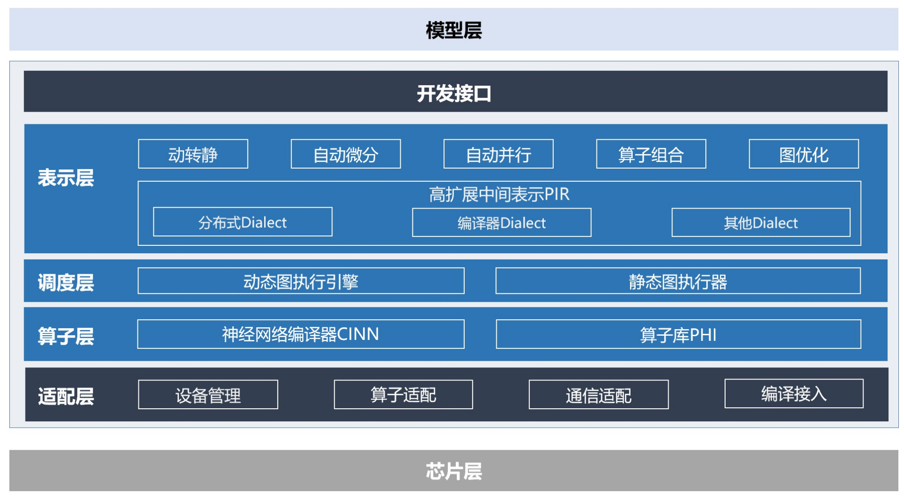
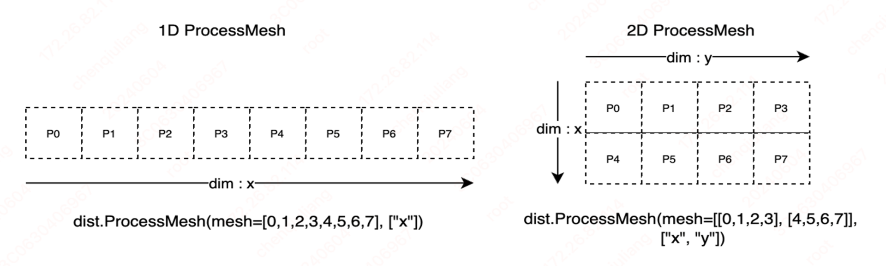
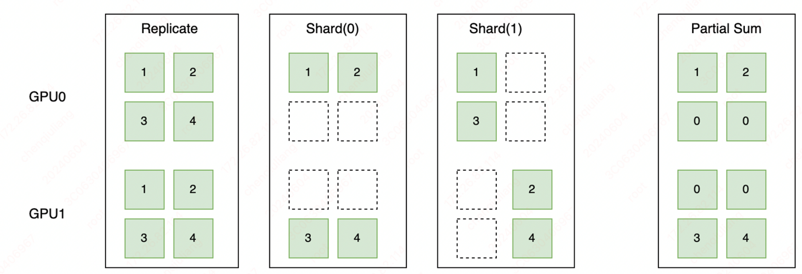
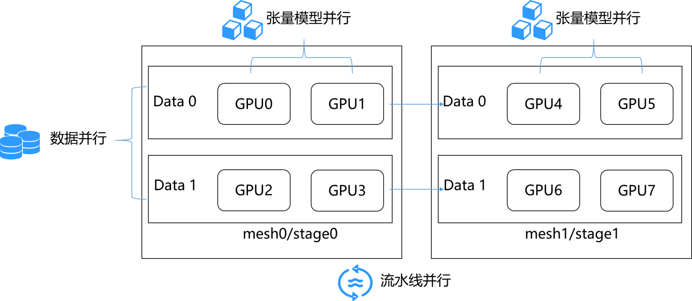
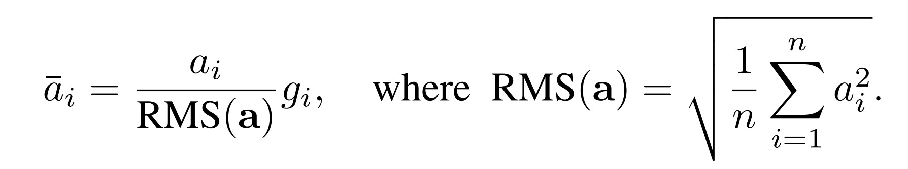
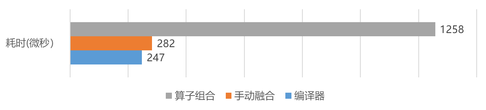
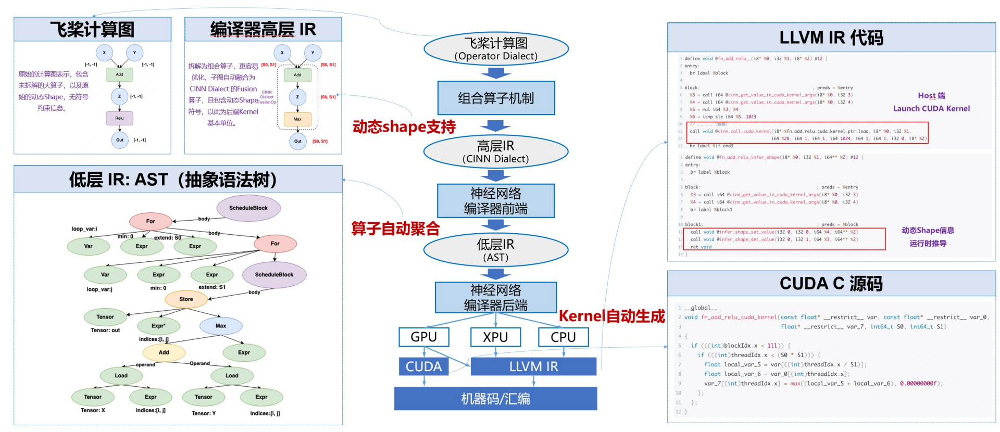
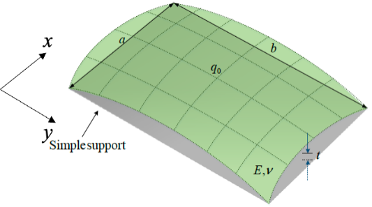
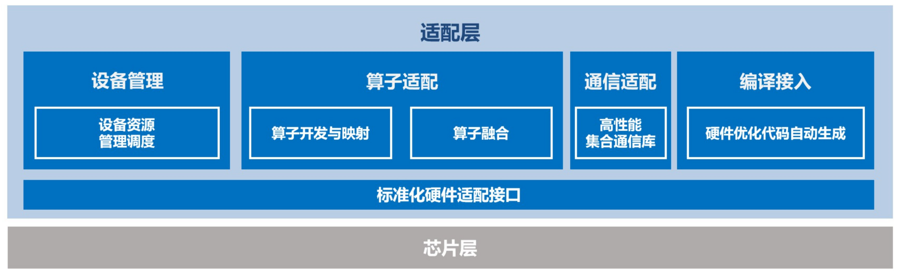
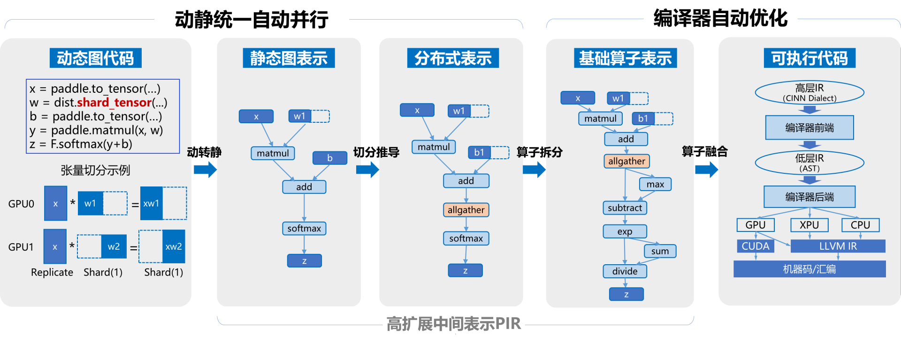

# 飞桨框架 3.0 新特性

## 一、概述

深度学习框架作为基础软件，不仅促进了深度学习技术的飞速进步，更为人工智能技术的广泛应用铺设了坚实的基础。首先深度学习框架为开发者提供了便捷易用的开发接口，这些接口对数据和操作进行了高度抽象，使得开发者能够更专注于算法和模型的设计，而不必深陷底层数据的处理细节。通过这些接口，开发者无需直接感知和应对复杂的硬件底层开发细节，从而极大地提升了开发效率和体验。其次深度学习框架还提供了自动微分这一强大功能，开发者通常只需要编写前向传播网络的代码，而繁琐的反向传播网络则交由框架自动完成。

飞桨框架是我国首个自主研发、开源开放且功能丰富的深度学习框架，自 2016 年起正式对外开源。2018 年，我们发布了飞桨框架 1.0 版本，该版本默认使用静态图，并着手研发动态图功能。2021 年初，飞桨框架 2.0 版本问世，它默认采用动态图，并实现了动静统一与训推一体的设计。此版本进一步融合了动态图的灵活性与静态图的高效性，同时支持了千亿参数模型的混合并行训练。在此期间，飞桨还踏上了神经网络编译器技术的探索征程。随着大模型时代的到来，模型参数规模日益扩大，训练成本也随之上升，这对深度学习框架在大规模分布式训练和性能优化方面提出了更高要求。近期，我们推出了飞桨框架 3.0-Beta 版本，标志着飞桨新一代框架技术创新之路的开启。该版本的核心特性包括动静统一自动并行技术和神经网络编译器自动优化等新技术，旨在应对当前深度学习领域的新挑战。飞桨框架 3.x 版本延续了 2.x 版本动静统一、训推一体的设计理念，其开发接口全面兼容 2.x 版本。这意味着，使用 2.x 版本开发的代码，在绝大多数情况下无需修改，即可直接在 3.x 版本上运行。

以下是飞桨框架 3.x 的新特性：

- **动静统一自动并行：** 为了降低大模型的编程难度，飞桨还优化了动静统一的半自动并行编程范式，显著简化了编程的复杂度。开发者无需深入研究手动并行编程的复杂概念和 API，只需进行少量的张量切分标注，即可完成混合并行模型的构建。框架能够自动推导分布式切分状态并添加通信算子，同时还支持一键动转静分布式训练，从而大幅简化了混合并行训练代码的开发过程。动静统一方面，飞桨通过采用基于字节码的动静转换技术，全面升级了其动转静训练能力，支持自适应的图构建功能。在 700 多个飞桨产业级模型上进行了验证，实现了一键动转静训练 100%的成功率。
- **神经网络编译器自动优化：** 飞桨神经网络编译器 CINN（Compiler Infrastructure for Neural Networks）采用与框架一体化的设计，能够支持生成式模型、科学计算模型等多种模型的高效训练与可变形状推理，为计算灵活性与高性能之间提供了一个良好的平衡点。通过算子的自动融合和代码生成技术，Llama2 和 Stable Diffusion 模型的性能提升了 30%。
- **高阶自动微分：** 为了更好支持科学计算等场景，飞桨框架设计并实现了基于组合算子机制的高阶自动微分技术，结合神经网络编译器自动优化技术，我们测试了超过 40 多个科学计算场景的微分方程，其求解速度领先业界同类产品 70%。
- **高扩展中间表示** ：为了提升飞桨框架的可扩展性，我们研发了高扩展中间表示 PIR（Paddle Intermediate Representation）。这一表示系统性地抽象了底层核心概念，提供了灵活且高效的组件。PIR 作为基础设施，支撑着动转静、自动微分、自动并行、组合算子、图优化等多项技术，并广泛应用于分布式训练、模型压缩、推理部署等场景。通过 PIR 提供的 DRR（Declarative Rewrite Rule）机制，Pass 的开发成本可以降低 60%。我们对超过 900 个模型配置进行了测试，结果显示，在使用 PIR 后，推理的整体性能提升了超过 10%。
- **多硬件适配：** 飞桨为大模型硬件适配提供了功能完善且低成本的方案。新硬件仅需适配 30 余个接口，即可支持大模型的训练、压缩与推理。同时，飞桨提供了基于编译器的硬件接入方式，硬件厂商只需以插件的形式实现编译器的代码生成后端，便能实现与飞桨框架的高效适配。

上述特性在飞桨框架 2.6 版本或更早版本时就已经开始开发，目前已达到外部可试用的阶段。由于这些新特性在使用体验、性能、二次开发便利度以及硬件适配能力等方面带来了显著提升，因此我们决定发布 3.0-Beta 版本。此版本包含了对框架 2.x 版本部分已有功能的改进，并且在不使用新特性的情况下，表现是成熟稳定的。展望未来，我们预计将在 2024 年 12 月发布飞桨框架 3.0 的正式版本。

## 二、设计思想

当前，AI 技术的发展正日新月异，引领着科技的前沿。深度学习框架的设计对于推动人工智能技术的发展至关重要，其核心设计目标是让深度学习技术的创新与应用更简单。那么如何做到这一点呢？我们需要从以下几个方面来考虑。

首先，框架向上对接开发者的需求。一个优秀的深度学习框架应当为开发者提供极致的开发体验。这不仅仅意味着提供一个用户友好的开发环境，更重要的是要能够大幅度减少开发者的学习成本和时间成本，同时显著提升开发的便利性。为此，飞桨框架提出了“动静统一、训推一体、自动并行”的理念，极大地提高了开发效率。

其次，框架向下对接硬件。现代深度学习应用往往需要在多样化的硬件平台上运行，因此，框架必须能够兼容并适配各种不同的硬件设备。这要求框架能够智能地隔离不同硬件接口之间的差异，实现广泛的硬件适配性。同时，为了充分发挥硬件的性能，框架还需要具备软硬件协同工作的能力，确保在利用硬件资源时能够达到最优的性能表现。

再者，框架需要考虑到 AI 技术发展的整体趋势。随着技术的不断进步，诸如 MOE（Mixture of Experts）、多模态以及科学智能（AI for Science）等前沿技术逐渐成为新的研究热点。深度学习框架应当能够紧跟这些技术发展的步伐，为研究者提供必要的支持和工具，以推动相关技术的快速发展和应用。在大模型领域，模型的显著特点是参数规模庞大、训练数据海量，以及对算力的巨大需求。随着模型复杂性的增加，计算瓶颈、存储瓶颈、访存瓶颈以及通信瓶颈等问题逐渐凸显。同时新的网络结构如 RWKV、Mamba 等也在不断涌现，为 AI 技术的发展注入了新的活力。为了解决这些问题，分布式训练和通用性能优化的需求日益迫切。在 AI for Science 领域，人工智能正引发科学发现和模式创新的深刻变革。以 AlphaFold 为代表的生物计算模型，GraphCast 等气象模型，物理信息神经网络（PINN）和傅里叶算子学习方法（FNO）都展示了 AI 在科学研究中的强大能力。为了支持科学计算模型，框架的设计需要能够支持高阶自动微分、复数运算、傅里叶变换等功能。

最后，框架需要能够支持产业的实际落地应用。在产业化方面，框架需要具备支持训练、压缩、推理一体化的全流程能力。这意味着，从模型的训练到优化，再到实际部署和推理，框架应当提供一套完整、高效的解决方案，以满足产业界对于深度学习技术的实际需求。

总的来说，飞桨将为开发者提供一个“动静统一、训推一体、自动并行、自动优化、广泛硬件适配”的深度学习框架，开发者可以像写单机代码一样写分布式代码，无需感知复杂的通信和调度逻辑，即可实现大模型的开发；可以像写数学公式一样用 Python 语言写神经网络，无需使用硬件开发语言编写复杂的算子内核代码，即可实现高效运行。

## 三、框架架构

为了实现深度学习框架的上述特性，我们必须对框架的架构进行精心设计，确保其能够支持各种复杂的模型构建，同时与多样化的芯片实现无缝对接。接下来，我们将通过直观的架构图，详细展示飞桨新一代框架内所涵盖的功能模块，以及这些模块之间的相互作用与联系。以下为飞桨框架 3.0 的架构图。


<figure align="center">

</figure>

飞桨框架对外提供了丰富的深度学习相关的各种开发接口，如张量表示、数学计算、模型组网、优化策略等。通过这些接口，开发者能够便捷地构建和训练自己的深度学习模型，无需深入到底层的技术细节中去。

在开发接口之下，飞桨框架可以划分为 4 个层次：表示层、调度层、算子层和适配层。

- 表示层专注于计算图的表达与转换，通过高可扩展中间表示 PIR，为动转静（动态图转为静态图）、自动微分、自动并行、组合算子以及计算图优化等核心功能提供坚实支撑。
- 调度层则负责对代码或计算图进行智能编排与高效调度，并且能够根据实际需求进行显存和内存的管理优化，支持动态图和静态图高效执行。无论开发者选择使用动态图还是静态图进行模型开发，飞桨框架都能提供高效的执行环境，同时确保资源利用的最优化。
- 算子层由神经网络编译器 CINN 和算子库 PHI 共同构成，涵盖了张量定义、算子定义、算子自动融合和算子内核实现等关键功能。
- 适配层则用于实现与底层芯片适配，包括设备管理、算子适配、通信适配以及编译接入等功能。

## 四、动静统一自动并行

### 4.1 动静统一

我们来回顾下飞桨框架所提供的静态图和动态图两种开发模式。这两种模式在模型组网阶段的代码是完全一致的，因此我们称之为动静统一的组网方式。然而，它们之间的主要差异体现在计算图的构建和执行过程中。在静态图开发模式下，一旦计算图被创建，它将保持不变。这意味着，在运行阶段，不能再根据输入的计算数据作为判断条件，来调整计算图。相反，在动态图开发模式下，每当输入新的数据批次时，计算图会动态地生成和执行。这种灵活性使得动态图模式在现代深度学习任务中备受欢迎。然而，尽管动态图模式具有诸多优势，但也存在一个问题：由于计算图会频繁地创建和执行，这使得对其进行优化变得相当困难。特别是在推理部署场景下，动态图模式往往难以摆脱对 Python 解释器的依赖进行部署。而 Python 解释器的引入，在某些场景下，比如对性能要求很高的大模型推理部署场景或者资源受限的端侧场景，可能会导致效率低下或无法使用。为了克服这一难题，飞桨研发了动静转换技术，通过简单的一行命令（to_static），便能够将动态图的代码轻松转换为静态图代码。

飞桨采用的技术方案是源代码到源代码的转换，即分析并转写动态图 Python 源代码，进而生成对应的静态图 Python 源代码；在获取源代码后，使用静态 Python 解释器来执行这段静态图代码，从而得到计算图表示。动静转换技术的核心挑战在于对 Python 语法的支持程度。通过实际测试，我们发现飞桨对 Python 语法的支持率高达 94%，飞桨的动静转换功能在整图导出任务的成功率高达 95%。飞桨框架的优势在于它同时兼容动态图和静态图两种开发模式。因此，在进行动静转换时，仅需实现从动态图 Python 源代码到静态图 Python 源代码的转换。这一转换过程可以通过 Python 解释器进一步增强对 Python 语法的支持，从而大大降低了实现的难度。在训练场景，针对那些无法进行动静转换的情况，例如 Python 代码中调用 Numpy 等第三方库时，这些库的函数调用无法直接转换为静态图表示。为了解决这一问题，飞桨创新性地研发了“自适应图构建机制”。当遇到不支持的语法时，该机制会被触发，自动断开这些部分，并利用前后相邻的图进行重新构建。通过采用这种方案，我们在训练场景中可以实现 100%的动静转换成功率，从而为编译器等计算图优化技术提供了更广阔的空间。更多关于动静转换的信息，请参考以下链接。[动转静 SOT 原理及使用]

### 4.2 自动并行

在大模型开发场景中，多维混合并行显得尤为重要。对于百亿甚至千亿规模的大模型，一般需要使用张量模型并行、流水并行、数据并行、分组参数切片并行的混合并行方式进行训练。然而，多维混合并行的开发过程往往相当复杂。以数据并行、张量模型并行和流水线并行为例，开发者必须精心处理计算、通信、调度等多元逻辑，才能编写出正确的混合并行代码，这无疑提高了开发的难度。为了解决这一难题，我们提出了动静统一的自动并行方案。自动并行，开发者只需要提供模型结构和集群，以及少量的标记信息，飞桨框架可以根据模型结构和集群信息自动寻找合适的分布式训练策略。我们来看一下对分布式标记（DistAttr）的定义。通过使用 ProcessMesh 将一个设备（比如一块 GPU 卡）映射为一个进程，将多个设备映射为多个进程组成的一维或多维数组，下图展示了由 8 个设备构成的两种不同 ProcessMesh 抽象表示。

<figure align="center">

</figure>

然后通过使用 Placement 来表示张量在不同设备上的切分状态，分为 Replicate、Shard 和 Partial 这 3 种切分状态。如下图所示，Replicate 表示张量在不同设备上会以复制的形式存在；Shard 表示按照特定的维度在不同设备上进行切分；Partial 表示设备上的张量不完整，需要进行 Reduce Sum 或者 Reduce Mean 等不同方式的操作后，才能得到完整的状态。

<figure align="center">

</figure>

在完成分布式标记抽象后，我们通过调用`paddle.distributed.shard_tensor()`接口，实现对张量切分的标记。通过张量切分的标记，我们可以表示复杂的分布式混合并行，下图展示了一个具体的数据并行、张量模型并行、流水线并行组成的混合并行的例子。

<figure align="center">

</figure>

以下代码展示了混合并行的具体例子。

```python
import paddle
import paddle.distributed as dist
from paddle.io import BatchSampler, DataLoader, Dataset
import numpy as np
...
mesh0 = dist.ProcessMesh([[0, 1], [2, 3]], dim_names=['x', 'y'])
mesh1 = dist.ProcessMesh([[4, 5], [6, 7]], dim_names=['x', 'y'])
...
class MlpModel(paddle.nn.Layer):
    def __init__(self):
        super(MlpModel, self).__init__()
        # 张量切分标记
        self.w0 = dist.shard_tensor(
                    self.create_parameter(shape=[1024, 4096]),
                    mesh0, [dist.Replicate(), dist.Shard(1)])
        self.w1 = dist.shard_tensor(
                    self.create_parameter(shape=[4096, 1024]),
                    mesh1, [dist.Replicate(), dist.Shard(0)])

    def forward(self, x):
        # 张量切分标记
        dist.shard_tensor(x, mesh0, [dist.Shard(0), dist.Replicate()])
        y = paddle.matmul(x, self.w0)
        # 张量重切分
        y = dist.reshard(y, mesh1, [dist.Shard(0), dist.Shard(2)])
        z = paddle.matmul(y, self.w1)
        return z
...
# 创建模型
model = MlpModel()
opt = paddle.optimizer.AdamW(...)
...
# 动转静训练
dist_model, dist_loader = dist.to_static(model, opt, ...)
for step, data in enumerate(dist_loader()):
    ...
    loss = dist_model(data)
    ...
```

我们以具体的 Llama 模型训练为例，动态图手动并行的开发方式，它要求开发者不仅要选择合适的并行策略，还必须精心设计通信逻辑；通过采用自动并行的开发方式，开发者无需再考虑复杂的通信逻辑。其分布式训练核心代码量减少了 50%，从而大大降低了开发的难度；从我们的一些实验可知，当前这种自动并行的性能优于动态图手动并行的性能。未来，我们将进一步探索无需使用张量切分标记的全自动并行，让开发者可以像写单机代码一样写分布式代码，进一步提升大模型的开发体验。更多关于自动并行的信息，请参考以下文档：[《动静统一自动并行》](./auto_parallel_cn.md)

## 五、神经网络编译器自动优化

编译器（compiler）是一种计算机程序，负责将用某种编程语言编写的源代码（原始语言）转换成另一种编程语言（目标语言）。以高级编程语言编译器为例，如 gcc，它能将 C 语言代码转换成 CPU 可执行的机器指令。类似地，神经网络编译器，通常也被称为深度学习编译器，是深度学习领域特有的工具，用于将一种神经网络中间表示(IR)转换为另一种中间表示(IR)。例如，飞桨神经网络编译器 CINN，能够将神经网络中间表示转换为其他形式的中间表示，如 CUDA C 语言代码、SyCL 语言代码，或 LLVM IR。之后，利用芯片软件栈提供的编程语言编译器，比如英伟达的 NVCC（NVIDIA CUDA Compiler）编译器或 NVRTC（NVIDIA CUDA Runtime Compilation）运行时编译库，将这些中间表示进一步转换为可在英伟达 GPU 上运行的机器指令。

### 5.1 从 RMSNorm 说起

为什么在深度学习框架中需要引入编译器技术呢？让我们通过一个实例来阐释这一点。我们以 Llama 模型中经常使用的 RMS Normalization （[Root Mean Square Layer Normalization](https://arxiv.org/abs/1910.07467)）为例，其计算公式相对简单明了。

<figure align="center">

</figure>

假设我们需要是实现 RMS Normalization 的计算，最简单的办法是，我们可以使用飞桨框架提供的张量运算开发接口，调用平方、求和、除法、开根号等操作来完成，代码如下：

```python
class RMSNorm(paddle.nn.Layer):
    def __init__(self):
        super().__init__()
        self.variance_epsilon = 1e-6
        self.size = 768
        self.weight = paddle.create_parameter(
            shape=[self.size],
            dtype=paddle.get_default_dtype(),
            default_initializer=nn.initializer.Constant(1.0),
        )

    def forward(self, x):
        variance = x.pow(2).mean(-1, keepdim=True)
        x = paddle.rsqrt(variance + self.variance_epsilon) * x
        return x * self.weight
```

从上述代码中，我们可以清晰地观察到代码与公式之间存在着良好的对应关系。具体来说，代码中的`weight`变量对应于公式中的`g`，`x`变量对应于公式中的`a`。此外，代码中的`pow`函数实现了平方运算，`mean`函数对应公式中的求和取平均操作，而`rsqrt`函数则实现了开根号后取倒数的计算。这种编写方式赋予了代码极高的灵活性和可维护性，使得开发者可以像书写数学公式一样编写代码，从而大大降低了代码的理解成本和维护成本。如果开发者希望采用新的 Normalization 策略，只需简单地修改代码即可实现新的计算公式。

尽管这种实现方式非常灵活，但它也面临着一个极具挑战的问题，即执行速度较慢。特别是在处理大型模型时，由于计算量巨大且算力成本高昂，这一问题尤为突出。速度慢的主要原因在于，每一次函数调用都会触发飞桨框架底层的一次算子调用。而算子作为深度学习框架的最小调度和执行单元，在执行过程中需要将显存中的数据搬运到寄存器中进行运算，并将计算结果写回到显存中。这种频繁的显存读写操作导致了计算密度降低，在访存带宽有限的情况下，显著拖慢了程序的运行速度。

为了解决这一问题，最简单的方法是，增加一个叫 RMSNorm 的算子，并且提供一个叫 RMSNorm 的 Python 层 API，这一方法在飞桨框架 1.x 版本就可以支持，比如我们采用以下代码实现：

```python
class RMSNorm(paddle.nn.Layer):
    def __init__(self):
        super().__init__()
        self.variance_epsilon = 1e-6
        self.size = 768
        self.weight = paddle.create_parameter(
            shape=[self.hidden_size],
            dtype=paddle.get_default_dtype(),
            default_initializer=nn.initializer.Constant(1.0),
        )

    def forward(self, x):
        return paddle.incubate.nn.functional.fused_rms_norm(
            x=x,
            norm_weight=self.weight,
            norm_bias=None,
            epsilon=self.variance_epsilon,
            begin_norm_axis=2,
        )
```

以上代码通过`fused_rms_norm`开发接口实现了对`rms_norm`的调用，这一改动带来了显著的性能提升，有效解决了之前版本运行速度慢的问题。然而，这一优化方案也带来了不少弊端。

最突出的是，它大大提高了开发者的门槛，因为开发者现在需要深入了解和掌握飞桨框架中关于张量、算子等核心概念，并熟悉算子开发与注册的全流程。此外，为了编写出性能优异的 reduce 求和操作，开发者还需精通 CUDA C 高性能程序开发的技巧，并对 Shared Memory、Warp Divergence、Bank Conflict 等高级概念有深刻的理解。

其次，该方案会增加框架开发接口的数量、并降低开发接口的可用性和可维护性。由于开发者的需求通常非常灵活多变，比如各种 Normalization 策略的变种，为每个特定操作同步增加一个 Python 开发接口，将导致框架的接口数量迅速增加，目前飞桨框架已经有接近 2000 个对外公开的开发接口。同时，随着算子融合粒度的增大，每个开发接口的参数数量也急剧上升，比如一些融合类的算子开发接口甚至可能包含多达 30 多个参数，这使得开发接口变得难以使用和维护。

再者，该方案的一个显著影响是导致框架算子库中的算子数量不断攀升，进而使得硬件适配的成本也随之增加。尽管飞桨框架已经对算子进行了清理和规范，且不考虑融合算子的情况，但当前飞桨框架的算子库仍然包含了超过 800 个算子，这为硬件适配工作带来了极大的挑战。这些新增加的算子需要使用 CUDA C 代码来实现，并且如果希望在其他类型的硬件上运行，还需要开发相应版本的代码。考虑到需要适配的硬件种类繁多，这无疑会大幅增加开发成本。

以下是截取的 CUDA C 代码实现片段，从中我们可以看出代码的实现变得复杂了许多。

```cpp
    const ComputeType row_sum_square =
        BlockAllReduce<SumOp, ComputeType, block_size>(thread_sum_square);

    // use multiply instead of divide. Author(zhengzekang).
    ComputeType row_rms = row_sum_square * col_divisor;
    ComputeType row_inv_rms =
        Rsqrt(row_rms + static_cast<ComputeType>(epsilon));
    // save for backward
    if (inv_var_data != nullptr) {
      inv_var_data[row] = row_inv_rms;
    }
    for (int pack_id = tid; pack_id < num_packs; pack_id += block_size) {
      ComputeType pack[kPackSize];
#pragma unroll
      for (int i = 0; i < kPackSize; ++i) {
        pack[i] = static_cast<ComputeType>(buf[i * num_packs + pack_id]) *
                  row_inv_rms;
      }
      store.template store<kPackSize>(pack, row, pack_id * kPackSize);
    }
```

而借助神经网络编译器技术，我们能够在维持高度灵活性和易用性的基础上，实现性能的显著提升。以下 A100 平台上 RMSNorm 算子的性能测试结果便是一个明证：相较于采用 Python 开发接口组合实现的方式，经过编译优化后的算子运行速度提升了 4 倍；即便与手动算子融合的方式相比，也实现了 14%的性能提升。这一成果充分展示了飞桨框架在灵活性与性能之间寻找到的理想平衡点。

<figure align="center">

</figure>

### 5.2 飞桨神经网络编译器 CINN

飞桨神经网络编译器 CINN 采用了与框架一体化的设计，其基础设施是基于飞桨的高扩展中间表示 PIR。这一设计使得 CINN 能够同时支持训练和推理过程，并且具备处理动态可变形状输入的能力。在生成式大语言模型 Llama 和文生图模型 Stable Diffusion 上的实验结果显示，通过使用编译器的优化技术，相较于未采用手动性能优化的基础版本，推理速度分别实现了 36%和 30%的提升。那么，编译器究竟是如何实现深度学习任务的加速呢？以下，我们将通过一个由 Add 和 Relu 算子组成的例子来具体展示这一过程。

<figure align="center">

</figure>

首先，该过程会利用组合算子机制，将原始的计算图拆解为由一系列基础算子构成的计算图，并在此过程中详细记录算子输入输出张量之间的形状关系，以确保其能够适应动态形状张量的复杂情况。随后，在神经网络编译器的前端部分，编译器会进行智能判断，识别出哪些基础算子具备融合潜力。对于这些可融合的基础算子，编译器会进一步调用基础的 Compute 函数，巧妙地将它们降级为由抽象语法树（AST）构成的低层中间表示（IR）。接下来，在神经网络编译器的后端部分，这些中间表示会被进一步精心转换成具体的代码实现，这既可能是 CUDA C 代码，也可能是 LLVM IR 代码，具体取决于目标平台的需求。最终，利用 NVCC 编译器或 LLVM 编译器，将这些代码转换成能够在芯片上高效运行的可执行代码，从而实现深度学习任务的显著加速。

更多关于神经网络编译器的信息，请参考文档[《神经网络编译器》](./cinn_cn.md)。

## 六、高阶自动微分

深度学习模型的训练过程，核心在于利用随机梯度下降（SGD）等优化算法来更新模型参数。在此过程中，深度学习框架的自动微分功能扮演着至关重要的角色，它基于链式法则自动计算出损失函数相对于模型参数的梯度。尽管在大多数深度学习任务中，仅需计算一阶导数，但在某些“AI for Science”的应用场景中，却需要计算高阶导数，这无疑大大增加了自动微分的复杂性。以 2D 矩形平板分布受载问题为例，该问题的内在机理需借助 4 阶微分方程来描述。因此，为了求解这类问题，深度学习框架必须提供高阶自动微分功能。然而，实现高阶自动微分面临着诸多挑战。具体来说，框架需要为每个算子编写高阶微分规则，而随着阶数的增加，这些微分规则的复杂性也随之上升。当阶数达到三阶或更高时，编写这些规则不仅变得极其困难，而且其正确性也难以保证。为了解决这一难题，我们提出了基于基础算子组合的高阶自动微分技术。该技术的核心思想是将复杂算子（如 log_softmax）拆解为多个基础算子的组合，然后对这些基础算子进行一阶自动微分变换。重要的是，基础算子经过一阶自动微分变换后，其所得的计算图仍然由基础算子构成。通过反复应用一阶自动微分规则，我们可以轻松地获得高阶自动微分的结果。

<figure align="center">

</figure>

<figure align="center">

</figure>

为了全面支持高阶自动微分，飞桨框架精心设计与实现了一套组合算子机制。这一机制不仅完美兼容动态图模式和静态图模式，而且在动态图模式下支持 N+1 阶微分的灵活拆分，同时在静态图模式下能够进行高效的编译器融合优化。我们创新性地设计并实现了动静一体的算子组合规则，这意味着同一套组合规则在动态图和静态图两种模式下均可无缝复用，从而有效避免了重复开发的繁琐。在构建基础算子体系时，我们以 Tensor 作为核心操作对象，严格确保了算子的原子性、实用性和完备性。此外，我们还提供了自定义反向操作和自动重计算功能，这些强大的特性不仅显著提升了模型的精度，还有效地减少了显存占用，为用户带来了更高效、更灵活的深度学习体验。

基于前期的工作积累，飞桨已开始积极探索科学智能（AI for Science）领域的相关工作。为了满足 AI for Science 任务的多样化需求，飞桨在框架层面实现了基于组合算子的高阶自动微分功能，并专门提供了针对科学计算的开发接口。此外，我们还实现了高阶优化器，如 LBFGS 等，以进一步提升科学计算的性能。在模型层面，我们成功研发了赛桨（PaddleScience）、螺旋桨（PaddleHelix）等系列开发套件，为科学计算提供了更为便捷、高效的解决方案。飞桨对国内外主流开源科学计算工具进行了广泛适配，如 DeepXDE、Modulus 等，并成为国际主流的科学计算深度学习库 DeepXDE 的默认推荐后端。在与 NVIDIA 合作适配 Modulus 的过程中，我们充分利用飞桨框架的高阶自动微分与编译优化技术，实现了方程求解类模型性能的大幅优化。相比 Modulus 现有的后端求解速度，我们的平均提升幅度达到了 71%。我们实现了物理信息网络（PINN）、傅里叶算子学习（FNO）等数据驱动、机理驱动以及数据机理融合的方法。这些方法在航空航天、汽车船舶、气象海洋、生命科学等多个领域都具有广泛的应用潜力，为科学研究和工程实践提供了有力的支持。

更多关于高阶自动微分和 AI for Science 的信息，请参考文档：[《高阶自动微分功能》](./high_order_ad_cn.md)。

## 七、高扩展中间表示 PIR

在通过动静转换技术获取计算图表示后，我们仍需对计算图进行一系列优化，如自动微分变换、分布式变换以及编译器加速等。为实现这些优化，我们需要一种“高扩展中间表示”PIR（Paddle Intermediate Representation）。PIR 具备灵活的基础组件，支持 Operation、Value、Attribute 等元素的定义，从而便于进行扩展。其中，Dialect 定义是 PIR 的核心组成部分，它类似于形式化语言中的一种表达，能够表示一个相对完整的体系，并支持开发者根据需求定制化扩展 Dialect，显著提升了框架的扩展性，这个体系涵盖了分布式、编译器、动态形状推理与控制流等多个方面。PIR 遵循 SSA（即 Static Single Assignment）原则，统一了顶层结构，实现“算子顺序性”和“计算图语义”的兼容表示。此外，PIR 还提供了更加简洁、低成本的 Pass 开发体系，并内置了一系列丰富且功能完备的 Pass 优化策略，为大模型的极致性能优化提供了强有力支撑。PIR 提供了 DRR 和 Pattern Rewriter 两种机制，以实现 IR 的灵活变化。为了验证 PIR 的有效性，我们比较了超过 900 个模型配置在使用 PIR 后的推理速度提升情况。结果显示，25%的模型推理速度提升了超过 30%，60%的模型提升了超过 10%。总体而言，使用 PIR 后，推理整体性能提升了超过 10%。这一显著提升主要归功于新 PIR 能够提前静态选择 Kernel，从而降低了调度成本和开销。此外，常量折叠策略的应用范围更广，Inplace Pass 策略机制也得到了更广泛的应用。采用新的 PIR 表示机制后，我们可以实现训推一体，展现出优异的性能和表现。更多关于 PIR 的信息，请参考文档：[《PIR 基本概念和开发》](./paddle_ir_cn.md)。

## 八、多硬件适配

深度学习框架在实现高效能计算的过程中，还面临着一个关键性挑战，即如何实现与各类硬件的有效适配。为了应对这一挑战，飞桨框架采取了全面的策略，并成功实现了多种不同的接入方式，以确保能够灵活满足不同芯片的适配需求。通过这些多样化的接入方法，飞桨框架不仅提升了深度学习应用的性能，还确保了广泛的硬件兼容性，从而为开发者提供了一个强大且灵活的工具，以适应不断变化的计算环境和需求。特别是针对大模型场景，飞桨提供了标准化硬件适配接口，只需要适配 30 余个接口，即可全面支持大模型训压推全流程；通过基础算子体系，减少硬件适配所需开发的算子数量；支持算子融合、显存复用等方式对大模型进行性能优化；支持通过神经网络编译器代码后端 CodeGen 的方式进行适配，实现算子自动融合和性能优化。

<figure align="center">

</figure>

基于前述的先进技术，飞桨与芯片厂商携手，共同打造一个繁荣的硬件生态。这一过程可划分为三个核心阶段。首先是“共聚”阶段，我们联合多家芯片厂商，共同发起了飞桨硬件生态圈。其次是“共研”阶段，与芯片厂商携手实现软硬一体的联合优化。最后是“共创”阶段，与芯片厂商深度合作，共创繁荣生态。至今，我们已与 22 家硬件厂商伙伴成功联合推出了飞桨生态发行版，标志着合作的深入与成果的显现。同时，我们的生态圈已吸引超过 40 家成员单位加入，覆盖了主流硬件厂商，提供了极为丰富的硬件支持框架，为用户带来更加多样化的选择。

## 九、开始使用

接下来，欢迎大家使用飞桨框架 3.0-Beta 版本，并给我们反馈。在开始使用前，确认已安装飞桨框架 develop 版本。下面，我们通过一个矩阵乘和 Softmax 组成的例子来展示飞桨新一代框架是如何实现动静统一自动并行和编译器自动优化性能的。具体代码如下所示：

```python
import paddle
import paddle.distributed as dist
import paddle.nn.functional as F
from paddle.io import Dataset, DataLoader
import numpy as np

mesh = dist.ProcessMesh([0, 1], dim_names=["x"])

class DemoDataset(Dataset):
    def __init__(self, num_samples):
        self.num_samples = num_samples

    def __getitem__(self, idx):
        return np.array([[1., 2.], [3., 4.],[5., 6.]]).astype('float32'), np.array([1.])

    def __len__(self):
        return self.num_samples

class DemoLayer(paddle.nn.Layer):
    def __init__(self):
        super(DemoLayer, self).__init__()
        self.w = dist.shard_tensor(
                paddle.create_parameter(shape=[2, 4], dtype='float32'),
                mesh, [dist.Shard(1)])
        self.b = paddle.to_tensor([0.1, 0.2, 0.3, 0.4])

    def forward(self, x):
        y = paddle.matmul(x, self.w)
        z = F.softmax(y + self.b)
        return z

dataset = DemoDataset(10)
loader = DataLoader(dataset, batch_size=1)

def loss_fn(logits, label):
    loss = paddle.nn.MSELoss(reduction="sum")
    logits = paddle.sum(logits, axis=[1, 2])
    return loss(logits, label)

layer = DemoLayer()
dist_layer = dist.to_static(layer, loader, loss_fn)

dist_layer.eval()
for data in loader():
    loss = dist_layer(data[0], data[1])
    print('loss', loss, flush=1)
```

因为一些功能还在开发中，为了避免对用户造成干扰，当前我们没有默认开启高扩展中间表示 PIR 和神经网络编译器自动优化功能，在开始执行前，我们需要进行环境变量设置以确保新功能生效，如下：

```cpp
# 打开组合算子
export FLAGS_prim_enable_dynamic=true && export FLAGS_prim_all=true

# 打开 CINN 编译器相关 FLAG
export FLAGS_use_cinn=true
export FLAGS_cinn_new_group_scheduler=true
export FLAGS_group_schedule_tiling_first=true
export FLAGS_cinn_bucket_compile=true

# 打开 PIR 模式
export FLAGS_enable_pir_api=true

# 是否打印 Program IR 信息
export FLAGS_print_ir=false
```

在设置环境变量后，我们即可正常使用飞桨框架。以上所展示例子的运行过程如下图所示：

<figure align="center">

</figure>

在开发者编写动态图代码时，利用`shard_tensor`分布式开发接口，可以轻松地标记张量切分方式。在此场景中，我们对矩阵乘法的参数`w`进行了列切分。

第 1 步，飞桨通过动转静技术，能够将动态图代码高效地转换为静态图代码，从而获取静态图中间表示。

第 2 步，通过切分推导规则，静态图中间表示可以自动转换成分布式中间表示。在这一过程中，我们可以观察到部分张量的切分标记发生了变化，并自动插入了分布式通信算子`allgather`。

第 3 步，通过组合算子机制，它能够将计算图中的复杂算子拆分为更小粒度的基础算子。例如，我们将`softmax`算子拆分成了`max`、`subtract`、`exp`、`sum`和`divide`等基础算子，为后续的性能优化提供了便利。

第 4 步，飞桨运用编译器自动优化技术，将这些基础算子自动融合，并生成高性能的内核代码，从而实现性能的提升。

从上述例子可以看到，基于飞桨新一代框架，开发者只需要少量张量切分标记，无需关注分布式通信逻辑，即可实现大模型的分布式训练；并且无需手写高性能算子内核代码，即可实现性能自动优化。
