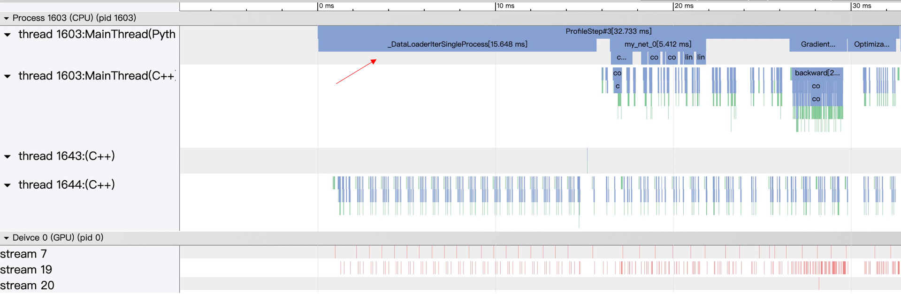
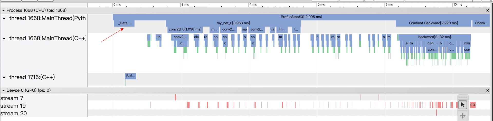
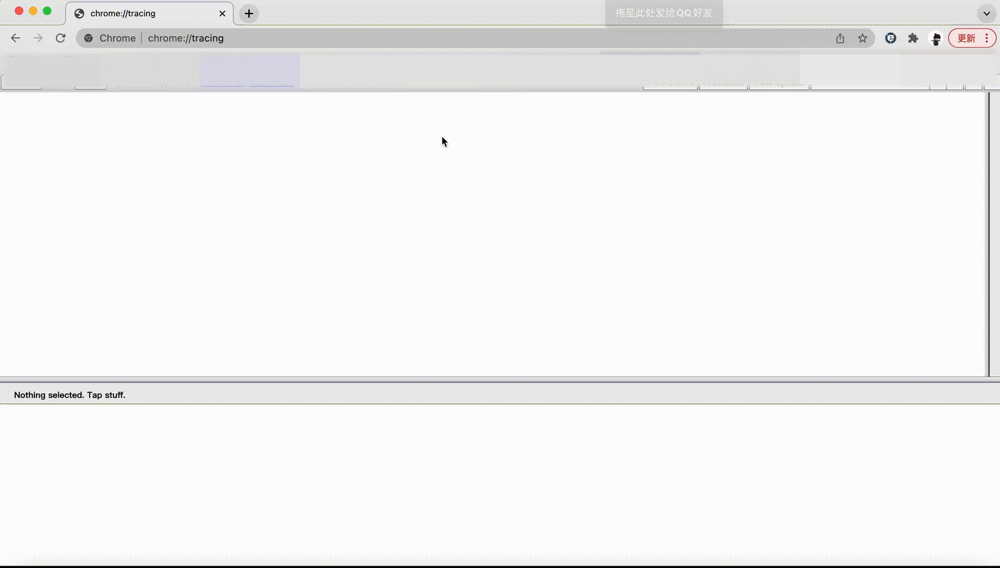

# 模型性能分析（Profiler）

飞桨框架提供了低开销性能分析器（Profiler），可以对模型运行过程的性能数据进行收集、统计和展示。性能分析器提供的数据可以帮助定位模型性能的瓶颈，识别造成程序运行时间过长或者设备（如 Nvidia GPU、寒武纪 MLU）利用率低的原因，从而寻求优化方案来获得性能的提升。

本文主要介绍如何使用 Profiler 来分析模型运行性能，以及当前 Profiler 可统计和展示的信息。

## 一、开启 Profiler 方法

### 1.1 收集并导出性能数据

**（1）导入 Paddle 性能分析模块。**

```python
import paddle
import paddle.profiler as profiler
```

**（2）创建性能分析器 Profiler 对象，并配置参数。**

```python
prof = profiler.Profiler(targets=[profiler.ProfilerTarget.CPU, profiler.ProfilerTarget.GPU],
                   scheduler = (2, 5),
                   on_trace_ready = profiler.export_chrome_tracing('./profiler_log'),
                   timer_only = False)
```

当前 Profiler 主要有四个参数需要配置：

- **targets** ： 指定性能分析的设备，目前支持 CPU、GPU 和 MLU。
- **scheduler**：指定性能分析的时间周期，示例代码中表示：分析第 [2, 5）个 batch 训练区间的性能数据。
- **on_trace_ready**：指定每一个收集周期结束后的回调处理函数，示例代码中表示：导出收集到的性能数据到 chrome tracing 格式的文件。
- **timer_only**：用于设置是否只需要分析数据读取时间和每个 batch 的迭代时间，并计算 ips（iterations per second， 每秒的迭代次数）。当该参数设置为 True 时，将不会进行详细的底层性能数据收集，此时 Profiler 相当于一个 Python 训练脚本中的计时器。

**（3）开启性能分析器，收集数据。**

在模型训练代码中添加启动性能分析的代码，有两种方式：

a. 使用 with 语句：

```python
with prof:
    for iteration in range(10):
        #train()
        prof.step()
```

b. 调用 profiler 的方法函数：

```python
prof.start()
for iteration in range(10):
    #train()
    prof.step()
prof.stop()
```

前一种方式将在上下文影响范围内启动 profiler；后一种方式通过 `prof.start()` 和 `prof.stop()` 方法设定性能分析范围；并且都通过`prof.step()`方法指示性能分析器进入下一个 batch。两种方式效果是一样的。

> 注意：启动后，Profiler 会根据前面配置的 scheduler 参数作为收集数据的周期（如前文中 scheduler = (2, 5)），并不是从 `prof.start()`就开始。如果没有设置 scheduler 参数（None），默认情况下性能分析器会一直保持 RECORD 状态到结束，但是不建议这样做，收集的周期过长会使得数据量过于庞大，也不利于分析问题所在。

此外，开启 profiler 后，还可以使用 profiler.RecordEvent 接口来自定义需要分析的代码片段：

```python
with profiler.RecordEvent(name="my_code_fragment"):
     data1 = paddle.randn(shape=[3])
     data2 = paddle.randn(shape=[3])
     result = data1 + data2
```

如上述代码将会记录下执行该代码片段所消耗的 CPU 和 GPU 时间。

**（4）导出数据。**

```python
prof.summary(sorted_by=SortedKeys.GPUTotal,
             op_detail=True,
             thread_sep=False,
             time_unit='ms')
```

在收集周期结束时，Profiler 会自动调用所设置的 on_trace_ready 函数，导出性能数据。为了查看统计表单，可以调用 Profiler 的 summary 接口进行查看。该接口主要有四个参数：

- **sorted_by**: 表单中数据项的排列方式，比如上面指定的是按消耗的 GPU 总时间来排序。
- **op_detail**: 是否展示每个 op 执行的子过程详细信息。
- **thread_sep**：是否将不同线程的事件分开打印。
- **time_unit**: 指定表单统计时所显示的时间单位。

### 1.2 查看性能数据的统计表单

飞桨 Profiler 提供了多个维度的性能数据呈现方式，方便深入分析模型性能瓶颈，主要包括：

- 可查看主机侧（CPU）和设备侧（GPU，MLU）在不同线程或 stream 下的事件发生的时间线，具体参见 [Timeline 展示](#31-timeline-展示)；
- 当 Profiler 的 timer_only 设置为 False 时，调用 summary 能够打印统计表单，通过不同角度的表单呈现性能数据，具体参见 [统计表单展示](#32-统计表单展示)；
- 当 Profiler 的 timer_only 设置为 True 时，仅展示模型的吞吐量以及时间开销，打印的统计表单请参见 [Benchmark 信息](#33-benchmark-信息展示)。

## 二、使用 Profiler 调试模型性能示例

下面以一个具体案例说明如何使用性能分析器调试模型训练性能。

在模型性能分析中，通常采用如下四个步骤：

- 获取模型正常运行时的 ips（iterations per second， 每秒的迭代次数），给出 baseline 数据。
- 开启性能分析器，定位性能瓶颈点。
- 优化程序，检查优化效果。
- 获取优化后模型正常运行时的 ips，和 baseline 比较，计算真实的提升幅度。

下面是应用实践教学中关于 [使用神经网络对 cifar10 进行分类](../../practices/cv/convnet_image_classification.html) 的示例代码，里面加上了启动性能分析的代码，可以直接拷贝该代码直接运行。

```python
import paddle
import paddle.profiler as profiler
import paddle.nn.functional as F
from paddle.vision.transforms import ToTensor
import numpy as np

transform = ToTensor()
cifar10_train = paddle.vision.datasets.Cifar10(mode='train',
                                               transform=transform)
cifar10_test = paddle.vision.datasets.Cifar10(mode='test',
                                              transform=transform)
class MyNet(paddle.nn.Layer):
    def __init__(self, num_classes=1):
        super().__init__()

        self.conv1 = paddle.nn.Conv2D(in_channels=3, out_channels=32, kernel_size=(3, 3))
        self.pool1 = paddle.nn.MaxPool2D(kernel_size=2, stride=2)

        self.conv2 = paddle.nn.Conv2D(in_channels=32, out_channels=64, kernel_size=(3,3))
        self.pool2 = paddle.nn.MaxPool2D(kernel_size=2, stride=2)

        self.conv3 = paddle.nn.Conv2D(in_channels=64, out_channels=64, kernel_size=(3,3))

        self.flatten = paddle.nn.Flatten()

        self.linear1 = paddle.nn.Linear(in_features=1024, out_features=64)
        self.linear2 = paddle.nn.Linear(in_features=64, out_features=num_classes)

    def forward(self, x):
        x = self.conv1(x)
        x = F.relu(x)
        x = self.pool1(x)

        x = self.conv2(x)
        x = F.relu(x)
        x = self.pool2(x)

        x = self.conv3(x)
        x = F.relu(x)

        x = self.flatten(x)
        x = self.linear1(x)
        x = F.relu(x)
        x = self.linear2(x)
        return x

epoch_num = 10
batch_size = 32
learning_rate = 0.001
val_acc_history = []
val_loss_history = []

def train(model):
    print('start training ... ')
    # turn into training mode
    model.train()

    opt = paddle.optimizer.Adam(learning_rate=learning_rate,
                                parameters=model.parameters())

    train_loader = paddle.io.DataLoader(cifar10_train,
                                        shuffle=True,
                                        batch_size=batch_size,
                                        num_workers=1)

    valid_loader = paddle.io.DataLoader(cifar10_test, batch_size=batch_size)

    # 创建性能分析器相关的代码
    def my_on_trace_ready(prof): # 定义回调函数，性能分析器结束采集数据时会被调用
      callback = profiler.export_chrome_tracing('./profiler_demo') # 创建导出性能数据到 profiler_demo 文件夹的回调函数
      callback(prof)  # 执行该导出函数
      prof.summary(sorted_by=profiler.SortedKeys.GPUTotal) # 打印表单，按 GPUTotal 排序表单项

    p = profiler.Profiler(scheduler = [3,14], on_trace_ready=my_on_trace_ready, timer_only=True) # 初始化 Profiler 对象

    p.start() # 性能分析器进入第 0 个 step

    for epoch in range(epoch_num):
        for batch_id, data in enumerate(train_loader()):
            x_data = data[0]
            y_data = paddle.to_tensor(data[1])
            y_data = paddle.unsqueeze(y_data, 1)

            logits = model(x_data)
            loss = F.cross_entropy(logits, y_data)

            if batch_id % 1000 == 0:
                print("epoch: {}, batch_id: {}, loss is: {}".format(epoch, batch_id, loss.numpy()))
            loss.backward()
            opt.step()
            opt.clear_grad()

            p.step() # 指示性能分析器进入下一个 step
            if batch_id == 19:
              p.stop() # 关闭性能分析器
              exit() # 做性能分析时，可以将程序提前退出

        # evaluate model after one epoch
        model.eval()
        accuracies = []
        losses = []
        for batch_id, data in enumerate(valid_loader()):
            x_data = data[0]
            y_data = paddle.to_tensor(data[1])
            y_data = paddle.unsqueeze(y_data, 1)

            logits = model(x_data)
            loss = F.cross_entropy(logits, y_data)
            acc = paddle.metric.accuracy(logits, y_data)
            accuracies.append(acc.numpy())
            losses.append(loss.numpy())

        avg_acc, avg_loss = np.mean(accuracies), np.mean(losses)
        print("[validation] accuracy/loss: {}/{}".format(avg_acc, avg_loss))
        val_acc_history.append(avg_acc)
        val_loss_history.append(avg_loss)
        model.train()

model = MyNet(num_classes=10)
train(model)
```

### 2.1 获取性能调试前模型正常运行的 ips

上述代码在创建 Profiler 时候，`timer_only` 设置的值为 True，此时将只开启 benchmark 功能，不开启性能分析器，输出模型正常运行时的 benchmark 信息如下：

```plain
============================================Perf Summary============================================
Reader Ratio: 53.514%
Time Unit: s, IPS Unit: steps/s
|                 |       avg       |       max       |       min       |
|   reader_cost   |     0.01367     |     0.01407     |     0.01310     |
|    batch_cost   |     0.02555     |     0.02381     |     0.02220     |
|       ips       |     39.13907    |     45.03588    |     41.99930    |
```

- **Reader Ratio** 表示数据读取部分占训练 batch 迭代过程的时间占比；
- **reader_cost** 代表数据读取时间；
- **batch_cost** 代表 batch 迭代的时间；
- **ips** 表示每秒能迭代多少次，即每秒训练多少个 batch。

可以看到，**此时的 ips 为 39.1，可将这个值作为优化对比的 baseline**。

### 2.2 开启性能分析器，定位性能瓶颈点

修改代码，将 Profiler 的 `timer_only`参数设置为 False， 此时代表不只开启 benchmark 功能，还将开启性能分析器，进行详细的性能分析。

```python
p = profiler.Profiler(scheduler = [3,14], on_trace_ready=my_on_trace_ready, timer_only=False)
```

性能分析器会收集程序在第 3 到 14 次（不包括 14）训练迭代过程中的性能数据，并在 `profiler_demo`文件夹中输出一个 json 格式的文件，用于展示程序执行过程的 timeline，可通过 chrome 浏览器的 `chrome://tracing` 插件打开这个文件进行查看。



性能分析器还会直接在终端打印统计表单（建议运行程序时使用 `>`重定向符写入到文件中查看），这里重点分析程序输出的 `Model Summary` 表单

```plain
-----------------------------------------------Model Summary-----------------------------------------------
Time unit: ms
---------------  ------  ----------------------------------------  ----------------------------------------
Name             Calls   CPU Total / Avg / Max / Min / Ratio(%)    GPU Total / Avg / Max / Min / Ratio(%)
---------------  ------  ----------------------------------------  ----------------------------------------
ProfileStep      11      294.53 / 26.78 / 35.28 / 24.56 / 100.00   13.22 / 1.20 / 1.20 / 1.20 / 100.00
  Dataloader     11      141.49 / 12.86 / 17.53 / 10.34 / 48.04    0.00 / 0.00 / 0.00 / 0.00 / 0.00
  Forward        11      51.41 / 4.67 / 6.18 / 3.93 / 17.45        3.92 / 0.36 / 0.36 / 0.35 / 29.50
  Backward       11      21.23 / 1.93 / 2.61 / 1.70 / 7.21         8.14 / 0.74 / 0.74 / 0.74 / 61.51
  Optimization   11      34.74 / 3.16 / 3.65 / 2.41 / 11.79        0.67 / 0.06 / 0.06 / 0.06 / 5.03
  Others         -       45.66 / - / - / - / 15.50                 0.49 / - / - / - / 3.96
---------------  ------  ----------------------------------------  ----------------------------------------
```

- **ProfileStep** 表示训练 batch 的迭代 step 过程，对应代码中每两次调用`p.step()`的间隔时间；
- **Dataloader** 表示数据读取的时间，即`for batch_id, data in enumerate(train_loader())`的执行时间；
- **Forward** 表示模型前向计算的时间，即`logits = model(x_data)`的执行时间；
- **Backward** 表示反向传播的时间，即`loss.backward()`的执行时间；
- **Optimization** 表示优化器执行时间，即`opt.step()`的执行时间。
  通过 timeline 可以看到，**Dataloader 占了执行过程的很大比重，Model Summary 显示其占比 48.04%，对应到 timeline 图上也能看到 Dataloader 时间较长**。分析程序发现，这是由于模型本身比较简单，需要的计算量小，再加上 Dataloader 准备数据时只用了单进程来读取，使得程序读取数据时和执行计算时没有并行操作，导致 Dataloader 占比过大。

### 2.3 优化程序，检查优化效果

识别到了问题产生的原因，对程序继续做如下修改，将 Dataloader 的 num_workers （加载数据的子进程个数）设置为 4，使得能有多个进程并行读取数据。

```python
train_loader = paddle.io.DataLoader(cifar10_train,
                                    shuffle=True,
                                    batch_size=batch_size,
                                    num_workers=4)
```

重新对程序进行性能分析，新的 timeline 和 Model Summary 如下所示：



可以看到，**从 Dataloader 中取数据的时间大大减少，变成了平均只占一个 step 的 2%，并且平均一个 step 所需要的时间也相应减少了。**

### 2.4 获取优化后模型正常运行的 ips，确定真实提升幅度

重新将 Profiler 的 `timer_only` 参数设置为 True，获取优化后模型正常运行时的 benchmark 信息：

```plain
============================================Perf Summary============================================
Reader Ratio: 1.653%
Time Unit: s, IPS Unit: steps/s
|                 |       avg       |       max       |       min       |
|   reader_cost   |     0.00011     |     0.00024     |     0.00009     |
|    batch_cost   |     0.00660     |     0.00629     |     0.00587     |
|       ips       |    151.45498    |    170.28927    |    159.06308    |
```

**此时 ips 的值变成了 151.5，相比优化前的 baseline 39.1，模型真实性能提升了 287%。**

**性能调试注意事项：**

- 由于 Profiler 开启时，收集性能数据本身也会造成程序性能的开销，因此正常运行程序时请不要开启性能分析器，性能分析器只作为调试程序性能时使用。
- 如果想获得程序正常运行时候的 benchmark 信息（如 ips），可以像示例一样将 Profiler 的 `timer_only` 参数设置为 True，此时不会进行详尽的性能数据收集，几乎不影响程序正常运行的性能，所获得的 benchmark 信息也趋于真实。
- benchmark 信息计算的数据范围是从调用 Profiler 的 start 方法开始，到调用 stop 方法结束这个过程的数据。而 timeline 和性能数据的统计表单的数据范围是所指定的采集区间，如这个例子中的第 3 到 14 次迭代，因此开启性能分析器时统计表单和 benchmark 信息输出的值是不同的（如统计到的 Dataloader 的时间占比）。
- 当 benchmark 统计的范围和性能分析器统计的范围不同时，由于 benchmark 统计的是平均时间，如果 benchmark 统计的范围覆盖了性能分析器开启的范围，也覆盖了关闭性能调试时的正常执行的范围，此时 benchmark 的值没有意义，因此**开启性能分析器时请以性能分析器输出的统计表单为参考**，这也是为何上面示例里在开启性能分析器时没贴 benchmark 信息的原因。

## 三、Profiler 统计信息和呈现

当前 Profiler 提供 timeline、统计表单、benchmark 信息共三个方面的展示功能。

> 注：Profiler 可以查看主机侧（CPU）和设备侧（GPU，MLU）的事件，设备侧的支持的硬件后续会扩展，在呈现数据时设备侧信息统一标识为 GPU。

### 3.1 Timeline 展示

对于采集的性能数据，导出为 chrome tracing timeline 格式的文件后，可以进行可视化分析。当前，所采用的可视化工具为 chrome 浏览器里的 [tracing 插件](chrome://tracing)，可以按照如下方式进行查看：




目前 Timeline 提供以下特性：

- 查看 CPU 和 GPU 在不同线程或 stream 下的事件发生的时间线。将同一线程下所记录的数据分为 Python 层和 C++ 层，以便根据需要进行折叠和展开。对于有名字的线程，标注线程名字。
- 所展示的事件名字上标注事件所持续的时间，点击具体的事件，可在下方的说明栏中看到更详细的事件信息。通过按键 `w`、`s` 可进行放大和缩小，通过`a`、`d`可进行左移和右移。
- 对于 GPU 上的事件，可以通过点击下方的`launch`链接查看所发起它的 CPU 上的事件。

### 3.2 统计表单展示

统计表单负责对采集到的数据 (Event) 从多个不同的角度进行解读，也可以理解为对 timeline 进行一些量化的指标计算。
目前提供 Device Summary、Overview Summary、Model Summary、Distributed Summary、Operator Summary、Kernel Summary、Memory Manipulation Summary 和 UserDefined Summary 的统计表单，每个表单从不同的角度进行统计计算。每个表单的统计内容简要叙述如下：

- **Device Summary**

  ```plain
  -------------------Device Summary-------------------
  ------------------------------  --------------------
  Device                          Utilization (%)
  ------------------------------  --------------------
  CPU(Process)                    77.13
  CPU(System)                     25.99
  GPU2                            55.50
  ------------------------------  --------------------
  Note:
  CPU(Process) Utilization = Current process CPU time over all cpu cores / elapsed time, so max utilization can be reached 100% * number of cpu cores.
  CPU(System) Utilization = All processes CPU time over all cpu cores(busy time) / (busy time + idle time).
  GPU Utilization = Current process GPU time / elapsed time.
  ----------------------------------------------------
  ```

  DeviceSummary 提供 CPU 和 GPU 的平均利用率信息。其中
  - **CPU(Process)**：指的是进程的 CPU 平均利用率，算的是从 Profiler 开始记录数据到结束这一段过程，进程所利用到的 **cpu core 的总时间**与**该段时间**的占比。因此如果是多核的情况，对于进程来说 CPU 平均利用率是有可能超过 100%的，因为同时用到的多个 core 的时间进行了累加。
  - **CPU(System)**：指的是整个系统的 CPU 平均利用率，算的是从 Profiler 开始记录数据到结束这一段过程，整个系统所有进程利用到的**cpu core 总时间**与**该段时间乘以 cpu core 的数量**的占比。可以当成是从 CPU 的视角来算的利用率。
  - **GPU**: 指的是进程的 GPU 平均利用率，算的是从 Profiler 开始记录数据到结束这一段过程，进程在 GPU 上所调用的**kernel 的执行时间**与**该段时间**的占比。

- **Overview Summary**

  ```plain
  ---------------------------------------------Overview Summary---------------------------------------------
  Time unit: ms
  -------------------------  -------------------------  -------------------------  -------------------------
  Event Type                 Calls                      CPU Time                   Ratio (%)
  -------------------------  -------------------------  -------------------------  -------------------------
  ProfileStep                8                          4945.15                    100.00
    CudaRuntime              28336                      2435.63                    49.25
    UserDefined              486                        2280.54                    46.12
    Dataloader               8                          1819.15                    36.79
    Forward                  8                          1282.64                    25.94
    Operator                 8056                       1244.41                    25.16
    OperatorInner            21880                      374.18                     7.57
    Backward                 8                          160.43                     3.24
    Optimization             8                          102.34                     2.07
  -------------------------  -------------------------  -------------------------  -------------------------
                            Calls                      GPU Time                   Ratio (%)
  -------------------------  -------------------------  -------------------------  -------------------------
    Kernel                   13688                      2744.61                    55.50
    Memcpy                   496                        29.82                      0.60
    Memset                   104                        0.12                       0.00
    Communication            784                        257.23                     5.20
  -------------------------  -------------------------  -------------------------  -------------------------
  Note:
  In this table, We sum up all collected events in terms of event type.
  The time of events collected on host are presented as CPU Time, and as GPU Time if on device.
  Events with different types may overlap or inclusion, e.g. Operator includes OperatorInner, so the sum of ratios is not 100%.
  The time of events in the same type with overlap will not calculate twice, and all time is summed after merged.
  Example:
  Thread 1:
    Operator: |___________|     |__________|
  Thread 2:
    Operator:   |____________|     |___|
  After merged:
    Result:   |______________|  |__________|

  ----------------------------------------------------------------------------------------------------------
  ```

  Overview Summary 用于展示每种类型的 Event 一共分别消耗了多少时间，对于多线程或多 stream 下，如果同一类型的 Event 有重叠的时间段，采取取并集操作，不对重叠的时间进行重复计算。**该表单可以帮助了解各种类型的事件在程序执行过程中的时间消耗占比，如 Kernel 类型的事件代表了在 GPU 上执行的计算时间。**

- **Model Summary**

  ```plain
  --------------------------------------------------Model Summary--------------------------------------------------
  Time unit: ms
  ---------------  ------  -------------------------------------------  -------------------------------------------
  Name             Calls   CPU Total / Avg / Max / Min / Ratio(%)       GPU Total / Avg / Max / Min / Ratio(%)
  ---------------  ------  -------------------------------------------  -------------------------------------------
  ProfileStep      8       4945.15 / 618.14 / 839.15 / 386.34 / 100.00  2790.80 / 348.85 / 372.39 / 344.60 / 100.00
    Dataloader     8       1819.15 / 227.39 / 451.69 / 0.32 / 36.79     0.00 / 0.00 / 0.00 / 0.00 / 0.00
    Forward        8       1282.64 / 160.33 / 161.49 / 159.19 / 25.94   1007.64 / 125.96 / 126.13 / 125.58 / 35.90
    Backward       8       160.43 / 20.05 / 21.00 / 19.21 / 3.24        1762.11 / 220.26 / 243.83 / 216.05 / 62.49
    Optimization   8       102.34 / 12.79 / 13.42 / 12.47 / 2.07        17.03 / 2.13 / 2.13 / 2.13 / 0.60
    Others         -       1580.59 / - / - / - / 31.96                  28.22 / - / - / - / 1.00
  ---------------  ------  -------------------------------------------  -------------------------------------------
  ```

  Model Summary 用于展示模型训练或者推理过程中，dataloader、forward、backward、optimization 所消耗的时间。其中 GPU Time 对应着在该段过程内所发起的 GPU 侧活动的时间。**该表单比较直观的展示了训练或推理过程各个阶段的时间和占比，当 Dataloader 读取数据没有得到优化时能够在此得到明显的体现。**

- **Distributed Summary**

  ```plain
  -----------------------------Distribution Summary------------------------------
  Time unit: ms
  -------------------------  -------------------------  -------------------------
  Name                       Total Time                 Ratio (%)
  -------------------------  -------------------------  -------------------------
  ProfileStep                4945.15                    100.00
    Communication            257.23                     5.20
    Computation              2526.52                    51.09
    Overlap                  39.13                      0.79
  -------------------------  -------------------------  -------------------------
  ```

  Distribution Summary 用于展示分布式训练中通信 (Communication)、计算 (Computation) 以及这两者 Overlap 的时间。
  - **Communication**：所有和通信有关活动的时间，包括和分布式相关的算子 (op) 以及 GPU 上的 kernel 的时间等。
  - **Computation**：所有 kernel 在 GPU 上的执行时间，但是去除了和通信相关的 kernel 的时间。
  - **Overlap**：Communication 和 Computation 的重叠时间。

  **该表单可以辅助分布式程序的开发人员了解当前计算和通信的并行程度，结合 Timeline 可以辅助开发人员朝着提高并行性的方向优化。**

- **Operator Summary**

  ```plain
  (由于原始表单较长，这里截取一部分进行展示)
  ----------------------------------------------------------------Operator Summary----------------------------------------------------------------
  Time unit: ms
  ----------------------------------------------------  ------  ----------------------------------------  ----------------------------------------
  Name                                                  Calls   CPU Total / Avg / Max / Min / Ratio(%)    GPU Total / Avg / Max / Min / Ratio(%)
  ----------------------------------------------------  ------  ----------------------------------------  ----------------------------------------
  -----------------------------------------------------------Thread: All threads merged-----------------------------------------------------------
  conv2d_grad grad_node                                 296     53.70 / 0.18 / 0.40 / 0.14 / 4.34         679.11 / 2.29 / 5.75 / 0.24 / 24.11
    conv2d_grad::infer_shape                            296     0.44 / 0.00 / 0.00 / 0.00 / 0.81          0.00 / 0.00 / 0.00 / 0.00 / 0.00
    conv2d_grad::compute                                296     44.09 / 0.15 / 0.31 / 0.10 / 82.10        644.39 / 2.18 / 5.75 / 0.24 / 94.89
      cudnn::maxwell::gemm::computeWgradOffsetsKern...  224     - / - / - / - / -                         0.50 / 0.00 / 0.00 / 0.00 / 0.08
      void scalePackedTensor_kernel<float, float>(c...  224     - / - / - / - / -                         0.79 / 0.00 / 0.01 / 0.00 / 0.12
      cudnn::maxwell::gemm::computeBOffsetsKernel(c...  464     - / - / - / - / -                         0.95 / 0.00 / 0.01 / 0.00 / 0.15
      maxwell_scudnn_128x32_stridedB_splitK_large_nn    8       - / - / - / - / -                         15.70 / 1.96 / 1.97 / 1.96 / 2.44
      cudnn::maxwell::gemm::computeOffsetsKernel(cu...  240     - / - / - / - / -                         0.54 / 0.00 / 0.00 / 0.00 / 0.08
      maxwell_scudnn_128x32_stridedB_interior_nn        8       - / - / - / - / -                         9.53 / 1.19 / 1.19 / 1.19 / 1.48
      maxwell_scudnn_128x64_stridedB_splitK_interio...  8       - / - / - / - / -                         28.67 / 3.58 / 3.59 / 3.58 / 4.45
      maxwell_scudnn_128x64_stridedB_interior_nn        8       - / - / - / - / -                         5.53 / 0.69 / 0.70 / 0.69 / 0.86
      maxwell_scudnn_128x128_stridedB_splitK_interi...  184     - / - / - / - / -                         167.03 / 0.91 / 2.28 / 0.19 / 25.92
      maxwell_scudnn_128x128_stridedB_interior_nn       200     - / - / - / - / -                         105.10 / 0.53 / 0.97 / 0.09 / 16.31
      MEMSET                                            104     - / - / - / - / -                         0.12 / 0.00 / 0.00 / 0.00 / 0.02
      maxwell_scudnn_128x128_stridedB_small_nn          24      - / - / - / - / -                         87.58 / 3.65 / 4.00 / 3.53 / 13.59
      void cudnn::winograd_nonfused::winogradWgradD...  72      - / - / - / - / -                         15.66 / 0.22 / 0.36 / 0.09 / 2.43
      void cudnn::winograd_nonfused::winogradWgradD...  72      - / - / - / - / -                         31.64 / 0.44 / 0.75 / 0.19 / 4.91
      maxwell_sgemm_128x64_nt                           72      - / - / - / - / -                         62.03 / 0.86 / 1.09 / 0.75 / 9.63
      void cudnn::winograd_nonfused::winogradWgradO...  72      - / - / - / - / -                         14.45 / 0.20 / 0.49 / 0.04 / 2.24
      void cudnn::winograd::generateWinogradTilesKe...  48      - / - / - / - / -                         1.78 / 0.04 / 0.06 / 0.02 / 0.28
      maxwell_scudnn_winograd_128x128_ldg1_ldg4_til...  24      - / - / - / - / -                         45.94 / 1.91 / 1.93 / 1.90 / 7.13
      maxwell_scudnn_winograd_128x128_ldg1_ldg4_til...  24      - / - / - / - / -                         40.93 / 1.71 / 1.72 / 1.69 / 6.35
      maxwell_scudnn_128x32_stridedB_splitK_interio...  24      - / - / - / - / -                         9.91 / 0.41 / 0.77 / 0.15 / 1.54
    GpuMemcpyAsync:CPU->GPU                             64      0.68 / 0.01 / 0.02 / 0.01 / 1.27          0.09 / 0.00 / 0.00 / 0.00 / 0.01
      MEMCPY_HtoD                                       64      - / - / - / - / -                         0.09 / 0.00 / 0.00 / 0.00 / 100.00
    void phi::funcs::ConcatKernel_<float>(float con...  16      - / - / - / - / -                         2.84 / 0.18 / 0.36 / 0.06 / 0.42
    void phi::funcs::ForRangeElemwiseOp<paddle::imp...  16      - / - / - / - / -                         1.33 / 0.08 / 0.16 / 0.01 / 0.20
    ncclAllReduceRingLLKernel_sum_f32(ncclColl)         16      - / - / - / - / -                         26.35 / 1.65 / 3.14 / 0.20 / 3.88
    void phi::funcs::SplitKernel_<float>(float cons...  16      - / - / - / - / -                         2.49 / 0.16 / 0.37 / 0.06 / 0.37
    void axpy_kernel_val<float, float>(cublasAxpyPa...  16      - / - / - / - / -                         1.63 / 0.10 / 0.14 / 0.07 / 0.24
  sync_batch_norm_grad grad_node                        376     37.90 / 0.10 / 0.31 / 0.08 / 3.07         670.62 / 1.78 / 39.29 / 0.13 / 23.81
    sync_batch_norm_grad::infer_shape                   376     1.60 / 0.00 / 0.01 / 0.00 / 4.22          0.00 / 0.00 / 0.00 / 0.00 / 0.00
    sync_batch_norm_grad::compute                       376     23.26 / 0.06 / 0.10 / 0.06 / 61.37        555.96 / 1.48 / 39.29 / 0.13 / 82.90
      void paddle::operators::KeBackwardLocalStats<...  376     - / - / - / - / -                         129.62 / 0.34 / 1.83 / 0.04 / 23.32
      ncclAllReduceRingLLKernel_sum_f32(ncclColl)       376     - / - / - / - / -                         128.00 / 0.34 / 37.70 / 0.01 / 23.02
      void paddle::operators::KeBNBackwardScaleBias...  376     - / - / - / - / -                         126.37 / 0.34 / 1.84 / 0.03 / 22.73
      void paddle::operators::KeBNBackwardData<floa...  376     - / - / - / - / -                         171.97 / 0.46 / 2.58 / 0.04 / 30.93
    GpuMemcpyAsync:CPU->GPU                             64      0.71 / 0.01 / 0.02 / 0.01 / 1.88          0.08 / 0.00 / 0.00 / 0.00 / 0.01
      MEMCPY_HtoD                                       64      - / - / - / - / -                         0.08 / 0.00 / 0.00 / 0.00 / 100.00
    void phi::funcs::ConcatKernel_<float>(float con...  16      - / - / - / - / -                         6.40 / 0.40 / 0.53 / 0.34 / 0.95
    void phi::funcs::ForRangeElemwiseOp<paddle::imp...  16      - / - / - / - / -                         6.23 / 0.39 / 0.56 / 0.27 / 0.93
    ncclAllReduceRingLLKernel_sum_f32(ncclColl)         16      - / - / - / - / -                         95.02 / 5.94 / 7.56 / 4.75 / 14.17
    void phi::funcs::SplitKernel_<float>(float cons...  16      - / - / - / - / -                         6.93 / 0.43 / 0.76 / 0.34 / 1.03
  ```

  Operator Summary 用于展示框架中算子 (op) 的执行信息。对于每一个 Op，可以通过打印表单时候的 op_detail 选项控制是否打印出 Op 执行过程里面的子过程。同时展示每个子过程中的 GPU 上的活动，且子过程的活动算时间占比时以上层的时间为总时间。**该表单可以辅助框架 Op 的开发人员了解算子的耗时，当某个 Op 计算时间超出预期时可以想办法进行优化。**

- **Kernel Summary**

  ```plain
  (由于原始表单较长，这里截取一部分进行展示)
  ---------------------------------------------------------------Kernel Summary---------------------------------------------------------------
  Time unit: ms
  ------------------------------------------------------------------------------------------  ------  ----------------------------------------
  Name                                                                                        Calls   GPU Total / Avg / Max / Min / Ratio(%)
  ------------------------------------------------------------------------------------------  ------  ----------------------------------------
  void paddle::operators::KeNormAffine<float, (paddle::experimental::DataLayout)2>            376     362.11 / 0.96 / 5.43 / 0.09 / 12.97
  ncclAllReduceRingLLKernel_sum_f32(ncclColl)                                                 784     257.23 / 0.33 / 37.70 / 0.01 / 9.22
  maxwell_scudnn_winograd_128x128_ldg1_ldg4_tile418n_nt                                       72      176.84 / 2.46 / 3.35 / 1.90 / 6.34
  void paddle::operators::KeBNBackwardData<float, (paddle::experimental::DataLayout)2>        376     171.97 / 0.46 / 2.58 / 0.04 / 6.16
  maxwell_scudnn_128x128_stridedB_splitK_interior_nn                                          184     167.03 / 0.91 / 2.28 / 0.19 / 5.99
  void paddle::operators::KeBackwardLocalStats<float, 256, (paddle::experimental::DataLay...  376     129.62 / 0.34 / 1.83 / 0.04 / 4.64
  void paddle::operators::KeBNBackwardScaleBias<float, 256, (paddle::experimental::DataLa...  376     126.37 / 0.34 / 1.84 / 0.03 / 4.53
  void phi::funcs::VectorizedElementwiseKernel<float, phi::funcs::CudaReluGradFunctor<flo...  216     115.61 / 0.54 / 2.31 / 0.07 / 4.14
  void paddle::operators::math::KernelDepthwiseConvFilterGradSp<float, 1, 1, 3, (paddle::...  72      113.87 / 1.58 / 2.04 / 1.36 / 4.08
  maxwell_scudnn_128x128_stridedB_interior_nn                                                 200     105.10 / 0.53 / 0.97 / 0.09 / 3.77
  maxwell_scudnn_128x128_relu_interior_nn                                                     184     103.17 / 0.56 / 0.98 / 0.12 / 3.70
  maxwell_scudnn_winograd_128x128_ldg1_ldg4_tile228n_nt                                       48      90.87 / 1.89 / 2.09 / 1.69 / 3.26
  maxwell_scudnn_128x128_stridedB_small_nn                                                    24      87.58 / 3.65 / 4.00 / 3.53 / 3.14
  ```

  Kernel Summary 用于展示在 GPU 执行的 kernel 的信息。**该表单可以辅助设备侧 kernel 的开发人员了解所实现 kernel 的执行性能，对计算耗时过长的 kernel 进行优化。**

- **Memory Manipulation Summary**

  ```plain
  -------------------------------------------------Memory Manipulation Summary-------------------------------------------------
  Time unit: ms
  ---------------------------------  ------  ----------------------------------------  ----------------------------------------
  Name                               Calls   CPU Total / Avg / Max / Min / Ratio(%)    GPU Total / Avg / Max / Min / Ratio(%)
  ---------------------------------  ------  ----------------------------------------  ----------------------------------------
  GpuMemcpySync:GPU->CPU             48      1519.87 / 31.66 / 213.82 / 0.02 / 30.73   0.07 / 0.00 / 0.00 / 0.00 / 0.00
  GpuMemcpyAsync:CPU->GPU            216     2.85 / 0.01 / 0.04 / 0.01 / 0.06          0.29 / 0.00 / 0.00 / 0.00 / 0.01
  GpuMemcpyAsync(same_gpu):GPU->GPU  168     3.61 / 0.02 / 0.05 / 0.01 / 0.07          0.33 / 0.00 / 0.01 / 0.00 / 0.01
  GpuMemcpySync:CUDAPinned->GPU      40      713.89 / 17.85 / 85.79 / 0.04 / 14.44     29.11 / 0.73 / 3.02 / 0.00 / 1.03
  BufferedReader:MemoryCopy          6       40.17 / 6.69 / 7.62 / 5.87 / 0.81         0.00 / 0.00 / 0.00 / 0.00 / 0.00
  ---------------------------------  ------  ----------------------------------------  ----------------------------------------
  ```

  Memory Manipulation Summary 用于展示框架中调用内存操作所花费的时间。**该表单可以帮助了解程序执行过程中存储操作发生的次数和时间，结合 timeline，可以分析程序中是否有不必要同步内存拷贝操作，提高内存操作和计算的并行性。**

- **UserDefined Summary**

  ```plain
  ------------------------------------------UserDefined Summary------------------------------------------
  Time unit: ms
  -----------  ------  ----------------------------------------  ----------------------------------------
  Name         Calls   CPU Total / Avg / Max / Min / Ratio(%)    GPU Total / Avg / Max / Min / Ratio(%)
  -----------  ------  ----------------------------------------  ----------------------------------------
  --------------------------------------Thread: All threads merged---------------------------------------
  MyRecord     8       0.15 / 0.02 / 0.02 / 0.02 / 0.00          0.00 / 0.00 / 0.00 / 0.00 / 0.00
  -----------  ------  ----------------------------------------  ----------------------------------------
  ```

  UserDefined Summary 用于展示用户自定义记录的 Event 所花费的时间。**通过 RecordEvent 接口所定义的事件将会展示在这里，用来分析目标代码片段的执行时间。**

### 3.3 Benchmark 信息展示

Benckmark 信息用于展示模型的吞吐量以及时间开销。

```plain
============================================Perf Summary============================================
Reader Ratio: 0.989%
Time Unit: s, IPS Unit: steps/s
|                 |       avg       |       max       |       min       |
|   reader_cost   |     0.00010     |     0.00011     |     0.00009     |
|    batch_cost   |     0.00986     |     0.00798     |     0.00786     |
|       ips       |    101.41524    |    127.25977    |    125.29320    |
```

其中 ReaderRatio 表示数据读取部分占 batch 迭代过程的时间占比，reader_cost 代表数据读取时间，batch_cost 代表 batch 迭代的时间，ips 表示每秒能迭代多少次，即每秒训练多少个 batch。

## 四、更多信息

### 4.1 Profiler 性能分析总结

Profiler 是帮助发现模型训练性能瓶颈的工具，实践中还需要结合开发经验实现模型性能提升的目标。

总结一下，Profiler 可能帮助发现的性能瓶颈问题如下（当然可能不止这些问题），希望可以帮助提供一些发现问题的灵感：

- 帮助发现训练过程中时间占比异常的环节，如本文例子中数据读取时间过长；
- 帮助分析可以优化的同步操作(内存同步、通信同步等），提高执行的并行性；
- 提供信息助力框架算子和 kernel 的优化；
- 帮助发现训练过程中非必要操作的代码，如频繁的记录日志和计算指标。

### 4.2 当前限制/其它

- 目前飞桨 Profiler 支持单机单卡程序和单机多卡分布式程序上的性能分析，其中分布式训练程序每个进程会生成自己的性能数据文件。关于 paddle.profiler 模块更详细的使用说明，可以参考 [API 文档](https://www.paddlepaddle.org.cn/documentation/docs/zh/develop/api/paddle/profiler/Overview_cn.html)。
- 本文中的例子主要是动态图模型训练的 Profiler 开启方法，静态图模型训练、动转静模型训练的用法是类似的。
- 目前 Profiler 主要还只提供时间方面的分析，之后会提供更多信息的收集来辅助做更全面的分析，如提供显存分析来监控显存泄漏问题。
- 此外，飞桨可视化分析工具 VisualDL 正在对 Profiler 的数据展示进行开发，敬请期待。

### 4.3 可能出现的环境问题

Profiler 目前支持采集主机侧（CPU）执行的事件和设备侧（GPU，MLU）执行的事件。通常能够在上述设备正常使用飞桨框架，也就能正常使用 profiler 功能。如果出现环境问题(如 Could not load dynamic library 'libcupti.so.10.1'），可进行如下检查：

- 如果只采集 CPU 上的事件，无需任何前置条件。
- 如果要采集 GPU 上的事件，需要确保：
  - 安装了 NVIDIA GPU 驱动程序和 CUDA Toolkit。
  - NVIDIA CUPTI 性能分析库 libcupti.so 能够被正常链接。通常 CUPTI 会位于 CUDA Toolkit，在 Linux 中的路径通常位于 `/usr/local/cuda/lib64` 或者 `/usr/local/cuda/extras/CUPTI/lib64`，如果程序运行报错提示找不到 libcupti.so，请使用如下命令：

```bash
# 替换成 libcupti.so 实际所在路径
➜  export LD_LIBRARY_PATH=$LD_LIBRARY_PATH:/usr/local/cuda/extras/CUPTI/lib64
```

- 如果要采集 MLU 上的事件，需要确保：
  - 安装了 MLU 驱动程序和 CNToolkit。
  - Cambricon CNPapi 性能分析库 libcnpapi.so 能够被正常链接。通常 CNPapi 会位于 CNToolkit，在 Linux 中的路径通常位于
  - `/local/neuware/lib64`，如果程序运行报错提示找不到 libcnpapi.so，请使用如下命令：

```bash
# 替换成 libcnpapi.so 实际所在路径
➜  export LD_LIBRARY_PATH=$LD_LIBRARY_PATH:/usr/local/neuware/lib64
```


**可能出现的权限问题**

在 Docker 环境中或 Linux 上使用 CUDA Toolkit 进行 GPU 性能分析时，可能会遇到 CUPTI 权限不足的报错 (`CUPTI_ERROR_INSUFFICIENT_PRIVILEGES`)。请参考 [NVIDIA 开发者文档](https://developer.nvidia.com/nvidia-development-tools-solutions-ERR_NVGPUCTRPERM-permission-issue-performance-counters) 详细了解如何解决这些问题。根据 [NVIDIA 开发者文档](https://developer.nvidia.com/nvidia-development-tools-solutions-err-nvgpuctrperm-cupti) 中介绍，当 CUDA 版本为 10.1 时非 root 权限大概率会报权限错误，这种情况需要使用 root 权限用户。

如果在 Docker 环境中发生 CUPTI 权限问题，请在运行容器前加上 `--privileged` 选项：

```bash
# 运行容器
➜  docker run --privileged=true
```

###
