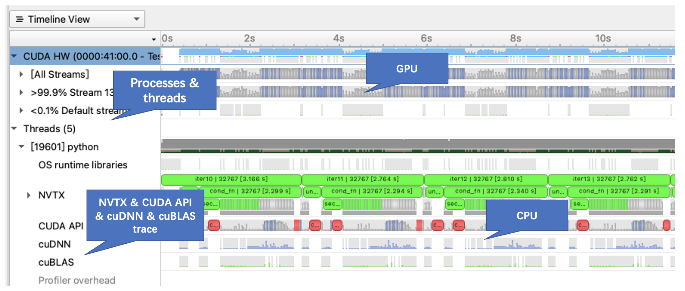

# 性能调优的应用实践案例

## 一 背景与意义
AIGC(AI Generated Content)，即基于人工智能技术自动生成内容，包括文本、语音、图像和视频等。资料显示，AIGC、NFT和VR/AR是元宇宙和Web3.0的三大基础设施。随着数据积累、算力提升和算法迭代，人工智能逐步渗透在写作、编曲、绘画和视频制作等创意领域。在这一趋势下，业内开始涌现出越来越多的AIGC产品，如百度依托飞桨和文心大模型技术创新性推出了业内首个AI艺术和创意辅助平台“文心·一格”。在“文心·一格”平台上，用户只需输入语言描述就可以生成不同风格、独一无二的创意画作，为设计提供灵感、为创作带来更多创意。 

同时业内也涌现出许多AIGC模型， 包括Disco Diffusion、Stable Diffusion等，对于用户所需的一些比较复杂的图片内容，可以将描述场景的关键词转换为涵盖关键词内容的图像。但是如Disco Diffusion这类模型结构复杂，如果用户希望提高训练性能达到产业应用水平，则需要进一步调优。

本文将针对性能这一类问题，以Disco Diffusion为例，详细阐述对该模型进行性能分析和调优的过程，并总结常用的性能分析方法和调优经验。

## 二 模型结构
在对Disco Diffusion训练性能调优之前，本节先简单介绍下这个模型。下图为Disco Diffusion的模型结构示意图。Disco Diffusion模型网络结构主要包括Diffusion Model和CLIP两个部分。简而言之，其中Diffusion Model使用的是U-Net作为扩散模型的主干网络，其作用主要是用于在一个充满噪音的图像上，通过推理出噪音并将其去除出的方式进行作画，而CLIP主要包括CLIP Text Encoder和CLIP Image Encoder两部分，CLIP Text Encoder可以将用户提供的文本编码转换为计算机可以理解的表征形式，而CLIP Image Encoder则对Diffusion Model创作的画作进行编码，通过计算两个编码间的Loss值来指导Disco Diffusion创作出的图像尽可能匹配与文本描述内容。


## 三 性能分析

模型性能优化离不开前期完整深入的分析，而分析的关键则在于使用一个功能丰富、信息展示全面的性能分析工具，本实践将使用英伟达Nsight Systems（NSYS）作为性能分析工具。下面将介绍如何安装和使用此工具分析Disco Diffusion模型。

### 3.1 安装性能分析工具

首先NSYS工具在服务器和本地PC机上皆需要安装：
* 服务器上的NSYS将用于分析模型训练性能，并最终以日志信息和profile文件形式输出性能分析结果。
* PC机上的NSYS将用于查看日志信息，并通过图形化界面查看并分析服务器生成的性能profile文件，从而确定优化策略。

请点击链接：https://developer.nvidia.cn/zh-cn/nsight-systems ，在页面中部，如下图所示，点击“立即下载”按钮，进入下载页面并找到下载列表，然后根据服务器和PC机环境信息找到合适的版本后下载NSYS工具安装包。


#### 服务器安装：
1. 执行如下命令在Linux系统中安装后缀为.run的安装文件。
```
# 服务器/开发机Nsight-system安装命令
bash NsightSystems-linux-public-xxx.run(xxx为不同版本号)
```
2. 安装过程中需要手动输入接受用户许可协议。


3. 安装路径默认敲击回车即可。
4. 安装成功后将会出现如下提示信息表示安装完成。
```
# 安装完成提示信息
To uninstall the Nsight Systems xxx, please delete "/opt/nvidia/nsight-systems/xxx"
Installation Complete
```

#### 本地安装：
安装方法与常规软件安装过程相似，此处不再赘述。

### 3.2 性能分析方法

#### 3.2.1 模型中埋点
在开始使用工具进行分析前，需要先在模型训练代码中相应的位置埋点，飞桨中提供了相关Python API接口（源代码请参见：https://github.com/PaddlePaddle/Paddle/blob/develop/paddle/fluid/pybind/pybind.cc#L2082）。
埋点过程中我们需要借助到英伟达的一个扩展工具，即NVIDIA Tools Extension Library (NVTX)。NVTX是一种强大的机制，允许用户手动检测程序性能数据，然后NSYS可以收集信息并将其呈现在timeline上。常用API接口如下所示（当前NSYS相关API存放在paddle.fluid.core中）：
* nvprof_start：表明NSYS记录性能数据的起始位置
* nvprof_nvtx_push：调用NVTX API，标记某一函数或训练阶段开始运行，类似入栈，一般用字符串表示其名称。具体使用见下方示例代码
* nvprof_nvtx_pop：调用NVTX API，标记某一函数或训练阶段结束运行，类似出栈。具体使用见下方示例代码
* nvprof_stop：表明NSYS记录性能数据的结束位置

在训练/推理过程中，一般以iter（迭代）为单位进行埋点，同时为保证性能数据稳定，且避免生成的profile文件过大，建议采样epoch中段的10到20个iter。若希望以更细粒度地记录和分析模型性能，可以使用nvprof_nvtx_push/pop在模型中任意阶段进行埋点，参考图-1Disco Diffusion模型结构，可以对U-Net、CLIP模型等阶段都进行埋点，方便后续分析。埋点示例如下所示。
```
# 埋点示例伪代码
from paddle.fluid import core

#1. 以iter为单位进行埋点，记录10个iter的性能数据
for iter, data in enumerate(dataloader):
    # 当iter等于100时，开始记录性能数据，且使用NVTX标记第100个iter的耗时
    if iter == 100:
        core.nvprof_start()
        core.nvprof_nvtx_push(str(iter))
    # 当iter大于100且小于110时，上个iter NVTX标记结束，当前iter NVTX开始标记
    if iter > 100 and iter < 110:
        core.nvprof_nvtx_pop()
        core.nvprof_nvtx_push(str(iter))
    # 当iter等于110时，记录结束
    if iter == 110:
        core.nvprof_nvtx_pop()
        core.nvprof_stop()
        
 #2. 一个iter中具体阶段埋点
 # 使用NVTX标记前向的耗时
 core.nvprof_nvtx_push("forward")
 model.forward()
 core.nvprof_nvtx_pop()
 # 使用NVTX标记反向的耗时
 core.nvprof_nvtx_push("backward")
 model.backward()
 core.nvprof_nvtx_pop()
 
 def forward():
     # 使用NVTX标记UNet的耗时
     core.nvprof_nvtx_push("UNet")
     UNet()
     core.nvprof_nvtx_pop()
     for clip_model in CLIP_MODELS:
         # 使用NVTX标记clip model的耗时
         core.nvprof_nvtx_push("clip_model")
         clip_model()
         core.nvprof_nvtx_pop()
```


#### 3.2.2 服务器/开发机运行
执行如下命令启动训练脚本，并且同时可以启动NSYS工具监控和收集训练过程中的性能信息。本案例所使用的各个命令参数说明如下，除此之外还有许多其他参数，读者若想深入了解其具体使用方法可参考其User Guide（链接：https://docs.nvidia.com/nsight-systems/UserGuide/index.html）。
```
nsys profile --stats true -t cuda,nvtx,osrt,cudnn,cublas --capture-range=cudaProfilerApi python train.py
```
命令参数说明：
| 缩写 | 全称 | 可选值 | 默认值 | 功能描述 |
| ------ | ------ |------ | ------ | ------ |
|       |  --stats | true, false | false | true表示收集性能数据后生成汇总统计信息 |
|-t | --trace | cublas, cuda,cudnn, nvtx,opengl,openacc,openmp,osrt, mpi,vulkan等等 | cuda, opengl,nvtx, osrt | 选择要trace的API类别，可选择多个API，仅以逗号分隔（无空格） |
|-c | --capture-range | none, cudaProfilerApi, hotkey, nvtx | none | 当使用该参数时，分析将仅在调用适当的启动 API或热键时开始 |

选择以上参数的原因：
* --stats设置为true，需要获取性能数据汇总统计信息以进行后续的性能分析。
* -t 增加了cublas和cudnn，可以在timeline上更方便的显示出cuBLAS和cuDNN相关的API调用情况。
* -c设置为cudaProfilerApi，仅在core.nvprof_start()后开始记录性能数据，去除模型启动阶段的一些开销，在训练/推理稳定阶段开始收集性能数据，对于后续的性能分析更加准确。


#### 3.2.3 本地图形界面
以上程序运行结束后，会产生详细的性能分析信息，包括CUDA Kernel的耗时占比统计、CUDA API调用次数和耗时等，不仅会生成相关日志信息，还会生成一个后缀为.nsys-rep的Profile文件（如果版本较老，后缀可能为.qdrep）。
使用本地NSYS图形化界面打开生成的Profile文件，界面及展示信息如下所示。
* 左侧信息栏展示了不同的进程和线程的信息：
	- CUDA HW展示的是GPU中的Kernel执行信息。
	- Threads展示了不同线程的执行信息，一般只看第一个python主线程即可。
* Threads线程中的执行程序分为了不同的类别：
	- NVTX：用户自定义或框架自身的一些NVTX事件。
	- CUDA API：CUDA相关的API，如cudaMemcpy、cudaMalloc等。
	- cuDNN/cuBLAS：英伟达提供的高性能计算库中的API。
* 右侧的主界面分为两部分：上半部分是GPU执行的Kernel信息，下半部分则是CPU相关的执行信息。


#### 3.2.4 关键信息
1. NSYS生成的log信息。如下图所示，主要关注以下几个信息：
	- 第一列为每个Kernel占总GPU耗时的比例。
	- 第二、三列为每个Kernel的运行总时间和总次数。
	- 最后一列为每个真正执行的Kernel名称，即CUDA中__global__修饰的函数。
	

2. NSYS生成的timeline信息。如下图所示，主要关注以下几个信息：
	- 大片空白。如图-4中红色框标记，一般属于Python端的不合理开销。
	- GPU较为稀疏的部分。正常情况应该如同绿色框中所示，如果遇到图-4中黄色框中显示的形式，则表明此部分GPU利用率较低，应考虑优化GPU开销。
	- 同步操作。如图-4中黑色框标记，同步会打断CPU端对算子执行的调度，因此需要从模型和框架层面尽可能避免同步。一般来说同步操作有cudaMemcpy、cudaMalloc、cudaDeviceSynchronize等。


下一小节将根据上述关键信息进行优化点分析。


### 3.3 优化点分析
#### 3.3.1 Kernel优化
首先分析图4 Nsight System CUDA Kernel 统计表，对于GPU耗时占比较高的算子，可以尝试优化。
1. Conv优化
由于飞桨中的Conv底层调用的是cuDNN Kernel，所以一般kernel名中带有“xxx_cudnnxxx”或“xxxcudnn_xxx”等关键字的kernel，就是Conv OP中调用的。如图4所示，第1、2、4行都是conv相关的kernel，合计占比高达25.5%，因此后面需要尝试优化Conv。
2. GroupNorm优化
如图4所示，第5行是GroupNorm相关的kernel，且由图6所示，GroupNorm由于不支持FP16计算，所以前后都会插入Cast OP，即图4中第6、7行的kernel，三者合计占比高达16.4%，因此也需要尝试优化。


#### 3.3.2 CPU开销
1. 分析图-4 Disco Diffusion模型的Timeline，在iter15中有大段空白，约400ms，约占总iter耗时的10%，因此分析模型代码，优化其中不合理的Python开销。
2. 分析图-4 Disco Diffusion模型的Timeline，其中黄色框所标记的GPU利用率较低部分，具体分析原因为其中有同步操作所致，如黑色框所示，通过进一步分析模型代码，发现该同步是由于在Python端进行判断时，所需数据需要从GPU拷贝至CPU所致，无法消除，因此暂不优化。代码如下：
```
assert (model_mean.shape == model_log_variance.shape == pred_xstart.shape == x.shape)
```
其中shape返回Tensor在GPU上，而此判断在CPU上进行，因此需要进行同步拷贝。

## 四 性能调优
根据上文分析的优化点，下面将逐一介绍对应的调优方法。
### 4.1 Conv优化
#### 问题
由图4 Nsight System CUDA Kernel 统计表得，Conv的耗时占比较高，因此可以尝试优化。
#### 分析
飞桨中Conv大部分是调用cuDNN实现，对其优化手段通常考虑优化其内部算法的选择。


从图7 Conv算法选择调试信息上可以看到，飞桨对于Conv的workspace_size默认设置的“workspace limit”为512MB，然而在算法选择的时候，某些算法往往会超过这个限制，因此可能会导致无法选择到性能最好的算法。
#### 优化方法
针对上述问题，优化步骤如下：
1. 选择引入环境变量FLAGS_conv_workspace_size_limit来调整workspace_size，从而使其能够尽可能地选择出性能更好的算法，如下命令。
```
export FLAGS_conv_workspace_size_limit = 4096
```
2. 若对显存的使用要求没有限制，则首先将FLAGS_conv_workspace_size_limit设置为4096(MB)，一般都可以选到最优的算法。
3. 若对显存的使用较为敏感，则需要减小workspace_size，一般设置为2的整数次幂，如1024、2048等，或者在某个2的整数次幂附近以256(MB)为步长进行调整，如1280、1536、2048等。
4. 在本案例中，由于考虑到硬件显存大小限制，为了尽可能减小显存使用，最终将FLAGS_conv_workspace_size_limit设置为2048(MB)。
### 4.2 GroupNorm优化
#### 问题
由图4 Nsight System CUDA Kernel 统计表得，GroupNormForward的耗时占比较高，约为6%；且GroupNorm使用的数据类型是Float，而该部分模型使用的是混合精度，因此前后会插入Cast算子来完成Float到Half的相互转换，如图-5所示，此结构为U-Net中占比很高的部分，所以Cast的耗时占比也很高，约10%。
#### 分析
GroupNorm属于是Memory-Bound类算子，即IO是性能瓶颈，若将该算子使用Half计算数据类型，那该算子的输入输出的IO量会直接减半，使Kernel耗时大大减少，同时也会大大减少框架中插入的Cast带来的开销。
#### 优化方法
1. 为GroupNorm添加Half数据类型支持，减少其IO量
```
PD_REGISTER_KERNEL(group_norm,
                   GPU,
                   ALL_LAYOUT,
                   phi::GroupNormKernel,
                   float,
                   double,
                   /*新增float16数据类型*/
                   phi::dtype::float16) {}
```
2. 为了保证精度要求，除了输入和输出外，其他参数仍保持使用FP32类型，且在计算过程中都使用FP32，最终在输出时cast为FP16，减少由数据类型转换带来的精度影响，保证模型整体精度
```
# T为输入数据类型，此处为float16
# AccT为计算时的数据类型，此处为float
template <typename T, typename AccT, int flags>
__global__ void GroupNormForward(/*参数略*/) {
  AccT x_mean = mean[ng];
  AccT x_var = var[ng];

# 计算过程中保持float计算
  AccT val;
  val = static_cast<AccT> (x[index]);
  val = (val - x_mean) * var_inv;
# 输出前转为float16
  y[index] = static_cast<T>(val);
}
```
详细调优代码请参见优化PR：https://github.com/PaddlePaddle/Paddle/pull/48222
### 4.3 减少Python端开销
#### 问题
由图-4 Timeline存在大段空白可以看到，在iter开始会存在大段空白，严重影响性能，规律是每5个iter出现，平均到每个iter大约有10%的占比。
#### 分析
在Timeline中，CPU与GPU都无法捕捉到的行为往往都是Python侧的一些开销所导致。进一步分析代码可知，模型中每隔5个Iter会将中间生成的图片保存下来，因此才会出现这样的现象。对应代码如下：
```
# 中间结果保存阶段代码
# 将结果转为图片，从GPU拷贝到CPU
def to_pil_image(pic):
    """
    pic: paddle.Tensor, dtype="float"
    """
    assert isinstance(pic, paddle.Tensor) and "float" in str(pic.numpy().dtype)
    pic = (pic * 255).cpu().numpy().astype("uint8")
    pic = np.transpose(pic, (1, 2, 0))
    return Image.fromarray(pic, mode="RGB")

# 每隔5个iter或最后一个iter会保存中间结果图片
if j in args.save_interm_steps or cur_t == -1:
    image = sample['pred_xstart'][0]
    # 调用tensor转图片的函数
    image = to_pil_image(((image + 1.) / 2.).clip(0, 1))
    if j in args.save_interm_steps:
        percent = math.ceil(j / total_steps * 100)
        filename = f'{args.batch_name}({args.batchNum})_{i:04}-{percent:02}%.png'
        # 大段空白的开销来源
        image.save(f'{partialFolder}/{filename}')
    if cur_t == -1:
        filename = f'{args.batch_name}({args.batchNum})_{i:04}.png'
        image.save(f'{batchFolder}/{filename}')
```
上述代码中image.save是保存图片的操作，即大段空白开销来源。
#### 优化方法
观察Timeline可知，这段空白之前已经完成了从GPU到CPU的数据拷贝（上面代码段的to_pil_image函数），如下图-7中红色框标记所示，所以这部分属于是纯Python的开销，因此可以考虑使用Python中Multi-Thread的方式，完成这一步的图片保存，从而不影响主线程的程序运行。


```
import threading

class MultiThread(threading.Thread):
    def __init__(self, *args, **kwargs):
        # 参数设置
        super().__init__()

    def run(self) -> None:
        # 子线程完成图片保存工作
        self.image.save(f'{filename}')
```
## 五 调优结果
经过上述的分析和优化，我们将最终的优化过程及其对应的优化效果汇总到下面的图表中进行展示。


> 注：
> 优化一：Conv优化；
> 优化二：Conv优化+GroupNorm优化
> 优化三：Conv优化+GroupNorm优化+减少Python端开销

最终经过我们的性能调优，Disco Diffusion模型在飞桨上的性能相比PyTorch达到了1.57x的加速比。

## 六 总结
本文以Disco Diffusion模型为例，详细阐述了一个模型的性能分析方法和调优过程，下面将总结下在面对一个新的模型时，通常需要从哪些方面分析和针对性优化。
1. 快速地运行配置调优
飞桨提供了很多运行时配置，我们在模型调优初期，可以通过尝试这些不同的运行配置，快速地验证其对性能是否有提升效果。比如：
	- 调整dataloader的num_workers大小，对于模型训练来说通常都是可以起到一定的效果。
	- 设置FLAGS_use_autotune/FLAGS_cudnn_exhaustive_search，或者调整FLAGS_conv_workspace_size_limit，可以帮助框架选择更好的Conv算法，从而提升以Conv性能为瓶颈的模型性能。

更多的运行时配置可以参见https://github.com/PaddlePaddle/Paddle/blob/develop/paddle/phi/core/flags.cc

2. 熟练地使用性能分析工具产出关键数据
“工欲善其事，必先利其器”。性能优化离不开分析，而分析则离不开分析工具。如3.1中所描述，在模型分析前，我们需要熟练地掌握性能分析工作，并且可以快速地通过工具拿到分析所需要的关键数据，这对后续的分析和优化是必不可少且至关重要的一环。

3. 准确地判断模型性能缺陷并采取相应的优化方法

**GPU优化：**
如果模型的GPU耗时远大于CPU，那我们需要优化GPU性能。这种问题下的优化思路往往比较直接，就是优化CUDA Kernel。
	- 通过NSYS生成的log，对耗时占比较高的CUDA Kernel进行性能优化，这里主要涉及到CUDA优化，不做展开；或者使用其它深度优化的高性能计算库，如cuDNN，cuBLAS等。
	- 如果是混合精度模型，在精度满足要求的前提下，可以使用Half类型代替Float类型去完成计算，一方面可以大大减少算子的IO量，另一方面也可以减少框架中在算子前后插入的Cast带来的开销。

**CPU优化：**
当模型整体的GPU利用率不高时，CPU开销就成为了模型性能的瓶颈。这种情况下，我们通常的优化思路有以下几点：
	- 减少同步操作：对于Host和Device，也就是CPU和GPU而言，Kernel Launch和执行是异步的，因此一些同步操作（如cudaMemcpy、cudaDeviceSynchronize）会造成CPU必须要等待GPU执行完成后，才能进行下一个Kernel的分发调度，因此需要尽量减少这类同步操作。需要从上到下，从模型、API到算子，去检查是否存在不合理的同步操作，如去除Numpy调用、使用异步拷贝等。
	- 如果观察Timeline中有大量小算子调用导致GPU利用率低，可以检查模型实现是否合理，能否找到可以实现相同功能但是算子调用更少、更高效的方法替代；或者考虑融合，如在Optimizer参数更新阶段中会有成百上千的小算子调用，此时可以将参数融合，只需调用一次算子，就可以完成参数的更新。
	- 如果观察Timeline中有大段空白，需要去检查模型代码实现中是否存在不合理的地方，比如大段的for循环、非常耗时的一些python操作等。

模型性能的分析和调优不是一成不变的，真实情况往往更加复杂，我们希望能够总结归纳出一些经验，可以帮助到性能调优相关的入门者和对这个领域感兴趣的读者，在面对到一个陌生的模型，不知从何下手时，可以有迹可循，最终通过不断的经验积累，找到属于自己的优化之路。
