# 训练全流程自动调优（Beta）

深度学习模型的训练往往需要耗费大量的时间和算力，因此 AI 开发者十分迫切地追求更佳的性能。通过性能优化，不仅可以缩短模型效果验证的周期，提高研发效率；还可以降低算力消耗，节约训练成本。但是由于模型结构的多样性和实际运行环境的复杂性，开发者要想提升训练性能，需要对各种加速策略的原理甚至框架实现机制有深入的了解，并且需要根据模型和硬件环境反复调整尝试，甚至还需要用到专业的性能分析工具才能确认瓶颈点。这无疑给开发者带来了巨大的学习成本以及调试成本，特别是在更换硬件后（比如使用了其他型号的 CPU 或 GPU 等），可能还需要重新分析和调整才能达到最优性能。

针对开发者在性能优化方面的痛点问题，飞桨框架通过深入分析影响模型整体性能的关键点，推出了业界首个全流程自动调优方案，在训练时框架可根据不同模型针对不同硬件自动调整运行配置、选择最优算子内核（Kernel）等，使模型获得最佳性能。大量模型实验表明，自动调优可达到持平甚至超越经验丰富的性能优化专家手工调整的效果，很好地解决了在各种硬件平台针对不同任务的模型手工调优难的问题。

## 一、概述
### 1.1 自动调优的流程和用法
通过对各类模型实际训练情况的深入分析，飞桨框架总结了影响模型训练性能的关键点，并尝试通过自动化的方式对这些关键点进行优化，支持“一键开启”的极简操作方式，减少对开发者经验的依赖，降低开发者手工调优的成本。

#### 1.1.1 多层次性能自动调优技术
飞桨框架目前实现了数据读取参数调整、数据布局切换以及多版本 OP Kernel 选择三个层面的自动调优，其核心技术是通过收集模型运行时的 Kernel 信息、资源使用情况，自动进行对比并且选择最优配置。

1. 数据读取参数调整：对于不同硬件环境，默认的 DataLoader 参数配置无法发挥硬件最优性能。为此，在训练开始之前根据模型的输入数据、训练的硬件对 DataLoader 参数进行搜索配置，从而可以在训练过程中，使用调优后的最佳配置进行数据读取。

2. 数据布局（Layout）切换：针对不同硬件环境，自动选择最佳的数据布局，充分提升模型中所涉及到的算子性能。

3. 多版本 OP Kernel 选择：根据当前模型配置、选择性能最佳的 Kernel。整个训练过程将被分为观察、调优和应用三个阶段。观察阶段，使用默认实现便于调试；调优阶段，使用穷举搜索法选择代价最小的 Kernel 进行缓存；应用阶段，依据算子配置从缓存中获取算法，若未命中则使用默认实现。基于该功能，模型在输入尺寸固定或动态变化的场景下均可通过算法搜索获得性能提升。
以上调优技术在模型训练中位置如下图所示：

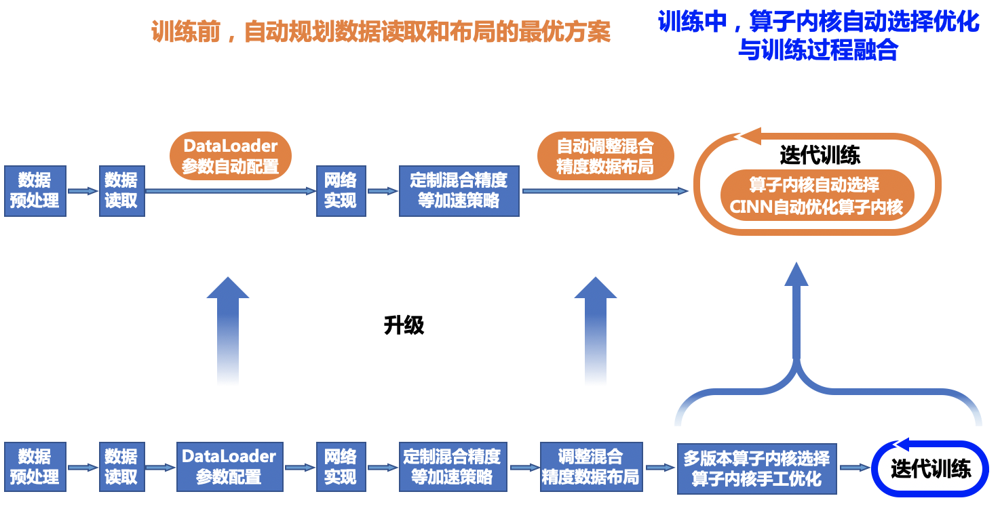

#### 1.1.2 一键开启自动调优
自动调优的所有功能可通过 paddle.incubate.autotune.set_config() 进行一键开启，也可以根据调试需求通过 enable 参数选择开启特定的调优功能：

1. kernel：开启自动调优后，将使用穷举搜索的方法在调优的迭代区间内为算子选择最佳算法并将其缓存。如果需要调试则可以通过 tuning_range 参数设置自动调优开始和结束的迭代区间。

2. layout：开启自动调优后，将根据设备和数据类型确定最优的数据布局（如选择 NCHW 数据布局或者 NHWC 数据布局）。如果当前的 layout 设置并非最优数据布局，将自动进行 layout 的切换以提升模型的性能。

3. dataloader：开启自动调优后，将自动选择最佳的数据加载子进程个数 num_workers 替换原始的配置。

```
config = {
    "kernel": {
        "enable": True,
        "tuning_range": [1, 10],
    },
    "layout": {
        "enable": True,
    },
    "dataloader": {
        "enable": True,
        "tuning_steps": 500
    }
}
paddle.incubate.autotune.set_config(config)
```

### 1.2 适用场景说明
自动调优功能对于所有的模型都是通用的，不存在使用场景的限制，也不存在对硬件的特殊要求。但是针对不同的模型，考虑到模型中算子的数量、kernel 的参数大小以及数据的读取量等存在差异，可以在使用前进行调试，以达到最优的调优效果。通常对模型进行定性分析，影响不同调优方法的因素如下：

1. 数据读取参数调优：通常在数据读取耗时占比较高的模型中，数据读取参数调优的效果表现更加明显，即通过调整数据加载子进程个数 num_workers 可以明显地影响模型的性能。而在数据读取耗时占比较小的模型中，调整 num_workers 往往对模型整体性能影响甚微。

2. 数据布局切换调优：如果模型中 Conv 算子的输入为 float16 数据类型，且模型在具有 Tensor Core 计算单元 (Tensor Core Units, TCUs) 的 GPU 硬件上运行（Nvidia 自从 Volta 架构开始在部分机器集成 TCUs, 如 V100 和 A100 等机器），开启数据布局切换调优会自动将输入数据的 Layout 转为 NHWC 进行计算；如果模型中 Conv 算子的输入为 float32 数据类型，开启数据布局切换调优后，模型运行时会将输入数据 Layout 转为 NCHW 进行计算。原因是 TCU 对于不同的数据类型进行 Conv 计算时，数据 Layout 将影响计算单元读取数据，进而导致性能上的差异。

3. 多版本 OP Kernel 选择调优：针对不同的高性能计算库中的 Kernel 以及飞桨框架中实现的 Kernel 进行选择，开启多版本 OP Kernel 选择调优主要针对模型中的计算密集型算子以最低的代价获得更好的性能。在观察和调试阶段缓存最佳配置后、应用阶段将直接获得这些配置进行训练。目前可以通过 OP Kernel 选择调优的算子有 Conv 算子和 Transpose 算子。在飞桨后续的版本中，将继续接入更多计算密集性的算子。

### 1.3 模型调优效果
通过实验对比发现，飞桨框架在开启自动调优功能后，模型的训练性能可以持平甚至超越专家级手工配置优化的效果。在多数模型中，相对飞桨或其他框架的默认配置都有大幅度的性能提升。下图展示了一键开启自动调优后不同模型的性能数据。

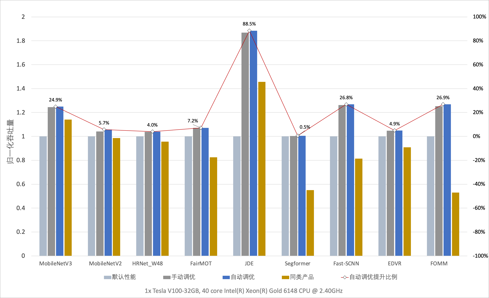

## 二、全流程自动调优示例
### 2.1 模型训练示例一（参照组）
本例作为参照组，先执行一个普通的模型训练，用于对比开启自动调优前后的加速效果。
```
import paddle
import time
from paddle.vision.models import resnet50
import logging
logging.basicConfig(level=logging.DEBUG)

import numpy as np

import paddle
import paddle.nn as nn
import paddle.nn.functional as F
from paddle.io import Dataset, BatchSampler, DataLoader

BATCH_NUM = 100
BATCH_SIZE = 1
EPOCH_NUM = 24

CLASS_NUM = 10
# define a random dataset
class RandomDataset(Dataset):
    def __init__(self, num_samples):
        self.num_samples = num_samples

    def __getitem__(self, idx):
        image = np.random.random([3, 224, 224]).astype('float32')
        label = np.random.randint(0, CLASS_NUM - 1, (1, )).astype('int64')
        return image, label

    def __len__(self):
        return self.num_samples

dataset = RandomDataset(BATCH_NUM * BATCH_SIZE)
simple_net = resnet50()
opt = paddle.optimizer.SGD(learning_rate=1e-3,
                          parameters=simple_net.parameters())

loader = DataLoader(dataset,
                    batch_size=BATCH_SIZE,
                    shuffle=True,
                    drop_last=True,
                    num_workers=2)   # 设置默认 数据读取的 num_worker

# image [1, 3, 224, 224]
train_time = 0 # 记录总训练时长
for e in range(EPOCH_NUM):
    for i, (image, label) in enumerate(loader()):
        start_time = time.time() # 记录开始训练时刻
        with paddle.amp.auto_cast(custom_white_list={'elementwise_add'}, level='O1'):
            out = simple_net(image)
            loss = F.cross_entropy(out, label)
        avg_loss = paddle.mean(loss)
        avg_loss.backward()
        opt.minimize(avg_loss)
        simple_net.clear_gradients()
        if e >= 10:
            train_time += time.time() - start_time # 记录训练耗时

print("模型耗时:{:.3f} sec".format(train_time/(EPOCH_NUM-10)))
```

运行效果：
```
grep: warning: GREP_OPTIONS is deprecated; please use an alias or script
W1219 02:42:50.029127 19849 gpu_resources.cc:61] Please NOTE: device: 0, GPU Compute Capability: 7.0, Driver API Version: 11.4, Runtime API Version: 11.2
W1219 02:42:50.034394 19849 gpu_resources.cc:91] device: 0, cuDNN Version: 8.1.
/usr/local/lib/python3.7/dist-packages/paddle/nn/layer/norm.py:713: UserWarning: When training, we now always track global mean and variance.
  "When training, we now always track global mean and variance."
模型耗时:5.361 sec   # 模型默认配置下的耗时
```


### 2.2 模型训练示例二（加入自动调优策略）
在模型运行前添加自动调优设置的代码，需要新增的代码只有注释范围内的代码部分，无其他代码修改：

+ kernel 用于配置多版本 OP Kernel 选择调优。enable 为 True 表示开启，默认是关闭。可以通过 tuning_range 参数设置自动调优开始和结束的迭代区间，常用范围是从模型第 1 次迭代开始 Kernel 调优，第 10 次迭代结束 Kernel 调优。

* layout 用于配置数据布局切换调优。enable 为 True 表示开启，默认是关闭。

* dataloader 用于配置数据读取参数调优。enable 为 True 表示开启，默认是关闭。tuning_steps 用于控制调优的步数，tuning_steps 越大每个 num_worker 下的 dataloader 耗时越稳定，num_worker 选择越准确，弊端是 tuning_steps 越大 dataloader 调优耗时越久，tuning_steps 需大于 0，默认是 500。
```
import paddle
import time
from paddle.vision.models import resnet50
import logging
logging.basicConfig(level=logging.DEBUG)

import numpy as np

import paddle
import paddle.nn as nn
import paddle.nn.functional as F
from paddle.io import Dataset, BatchSampler, DataLoader

BATCH_NUM = 100
BATCH_SIZE = 1
EPOCH_NUM = 24

CLASS_NUM = 10

# ************* 一键开启 自动调优 ***************
config = {
    "kernel": {
        "enable": True,   # 开启 kernel 调优
        "tuning_range": [1, 3],
    },
    "layout": {
        "enable": True,  # 开启 layout 调优
    },
    "dataloader": {      # 开启数据读取调优
        "enable": True,
        "tuning_steps": 1000 # 设置调优的步数
    }
}
paddle.incubate.autotune.set_config(config) # 添加配置
# ************* 一键开启 自动调优 ***************

# define a random dataset
class RandomDataset(Dataset):
    def __init__(self, num_samples):
        self.num_samples = num_samples

    def __getitem__(self, idx):
        image = np.random.random([3, 224, 224]).astype('float32')
        label = np.random.randint(0, CLASS_NUM - 1, (1, )).astype('int64')
        return image, label

    def __len__(self):
        return self.num_samples

dataset = RandomDataset(BATCH_NUM * BATCH_SIZE)
simple_net = resnet50()
opt = paddle.optimizer.SGD(learning_rate=1e-3,
                          parameters=simple_net.parameters())

loader = DataLoader(dataset,
                    batch_size=BATCH_SIZE,
                    shuffle=True,
                    drop_last=True,
                    num_workers=2)   # 设置默认 数据读取的 num_worker

# image [1, 3, 224, 224]
train_time = 0 # 记录总训练时长
for e in range(EPOCH_NUM):
    for i, (image, label) in enumerate(loader()):
        start_time = time.time() # 记录开始训练时刻
        with paddle.amp.auto_cast(custom_white_list={'elementwise_add'}, level='O1'):
            out = simple_net(image)
            loss = F.cross_entropy(out, label)
        avg_loss = paddle.mean(loss)
        avg_loss.backward()
        opt.minimize(avg_loss)
        simple_net.clear_gradients()
        if e >= 10:
            train_time += time.time() - start_time # 记录训练耗时
print("模型耗时:{:.3f} sec".format(train_time/(EPOCH_NUM-10)))
```
运行效果：

```
grep: warning: GREP_OPTIONS is deprecated; please use an alias or script
W1219 02:46:20.608898 20127 gpu_resources.cc:61] Please NOTE: device: 0, GPU Compute Capability: 7.0, Driver API Version: 11.4, Runtime API Version: 11.2
W1219 02:46:20.614234 20127 gpu_resources.cc:91] device: 0, cuDNN Version: 8.1.
DEBUG:root:========= DataLoader Auto Tune =========
DEBUG:root:User config for DataLoader: 2        # 默认的 num_worker
DEBUG:root:Tuning Range for num_workers: 0 ~ 20.0   # num_workers 自动调优过程
DEBUG:root:num_workers: 0 avg_cost: 0.002369951228706204
DEBUG:root:for back num_workers: 1 avg_cost: 0.0011901782483470682
DEBUG:root:num_workers: 2 avg_cost: 0.0017953016320053413
DEBUG:root:num_workers: 4 avg_cost: 0.001050046512058803
DEBUG:root:for back num_workers: 5 avg_cost: 0.0008129830263098891
DEBUG:root:for back num_workers: 6 avg_cost: 0.0008290154593331474
DEBUG:root:for back num_workers: 7 avg_cost: 0.0008399218929057219
DEBUG:root:for back num_workers: 8 avg_cost: 0.0007657250579522581
DEBUG:root:for back num_workers: 9 avg_cost: 0.0007616549122090242
INFO:root:auto_tune dataLoader best_num_workers: 4   # 最终选择的 num_workers
DEBUG:root:AutoTuning Cost for DataLoader: 3.491981267929077 seconds
/usr/local/lib/python3.7/dist-packages/paddle/nn/layer/norm.py:713: UserWarning: When training, we now always track global mean and variance.
  "When training, we now always track global mean and variance."
模型耗时:4.883 sec    # 开启自动调优后的模型耗时
```

对比相同 epoch 下开启自动调优前后的训练加速效果，注意当前示例耗时存在波动仅供参考：

|数据对比 | 参照组 | 开启自动优化后 | 性能提升 |
|---|---|---|---|
|训练耗时 | 5.361 s | 4.883 s | 8.9% |


## 三、常见问题和处理办法

数据读取参数调优和 OP Kernel 选择调优对于开发者来说是位于框架底层不可见的，在目前的使用中不会出现报错，但是可能会出现性能调优不理想的情况。如果遇到，请参考 1.2 适用场景说明 结合所运行的模型进行定位分析，并通过修改 config 的配置进行调试以获取最佳的性能。

对于数据布局切换调优不支持的模型，通常会在开启 Layout 调优后出现模型报错等问题。如果出现报错，则表示该模型不支持该调优功能。在使用中遇到任何报错，或者对自动调优功能有任何建议，欢迎以 Github Issues 的形式提交给我们。
## 四、全流程自动调优原理
### 4.1 数据读取（Dataloader）自动调优

当前主流的深度学习框架都在数据读取方面进行了底层的优化，例如通过多进程并发处理数据读取、数据预处理以及数据组 batch 等数据 I/O 任务。通过共享内存加速进程间的数据传输；通过异步操作消除数据拷贝的耗时。并发对数据读取的性能有显著影响，但多数框架对并发度的设置（num_workers）仅提供了一个基础的默认值，难以在各种硬件环境下达到最优性能。由于机器的 CPU 核数量有限，数据读取的效率存在上限，如果达到上限后继续增大 num_workers 的值，不仅无法进一步获得性能提升，甚至会加重 CPU 的负担，挤占其他阶段的资源，进而导致整体性能降低。由于最优并发度的设置与硬件环境相关，目前多数主流框架都将此参数的设置交给开发者决策。开发者可通常需要进行多次测试才能找到最合适的 num_workers 参数，这无疑增加了模型训练的操作成本。

为了方便开发者在训练模型时获得最佳的数据读取性能，飞桨框架设计了一套自动调整 num_workers 参数的机制。开启数据读取自动调优后，在模型启动训练时，框架将自动从模型配置文件中读取 num_workers 参数，同时从设备中读取可用的 CPU 核数，并且从训练数据集中随机抽样构建数据子集，通过 tuning_steps 控制调优的次数，tuning_steps 越大统计的 Dataloader 耗时越稳定，num_workers 选择越准确，弊端是 tuning_steps 越大 Dataloader 调优耗时越久。飞桨会采用 "爬山法" 反复调整读取数据子集时的 num_workers 参数，并统计 tuning_steps 次读取的时间开销，直至得到最佳参数值为止。随后，框架自动替换 num_workers 参数并执行实际训练过程。在正式训练开始前完成最优参数的搜索过程，整个搜索过程可以在秒级完成，达到对开发者无感知的状态。

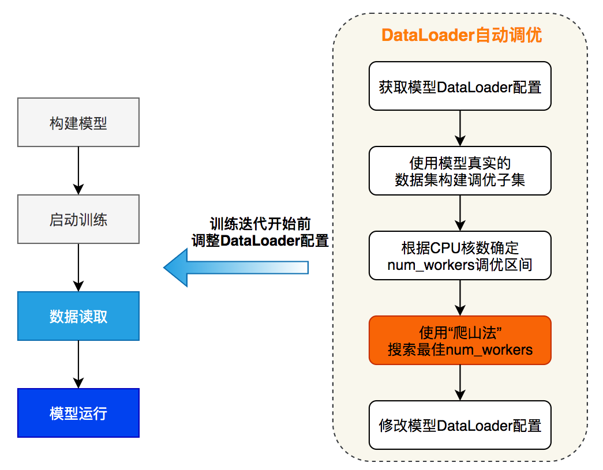

在计算机视觉类的任务中，图像读取和预处理开销较高，如果未启用多进程异步数据读取非常容易出现 IO 瓶颈。以目标检测的 JDE 模型为例，通过性能分析可以发现模型的数据读取开销占比高达 51.71%。而在开启自动调优功能之后，模型的数据读取降低至 0.56%，同时吞吐量从原始的 9.14 samples/s 提升到 13.60 samples/s，性能提升了 49%。

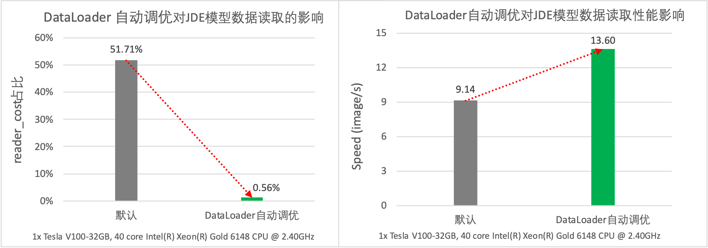

### 4.2 数据布局（Layout）自动调优
深度学习框架中针对多维数组通常支持通道在前（NCHW）和通道在后（NHWC）两种格式。不同硬件上数据排布方式的选择会对性能产生较大的影响。
下图通过实验比较了在 V100 GPU 上 Conv 算子在不同数据布局以及数据类型下的前向运算耗时，结果表明在输入、输出通道数及卷积核尺寸的固定的前提下，FP32 计算采用 NCHW 数据布局性能更优，而 FP16 计算则采用 NHWC 数据布局性能更优。如果对一个使用 NCHW 数据布局、FP32 数据类型的模型开启混合精度模式进行加速，则需开发者手动对数据布局进行调整或额外在相关算子前后插入 Transpose 操作对数据布局进行转换。

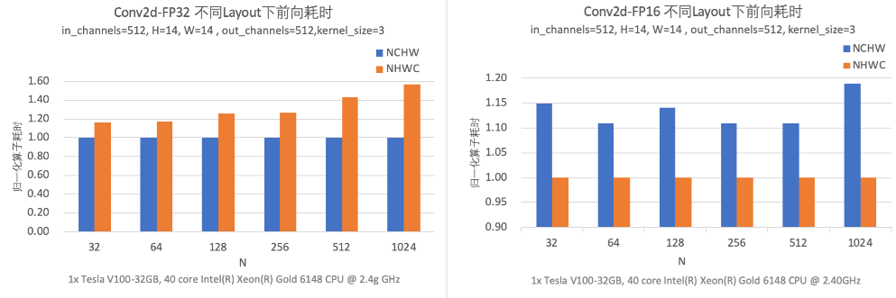

目前主流的框架对于 API 默认的数据布局设置都是 NCHW，但在混合精度训练的大量模型案例中，开发者经常由于不了解加速限制而未使用最佳数据布局，导致框架层面启用了混合精度却没有加速效果。此外，模型中的算子最好使用统一的数据布局，避免算子之间频繁发生数据布局转换造成性能损失。飞桨数据布局自动调整策略会在模型运行过程中获取原始的数据布局配置和设备特性，根据先验知识确定最佳数据布局，根据对数据布局的敏感度，在算子运行前执行转换过程，最后使用转换为最佳数据布局的输入完成算子的计算。

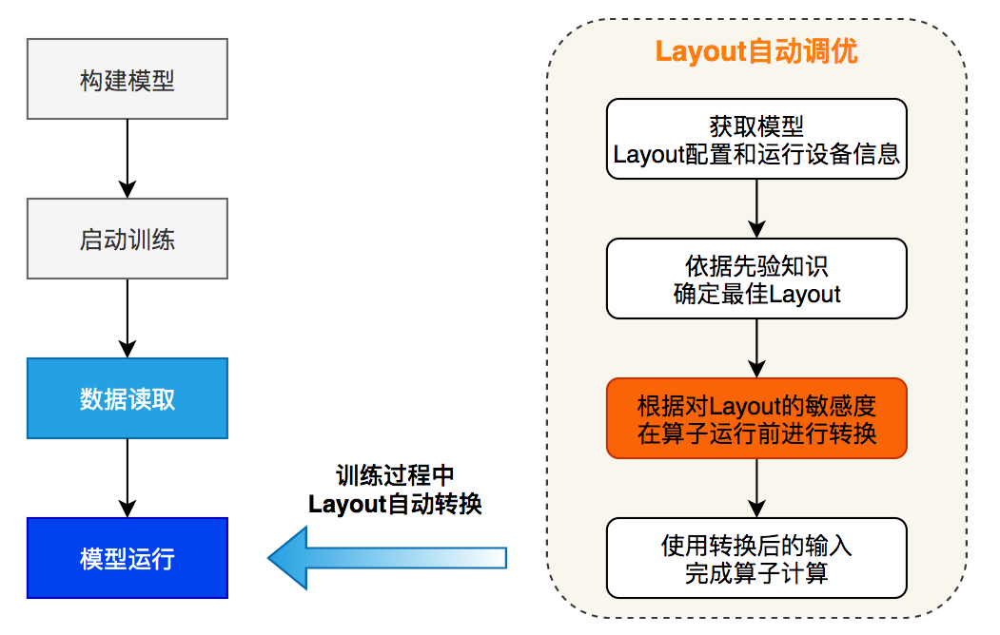

下图是数据布局自动调优的示意图，以 ResNet50 模型为例，根据算子计算功能和性能对数据布局的敏感度，我们设计了 3 类转换规则：

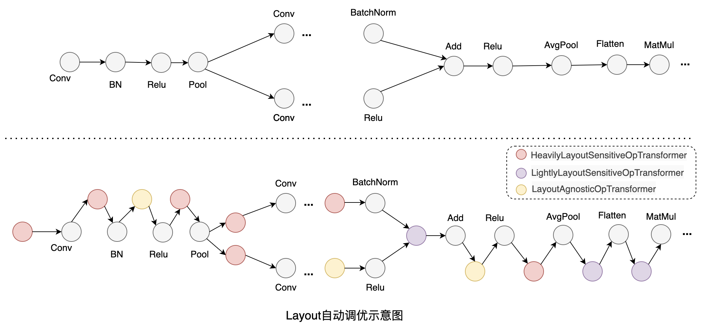

1. 功能和性能与数据布局强相关的算子：例如 Conv，这类算子会在输入不是最佳数据布局时，会将输入转换为最佳数据布局。

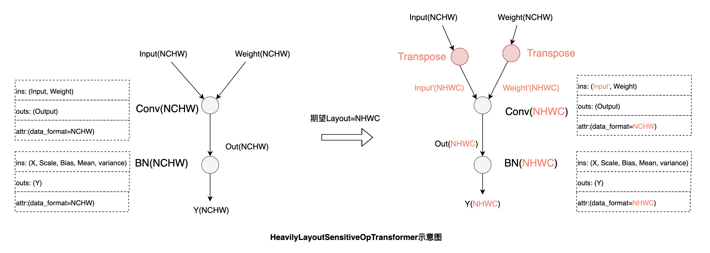

2. 功能与数据布局强相关，性能影响较弱的算子：例如 Flatten，由于计算过程涉及到张量维度配置，其功能会受数据布局的影响。根据输入的数据布局，首先尝试调整 start 和 stop 的 axis 达到等效的结果，当无法通过调整算子参数达到等效时，再将输入转换回原始的数据布局进行计算。

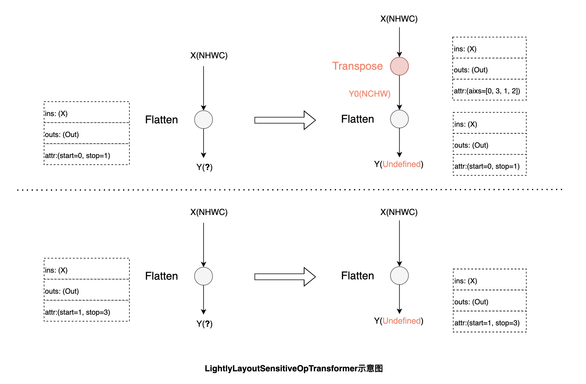

3. 功能和性能与数据布局无关的算子：例如 Relu，这类算子无需做数据布局的转换，只需将输入的数据布局传递给输出。

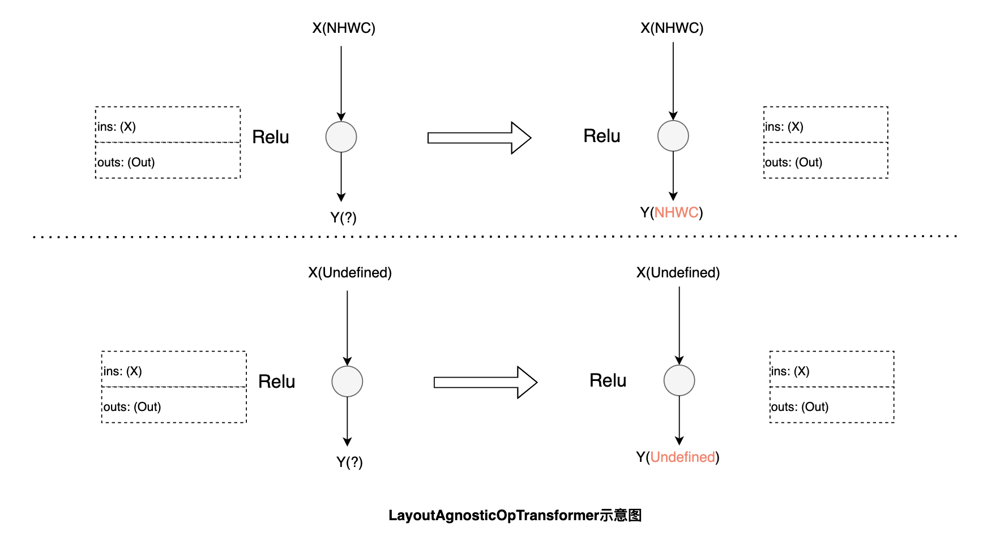

数据布局自动调优中，飞桨引入最小的转换代价使模型在最佳数据布局下运行，获取更大的性能收益。如下图所示，在 V100 GPU 上进行 ResNet50 的混合精度训练，在模型默认数据布局为 NCHW 的情况下，开启自动调优后吞吐量提升了 26.8%，可以与手工调优性能持平。

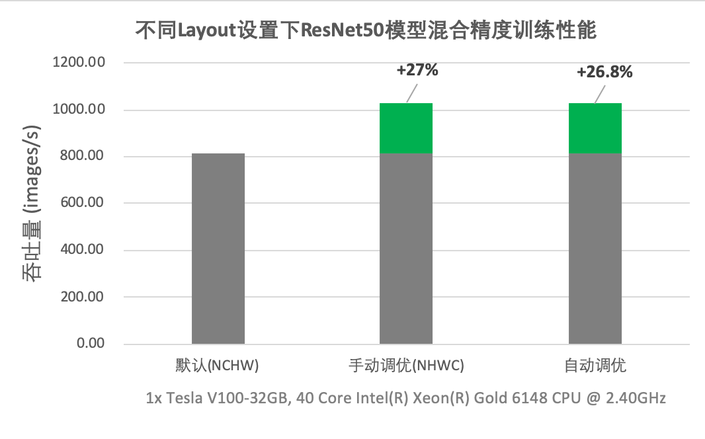

### 4.3 多版本 Kernel 自动选择
为了充分发挥硬件的性能，硬件厂商往往会提供一个或多个高性能计算库，如 NVIDIA 对于其生产的 GPU 提供了 cuDNN，cuBLAS 等多个加速库。此外，许多第三方高性能库提供了跨平台高性能实现，如飞桨采用 Eigen 来实现部分算子。由于模型种类和数量的复杂性，各种算子的配置也存在多种情况，经常存在某一个加速库无法在所有配置和场景下都达到最优性能的情况。针对该情况，目前的主流框架在算子的实现过程中，在引入高性能库进行计算的同时，还会增加一些补充实现以覆盖高性能库性能不佳的场景。例如深度学习模型中常用的 MaxPool2D 算子，采用 cuDNN 实现大部分场景下都能达到很好的性能，但对某些 Shape 的 Tensor （如 [408, 64, 112, 112] 等）进行计算时，cuDNN 提供反向性能十分差，耗时约为飞桨中提供的 CUDA Kernel 的 2 倍。开发者需要使用专业性能分析工具，才能确定不同 kernel 实现在具体配置下的性能差异，手动指定 Kernel，需要付出巨大的性能优化成本。

此外，CV 类任务中最常用的 Conv OP 在 cuDNN 接口内封装了多种算法类型，cuDNN 同时提供了穷举式搜索和启发式搜索两种算法选择模式。针对数据集尺寸变化范围小的场景可使用穷举搜索功能，对每一种 Conv OP 输入获取相应的最高效算法。当数据集的尺寸变化范围广时，穷举式搜索会引发大量的算法选择开销，可能降低整体训练速度。因此多数框架仍然将决策权留给了开发者，需要开发者通过经验或反复调试来确认是否开启，这不仅增加了开发者的调试成本，设置不当还将造成导致巨大的性能损失。

针对上述问题，飞桨框架提供了一套 OP Kernel 自动选择的机制，对于飞桨 Phi 算子库中的某些特定算子，充分挖掘其性能潜力，实现对一个算子的手写 CUDA、硬件加速库、第三方高性能库等多版本 Kernel 的动态选择，在各种输入条件下，都能选取到该算子的最优 Kernel，如下图所示。


OP Kernel 自动选择功能在具体是实现分为观察阶段、优化阶段和执行阶段，各阶段的主要功能如下：
1. 观察阶段：全部 OP 走入默认算法，确保开发者开发和调试过程中的体验与通常开发一致；

2. 优化阶段：当训练过程进入优化 step 区间时，自动地从 OP 层和框架层两个方面展开优化：
* OP 层：自动采用穷举计算模式，针对当前 OP 的输入调用全部可用算法并比较各算法的性能，从中选出最高效算法后，利用 Cache 机制将当前计算场景与被选中算法进行绑定，保证当前计算场景在后续复现时，OP 内可以立即查询 Cache 执行最高性能算法。
* 框架层：飞桨会在优化阶段的每个 step 计算结束后，统计并实时反馈当前 OP 的平均 Cache 命中率，直到达到优化的目标 step 后结束优化过程，进入执行阶段。

3. 执行阶段：根据 Cache 信息调用最佳算法完成 OP 计算，后续计算中若出现数据变换等情形，则走入默认计算分支，避免庞大的算法选择开销。
整个流程如下图所示，调优区间可以通过 config 中的 tuning_range 设置。对于参数波动较大的模型，增大调优区间的范围可以增大 cache 命中的几率、进而提高模型的性能。

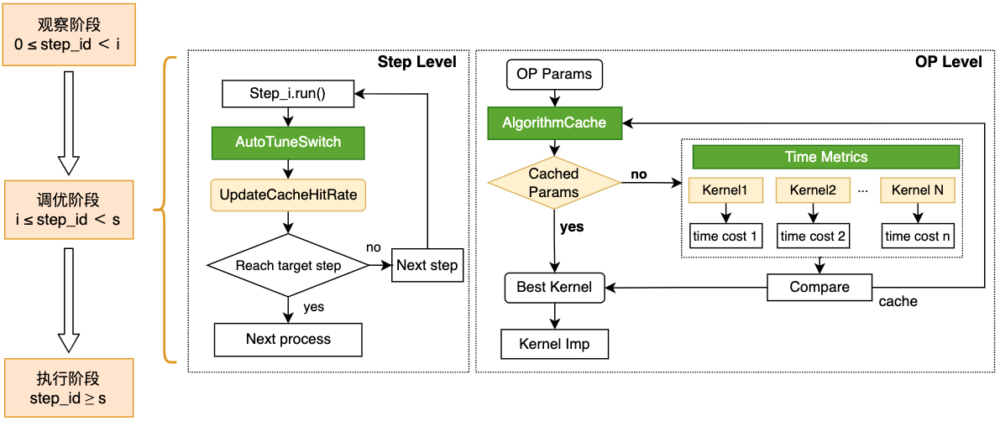

OP Kernel 自动选择机制可有效应对各类变尺度数据集训练场景，挖掘 OP 内各算法性能潜力，在各类训练场景下获得良好的性能收益。例如：对于数据 Shape 变化非常大的目标检测 JDE 模型，在开启 OP Kernel 自动选择功能后，通过下图可以发现，模型的训练性能获得大幅提升，且超越了手动设置 cuDNN 启发式搜索模式的性能。

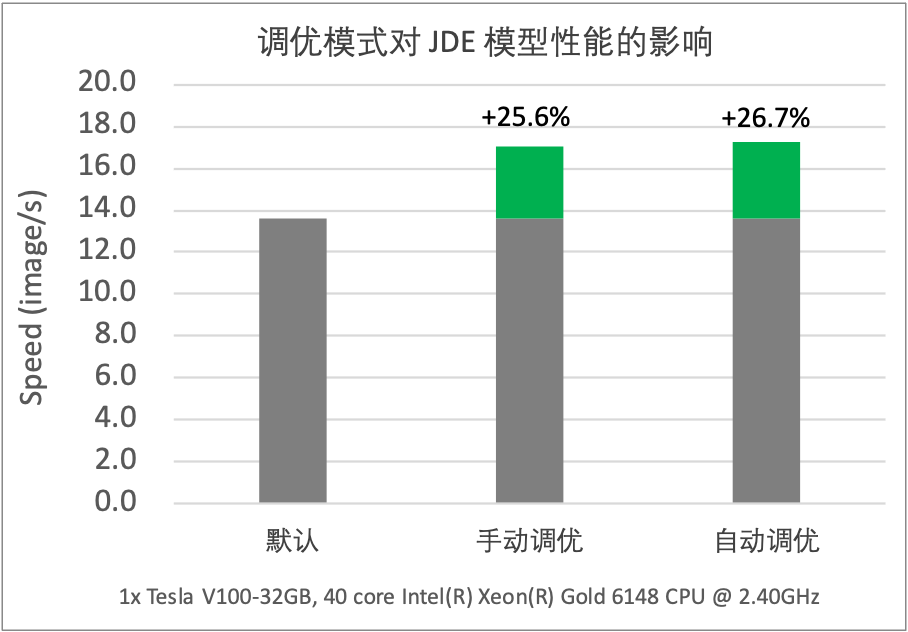

此外，飞桨提供的 OP Kernel 自动选择机制不仅囊括了框架原生的多种算子实现，还可以覆盖到飞桨深度学习编译器中生成和优化的算子，进一步挖掘编译器对算子的自动优化能力。

## 五、总结

DataLoader 自动调优是对模型数据读取进行优化，建议在数据读取耗时占比较高的模型中开启 DataLoader 自动调优，而在数据读取耗时占比较小的模型中，开启 DataLoader 自动调优往往对模型整体性能影响甚微。数据布局切换调优建议在以下两种场景中开启，场景一：当模型中 Conv 算子的输入为 float16 数据类型，数据 Layout 为 NCHW，且模型在具有 Tensor Core 计算单元 的 GPU 硬件上运行时；场景二：当模型中 Conv 算子的输入为 float32 数据类型，数据 Layout 为 NHWC 时；其他场景数据布局切换调优基本无性能收益。当前支持 OP Kernel 选择调优的算子有 Conv 算子和 Transpose 算子，建议在包含 Conv 算子或 Transpose 算子的模型中开启多版本 OP Kernel 选择。在飞桨后续的版本中，飞桨将不断的完善和增强自动调优能力，未来将有更多层次的自动调优功能默认开启，并加入更多的自动调优策略。期待有更多的开发者能够应用此功能提高模型训练效率，达到与专家级手工配置优化持平或超越的效果。
