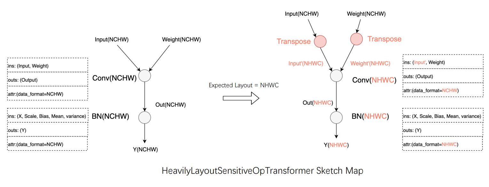

# Auto-tuning in Full-process Training (Beta)

The training of deep learning models consumes a quantity of time and computing power. Therefore, AI developers are pursuing better performance with great urgency. The optimization of performance can not only shorten the model validation cycle and improve R&D efficiency, but also reduce computing power consumption and save training costs. Whereas, owing to the diversity of model structures and the complexity of actual running environments, developers are required to gain insight into the principles of acceleration strategies and even framework implementation mechanisms to improve training performance. They are expected to conduct repeated adjustments according to the model and hardware environment and even employ professional performance analysis tools to identify specific bottlenecks. These requirements undoubtedly bring huge learning and debugging costs to developers, especially after replacing the hardware (e.g., using a different CPU or GPU). In this circumstance, re-analysis and re-adjustment are both needed to achieve optimal performance.
Targeted at developers’ pain points in performance optimization, the PaddlePaddle framework introduces the industry's first full-process automatic tuning scheme through an in-depth analysis of the key points that affect overall model performance. In the process of training, the framework can automatically adjust the running configuration and select the optimal operator Kernel based on various models and hardware to obtain optimal performance. According to a large quantity of model experiments, the result of auto-tuning can equal to or even surpass that of manual tuning by experts in performance optimization. Besides, it solves the problem of difficult manual tuning at different tasks on various hardware platforms.

## 1、Overview
### 1.1 Process and Usage of Auto-tuning
Through in-depth analysis of the actual training of various models, the PaddlePaddle framework summarizes the key points that affect models’ training performance, attempts to optimize these points automatically, and offers "one-click" method to start the operation. It depends less on developer experience and reduces the cost of manual tuning by developers.

#### 1.1.1  Techniques of Multi-level Automatic Performance Tuning
Currently, the PaddlePaddle framework realizes auto-tuning from three perspectives: reading parameter adjustment, data layout switch, and multi-version OP Kernel selection. The core technology is to collect the model’s Kernel information and resource usage at runtime and select the optimal configuration after automatic comparison.

1. Data Reading Parameter Adjustment: The default DataLoader parameters fail to achieve optimal hardware performance in various hardware environments. To tackle this problem, prior to training, the PaddlePaddle framework conducts searchable configuration to DataLoader parameters based on the model’s input and the training’s hardware. In this way, the optimized configuration can be utilized to read data during training.
2. Data Layout Switch: According to different hardware environments, the optimal data layout is automatically selected to improve the performance of operators involved in the models.
3. Multi-version OP Kernel Selection: Select kernel with the optimal performance according to the current model configuration. The whole training process will be divided into three stages: observation, tuning, and application. In the observation stage, adopt the default implementation for the convenience of debugging; In the tuning stage, the Kernel with the least cost is selected by the exhaustive search method for caching; In the application stage, the algorithm is obtained from the cache based on the operator configuration. Employ the default implementation if it fails. Through this function, we can improve the model performance by algorithm search when the input is dynamic or in a fixed size.
The above tuning techniques in the model training process are demonstrated in the following figure:


#### 1.1.2 Enable Auto-tuning with One-click
Enable all auto-tuning functions by paddle.incubate.autotune.set_config(). Users can also enable particular tuning function by the enable parameter according to the debugging requirements.
1. kernel: After enabling auto-tuning, it uses the exhaustive search to select the optimal algorithm for the operator within the tuning iteration interval and cache the algorithm. Use the tuning_range parameter to set the iteration interval at which the auto-tuning starts and ends.
2. layout: After enabling auto-tuning, it will determine the optimal data layout (e.g., NCHW or NHWC) based on the type of devices and data. If the current layout is not the optimal data layout, an automatic switch occurs to improve the model performance.
3. dataloader: After enabling auto-tuning, it will automatically determine the optimal number of data loading child processes num_workers to replace the original configuration.

```
config = {
    "kernel": {
        "enable": True,
        "tuning_range": [1, 10],
    },
    "layout": {
        "enable": True,
    },
    "dataloader": {
        "enable": True,
        "tuning_steps": 500
    }
}
paddle.incubate.autotune.set_config(config)
```

### Applicable Scenarios
The auto-tuning can be applied to all models without restriction on usage scenarios and special requirements on the hardware. However, given the differences in operator number, kernel parameter size, and data read amount in various models, users can debug the auto-tuning before employment to achieve the optimal tuning effect: Qualitative analysis of the model is usually performed. Factors that affect tuning methods are as follows:

1. Data reading parameter tuning: Tuning data reading parameters is more effective for models with higher time-consumption ratios when reading data. In other words, adjusting the number of data loading child processes num_workers can significantly affect the model performance. While for models with lower time-consumption ratios when reading data., tuning num_workers has little impact on the overall performance.

2. Data layout switch tuning: If the input to the Conv operator is in float16 data type and the model is running on GPU hardware with Tensor CoreUnits (TCUs) (Nvidia has integrated TCUs in some machines like V100 and A100 since the Volta architecture), data layout switch tuning will automatically change the layout of the input data to NHWC for calculation. If the input to the Conv operator is in float32 data type, data layout switch tuning will change the layout to NCHW for calculation. The reason is that when TCU computes Conv in different data types, the data layout will affect the data reading conducted by computing units and further result in performance variation.

3. Multi-version OP kernel selection tuning: By selecting kernels from different HPC libraries and the PaddlePaddle framework, multi-version OP kernel selection tuning mainly aims at computation-intensive operators in the model to obtain better performance with the lowest cost. After caching the optimal configurations in the observation and debugging stages, these configurations will be directly obtained for training in the application stage. Currently, the Conv operator and the Transpose operator are applicable in OP Kernal selection tuning. More computation-intensive operators will be added in subsequent PaddlePaddle versions.

### 1.3 Model Tuning Effect
Through experimental comparison, it is found that when enabling auto-tuning, models' training performance can equal to or even surpass the effect after manual tuning by experts. Most models gain significant performance improvements compared with the default configuration of PaddlePaddle and other frameworks. The figure below demonstrates the performance of various models after one-click automatic tuning.


## 2、Full-process Automatic Tuning Example
### 2.1 Model Training Example One (reference group)
A general model training is performed in this example to compare the acceleration effect before and after auto-tuning.
```
import paddle
import time
from paddle.vision.models import resnet50
import logging
logging.basicConfig(level=logging.DEBUG)

import numpy as np

import paddle
import paddle.nn as nn
import paddle.nn.functional as F
from paddle.io import Dataset, BatchSampler, DataLoader

BATCH_NUM = 100
BATCH_SIZE = 1
EPOCH_NUM = 24

CLASS_NUM = 10
# define a random dataset
class RandomDataset(Dataset):
    def __init__(self, num_samples):
        self.num_samples = num_samples

    def __getitem__(self, idx):
        image = np.random.random([3, 224, 224]).astype('float32')
        label = np.random.randint(0, CLASS_NUM - 1, (1, )).astype('int64')
        return image, label

    def __len__(self):
        return self.num_samples

dataset = RandomDataset(BATCH_NUM * BATCH_SIZE)
simple_net = resnet50()
opt = paddle.optimizer.SGD(learning_rate=1e-3,
                          parameters=simple_net.parameters())

loader = DataLoader(dataset,
                    batch_size=BATCH_SIZE,
                    shuffle=True,
                    drop_last=True,
                    num_workers=2)   # Set the default num_worker for data reading

# image [1, 3, 224, 224]
train_time = 0 # Record total training time
for e in range(EPOCH_NUM):
    for i, (image, label) in enumerate(loader()):
        start_time = time.time()  # Record training start time
        with paddle.amp.auto_cast(custom_white_list={'elementwise_add'}, level='O1'):
            out = simple_net(image)
            loss = F.cross_entropy(out, label)
        avg_loss = paddle.mean(loss)
        avg_loss.backward()
        opt.minimize(avg_loss)
        simple_net.clear_gradients()
        if e >= 10:
            train_time += time.time() - start_time # Record training time

print("Model training time:{:.3f} sec".format(train_time/(EPOCH_NUM-10)))
```

Running result：
```
grep: warning: GREP_OPTIONS is deprecated; please use an alias or script
W1219 02:42:50.029127 19849 gpu_resources.cc:61] Please NOTE: device: 0, GPU Compute Capability: 7.0, Driver API Version: 11.4, Runtime API Version: 11.2
W1219 02:42:50.034394 19849 gpu_resources.cc:91] device: 0, cuDNN Version: 8.1.
/usr/local/lib/python3.7/dist-packages/paddle/nn/layer/norm.py:713: UserWarning: When training, we now always track global mean and variance.
  "When training, we now always track global mean and variance."
Model training time:5.361 sec    # Training time in default configuration
```


### 2.2 Model Training Example Two (with auto-tuning strategy)
Before the model runs, the only change is to add the code for auto-tuning within the comment scope:
* The kernel is used to configure multi-version OP kernel selection tuning. The True enable means starting the selection tuning, which is turned off by default. Use the tuning_range parameter to set the iteration interval at which the auto-tuning starts and ends. A common range is to start kernel tuning from the 1st model iteration and end it at the 10th iteration.

* The layout is used to configure data layout switch tuning. The True enable means starting the tuning, which is turned off by default.

* The dataloader is used to configure data reading parameter tuning. The True enable means starting the tuning, which is turned off by default. The tuning_steps is used to control the number of tuning steps. Larger tuning_steps corresponds to more stable time consumption of dataloader under each num_worker, as well as more accurate num_worker selection. Whereas, the downside is that larger tuning_steps requires more time for dataloader tuning. Tuning_steps should be greater than 0, which is set to 500 by default.

```
import paddle
import time
from paddle.vision.models import resnet50
import logging
logging.basicConfig(level=logging.DEBUG)

import numpy as np

import paddle
import paddle.nn as nn
import paddle.nn.functional as F
from paddle.io import Dataset, BatchSampler, DataLoader

BATCH_NUM = 100
BATCH_SIZE = 1
EPOCH_NUM = 24

CLASS_NUM = 10

# ************* Turn on auto-tuning with one click ***************
config = {
    "kernel": {
        "enable": True,   # Enable kernel tuning
        "tuning_range": [1, 3],
    },
    "layout": {
        "enable": True,  # Enable layout tuning
    },
    "dataloader": {      # Enable data reading tuning
        "enable": True,
        "tuning_steps": 1000 # Set tuning steps
    }
}
paddle.incubate.autotune.set_config(config) # Add configurations
# ************* Turn on auto-tuning with one click ***************

# define a random dataset
class RandomDataset(Dataset):
    def __init__(self, num_samples):
        self.num_samples = num_samples

    def __getitem__(self, idx):
        image = np.random.random([3, 224, 224]).astype('float32')
        label = np.random.randint(0, CLASS_NUM - 1, (1, )).astype('int64')
        return image, label

    def __len__(self):
        return self.num_samples

dataset = RandomDataset(BATCH_NUM * BATCH_SIZE)
simple_net = resnet50()
opt = paddle.optimizer.SGD(learning_rate=1e-3,
                          parameters=simple_net.parameters())

loader = DataLoader(dataset,
                    batch_size=BATCH_SIZE,
                    shuffle=True,
                    drop_last=True,
                    num_workers=2)   # Set the default num_worker for data reading

# image [1, 3, 224, 224]
train_time = 0 # Record total training time
for e in range(EPOCH_NUM):
    for i, (image, label) in enumerate(loader()):
        start_time = time.time() # Record start training time
        with paddle.amp.auto_cast(custom_white_list={'elementwise_add'}, level='O1'):
            out = simple_net(image)
            loss = F.cross_entropy(out, label)
        avg_loss = paddle.mean(loss)
        avg_loss.backward()
        opt.minimize(avg_loss)
        simple_net.clear_gradients()
        if e >= 10:
            train_time += time.time() - start_time # Record training time
print("Model training time:{:.3f} sec".format(train_time/(EPOCH_NUM-10)))

```
Running result:

```
grep: warning: GREP_OPTIONS is deprecated; please use an alias or script
W1219 02:46:20.608898 20127 gpu_resources.cc:61] Please NOTE: device: 0, GPU Compute Capability: 7.0, Driver API Version: 11.4, Runtime API Version: 11.2
W1219 02:46:20.614234 20127 gpu_resources.cc:91] device: 0, cuDNN Version: 8.1.
DEBUG:root:========= DataLoader Auto Tune =========
DEBUG:root:User config for DataLoader: 2        # Default num_worker
DEBUG:root:Tuning Range for num_workers: 0 ~ 20.0   # num_workers auto-tuning process
DEBUG:root:num_workers: 0 avg_cost: 0.002369951228706204
DEBUG:root:for back num_workers: 1 avg_cost: 0.0011901782483470682
DEBUG:root:num_workers: 2 avg_cost: 0.0017953016320053413
DEBUG:root:num_workers: 4 avg_cost: 0.001050046512058803
DEBUG:root:for back num_workers: 5 avg_cost: 0.0008129830263098891
DEBUG:root:for back num_workers: 6 avg_cost: 0.0008290154593331474
DEBUG:root:for back num_workers: 7 avg_cost: 0.0008399218929057219
DEBUG:root:for back num_workers: 8 avg_cost: 0.0007657250579522581
DEBUG:root:for back num_workers: 9 avg_cost: 0.0007616549122090242
INFO:root:auto_tune dataLoader best_num_workers: 4   # The final selected num_workers
DEBUG:root:AutoTuning Cost for DataLoader: 3.491981267929077 seconds
/usr/local/lib/python3.7/dist-packages/paddle/nn/layer/norm.py:713: UserWarning: When training, we now always track global mean and variance.
  "When training, we now always track global mean and variance."
Model training time:4.883 sec    # Model training time after enabling auto-tuning
```

Compare the acceleration effect before and after auto-tuning in the same epoch. Note: time fluctuates within this example, for reference only:

|compare | Reference group | After auto-tuning | Performance improvement |
|---|---|---|---|
|Training time | 5.361 s | 4.883 s | 8.9% |


## 3、Common Problems and Solutions
Located in the underlying framework, data reading parameter tuning and OP kernel selection tuning are invisible to developers. Although no errors will be reported, non-ideal tuning may occur. If users encounter this problem, please conduct positioning analysis based on your running model with reference to 1.2 Applicable Scenarios, then modify the config to debug and obtain optimal performance.

For models that do not support data layout switch tuning, problems such as model errors usually occur after enabling layout tuning, which means that the model does not support this tuning function. If you encounter errors or have any suggestions for auto-tuning, feel free to submit them to PaddlePaddle in the form of Github Issues.


## 4、Full-process Automatic Tuning Principles
### 4.1 Data Reading (Dataloader) Auto-tuning

Current mainstream deep learning frameworks have conducted underlying optimizations in terms of data reading. For example, some frameworks deal with data I/O tasks like data reading, data pre-processing and data group batch through multi-process concurrency; some frameworks accelerate the data transfer between processes by shared memory; Others save time on data copy by asynchronous operation. Despite concurrency having a significant impact on data reading performance, most frameworks merely provide one base default value of the concurrency (num_workers), which makes it difficult to realize optimal performance in various hardware environments. Apart from a limited number of CPU cores, there is an upper limit to the efficiency of data reading. If we continue to increase the value ofnum_workersafter reaching the ceiling, it will not contribute to further performance improvement. Instead, this practice even increases the burden on the CPU and crowds out resources in other stages, all of which lead to overall performance degradation. Setting optimal concurrency is related to the hardware environment. Therefore, most mainstream frameworks currently leave its setting to developers. It requires them to conduct multiple tests to find the most appropriatenum_workers, which undoubtedly increases the operational cost of model training.
To help developers obtain optimal data reading performance during model training, the PaddlePaddle framework has designed a mechanism to automatically adjust thenum_workers. When starting the model training with auto-tuning, the framework will automatically read thenum_workersparameter from the model configuration file and the number of available CPU cores from the device. Moreover, it will construct a data subset by random sampling from the training dataset. Modify the number of tuning steps via tuning_steps, which increases with more stable time consumption of Dataloader and more accuratenum_workers. While the downside is that larger tuning_steps require more time for dataloader tuning. PaddlePaddle adopts the “hill climbing” method to repeatedly adjustnum_workerswhen reading data subsets and counts the time cost of data reading in tuning_steps to search the optimal num_workers. Subsequently, the framework automatically replacesnum_workerswith this value and performs the actual training process. This search process can be completed within seconds before formal training, which developers are even not aware of.


With high overheads of image reading and pre-processing in computer vision tasks, IO bottlenecks often occur if multi-process asynchronous data reading is not enabled. Taking the JDE model for target detection as an example, the performance analysis shows that the model’s data reading overhead accounts for 51.71%, which reduces to 0.56% with auto-tuning. Meanwhile, the throughput increases from the original 9.14 samples/s to 13.60 samples/s, with a 49% performance improvement.


### 4.2 Data Layout Auto-tuning
For multi-dimensional arrays, deep learning frameworks usually support both channel ahead (NCHW) and channel behind (NHWC). The data arrangement on different hardware can have a significant impact on model performance.
According to experiments, the figure below compares the forward operation time of the Conv operator on V100 GPU with different data layouts and data types. With a fixed number of input and output channels and convolutional kernel size, the results indicate that the FP32 computation performs better with NCHW data layout, while the FP16 computation performs better with NHWC data layout. If the mixed precision code is enabled for acceleration in models with NCHW data layout and FP32 data type, developers should manually adjust the data layout or additionally insert the Transpose operation before and after relevant operators.


Currently, the data layout of mainstream frameworks is NCHW default by API. However, in many model cases with mixed precision training, developers often fail to use the optimal data layout because they are not familiar with the acceleration limit, causing no acceleration though enabling mixed precision in the framework. Besides, it is better to use a unified data layout for operators to avoid performance loss aroused by frequent data layout switches between operators. In PaddlePaddle’s data layout automatic adjustment, the strategy first obtains the original data layout and device characteristics during model running, determines the optimal data layout according to the prior knowledge, then executes the switch before the operator runs based on the sensitivity to data layouts, and finally uses the input switched to the optimal data layout to complete the operator computation.


The following figure is the sketch map of data layout auto-tuning. Taking the ResNet50 model as an example, 3 types of switch rules are designed according to the operator computation and the performance’s sensitivity to data layouts:


1. Operators whose functionality and performance are heavily layout sensitive: taking Conv as an instance, it will transform the input data layout to the optimal one.



2. Operators whose functionality is heavily layout sensitive and performance is lightly layout sensitive: taking Flatten as an instance, its functionality will be affected by the data layout because the operator's calculation process involves tensor dimension configuration. Based on the input data layout, the auto-tuning strategy first attempts to adjust the axis of start and stop to achieve equivalence. If it fails, the input will be transformed back to the original data layout for calculation.


3. Operators whose functionality and performance are layout agnostic: taking Relu as an instance, data layout transformation is not required for this type of operator. Merely pass the input data layout to the output.


In the data layout auto-tuning, PaddlePaddle makes the model run under the optimal data layout with minimal transformation cost to obtain better performance. As shown in the figure below, for mixed precision training of ResNet50 on V100GPU with the default NCHW data layout, the throughput improves by 26.8% after enabling auto-tuning, which is on par with the performance after manual tuning.


### 4.3 Multi-version Kernel Automatic Selection

Hardware vendors often provide one or more high-performance computing libraries to fully realize the hardware performance. For example, NVIDIA offers several acceleration libraries like cuDNN and cuBLAS for its GPU. In addition, many high-performance libraries from third-party optimize the performance under cross-platform. For instance, PaddlePaddle adopts Eigen to implement some operators. The operator configuration varies owing to the complex model types and model numbers. Hence, one particular acceleration library cannot often achieve optimal performance in all configurations and scenarios. In response to this problem, after introducing high-performance libraries for calculation, the current mainstream frameworks also add some complementary implementations for scenarios where high-performance libraries perform poorly. For example, the MaxPool2D operator, which is commonly used in deep learning models, can achieve good performance in most scenarios using cuDNN implementation. However, cuDNN provides poor reverse performance when computing Tensor in certain Shapes (e.g. [408, 64, 112, 112], etc.). And its time consumption is twice that of the CUDA kernel provided by the PaddlePaddle.Developers need professional performance analysis tools to determine performance differences between different kernels under specific configurations. Specifying the kernel manually comes with a huge cost in performance optimization.
Moreover, the most commonly used Conv OP in computer vision tasks encapsulates multiple algorithms within the cuDNN interface. cuDNN provides two modes, including exhaustive search and heuristic search, to select the algorithm. For scenarios where the dataset size has a small range of variation, the exhaustive search function can be used to obtain the most efficient algorithm for every type of Conv OP input. When the size varies widely, the exhaustive search triggers significant overhead to select the algorithm, which may slow down the overall training speed. Therefore, in most frameworks, the decision right is still given to developers, which requires them to confirm whether to enable auto-tuning by experience or repeated debugging. This will not only increase the debugging cost for developers, but also cause significant performance loss if not set properly.
Targeted at the above problems, the PaddlePaddle framework provides a mechanism for OP kernel automatic selection. For specific operators in the PaddlePaddle Phi operator library, the mechanism can fully exploit their performance potential and realize dynamic selection from kernels in multiple versions, including handwritten CUDA, hardware acceleration libraries, and high-performance libraries from third-party. In this way, the optimal kernel for the operator can be selected under various inputs, as shown in the following figure.


The OP kernel auto-selection is implemented in the observation stage, optimization stage, and execution stage. The main functions of each stage are as follows:
1. The observation stage: All OPs go to the default algorithm, ensuring that the developer experience during development and debugging is consistent with usual development.
2. The optimization stage: When entering the step interval during training, the optimization is automatically carried out from the OP layer and the framework layer：
* OP layer: Automatically adopt the exhaustive computation mode to call all available algorithms for the current OP's input and compare the performance of each algorithm, among which the most efficient algorithm is selected. Then bind the selected algorithm to the current computation scenario using the Cache mechanism. It ensures that the OP can immediately query Cache and perform the optimal algorithm when the current computation scenario recurs subsequently.
* Framework layer: After ending every step in the optimization stage, PaddlePaddle will count the average Cache hit rate of the current OP and give real-time feedback, which lasts until obtaining the optimized target step. Then, it enters the execution stage.
3. The execution stage: Complete the OP computation using the optimal algorithm selected from Cache. If data transformation occurs in the subsequent computation, it goes to the default computation branch to avoid the huge overhead for algorithm selection.

The whole process is as follows. Change tuning_range in configuration to set the tuning interval. For models whose parameters fluctuate widely, widening the tuning interval can increase the cache hit rate and further improve model performance.


The OP kernel auto-selection can effectively cope with various training scenarios with variable-scale datasets, release the performance potential of each algorithm in OP, and realize good performance in various training scenarios. For example, as demonstrated in the following figure, for the target detection JDE model with variable data Shape, the model’s training performance improves greatly after auto-selection, which even exceeds the performance after manually setting the cuDNN heuristic search mode.


Furthermore, this mechanism provided by PaddlePaddle not only includes a variety of operators implemented natively in the framework, but also operators generated and optimized in the PaddlePaddle deep learning compiler, which can further promote the compiler’s auto-tuning capability.

## 5、Summary

The DataLoader auto-tuning aims to optimize one model’s data reading. It is recommended to enable it in models with higher time-consumption ratios when reading data. While it has little impact on the overall performance of the model with rather low time-consumption ratios when reading data. The data layout switch tuning is recommended in the following two scenarios. Scenario 1: The model’s input of Conv is in float16 data type with NCHW data layout. And the model is running on GPU with Tensor Core computing units; Scenario 2: The model’s input of the Conv is in float32 data type with NHWC data layout. For other scenarios, data layout tuning basically cannot promote performance. Currently, the Conv operator and Transpose operator both support OP kernel selection tuning. It is recommended to enable multi-version OP kernel selection in models containing Conv operator or Transpose operator. In the subsequent versions of PaddlePaddle, we will continue to improve and enhance its auto-tuning capability. In the future, more auto-tuning functions will be enabled by default with more auto-tuning strategies. Hope that more and more developers will adopt this function to improve model training efficiency, which can be in line with or beyond the effect after manual optimization by experts.
