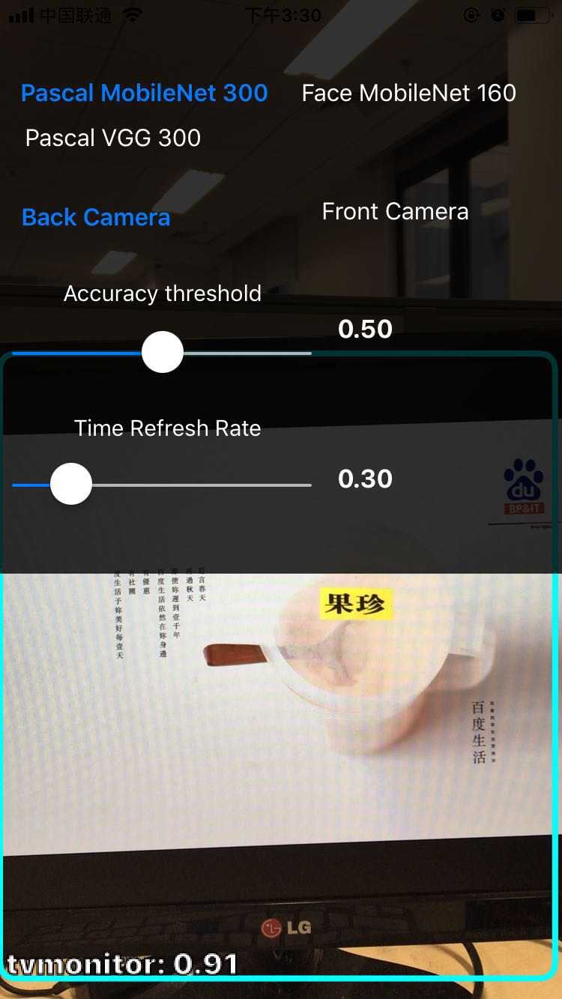
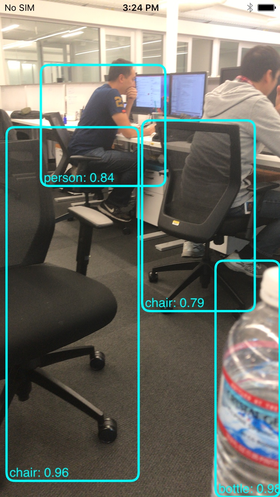
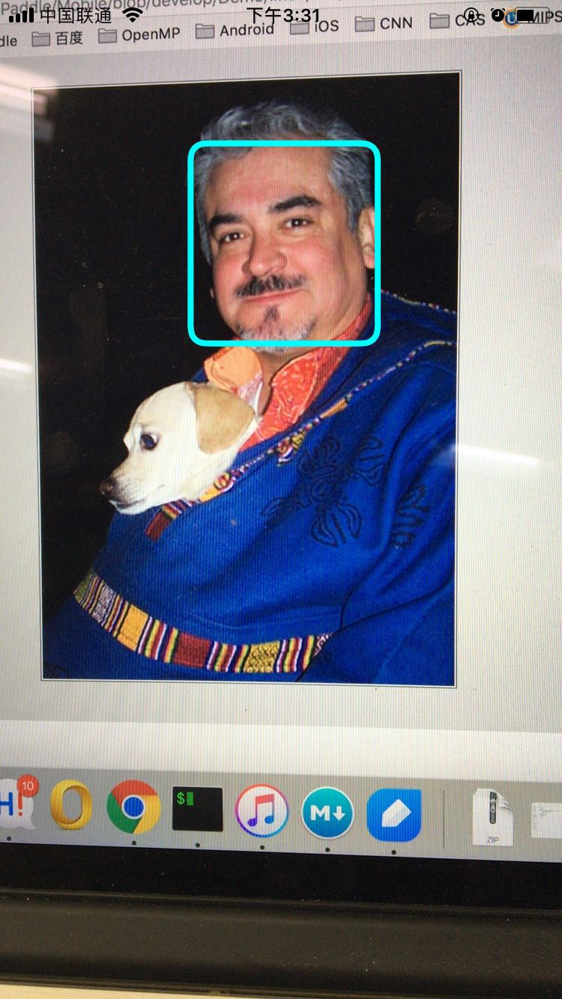
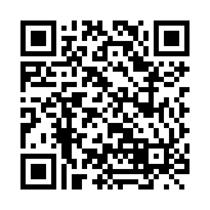

# PDCamera

- [简介](#简介)
  - [模型](#模型)
  - [演示效果](#演示效果)
- [快速安装](#快速安装)
- [源码安装](#源码安装)
  - [准备模型](#准备模型)
  - [准备PaddlePaddle库](#准备paddlepaddle库)
  - [目录结构](#目录结构)
- [如何链接PaddlePaddle库](#如何链接paddlepaddle库)

## 简介

这是一个使用PaddlePaddle库进行离线目标检测的iOS Demo。该Demo调用PaddlePaddle C-API接口，使用预训练好的PaddlePaddle模型，可以检测到通过摄像头捕获到的目标的类别，并将其标记出来，展示给用户。

更多关于SSD模型架构特征，以及如何使用PaddlePaddle训练得到一个好的SSD模型，可以参考[这里](https://github.com/PaddlePaddle/models/tree/develop/ssd)。我们也提供了一个[Linux Demo](https://github.com/PaddlePaddle/Mobile/tree/develop/Demo/linux)，可以在Linux系统上快速地验证模型。

### 模型

我们提供3个预训练的模型以进行测试。其中，`vgg_ssd_net`和`pascal_mobilenet_300_66`模型可进行20类通用物体检测和识别，`face_mobilenet_160_91`可以对人脸进行检测。其识别精度如下表所示：

| Model                    | Dimensions | Accuracy |  Size |
| ------------------------ |:----------:| --------:|------:|
| [pascal\_mobilenet\_300\_66.paddle](http://cloud.dlnel.org/filepub/?uuid=39c325d9-b468-4940-ba47-d50c8ec5fd5b) | 300 x 300 | 66% | 23.2MB |
| [vgg\_ssd\_net.paddle](http://cloud.dlnel.org/filepub/?uuid=1116a5f3-7762-44b5-82bb-9954159cb5d4) | 300 x 300 | 71% | 104.3MB |
| [face\_mobilenet\_160\_91.paddle](http://cloud.dlnel.org/filepub/?uuid=038c1dbf-08b3-42a9-b2dc-efccd63859fb) | 160 x 160 | 91% | 18.4MB |

点击表格中各模型名字，会自动通过浏览器下载对应模型。

### 演示效果

App模型需要开启摄像头权限。启动App后，点击屏幕，将会出现设置主界面（如图-1（1）所示），其中

- 模型选择层：可以选择`Pascal MobileNet 300`或`Face MobileNet 160`，进行20类通用目标检测或者人脸检测。注意：默认情况下`Pascal VGG 300`功能是关闭的。每一次改变设置，App将需要重新启动。
- 摄像头选择层：可选择`Front/Back Camera`，即`前置/后置摄像头`来捕获图像，进行检测。
- 精度阈值控制层（`Accuracy threshold`）：控制识别结果的准确度。取值越高，检测到目标的准确性也越高，但检测到目标的数量可能会降低。
- 刷新时间间隔控制层（`Time Refresh Rate`）：控制摄像头捕获图像的频率。

<p align="center">


<br/>
图-1
（1）App设置主界面&nbsp;&nbsp;&nbsp;&nbsp;
（2）20类通用目标检测效果&nbsp;&nbsp;&nbsp;&nbsp;&nbsp;&nbsp;&nbsp;&nbsp;&nbsp;&nbsp;&nbsp;&nbsp;
（3）人脸检测效果
</p>

进行20类通用目标检测时，App将会框选出检测到的目标，并且显示对应目标的类别和概率（如图-1（2）所示）。进行人脸检测时，App将会框选出目标人脸的位置（如图-1（3）所示）。

## 快速安装

如果你想快速地体验PDCamera，可通过扫描以下二维码进行安装。成功识别二维码之后，会自动跳转到安装页面，点击**“Install PDCamera”**链接，App会自动下载并安装到你的iOS设备上。

成功安装App后，你还需要按照如下步骤设置你的iOS设备：**设置 → 通用 → 设备管理 → Baidu USA llc → 信任“Baidu USA llc”**。

<p align="center">

</p>

## 源码安装

该Demo基于最新的XCode（XCode 9.1）开发。由于Demo中需要调用摄像头进行目标检测，因此不能在模拟器上测试。

该Demo前端使用Swift绘制，基于API 10.0+，因此要求设备的iOS版本在10.0以上。由于Swift不能直接调用Paddle的C-API，因此我们使用Objective-C实现了一个中间层，来调用Paddle的C-API接口。

### 准备模型

Github上面只维护了该Demo相关的源码文件和项目配置。用户可下载[face\_mobilenet\_160\_91.paddle](http://cloud.dlnel.org/filepub/?uuid=038c1dbf-08b3-42a9-b2dc-efccd63859fb)和[pascal\_mobilenet\_300\_66.paddle](http://cloud.dlnel.org/filepub/?uuid=39c325d9-b468-4940-ba47-d50c8ec5fd5b)，加入项目根目录下面的`models`子目录下面。

VGG模型的识别精度高，但由于模型较大（104.3MB），需要占用较高的内存（\~800MB），并且识别速度慢（每帧~1.5秒），因此对设备的计算能力要求较高（iPhone6s以上），默认没有添加到项目中。用户也可自行下载[vgg\_ssd\_net.paddle](http://cloud.dlnel.org/filepub/?uuid=1116a5f3-7762-44b5-82bb-9954159cb5d4)，添加到项目中，体验其高精度识别效果。

这里，我们使用的是**合并的模型**（merged model）。如何从配置文件（例如`config.py`）和训练得到的参数文件（例如`params_pass_0.tar.gz`）得的**合并的模型**文件，请参考[如何合并模型](../../../deployment/model/merge_config_parameters/README.cn.md)。

### 准备PaddlePaddle库

用户可按照[iOS平台编译指南](https://github.com/PaddlePaddle/Paddle/blob/develop/doc/mobile/cross_compiling_for_ios_cn.md)，拉取[Paddle](https://github.com/PaddlePaddle/Paddle)最新的源码，编译适用于iOS平台的PaddlePaddle库。在执行`make install`之后，PaddlePaddle库将会安装在`CMAKE_INSTALL_PREFIX`所指定的目录下。该目录包含如下子目录：

- `include`，其中包含使用PaddlePaddle所需要引入的头文件，通常代码中加入`#include <paddle/capi.h>`即可。
- `lib`，其中包含了PaddlePaddle对应架构的库文件。iOS平台只生成了静态库，包括`libpaddle_capi_layers.a`和`libpaddle_capi_engine.a`。
- `third_party`，PaddlePaddle所依赖的第三方库。

用户也可从[wiki](https://github.com/PaddlePaddle/Mobile/wiki)页面下载预编译好的版本。

准备好PaddlePaddle库之后，用户需要将PaddlePaddle库目录重命名为`paddle-ios`，并拷贝到`AICamera`项目的根目录下。

### 目录结构

在准备好一切之后，项目的目录结构应如下所示：

```
$ git clone https://github.com/PaddlePaddle/Mobile.git
$ cd Mobile/Demo/iOS/AICamera
$ tree
.
├── AICamera  # 源码目录
├── PDCamera.xcodeproj
├── README.md
├── README_cn.md
├── assets
├── models  # 模型存放目录
│   ├── face_mobilenet_160_91.paddle
│   ├── pascal_mobilenet_300_66.paddle
│   └── vgg_ssd_net.paddle
└── paddle-ios  # PaddlePaddle库所在目录
    ├── include
    ├── lib
    │   ├── libpaddle_capi_engine.a
    │   ├── libpaddle_capi_layers.a
    │   └── libpaddle_capi_whole.a
    └── third_party
```

然后，你就可以构建和运行该Demo了。

这个项目展示了如何在iOS App中集成PaddlePaddle，如何调用Paddle C API进行离线推断，以及如何和Swift混合互调。对于开发者，你可以根据自己的需求，在这个项目的基础之上进行二次开发，实现其他深度学习应用。

## 如何链接PaddlePaddle库

开发者若想在自己的iOS项目中链接PaddlePaddle库，则需要按照如下4个步骤配置项目。在这里，我们假设PaddlePaddle库安装在项目根目录的`paddle-ios`目录下面。

- 将头文件目录`paddle-ios/include`添加到**Header Search Paths**。

<p align="center">

</p>

- 如果编译PaddlePaddle库时设置了`IOS_USE_VECLIB_FOR_BLAS=ON`，则需要将加速框架`Accelerate.framework`或`veclib.framework`添加到你的项目中。
- 将PaddlePaddle静态库`libpaddle_capi_layers.a`和`libpaddle_capi_engine.a`，以及所有依赖的第三方库添加到项目中。

<p align="center">

</p>

- 为`libpaddle_capi_layers.a`设置`-force_load`属性。

<p align="center">

</p>
