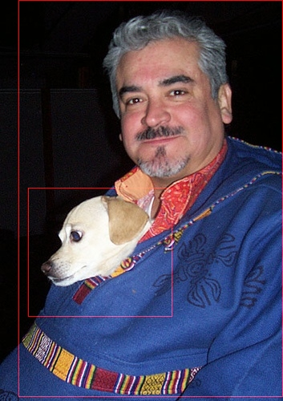

# Download merged models for ssd_demo
  - Use the `model_download.sh` script file
    ```bash
    $ cd models
    $ sh model_download.sh vgg_ssd_net
    ```

  - Download the models manually
    - [vgg_ssd_net.paddle](http://cloud.dlnel.org/filepub/?uuid=1116a5f3-7762-44b5-82bb-9954159cb5d4), input size `300 x 300`, means `[104, 117, 124]`
      ```bash
      $ cd models
      $ wget -c http://cloud.dlnel.org/filepub/?uuid=1116a5f3-7762-44b5-82bb-9954159cb5d4 -O vgg_ssd_net.paddle
      ```

# Test Cases
- `test_noresize`, take `images/resized.jpg` as input, need no resize and no rotate
- `test_resize`, take `images/origin.jpg` as input, need resize but no rotate
- `test_rgba`, take `images/origin.jpg` as input, need resize but no rotate
- `test_rotate`, take `images/rotated.jpg` as input, need resize and totate

All the test cases have the same output.

# Result Profile
- Input image

  

- Result image

  

- Direct result
  ```text
  Direct Result: 7 x 7
  row 0: 0 9 0.0179508 0.0510816 0.239131 0.959698 0.958421
  row 1: 0 12 0.418664 0.0820695 0.482612 0.859771 0.964951
  row 2: 0 12 0.0461984 0.0569364 0.0461196 1 0.962269
  row 3: 0 15 0.998847 0.0509981 0 0.999272 1
  row 4: 0 15 0.0143228 0.00955433 0.486377 0.898542 0.970568
  row 5: 0 15 0.0104038 0.764458 0.188112 0.828094 0.334612
  row 6: 0 18 0.119341 0.0510816 0.239131 0.959698 0.958421
  ```

- Profiled result
  ```text
  Object 0
      image: 0
      type: chair
      score: 0.0179508
      rectangle information:
          xmin, 0.0510816
          ymin, 0.239131
          xmax, 0.959698
          ymax, 0.958421
  Object 1
      image: 0
      type: dog
      score: 0.418664
      rectangle information:
          xmin, 0.0820695
          ymin, 0.482612
          xmax, 0.859771
          ymax, 0.964951
  Object 2
      image: 0
      type: dog
      score: 0.0461984
      rectangle information:
          xmin, 0.0569364
          ymin, 0.0461196
          xmax, 1
          ymax, 0.962269
  Object 3
      image: 0
      type: person
      score: 0.998847
      rectangle information:
          xmin, 0.0509981
          ymin, 0
          xmax, 0.999272
          ymax, 1
  Object 4
      image: 0
      type: person
      score: 0.0143228
      rectangle information:
          xmin, 0.00955433
          ymin, 0.486377
          xmax, 0.898542
          ymax, 0.970568
  Object 5
      image: 0
      type: person
      score: 0.0104038
      rectangle information:
          xmin, 0.764458
          ymin, 0.188112
          xmax, 0.828094
          ymax, 0.334612
  Object 6
      image: 0
      type: sofa
      score: 0.119341
      rectangle information:
          xmin, 0.0510816
          ymin, 0.239131
          xmax, 0.959698
          ymax, 0.958421
  ```

- Profiled result (threshold = 0.3)
  ```text
  Object 1
      image: 0
      type: dog
      score: 0.418664
      rectangle information:
          xmin, 0.0820695
          ymin, 0.482612
          xmax, 0.859771
          ymax, 0.964951
  Object 3
      image: 0
      type: person
      score: 0.998847
      rectangle information:
          xmin, 0.0509981
          ymin, 0
          xmax, 0.999272
          ymax, 1
  ```
