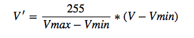
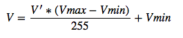

# Rounding

###  Rounding test of Mobilenet(1.0,  224 * 224 input) on flowers102 dataset.

| Model| Rounding | Without BN | Pruning| modelSize(gzip)|Accuracy | Download|
| ---- | --- | ---- | ---  | --- | --- | ---|
|Mobilenet ||  | |12M|97.16%|[download](https://pan.baidu.com/s/1geHkrw3)|
|Mobilenet|&radic;|||3.2M|97.05%|[download](https://pan.baidu.com/s/1bo5kqsR)|
|Mobilenet|||&radic;|4.4M|96.96%|[download](https://pan.baidu.com/s/1ge8wOp1)|
|Mobilenet|&radic;||&radic;|2.3M|96.7%|[download](https://pan.baidu.com/s/1bpo5CMr)|
|Mobilenet||&radic;||12M|97.16%|[download](https://pan.baidu.com/s/1slodbNR)|
|Mobilenet|&radic;|&radic;||3.0M|96.96%|[download](https://pan.baidu.com/s/1bo66hUR)|

## Principle

Given floating parameters `V`, first our goal is to represent `V` as 8-bit integers `V'`. And then we transformed back `V'` back into its approximate high-precision value by performing the inverse of the quantization operation. At last, we perform gzip to our quantized && inverse-quantized model. The whole process can reduces our model by 70%.

### Process
- First, we use UInt8 quantization, that is, the parameters are sacled to [0, 255]  
 

- Second, we inverse the quantization.  
     

In the last, We apply gzip to compress the inverse-quantized model, and the compression ratio can be up to 70%.
