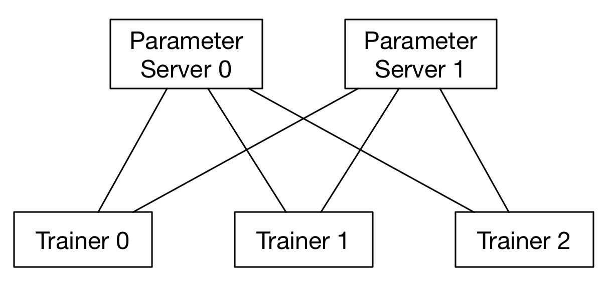
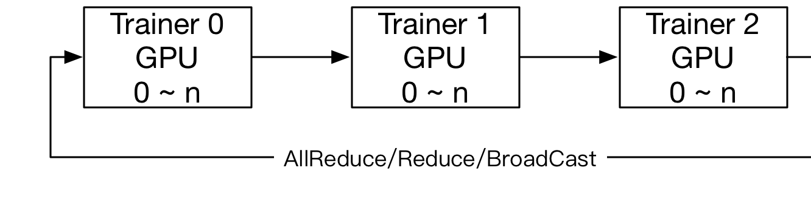

# Fluid分布式训练手册

## 分布式训练基本思想

分布式深度学习训练通常分为两种并行化方法：数据并行，模型并行，参考下图：


在模型并行方式下，模型的层和参数将被分布在多个节点上，模型在一个mini-batch的前向和反向训练中，将经过多次跨
节点之间的通信。每个节点只保存整个模型的一部分；在数据并行方式下，每个节点保存有完整的模型的层和参数，每个节点
独自完成前向和反向计算，然后完成梯度的聚合并同步的更新所有节点上的参数。Fluid目前版本仅提供数据并行方式，另外
诸如模型并行的特例实现（超大稀疏模型训练）功能将在后续的文档中予以说明。

在数据并行模式的训练中，Fluid使用了两种通信模式，用于应对不同训练任务对分布式训练的要求，分别为RPC通信和Collective
通信。其中RPC通信方式使用[gRPC](https://github.com/grpc/grpc/)，Collective通信方式使用
[NCCL2](https://developer.nvidia.com/nccl)。下面是一个RPC通信和Collective通信的横向对比：

| Feature       | Collective    | RPC    |
| ------------- |:-------------:| :-----:|
| Ring-Based Comm  | Yes | No |
| Async Training   | Reduce ranks | Fast, Direct async updates |
| Dist-Sparse-Table | No      | Yes |
| Fault-Tolerant | No | Yes|
| Performance | Faster | Fast |

* RPC通信方式的结构：
  
* NCCL2通信方式的结构：
  


## 使用parameter server方式的训练

使用"trainer" API，程序可以自动的通过识别环境变量决定是否已分布式方式执行，需要在您的分布式环境中配置的环境变量包括：

| Env Variable | Comment |
| ------------ | ------- |
| PADDLE_TRAINING_ROLE | role of current node, must be PSERVER or TRAINER |
| PADDLE_PSERVER_PORT | the port that the parameter servers will bind to |
| PADDLE_PSERVER_IPS | a comma separated list of parameter server ips or hostname |
| PADDLE_TRAINERS | number of trainers that in this distributed job |
| PADDLE_CURRENT_IP | current node ip address |
| PADDLE_TRAINER_ID | zero based ID for each trainer |

使用更加底层的"transpiler" API可以提供自定义的分布式训练的方法，比如可以在同一台机器上，启动多个pserver和trainer
进行训练，使用底层API的方法可以参考下面的样例代码：

```python
role = "PSERVER"
trainer_id = 0
pserver_endpoints = "127.0.0.1:6170,127.0.0.1:6171"
current_endpoint = "127.0.0.1:6170"
trainers = 4
t = fluid.DistributeTranspiler()
t.transpile(trainer_id, pservers=pserver_endpoints, trainers=trainers)
if role == "PSERVER":
    pserver_prog = t.get_pserver_program(current_endpoint)
    pserver_startup = t.get_startup_program(current_endpoint,
                                            pserver_prog)
    exe.run(pserver_startup)
    exe.run(pserver_prog)
elif role == "TRAINER":
    train_loop(t.get_trainer_program())
```

## 使用NCCL2通信方式的训练

注NCCL2模式目前仅支持"trainer" API，NCCL2方式并没有很多可选项，也没有"transpiler"，所以并没有底层API。
使用NCCL2方式同样需要配置每个节点的环境变量，此处与parameter server模式有所不同：

| Env Variable | Comment |
| ------------ | ------- |
| PADDLE_TRAINER_IPS | comma separated IP list of all trainer nodes |
| PADDLE_TRAINER_ID | zero based ID for each trainer, aka. "rank" |
| PADDLE_PSERVER_PORT | a port that will used at initial stage to broadcast the NCCL ID |
| PADDLE_CURRENT_IP | current IP address of current node |
